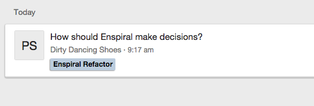
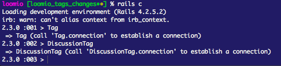

Loomio’s recently released a plugin architecture, which will allow you to quickly and easily add functionality to Loomio on your own instance. There are some good docs in [the plugin README](https://github.com/loomio/loomio/blob/master/plugins/README.md), but I thought it might be helpful to step through how we make plugins here.

#### WHAT WE’LL BE MAKING:

The thing we’ll be making this time is a tagging plugin, which will allow group coordinators to specify tags, which can then be used to classify discussions which are related, but distinct (think something like ‘Board meeting minutes’, or ‘The Party Planning Committee’)

It'll look like this:



By the end of this article, we'll have:

- Added a new database table and model to the Loomio rails app
- Added a new controller, route, and serializer to expose an API endpoint
- Modified existing Loomio classes to create model relationships
- Added models and record stores for storing data on the client
- Created an angular directive which shows our tags on the dashboard
- Created an angular directive which displays our tags in the view
- Added testing functionality to our rails controller which can be hooked up to a CI or run locally

We won't have:

- Created a form to allow group admins to add, edit or destroy tags
- Made another directive to make the tags appear on the thread page

But, you can check out the repository for this plugin [on github](http://github.com/loomio/loomio_tags) to see our most up-to-date progress.

Let's get started!

### PART 1: Create a basic plugin.
First off, we’re going to create a local plugin, and initialize it with a git repository so it’s separate from the Loomio core codebase. This guide assumes you have a local dev instance of Loomio up and running.

First, create a new folder in the `/plugins` folder with the name of your plugin:
```
mkdir plugins/loomio_tagging && cd plugins/loomio_tags
```

Then, update the `.gitignore` file to let it know you want to see your new plugin:

```
# .gitignore
!plugins/loomio_tags
```

Now, make a `plugin.rb` file in the `plugins/loomio_tags` directory, and fill it with the following template:

```
# plugins/loomio_tags/plugin.rb
module Plugins
  module LoomioTags
    class Plugin < Plugins::Base
      setup! :loomio_tags do |plugin|
        # our code will go here!
        puts “Hello, world!”
      end
    end
  end
end
```

Now, if you run a command which boots the rails environment (like `rails c` or `rails s`), you’ll notice a friendly ‘Hello world!’ message. Congrats, you’ve made a plugin!

Unfortunately, it’s not a terribly useful plugin yet, but we can make it better. First though, let’s push it up to a github repository. To do that, we’ll follow these steps:

- Create a new git repository, like `git@github.com:loomio/loomio_tags.git`
- Run `git init` in the `plugins/loomio_tags` folder
- git remote add origin `git@github.com:loomio/loomio_tags.git`
- `git add . && git commit -m “initial commit” && git push origin master`
- (important, don’t skip!) add a reference to `lib/plugins.yml`, telling Loomio where to find your plugin on github. That will look like this:

```yaml
  plugins:
    loomio_tags:
      repo: loomio/loomio_tags
      version: master
```

(NB: you can constrain your plugin to a particular branch, tag, or commit with the version, but we’ll stick with tracking the master branch for now.)

To prove that this works, we’ll nuke the local version of our plugin:

```
rm -rf plugins/loomio_tags
```

reacquire it:
```
rake plugins:fetch
```

and run a console again:
```
rails c
```

Which should result another friendly ‘Hello world’ message. Now we know Loomio can run our plugin from anywhere; woot!

(NB: rake plugins:fetch can be a destructive action; it will delete all of the existing plugins on your local instance and replace them with those specified in `plugins.yml`. TL;DR you can easily lose your work if you skip step 5 above, don’t do it!)

### PART 2: Add some simple functionality

Alright, now we’ve got a working plugin, up on github. Time to make it do something a bit more useful! We’ll do this by issuing commands in our `setup!` method, which will either execute code on our instance directly, or reference other files which should be included in the app.

##### 1. Tell Loomio to enable our plugin (important, don’t skip!)

We’ll need to tell Loomio when to run this plugin code, otherwise it’ll skip everything and the plugin will be ‘off’ all the time. To do this, we can either provide an ENV variable to look at (the plugin will be enabled if the ENV is present):

```
# plugin.rb (within the `setup!` method)
plugin.enabled = ‘ENABLE_THREAD_TAGGING’
# (will be enabled when ENV[‘ENABLE_THREAD_TAGGING’] is truthy)
```

or, simply set to it ‘true’ all the time:
```
# plugin.rb (within the `setup!` method)
plugin.enabled = true
```

##### 2. Create two database tables for our new many-to-many relationship

```
# plugin.rb (within the `setup!` method)
plugin.use_database_table :tag do |table|
  table.belongs_to :group
  table.string :name
  table.string :color
  table.timestamps
end

plugin.use_database_table :discussion_tag do |table|
  table.belongs_to :tag
  table.belongs_to :discussion
  table.timestamps
end
```

##### 3. Create a model to define what a tag does, and tell the plugin to use it

```
# plugins/loomio_tags/models/tag.rb
class Tag < ApplicationRecord
  belongs_to :group, dependent: :destroy
  has_many :discussion_tags, dependent: :destroy
  has_many :discussions, through: :discussion_tags

  validates :group, presence: true
  validates :name, presence: true
  validates :color, presence: true
end
```
```
# plugins/loomio_tags/models/discussion_tag.rb
class DiscussionTag < ApplicationRecord
  belongs_to :discussion
  belongs_to :tag

  validates :discussion, presence: true
  validates :tag, presence: true
end
```
```
# plugins/loomio_tags/plugin.rb (within the setup! method)
plugin.use_class ‘models/tag’
plugin.use_class ‘models/discussion_tag’
```

NB: We could also tell the plugin to load all of the files in the ‘models’ directory in a single line, like this:
```
plugin.use_class_directory :models
```

##### 4. Modify the existing Discussion and Group models to let it know about tags.

```
# plugins/loomio_tags/plugin.rb (within the setup! method)
plugin.extend_class Discussion do
  has_many :discussion_tags, dependent: :destroy
  has_many :tags, through: :discussion_tags
end

plugin.extend_class Group do
  has_many :tags, dependent: :destroy
end
```

_Note: the commands which ‘plugin’ accepts are well-documented in the [README](https://github.com/loomio/loomio/tree/master/plugins) in our repository. If you’re trying to figure out how to do something, that’s a really great place to start._

At this point, running `rails c` again should add those new tables and pop that new code into our instance.



And if we run a few little experiments, we should see that we can now add tags and associate them with discussions via the console:

**Create a new tag:**
```
> t = Tag.create(group: Group.last, name: “Test tag”, color: “#cccccc”)
```
**Ensure the group know about its tag:**
```
> Group.last.tags.first
 => #<Tag id: 2, group_id: 33707, name: "Test tag", color: "#cccccc", created_at: "2016-03-07 01:40:08", updated_at: "2016-03-07 01:40:08">
 ```
**Associate that tag with a discussion:**
```
> dt = DiscussionTag.create(discussion: Discussion.last, tag: t)
```
**Ensure the discussion knows about its new tag:**
```
> Discussion.last.tags.first
 => #<Tag id: 2, group_id: 33707, name: "Test tag", color: "#cccccc", created_at: "2016-03-07 01:40:08", updated_at: "2016-03-07 01:40:08">
```

Sweet!

### PART 3: Create an API endpoint
Now that we’ve got some models and a place to store them, the next step is to make that information available via our API. If you’re going to be writing plugins which expose info through the API, it’s strongly suggested you read up on the [snorlax gem](https://github.com/loomio/snorlax) that we’re using for our API controllers, and take a nice look through some of the existing controllers in `app/controllers/api`. It’s a bit of a DSL, but once you get the hang of it, writing new endpoints is a breeze!

##### 1. Create a route
First, let’s expose an endpoint, ‘/api/v1/discussion_tags.json’, which will route to the index action in a DiscussionTagsController:

```
# plugins/loomio_tags/plugin.rb (within the setup! method)
plugin.use_route :get, '/discussion_tags', 'discussion_tags#index'
```

##### 2. Create a controller
Now, we’ll define our index action in a new controller:

```
# plugins/loomio_tags/controllers/discussion_tags_controller.rb
class ::API::DiscussionTagsController < API::RestfulController
  def index
    instantiate_collection { |collection| collection.where('discussions.key': params[:discussion_keys]) }
    respond_with_collection
  end

  private

  def accessible_records
    resource_class.joins(:discussion)
                             .where('discussions.id': Queries::VisibleDiscussions.new(user: current_user).pluck(:id))
  end
end
```
This may look a little confusing, but here’s the gist:
- **accessible_records** defines the DiscussionTags the current user has access to, namely those associated with discussions which the user can see
- **instantiate_collection** passes in those accessible records as a collection, and assigns the result of the block to @discussion_tags
- **respond_with_collection** takes @discussion_tags and serializes it according to our API standards (more on that [here](https://github.com/loomio/tech-manual/blob/master/using_the_loomio_api.md#api-response-information))

##### 3. Create a serializer
Finally, we’ll define how those discussion tags we’re responding with appear in our API response. A simplified version:

```
# plugins/loomio_tags/serializers/discussion_tag_serializer.rb
class DiscussionTagSerializer < ActiveModel::Serializer
  embed :ids, include: true
  attributes :id, :tag_name, :tag_color, :discussion_id
end
```

You can check out some of the other serializers we've written in [app/serializers](https://github.com/loomio/loomio/tree/master/app/serializers).

Alright, with that out of the way, we can access the tags we create through our API. Next up? Part 4 will cover how to add these tags to the actual interface. We’re getting close!

### PART 4: Display created tags in the frontend

Now that we’ve got some plumbing going, we can start displaying our hard work in the interface.

The angular interface is comprised primarily of ‘components’. A component is a collection of a directive, a template, and a stylesheet. Then, we can slot these components into ‘outlets’ in the interface.

##### 1. Adding a client side model
Just like on the server side, Loomio has client side models as well, which are stored in a client side data store called a 'RecordsInterface'. You can check out the existing models and RecordsInterfaces in [angular/core/models](https://github.com/loomio/loomio/tree/master/angular/core/models). We'll want to make a model and corresponding records interface for our new DiscussionTags.

```
# plugins/components/discussion_tags/discussion_tag_model.coffee
angular.module('loomioApp').factory 'DiscussionTagModel', (BaseModel) ->
  class DiscussionTagModel extends BaseModel
    @singular: 'discussionTag'
    @plural: 'discussionTags'
```
```
# plugins/components/discussion_tags/discussion_tag_records_interface.coffee
angular.module('loomioApp').factory 'DiscussionTagRecordsInterface', (BaseRecordsInterface, DiscussionTagModel) ->
  class DiscussionTagRecordsInterface extends BaseRecordsInterface
    model: DiscussionTagModel
```

*NB: These are copied straight from existing classes, with the names of the classes changed.*

Then, to let our plugin know to add these classes to our asset pipeline, use the `use_asset` command:

```
plugin.use_asset 'components/discussion_tags/discussion_tag_model.coffee'
plugin.use_asset 'components/discussion_tags/discussion_tag_records_interface.coffee'
```

`use_asset` allows us to add any type of compilable (coffee, haml, scss) file to our asset pipeline, so you can add other things this way if you find you need to as well.

_NB: We could also use the `use_asset_directory` command to include a whole directory of files in one line._

##### 2. Making an outlet

This is the easy part. Find where in the interface you’d like your component to go, and put an ‘outlet’ directive there (if it doesn’t already exist), with a name, like so:

```
%outlet{name: “before-thread-title”}
```

You can find all of the existing outlets by searching for `%outlet` in the repository.

_NB: You’ll need to pull request any new outlets against the main loomio repository, but don’t worry, we’ll definitely accept it if it’s named nicely and not right next to another outlet. We'll also be very excited to hear about what you're working on._

##### 3. Making a component

Now, we’ll write a little code to display tags next to the discussions title if they exist.

```
# plugins/loomio_tags/components/thread_tags/thread_tags.coffee
angular.module('loomioApp').directive 'tags', ->
  restrict: 'E'
  replace: true
  templateUrl: 'generated/components/tags.html'
  controller: ($scope, Records) ->
    $scope.tags = ->
      Records.discussionTags.find(discussionId: $scope.thread.id)
```

Some things to note:

- For now, plugin components must inherit the scope in which they inhabit. This means that if you put a plugin into an outlet in the ThreadPageController, then you'll have access to the ThreadPageController's $scope in your component. Here our outlet is in `thread_preview_collection.haml`, so we have access to the scope defined in `thread_preview_collection.coffee`
- The template url format is `generated/components/<your_component_name>.html`
- You can inject any class you'd like into the plugin controllers, which can be defined either in the core repo or within your plugin.
- `Records` is a collection of all of our records interfaces, and `find` is a method we can use to search for records within a given interface.

```
# plugins/loomio_tags/components/thread_tags/thread_tags.haml
.thread-tags{ng-if: "anyTags()"}
  .thread-tag{ng-repeat: "tag in tags()", style: "background-color: {{tag.color}};"}
    %span {{tag.name}}
```

_NB: notice that these need to be in a folder within a /components folder in your plugin, and that that folder must be named the same as each file._

Then, we can tell our plugin about the component we created, and what outlet we want it to live in, using the `use_component` command:

```
plugin.use_component :thread_tags, outlet: :before_thread_title
```

_NB: We support using the same outlet for multiple components, so don’t worry about conflicts there._

You can also put a single component into multiple outlets in the interface by passing an array of names:

```
plugin.use_component :thread_tags, outlet: [:before_thread_title, :after_thread_title]
```

##### 4. Fetching the tags from the server
The only thing left is to make an API call to fetch our tags! In order to do this, we'll create another directive, which specifically performs an API request when it's loaded. (This is the recommended way to load remote records into your app.)

I've called it `tag_fetcher`, and it has just a single file, `tag_fetcher.coffee`:

```
# plugins/loomio_tags/components/tag_fetcher.coffee
angular.module('loomioApp').directive 'tagFetcher', ->
  restrict: 'E'
  replace: true
  controller: ($scope, Records, DiscussionTagRecordsInterface) ->
    Records.addRecordsInterface(DiscussionTagRecordsInterface) if !Records.discussionTags
    Records.discussionTags.fetch
      params:
        discussion_keys: _.pluck($scope.query.threads(), 'key')
```

_NB: Notice that we're adding the records interface to Records if it doesn't exist yet._

Then, we pop this into another outlet in `thread_preview_collection.haml`:

```
%outlet{name: "before-thread-previews"}
```
```
plugin.use_component :tag_fetcher, outlet: :before_thread_previews
```

Now, if we load up our app, we’ll see our tag displayed nicely next to the discussion title. Hooray!

### PART 5: Testing our controller

If you're not testing it, you're not doing it right! We provide the ability to add your own specs. If they're in the plugins/ folder, they'll even be run as part of the CI, so you can be more confident that your plugins aren't breaking stuff.

For this plugin, the thing that makes most sense is a controller spec, to make sure that we're responding with the right thing when an API call is made. You can check it out [here](https://github.com/loomio/loomio_tags/blob/master/spec/discussion_tags_controller_spec.rb).

Some interesting things:
- You can define factories right there in the file if you need them
- You'll need to define `type: :controller`, since rspec can't infer what type of test it is from the file location
- In order to run just plugin specs, you can run `bundle exec rspec plugins` from the project root folder. To get even more specific, you can point rspec to the particular file/line you're interested in, like `bundle exec rspec plugins/controllers/discussion_tags_controller_spec.rb:18`

### PART 6: And beyond!
That's it for this tutorial; it feels like we've covered a lot!
There's still plenty more that could be done here, including making the tags appear in multiple places, and allowing group coordinators to create/update/destroy tags, and more. Again, if you're interesting in the progress of this particular functionality, feel free to follow the [loomio tags](https://github.com/loomio/loomio_tags) repository.

There are also several other plugins which have been developed, which you can refer to for other nifty things that can be done:

- [Fire off webhooks when events happen](https://github.com/loomio/loomio_webhooks)
- [Allow proposal creators to specify what different positions mean on their propoosal](https://github.com/gdpelican/position_specific)
- [Code specific to loomio.org](https://github.com/loomio/loomio_org_plugin)
- [Make a doge appear!](https://github.com/gdpelican/peking_doge)

I'm hoping that this is enough to get you started on your own plugins; I'd love to hear about some of the ideas you have. Feel free to get in touch at james@loomio.org

Happy hacking!
