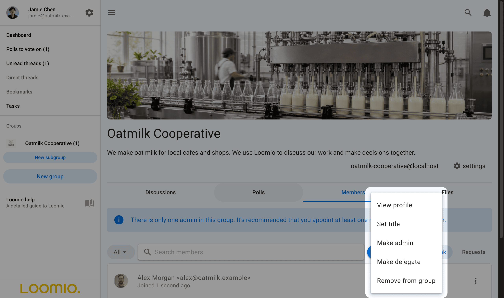
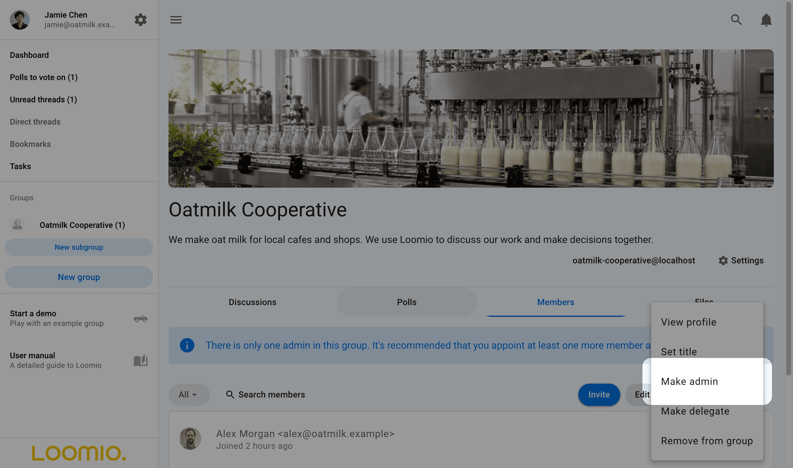
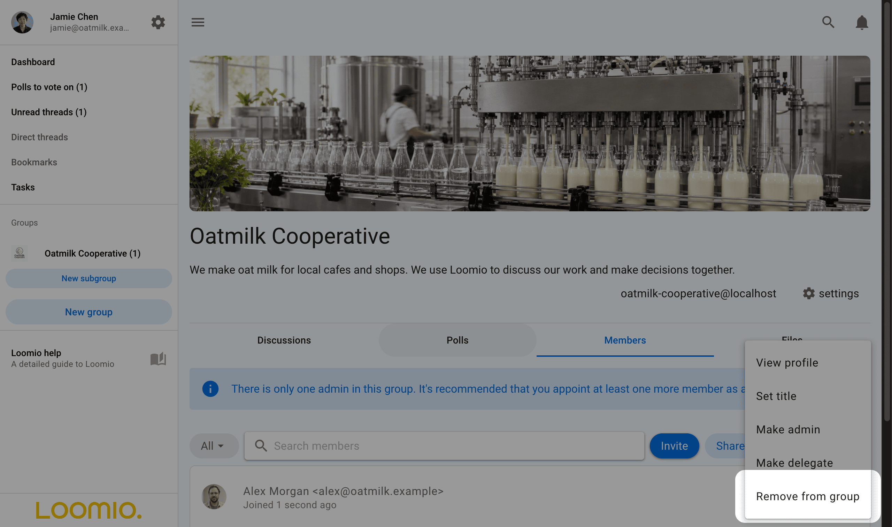
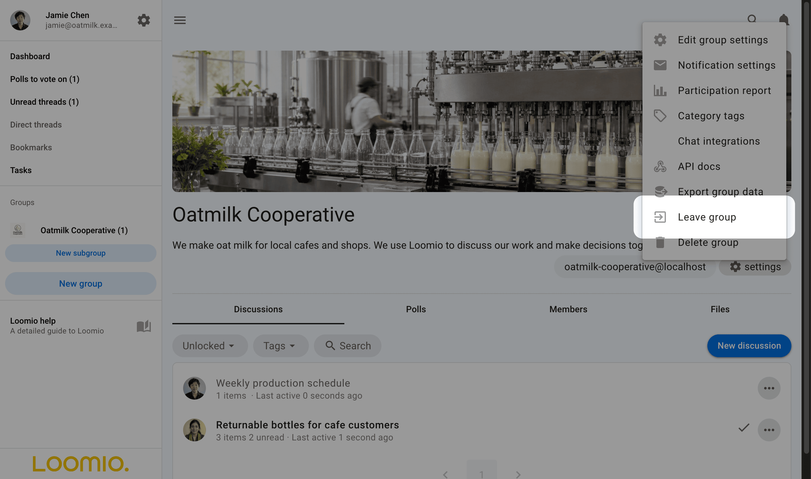
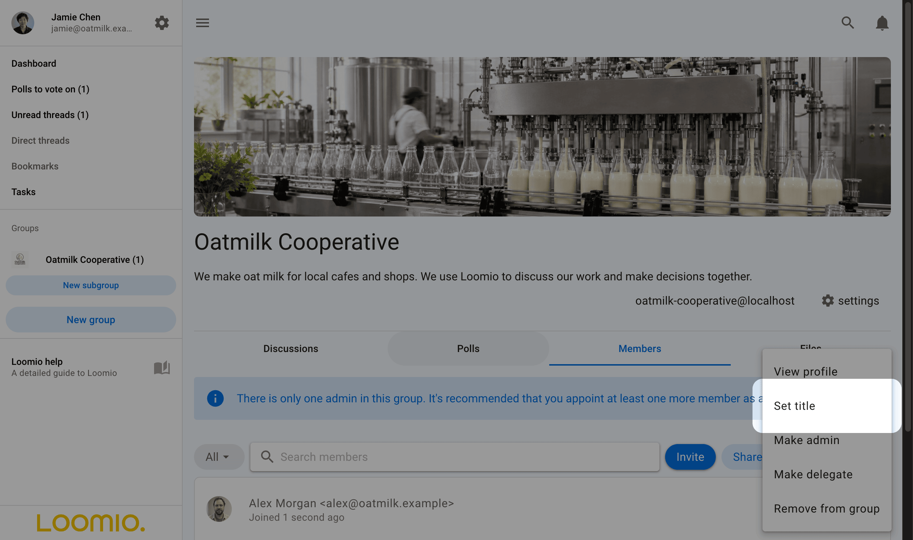

<!-- translation-section: introduction -->

# Member management

If you are an admin, you can manage members from the **Members** tab on your group page.

Click on the three dots (**⋮**) to the right of the group member to set their title, make them an admin, make them a delegate, or remove them from the group.

<!-- translation-section: administering-your-group -->

## Administering your group
There are only two user types in a Loomio group: **member** and **admin**.

Admins perform administrative tasks for your group, including: adding and removing members, managing member permissions, setting the group privacy levels, and managing the subscription plans.  In addition, admins are able to see the email addresses of members and export the group's data.

The person creating a new Loomio group is made admin by default. We recommend to make at least one other trusted person in your group an admin, to insure someone can always administer your group. You can have as many admins in your group as you wish.

To make a member **admin**, go to the Members tab, find the member and click on the three dots (**⋮**) next to their name. Choose **Make admin**. An `Admin` tag will appear beside their name.

<!-- translation-section: managing-subgroups -->

## Managing subgroups
Admins of a parent group can join its Open, Closed, and **Visible to parent group** subgroups, then make themselves subgroup admins.

Select **Join group** on the subgroup page.

Once you have joined the subgroup, you will also be able to make yourself the admin of that subgroup, just as you would promote anyone to admin.

>[!Note]
>These permissions do not extend to [**secret** subgroups](/en/user_manual/groups/subgroups/?highlight=secret#permissions).

<!-- translation-section: removing-members -->

## Removing members
When you click **Remove from group** you'll be asked to confirm the removal. Upon removal, this user will no longer have access to the group's pages, threads, polls, or proposals. They will receive no further emails or notifications of group activity. However, any comments and votes written by the user will remain untouched.

You can add removed members back to the group later if you wish.

<!-- translation-section: leaving-group -->

## Leaving group
To leave a group: go to the group page, open the 3 dot menu, and click **Leave group**.

<!-- translation-section: set-title -->

## Set title
Within the Members tab, you can also name your role within the group, or identify an organization you represent using **title**. You or a group admin can change your title with **Set title** from the 3 dot menu near your name.

You can have different titles in different subgroups.

<!-- translation-section: member-email-addresses -->

## Member email addresses

Only admins can see group member email addresses.  This is sometimes necessary to audit the members in a group.

To see member email addresses: Use [data export](/en/user_manual/groups/data_export/) to download a CSV file, and open the file in Excel or Google sheets.

The export group data file shows every person and their email address in every subgroup.

You can also search for members by email address in the members tab. So if you see someone you want to remove, you can search by email to remove them.
