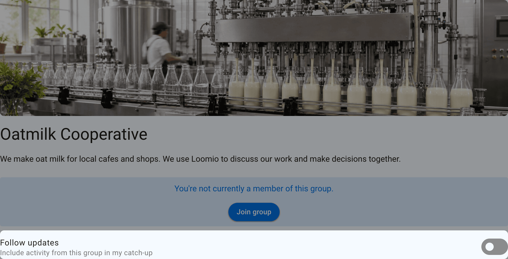

<!-- translation-section: introduction -->

# Group privacy

Privacy controls who can find a group and who can read its content. Open **Edit group settings** from the group page, then select **Privacy**.

Changing privacy can expose or hide existing group content, not only content created afterward. Choose the most restrictive setting that still supports the group's purpose.

<!-- translation-section: open -->

## Open

Open groups are public spaces. Anyone can find the group and read its discussions, polls, and files. The member list remains visible only to members.

Open groups can allow people to join immediately, require approval, or remain invitation only.

<!-- translation-section: follow-an-open-group -->

### Follow an Open group

People can stay up to date with an Open group without joining. Following adds unread group activity to their catch-up email so they can review it in their own time. Followers do not become members, receive member voting rights, or receive immediate notifications just because they follow the group.

Turn on **Follow updates** on the group page to include its unread discussions, comments, polls, and other thread activity in your catch-up. Turn the setting off to stop including the group.

<!-- translation-section: closed -->

## Closed

Anyone can find a Closed group and read its name and description. Discussions, polls, files, and the member list are private to members and invited guests.

Closed parent groups can let people request membership or remain invitation only. They cannot let people join immediately without approval.

Closed subgroups can also allow anyone to join without approval. To limit discovery and immediate joining to parent group members, select **Visible to parent group** instead.

A Closed subgroup of a parent group can optionally allow members of the parent group to read its discussions without joining the subgroup.

<!-- translation-section: visible-to-parent-group -->

## Visible to parent group

This subgroup setting lets parent group members find the subgroup while keeping its threads private to subgroup members and invited guests. People outside both groups cannot find it, even when the parent group is public.

Select **Visible to parent group**, then **Members of [parent group] can join without approval** to let parent members join themselves. Joining gives ordinary subgroup membership, including access to its private threads. Approval and invitation-only joining are also available.

The subgroup keeps this visibility when the parent becomes public. If the parent becomes private, its public subgroups become **Visible to parent group** and their threads become private. Secret subgroups stay Secret. Existing subgroups previously labelled Closed under a private parent now show **Visible to parent group**, with their existing access unchanged.

To let parent members read private threads before joining, enable **Members of [parent group] can see private threads** in **Permissions**. This grants read access, without subgroup membership or voting rights.

<!-- translation-section: secret -->

## Secret

Secret groups and their content are visible only to people who have been invited or added. Membership is invitation only. Secret groups do not appear in the public group directory.

A Secret parent group supports only **Visible to parent group** and **Secret** subgroups. Its subgroups cannot be Open or Closed.

<!-- translation-section: how-people-join -->

## How people join

Privacy determines which joining options are available:

| Group privacy | Available joining options |
| --- | --- |
| **Open** | Anyone can join, request approval, or invitation only |
| **Closed parent group** | Request approval or invitation only |
| **Closed subgroup** | Anyone can join, request approval, or invitation only |
| **Visible to parent group** | Parent members can join, request approval, or invitation only |
| **Secret** | Invitation only |

Immediate joining follows the group's visibility. In a public subgroup, anyone can join. In a subgroup **Visible to parent group**, parent members can join. Members can leave and join again while they remain eligible. Changing how people join does not change who can read private threads before joining.

When approval is required, people select **Join group**, answer the group's joining prompt, and send a request to join. See [Inviting people](/en/user_manual/groups/inviting_people#request-to-join-group) for instructions on configuring the prompt, reviewing requests, and inviting people directly.

<!-- translation-section: group-directory -->

## Group directory

Open and Closed parent groups can be listed in the public group directory so people can discover them. Directory listing does not change who can read group content or become a member. Subgroups and Secret groups cannot be listed.
