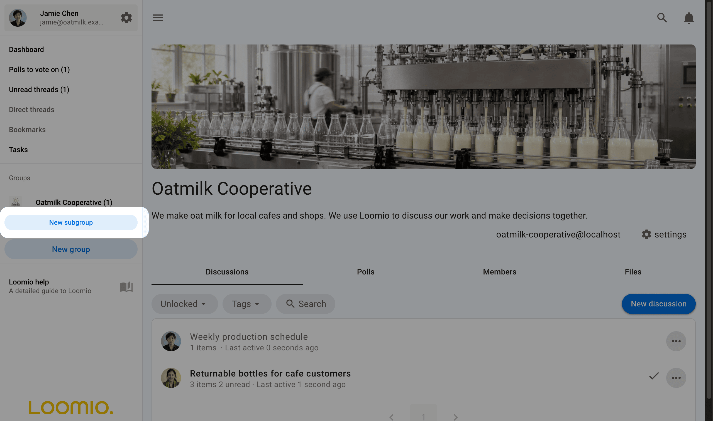
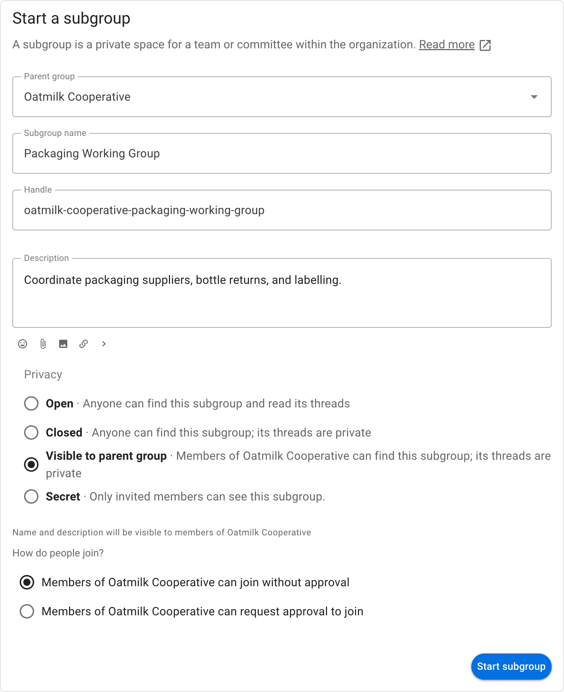
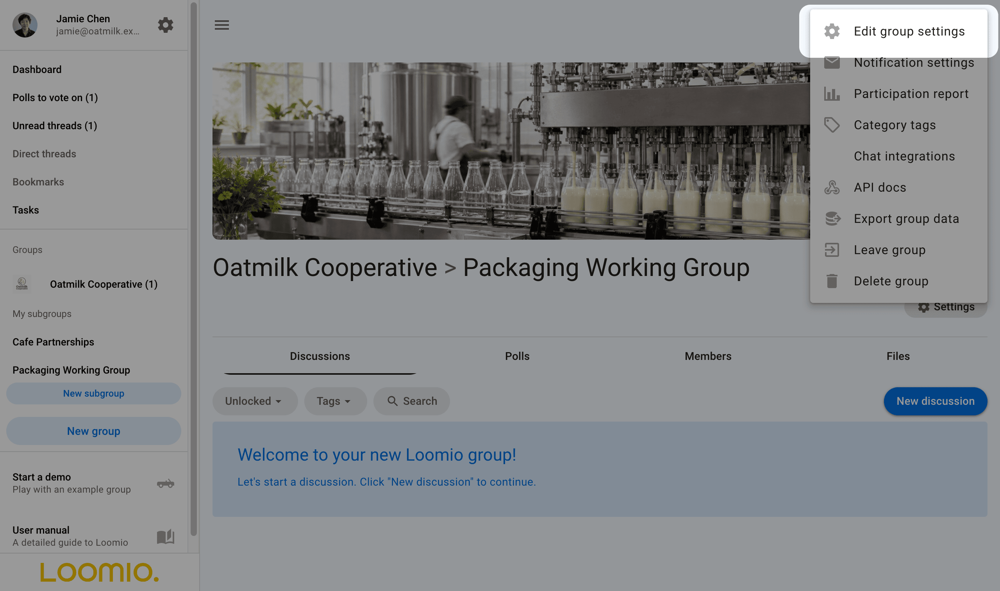
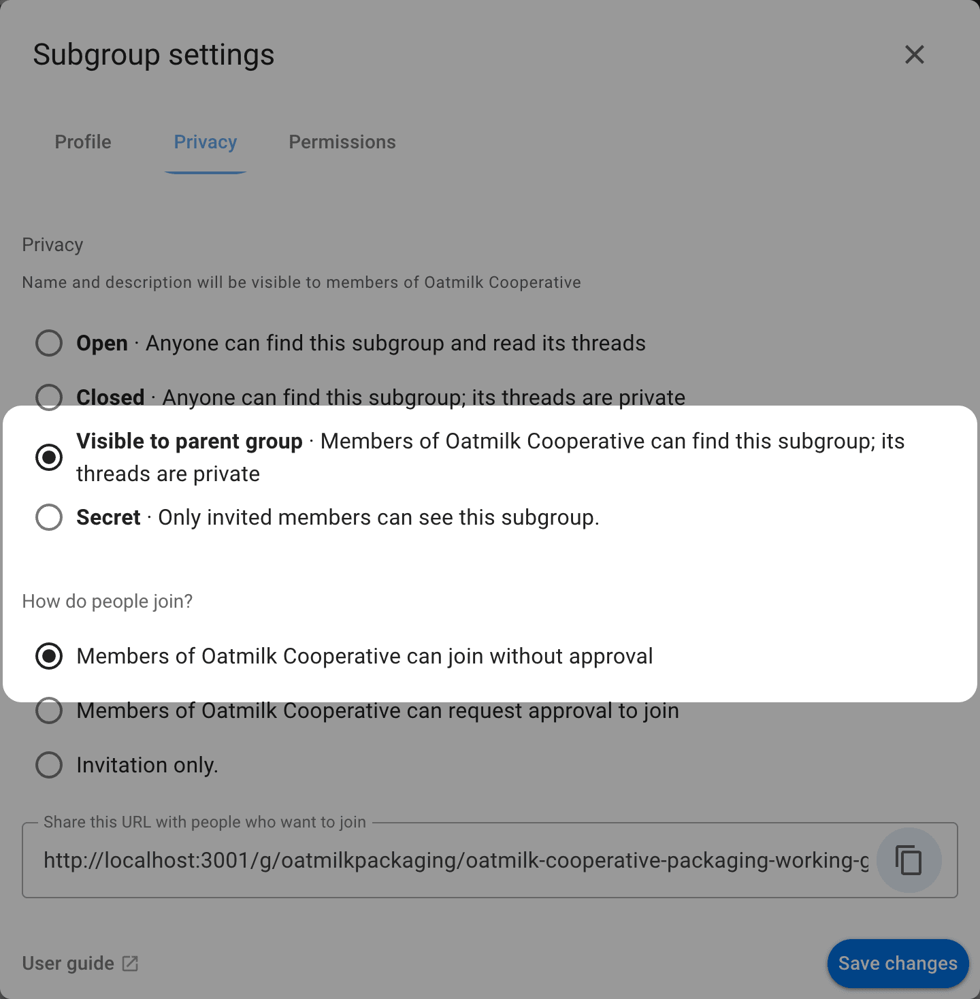
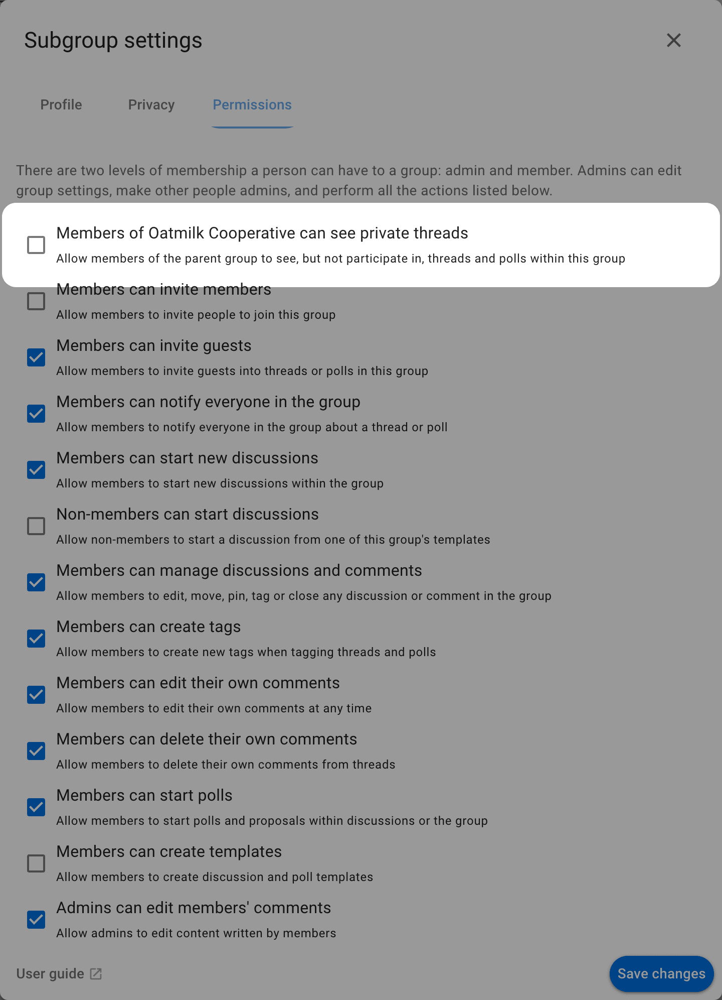
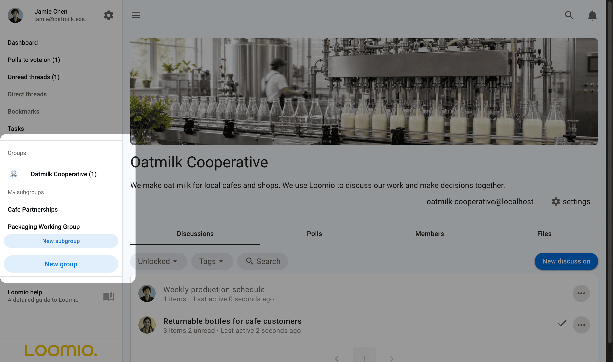
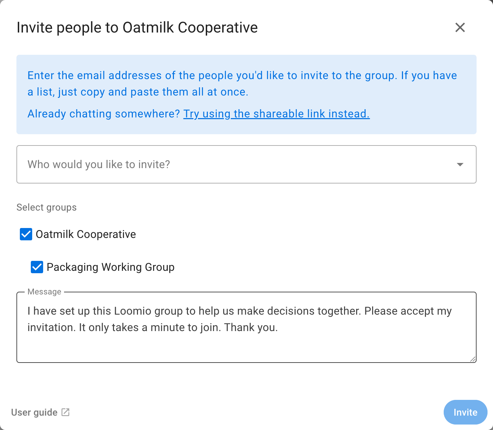
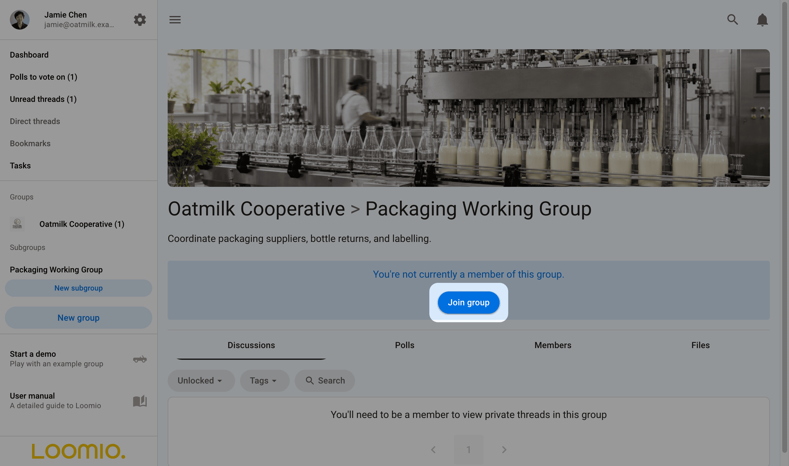
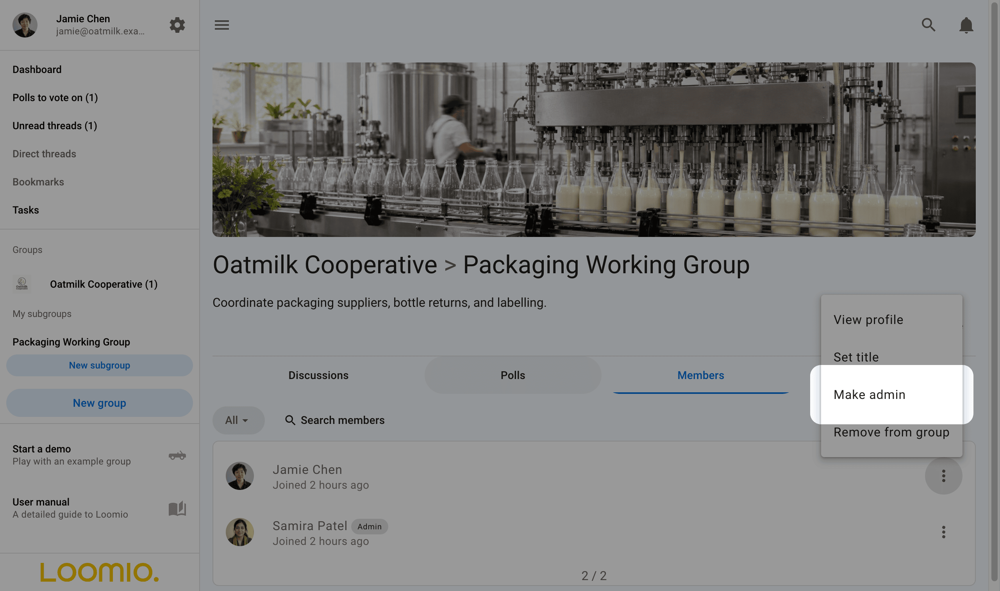

<!-- translation-section: introduction -->

# Subgroups

Subgroups help you organize your communications and members so that the right people are engaged in their work together.

For example, an organization may have the following subgroups:
- governance board
- working team or a project working group
- a topic (such as 'strategy' or 'learning')

Subgroups work just like groups do, but are located within your "parent" group. Most of the features and settings available are the same as in the parent group. This also means that someone can be a member of your subgroup, such as your board, but not of your parent group.

<!-- translation-section: add-a-subgroup -->

## Add a subgroup

>[!Note]
>The ability to add new subgroups is part of the group's [permission settings](/en/user_manual/groups/settings/permissions). By default, only admins can start new subgroups.

To add a subgroup, visit your main group page, then click **New Subgroup** from the sidebar.  

Click the **New subgroup** button, give it a name and select the privacy setting, then click **Start subgroup**.

When you are ready, [invite people](/en/user_manual/groups/inviting_people/) to the subgroup.

You can edit the subgroups [group settings](/en/user_manual/groups/settings/) by clicking the cog icon on the subgroup page.

<!-- translation-section: subgroup-settings -->

## Subgroup settings

<!-- translation-section: privacy -->

### Privacy

Choose who can find the subgroup separately from how people join it:

| Privacy | Who can find it | Who can read its threads |
| --- | --- | --- |
| **Open** | Anyone | Anyone |
| **Closed** | Anyone | Subgroup members and invited guests |
| **Visible to parent group** | Parent group members and subgroup members | Subgroup members and invited guests |
| **Secret** | Invited subgroup members | Subgroup members and invited guests |

To let parent group members join themselves, select **Visible to parent group**, then **Members of [parent group] can join without approval** under **How do people join?** when creating the subgroup, or in **Edit group settings → Privacy**. People outside the parent group need an invitation. Members can leave the subgroup and join again while they still belong to its parent group.

Joining makes someone an ordinary subgroup member. It does not make them an admin or change the privacy of existing threads.

Public subgroups can also allow immediate joining; anyone can join when that option is selected. When the parent group is private, the available subgroup settings are **Visible to parent group** and **Secret**.

A subgroup **Visible to parent group** stays private when its parent becomes public. Making a parent private restricts its public subgroups to parent members and makes their threads private, while preserving Secret subgroups.

[Read about group privacy here](/en/user_manual/groups/settings/privacy).

<!-- translation-section: permissions -->

### Permissions

Subgroups operate independently of the main group. For example, if the subgroup privacy setting is set to **Secret**, then only invited members can find this subgroup, see who is in it, and see threads.

**Closed** subgroups and subgroups **Visible to parent group** can allow parent group members to read private threads before joining. Enable **Members of [parent group] can see private threads** in **Permissions**. These readers do not gain voting rights or subgroup membership.

<!-- translation-section: find-subgroups -->

## Find subgroups

Open the sidebar menu, and click your group name to see it's subgroups.

<!-- translation-section: invite-to-a-subgroup -->

## Invite to a subgroup

Invite people to a subgroup as you invite them into a group. If they already belong to a parent group or another subgroup in the same organization that you also belong to, you can type their name or select that group as an audience. Select the audience chip to expand it into individual people, then remove anyone you do not want to invite.

<!-- translation-section: simultaneously-invite-people-to-subgroups-and-parent-group -->

### Simultaneously invite people to subgroups and parent group

If you use the **Invite people** button from your parent group's **Members** tab, you can invite people to multiple subgroups at the same time by ticking the boxes of those you would like them to join immediately.

<!-- translation-section: administer-a-subgroup -->

## Administer a subgroup

Subgroups can have their own admins, and admins of a subgroup may not be the same as the admins of the parent group.

However an admin of the 'parent' group can make themselves admin of any subgroup.  This helps administrators of the parent group to administer subgroups as necessary.

Go to the Subgroup tab, find the subgroup and click **Join group**.

Now a member of the subgroup, an admin of the parent group can make themselves an admin of the subgroup.

<!-- translation-section: delete-a-subgroup -->

## Delete a subgroup

Admins can delete a subgroup in the same way you delete a group. When deleting a subgroup, be careful to not delete the 'parent' group.

Learn [how to delete groups](/en/user_manual/groups/deleting_your_group/).
