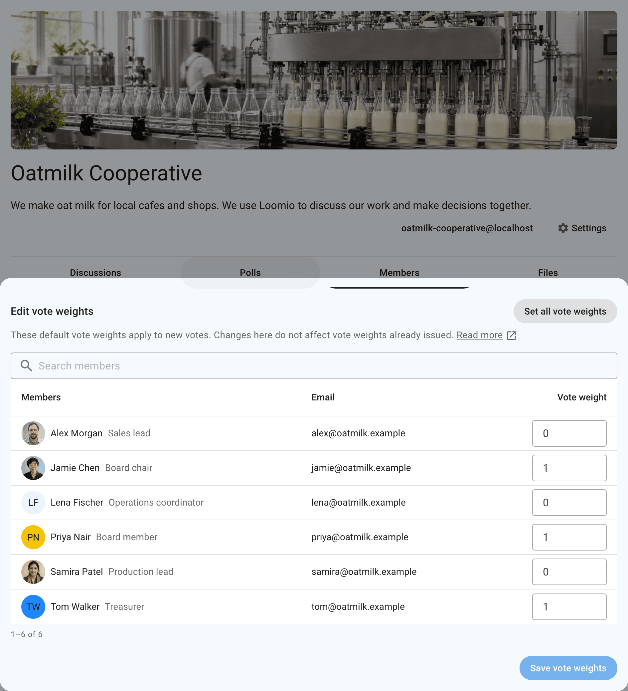
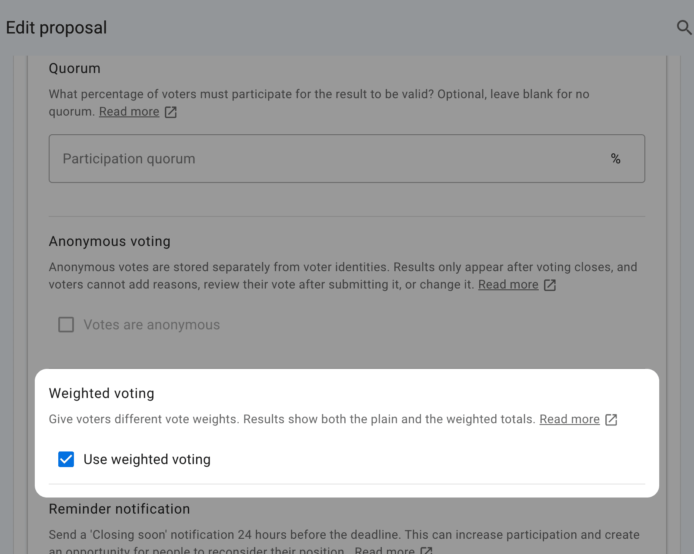
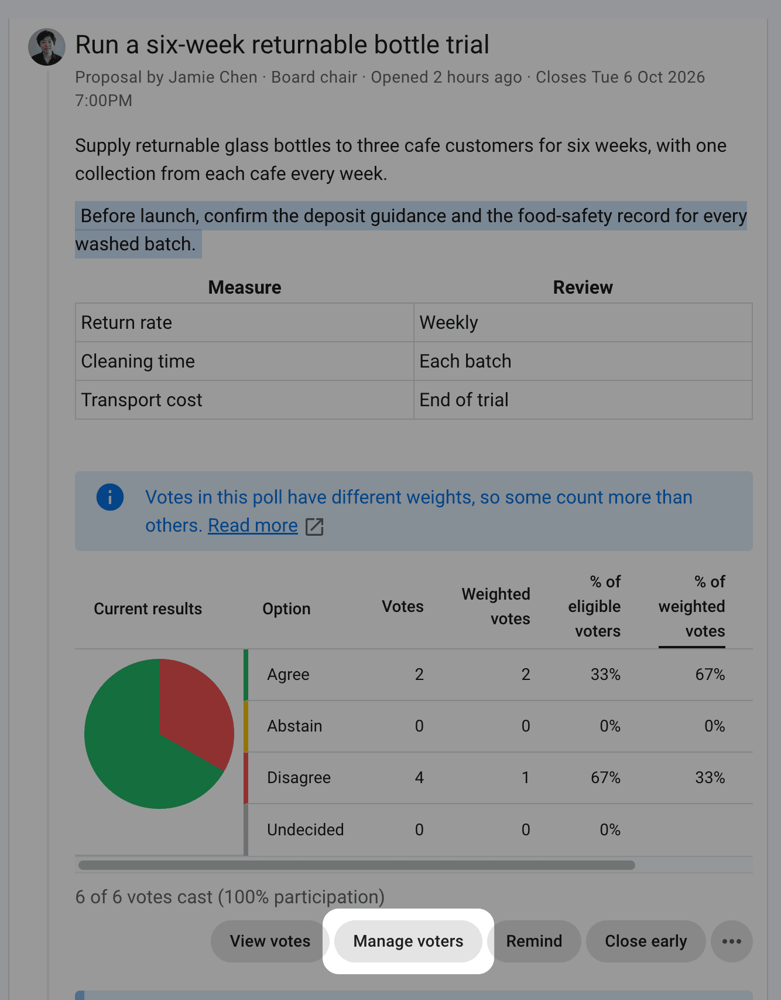
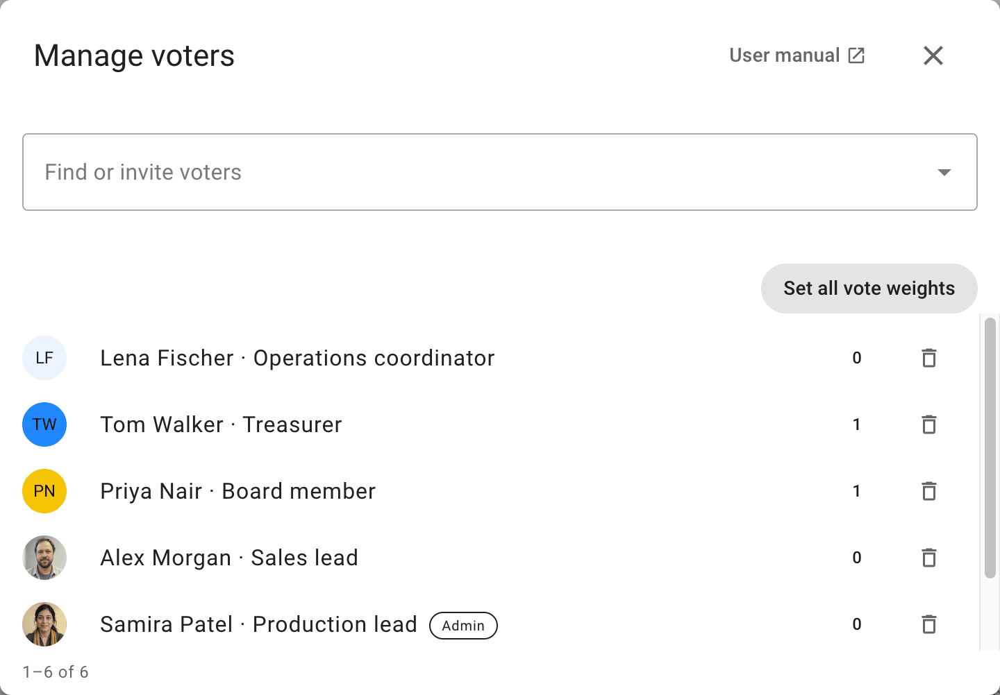
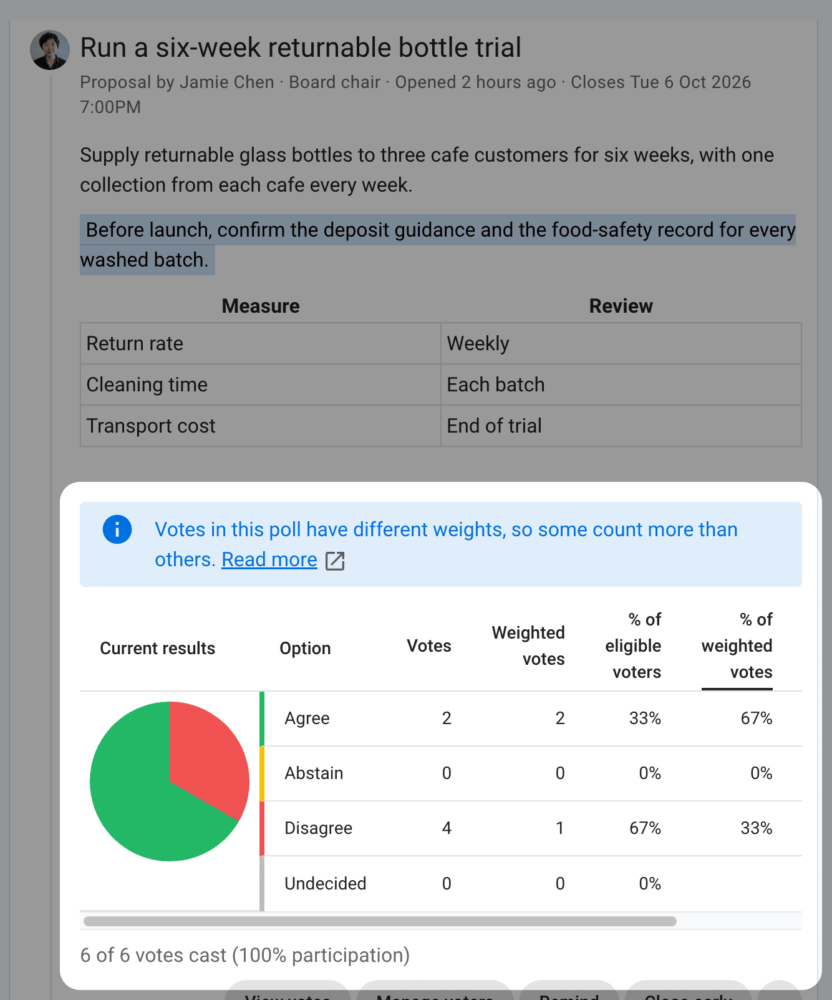

<!-- translation-section: introduction -->

# Weighted voting

Weighted voting lets some votes count more than others. Each voter has a vote weight. For example:

- A housing community gives each property one vote. A member who represents three properties has a vote weight of `3`.
- A worker cooperative grants voting rights after a set period of membership. Newer members receive a vote weight of `0`, so they can contribute to the discussion and experience the voting process without their votes affecting the result.
- A company gives shareholders votes according to their ownership stake. Someone who owns 12.5% of the shares has a vote weight of `12.5`.

<!-- translation-section: set-members-vote-weights -->

## Set members' vote weights

A group admin can open the group's **Members** page and select **Edit vote weights**. Enter vote weights and select **Save vote weights**. Vote weights can be `0` or more, with up to three decimal places. Search by name or email to find someone. To give every member the same vote weight, select **Set all vote weights**.

A member's vote weight is copied into each poll they are added to. Changing it later does not change polls that already have it.

<!-- translation-section: use-weighted-voting-in-a-poll -->

## Use weighted voting in a poll

Select **Use weighted voting** in the poll's advanced settings. You can turn it on or off after voting opens. Turning it off sets every vote weight in the poll to `1`, and any vote weights you changed for that poll are lost.

If your group uses weighted voting for an established process, select **Use weighted voting** in a [poll template](/en/user_manual/polls/poll_templates). Polls started from that template use weighted voting.

Weighted voting works with these poll types: [Proposal](/en/user_manual/polls/proposals), [Choose](/en/user_manual/polls/choose), [Score](/en/user_manual/polls/score), [Allocate](/en/user_manual/polls/allocate), and [Rank](/en/user_manual/polls/rank).

You cannot use weighted voting and [anonymous voting](/en/user_manual/polls/anonymous_voting) in the same poll.

To change one voter's vote weight, select **Manage voters**, then select the vote weight beside their name. To change everyone's, select **Set all vote weights**. You can copy each member's vote weight from the group, or give everyone the same value. Voters who are not group members get a vote weight of `1`.

<!-- translation-section: results -->

## Results

Results show the plain totals and the weighted totals side by side:

- Proposal and Choose polls show **Votes** and **Weighted votes**.
- Score, Allocate, and Rank polls show **Points** and **Weighted points**.

The chart shows the weighted result. Select a column heading to chart that column instead. Eligible voters and quorum count people, not vote weights. Anyone who can see the votes can see each voter's vote weight.

