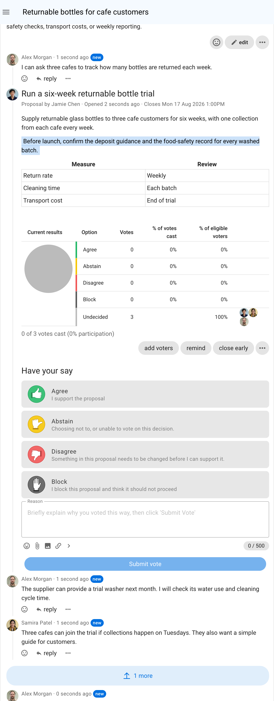
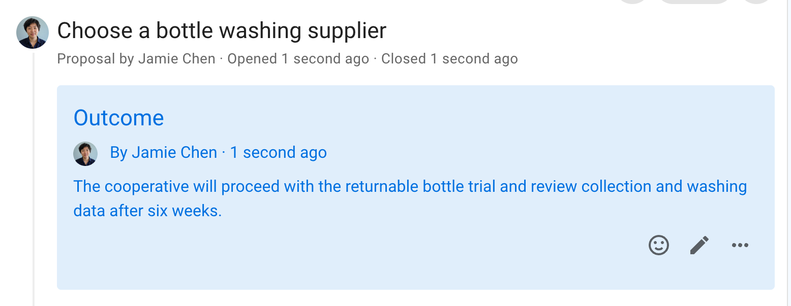

# Advice process

Seek advice on a decision you need to make.

Make a decision with the advice of people impacted or who have expertise, so you can make a better decision for your organization.

> *“With the advice process, any person can make any decision but must seek advice from affected parties and people with expertise.” - Frederick Laloux, Reinventing Organizations.*

## Key points
- Freedom to make a decision.
- Invite people to offer their advice.
- Take into account other people’s voices.

## Steps in the Advice process
You notice a problem or opportunity and take the initiative.
1. Seek input to sound out perspectives before proposing action - start a Loomio **discussion**.
2. Clarify and build on advice through comments in the discussion thread.
3. Taking advice received into account, make a decision and inform the people who have given advice - state an **outcome**.

## Benefits
- Advice helps you make a better decision for your organization. 
- Foster relationships, learning opportunities and diverse input.
- Stimulate initiative and creativity, and more enjoyable work.

## Applying the Advice process on Loomio

| **Advice process** | **On Loomio** |
|---|---|
| You notice a problem or opportunity and take the initiative. |  |
| Seek input to sound out perspectives before  proposing action. | Start a Loomio **discussion**.    Name the issue or opportunity in the discussion title, and seek input and perspectives from people. |
| Taking advice received into account, you make a decision and inform the people who have given advice. | Add an an **outcome** to the discussion thread.     State the decision made and thank people for their advice and feedback.       Say what will happen next and notify people about the outcome.    The outcome statement is an important record of the decision for future reference.     Either update the context to include this outcome, or state it in a comment you pin to the timeline to quickly find it in the future.   |        

## Example of an Advice process on Loomio

### Step 0 - You notice a problem or opportunity and take the initiative.

Is the problem or opportunity is worth pursuing?  Takashi is experiencing problems with his old computer, and it crashed during a recent presentation.

Is there a decision to be made?  It's time to replace the computer.

Does it impact other people and your organization?  Takashi's colleagues want him to perform his role effectively, not waste time in meetings, and so appreciate he needs a working computer.  Purchase of a piece of equipment also impacts on the organization budget, purchasing policies and may need to be aligned with other team members.

### Step 1. Seek input to sound out perspectives before proposing action

Takashi starts a Loomio discussion with a clear statement of the decision he needs to make.  He provides some context to open a discussion, that he is starting an advice process.

### Step 2.  Clarify and strengthen the advice through discussion

Takashi replies to advice given in comments in the discussion thread, clarifying his situation and asking questions to expand on the advice given.

As people offer advice and comments, Takashi grows resolved in his decision.

### Step 3. Make a decision with advice and inform people

When everyone has offered advice, or the proposal closes, Takashi makes a decision and states the **[outcome](/en/user_manual/polls/outcomes/)**.

The outcome is a clear statement of the decision made and what will happen next. It  becomes an important record for the organization.

Takashi edits the discussion context to include this outcome.

Alternatively, he could state it in a comment that he pins to the thread, so the outcome appears prominently in the discussion timeline.
