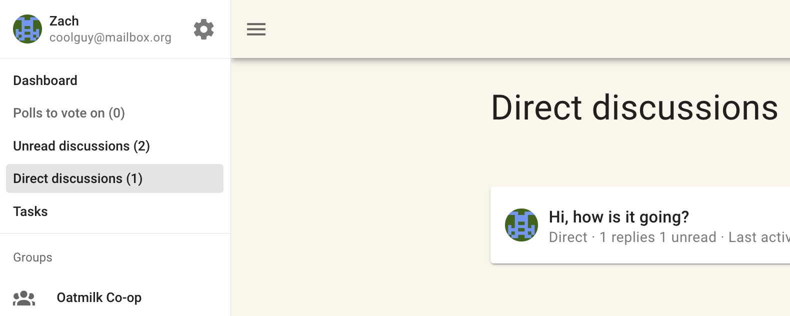

# Direct discussions
A 'direct' discussion is useful when you want to invite particular people to a private discussion.

A direct discussion does not belong to a group. Invited people do not need to be a member of your Loomio group.

With **Direct Discussions** you control who can see and participate in the discussion.

Direct discussions have all of the benefits of Loomio discussions and are often used in place of subgroups.

Your direct discussions can be found (and new ones created) under **Direct Discussions** in the sidebar menu.

## Contacting someone via a direct discussion
A direct discussion can be a useful way to contact another member of your group privately.
