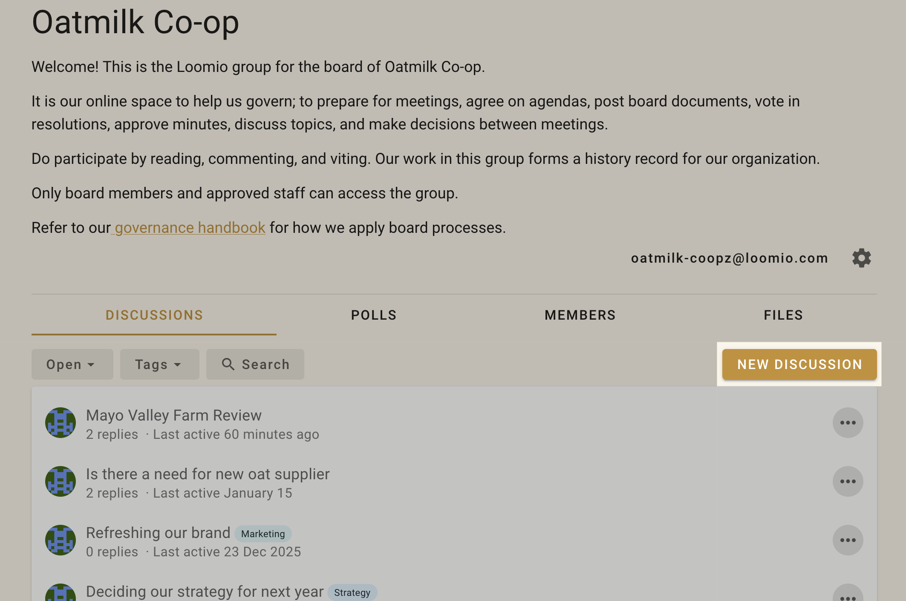
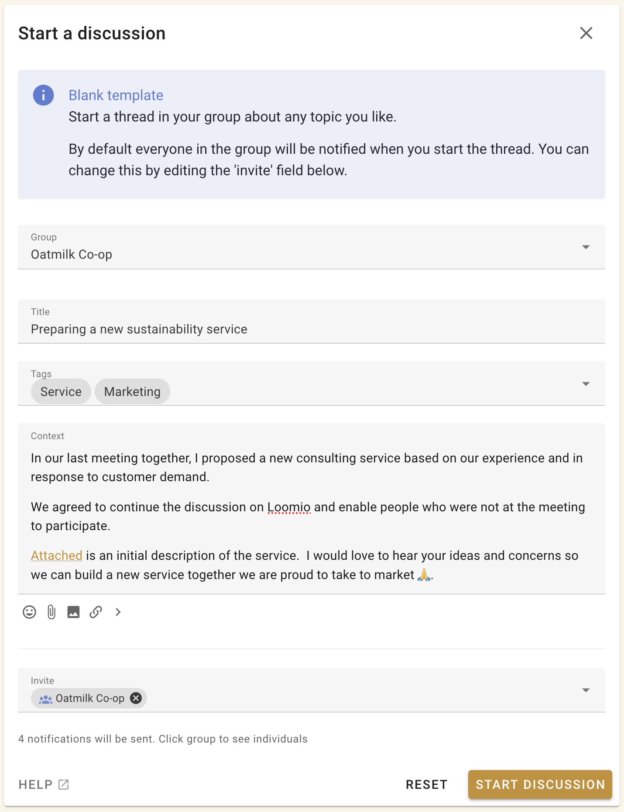

# Starting a discussion

Starting a Loomio discussion is like writing an email. The subject line of an email is like the discussion title, and the text you write in an email is like the context of a discussion.

As you add people in the send list of your email, in Loomio you can invite people individually or as a group to the discussion - they will receive an email notification with the content of your discussion.

People can reply to your discussion via email and their comments will appear in the discussion.

As with an email, a discussion may be a simple question, or a more detailed introduction to a topic with links or files attached for background information.

## New discussion

Find the **New discussion** button on your Loomio group page to start a new discussion.

You can start a discussion within your Loomio group or any subgroup.

### Group
Check the name of the group or subgroup is correct for your discussion.  Anyone in this group will be able to see the discussion. You can also start the discussion in another group or as a 'direct' discussion (no group).

*Tip: If you are not ready to make the discussion visible in your group, start the discussion as 'direct'.  You can move the discussion to your Loomio group when ready.*

### Tags
Add tag(s) to help people find your discussion when searching by tag.  Admins can create new tags.

### Invite

Use invite to send the discussion to specific people via email.

See [Notifying people](https://help.loomio.com/en/user_manual/threads/notifying_people/index.html) for guidance.

### Title
Give your discussion a relevant title.  A discussion title is similar to an email subject line.

### Context
Use discussion context to introduce the topic and frame the conversation or decision to make. Use the formatting tools to emphasize key points. Include background information, attach files, link to online documents and embed a video.

The context will always stay at the top of the discussion and you can update it at any time as the discussion progresses.  When the discussion ends, update the context with the outcome.

