# Using discussions

Loomio discussions are versatile and you have many tools available to help you progress a discussion to an outcome.  Read on to see how to get the most from discussions.

*On this page*
- [Discussion navigation](#discussion-navigation)
- [Discussion context](#discussion-context)
- [Discussion timeline](#discussion-timeline)
- [Comments](#comments)
- [Discussion display](#discussion-display)
- [Administering discussions](#administering-discussions)

## Discussion navigation

A typical thread looks like this:

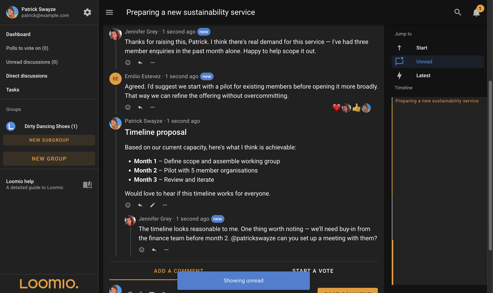

Description of thread features from the top.

**Group name** - At the top left of the discussion page is the name of the group or subgroup that the discussion belongs to.  Click on this name to go back to the group page.

**Discussion privacy** - At the top right of the discussion page is a tag showing that this discussion is private - only members of the group, and anyone specifically invited to the discussion, can see and participate in the discussion.

**Discussion title** - The discussion title is the largest type font on the page, so easy to spot.

**Category tags** - The discussion may have one or more category tags. Using simple tags helps people more easily find discussions of a similar type.

**Discussion author** - Under the discussion title is see the photo/avatar and name of the person who started the discussion.

**Date** - Hover over the date to see the full date and time of discussion start.

**Seen by** - Shows who has read the discussion, and when.

**Notified** - Shows who has been notified about the discussion, and if read or email opened.

**Discussion context** - Content to frame the discussion.

**Discussion interaction and administration tools** - Under discussion context is a range of tools where you can watch, invite, react, reply and edit the discussion context.  Click on the 3 dot menu (**...**) to see more tools.

**Comments** - Comments are displayed under the discussion context. The default display is from oldest to newest. You can change the order of display if you wish, however this applies to everyone in the group.   The comment author, image and date comment added helps you see who has written the comment and when.   Interaction and administration tools are also available for each comment.

**Timeline** - As comments and polls are posted in the discussion, a timeline builds marking important milestones in the discussion.  Polls are automatically pinned to the timeline.  Any comment may be pinned to the timeline.

## Discussion context

The discussion **context** is always found at the top of the discussion. Use the context to frame the discussion or decision.

Think of your group as you write content in the discussion context.  Your aim is to get a discussion going, so consider how you can motivate people to participate.  In general, keep the discussion context simple and clear.

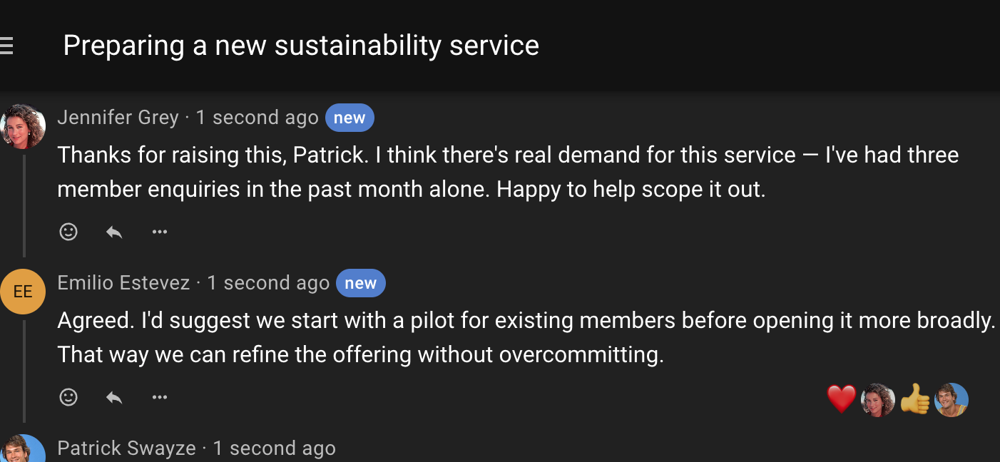

Write the discussion context when starting or editing a discussion. **Edit** a discussion with the pencil icon.

As the discussion progresses, update discussion context.  Think of the context like a whiteboard in your meeting room, where you can write the agenda, the outcomes intended and how you plan to get there.

At the bottom of the context panel is a formatting bar, where you can format text, attach files, images and embed a video.

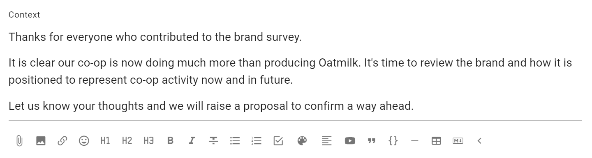

## Discussion timeline

The discussion timeline is on the right of the discussion, and helps you quickly access comments and polls in a discussion. It is a visual, interactive history automatically building as the discussion progresses with important comments, polls and milestones.

Comments that include a header (H2 or H3), polls and proposals are automatically pinned to the timeline.

Click on the item in the timeline to go directly to the comment or poll in the discussion.

Jump to the top of the discussion by clicking on "**Context**".

## Comments
The most common activity in a discussion is commenting. Comments are visible to anyone who has permission to see the discussion.

### Reading comments
When you open a discussion, Loomio will first show you new comments. 

Unread comments are shown with a yellow line on the left side. 

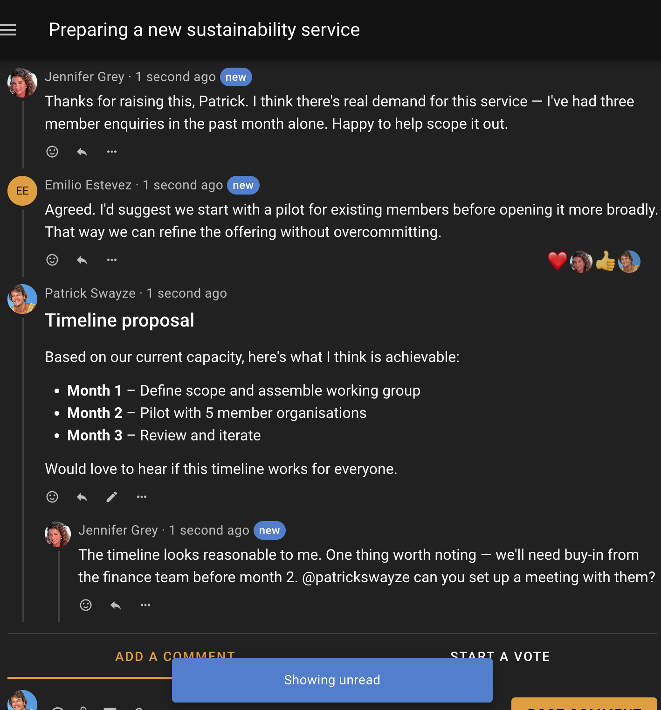

### Writing a comment

You can write a comment in a discussion, and people can reply, react or post their own comment to continue the discussion.

When you have written your text, use **Post Comment** to instantly publish the comment. Your comment will be visible to anyone who has permission to see the discussion. 

The full range of formatting tools described in [Formatting](https://help.loomio.com/en/user_manual/threads/thread_admin/index.html) are available for use in comments.

Write your comment and press **Post Comment**.

### Reactions
Reacting to a comment is a great way to encourage and acknowledge a comment by letting the comment author know how you feel.  

It is a quick and easy way to participate that does not require any text, nor send an email.

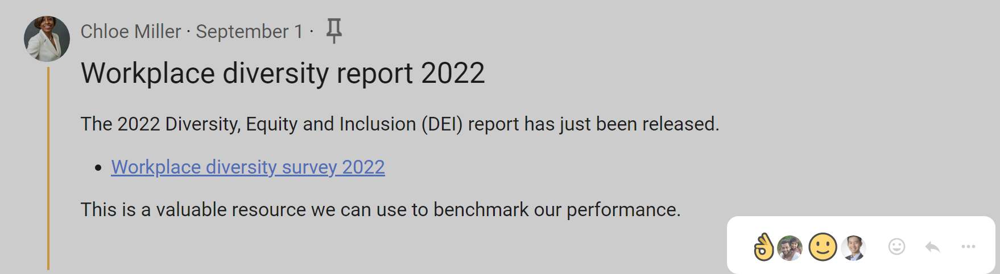

### Replying to a comment

You can reply to someone's comment by clicking on the reply icon located at the bottom right of the comment.

Your reply is published in the thread and an email notification is sent to the author of the comment.

You can reply to your own comment so as to nest your reply underneath the comment. Click the three horizontal dots (**⋯**) to find the **reply** feature.

If Loomio has emailed you a comment and says you can reply to the email, you can reply directly from your email and your message will appear in the thread.

### Automatic translation

Loomio can translate user content - written in discussion context, comment or polls -  into your language.

If the author uses a language other than yours, **Translate comment** will be available in the drop-down options of that comment.

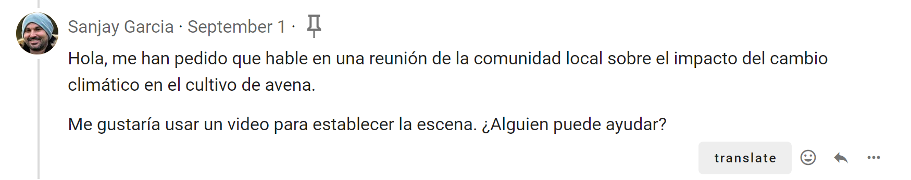

Click **Translate comment** to see the comment in your language.

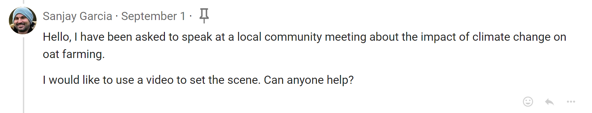

### Comment tools

The following tools can be used on any comment by clicking on the three dot menu (**⋯**) at the bottom-right of the comment.

### Pin to timeline

Use **Pin to timeline** to pin a comment to the timeline.

You an edit the comment label on the timeline. Unpin and then pin it again; this will give you the opportunity to reword the text that appears as a link in the timeline.

> **Tip:** Highlight the words that you would like to use as the text in the timeline

**Unpin**  removes the item from the timeline.

### Editing comment
If you want to change anything you can edit the comment by selecting **Edit** under the 3 dot menu.

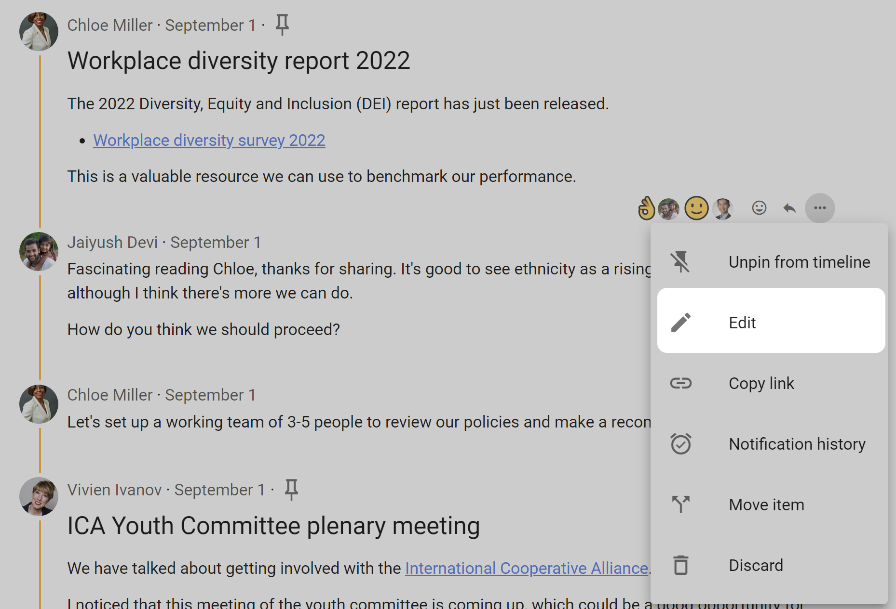

### Show edits

When a comment has been edited, the **Show edits** icon appears.

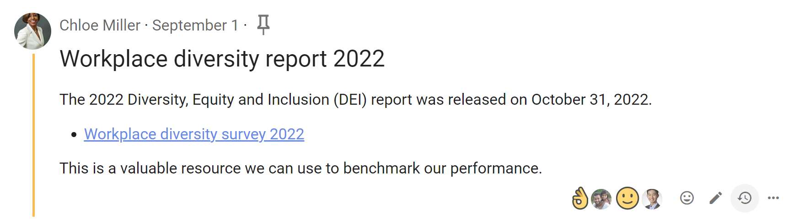

Click on **Show edits** to see what changes have been made.  Red highlighted text has been deleted, and green highlighted text added.  

The person who edited the comment, and the date and time of edit, is recorded in Loomio.  

Click on the arrows to see previous edits.

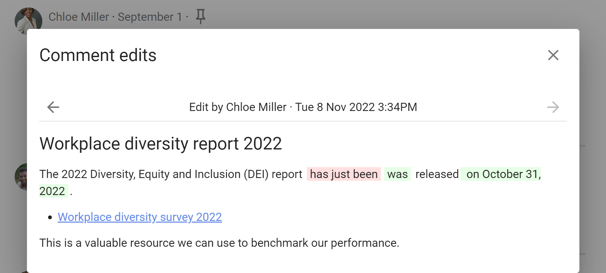

You cannot edit other people's comments unless:
- You are the comment author
- You are a group admin and the group permission [Admins can edit members' comments](https://help.loomio.com/en/user_manual/groups/settings/index.html#permissions) is enabled. 

### Copy link

Use **Copy link** to copy the unique address (url) of the comment.  

The link will be copied to your computer or mobile device clipboard, where you can paste or add it as a link in another part of Loomio or any online document.

This is a great way to directly refer to your own comment or a comment someone has posted.

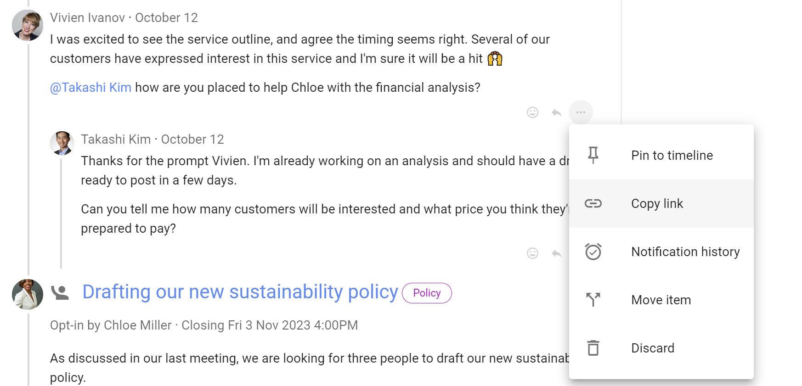

### Notification history

See [Comment notification history](https://help.loomio.com/en/user_manual/threads/notifying_people/index.html#comment-notification-history).

### Move item

If a comment is posted on a new or different topic, you can move comments to another discussion, or to start a new discussion.

Open the 3 dot menu (**...**) and select **Move item**.

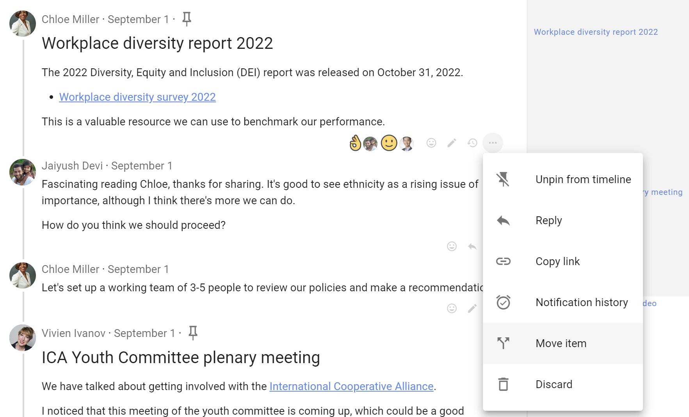

Select the comments you want to move to another discussion.

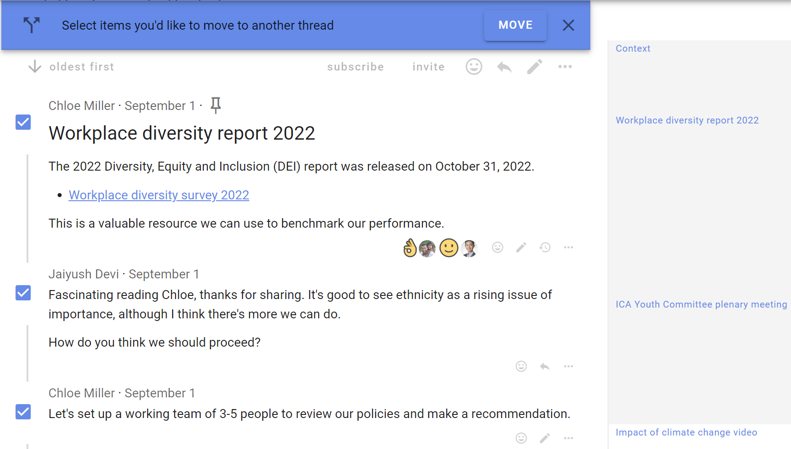

Click **Move** in the banner at the top of the discussion.

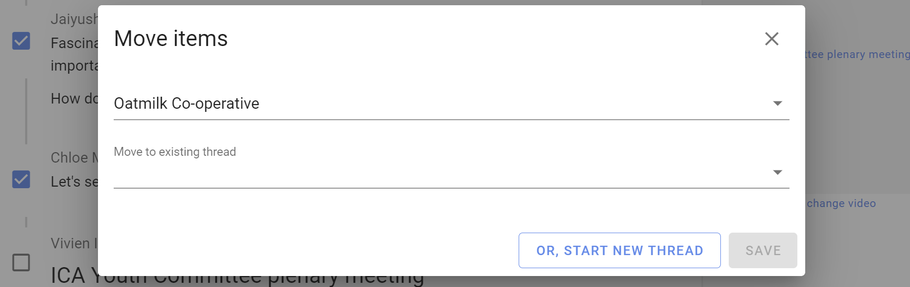

Choose the group or subgroup.

Choose either an existing discussion to move the comments in to, or start a new discussion on a new topic.

If you want to start a new discussion, add discussion title and context.

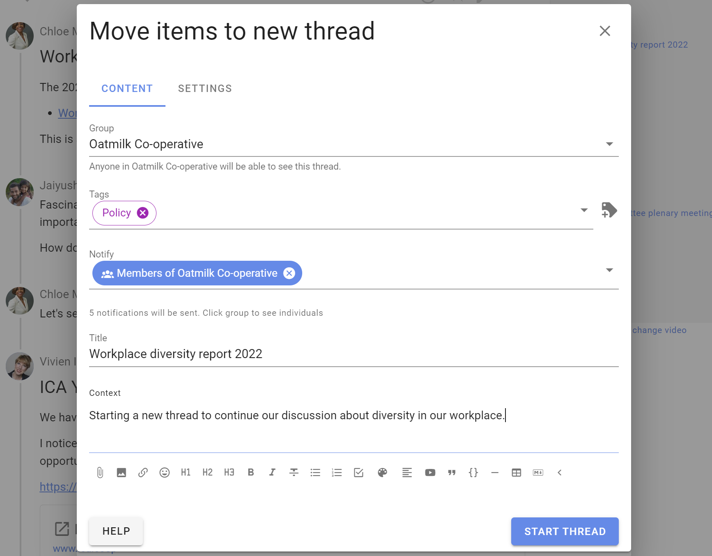

A new discussion is created with comments moved from the old discussion.

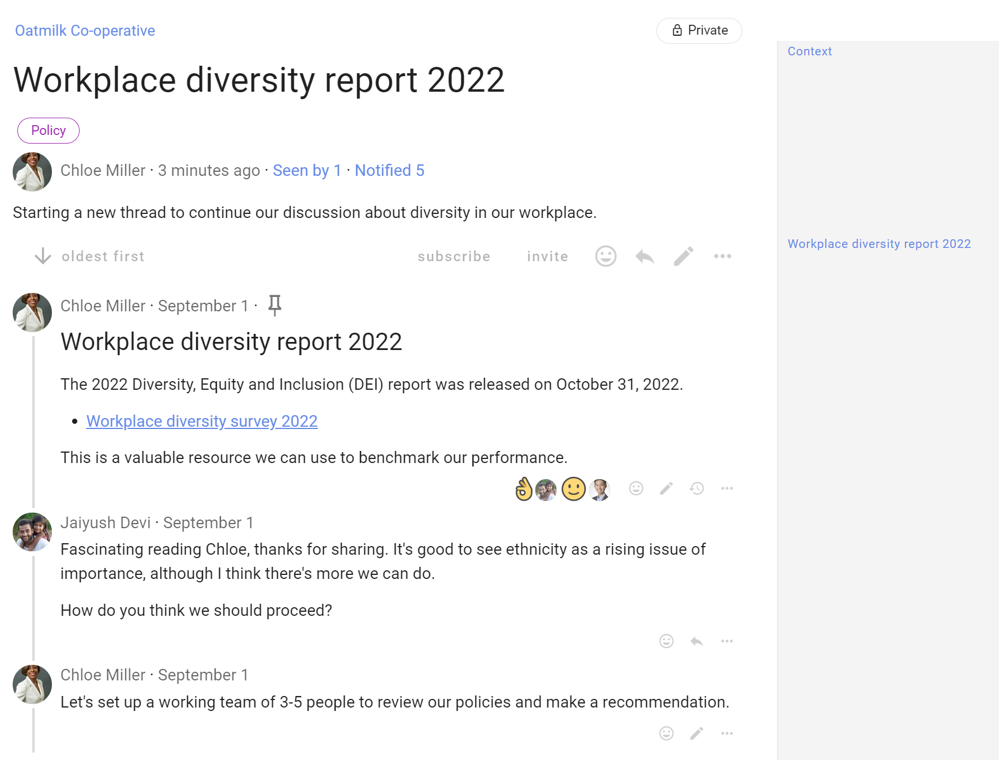

### Discard comment

Discarding a comment removes it from the thread, but retains the comment in a trash bin.

You can discard your own comments at any time with **Discard** under the 3 dot (*...*) menu located at the bottom right of your comment.

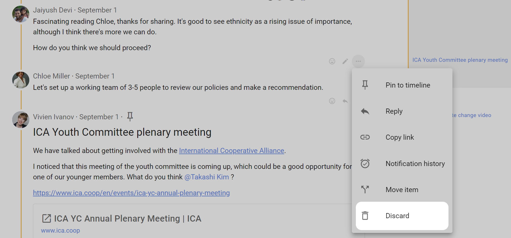

#### Restore comment

You can restore your own comment with **Restore**.  The location of the comment will be labeled as **Item removed**.  Click on the 3 dot (*...*) menu located at the bottom right of your discarded comment and select **Restore**.

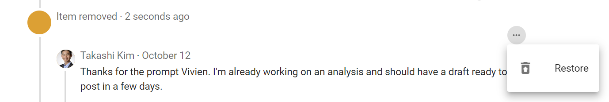

### Delete comment

Delete comment removes the comment permanently from the discussion.  It cannot be restored.

If "Members can delete their own comments" is permitted in [Group Settings](https://help.loomio.com/en/user_manual/groups/settings/index.html#permissions), you can delete your comment.

The location of the comment will be labeled as **Item removed**.  Click on the 3 dot (*...*) menu located at the bottom right of your discarded comment and select **Delete**.

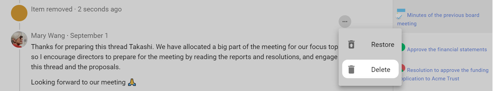

A warning message will appear and ask you to acknowledge that the comment will be permanently from the discussion and cannot be restored.

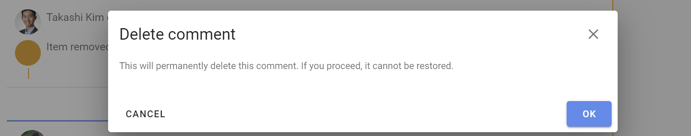

Admins can delete any comment - their own comments and the comments of other people in the group.

## Discussion display

By default comments in discussions are listed one after the other as you scroll down the discussion page - oldest comments first.  However you can change the discussion order so that newest comments are listed at the top of the discussion.  Seeing the latest comments first is useful for discussions used for reporting or discussions that have been active for some time.

The grey text just under the context will indicate in which order the activity is being listed, along with the number of replies.

To change this setting, click that grey text, choose your preference, and save. _This changes the layout for everyone, not just you._

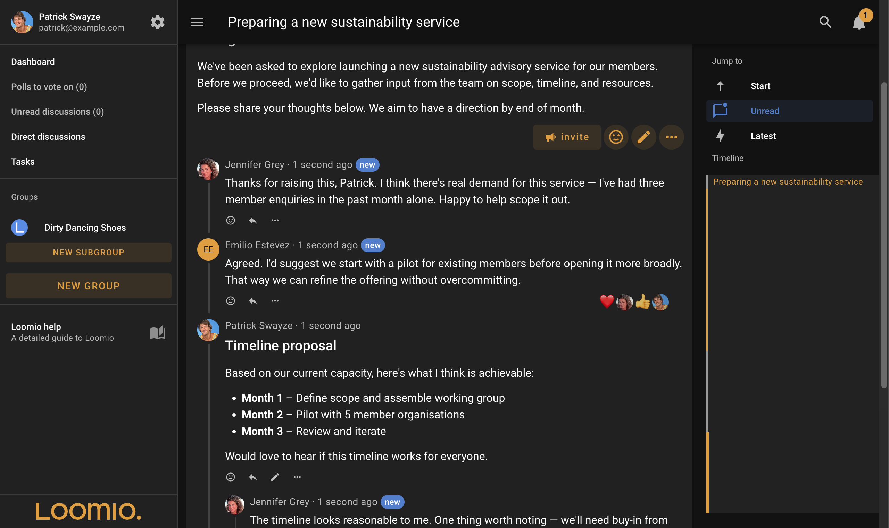

### Discussion display options

## Administering discussions

There are a set of tools on the discussion page to help you make a copy, print, move discussion, close or delete discussion.

Find the tools under the 3 dot (**⋯**) menu, under the discussion context on the right.

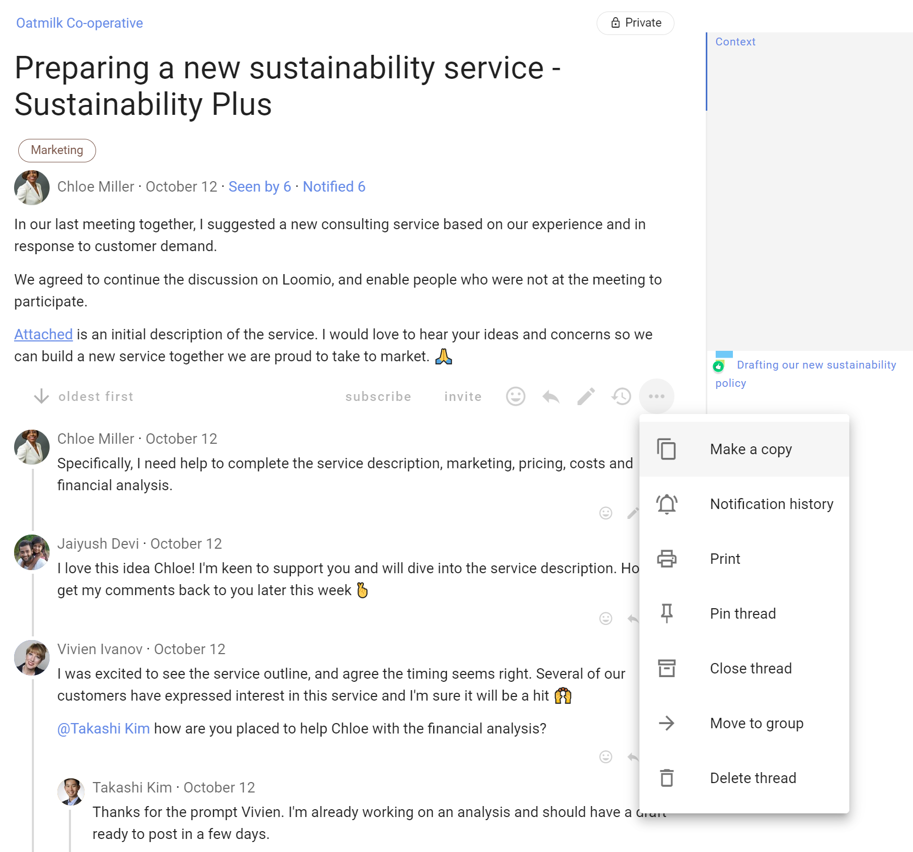

### Make a copy

Create a copy of a discussion - title ("Copy of...") and the discussion context, along with any tags and formatting used.

Use **Make a copy** when you want to start a new discussion based on an existing discussion.

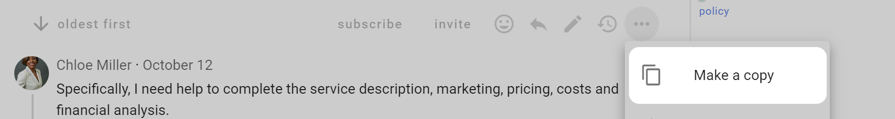

Edit the discussion title and context for your new discussion.

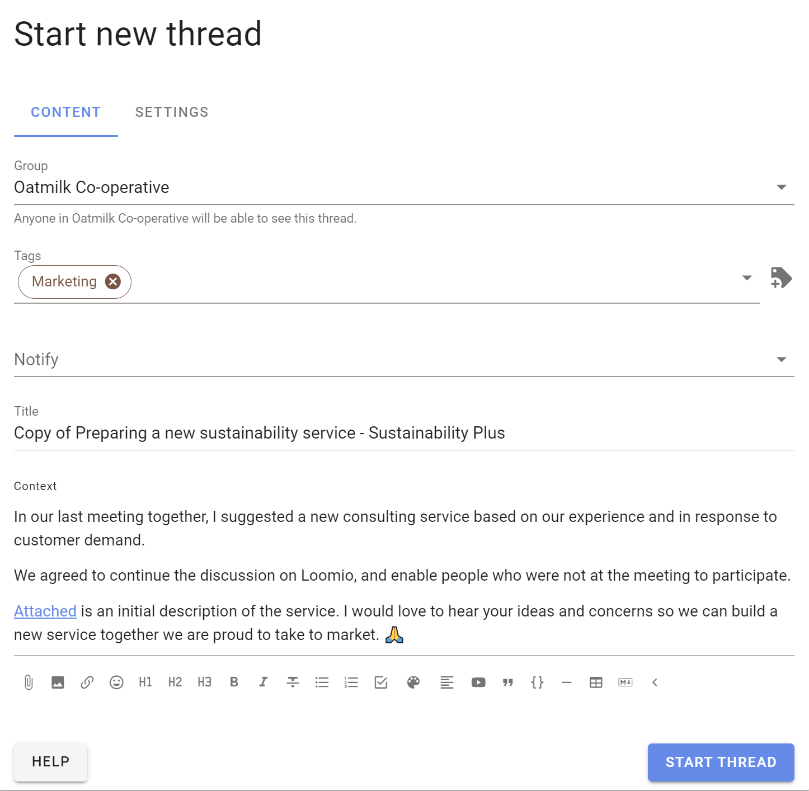

> Note: **Make a copy** does not copy comments or polls from the source discussion.  Although Loomio remembers the polls used in the source discussion, so that when you start a poll in the discussion, the poll types used in the source discussion will show at the top of the list of polls.

### Show notifications

See [Notified: (Discussion notification history)](https://help.loomio.com/en/user_manual/threads/notifying_people/index.html#notified-discussion-notification-history).

### Print

In the discussion menu click on the 3 dots menu (**⋯**) and choose **Print**.

A page suitable for print is generated.

To save as a file, use your browser's ability to "save to pdf", or copy and paste it into a file or repository of your choosing.

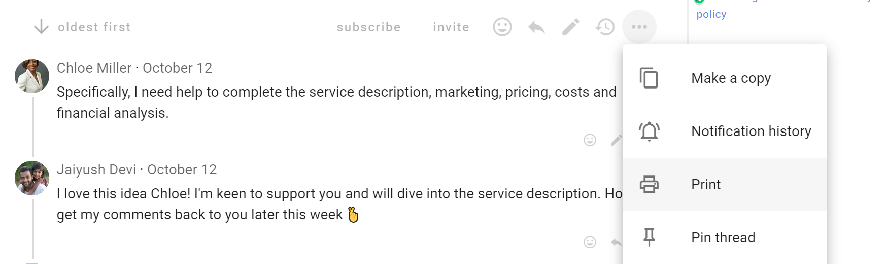

### Pin discussion
Admins can pin discussions to the top of the group page to make them easier to find.

Pinned discussions will appear above your other discussions on your group page and will be ordered by the most recently pinned item at the top. You can change position of the pinned discussion by pinning and unpinning discussions.

You can **pin** or **un-pin** from the discussion preview options on the Group page.

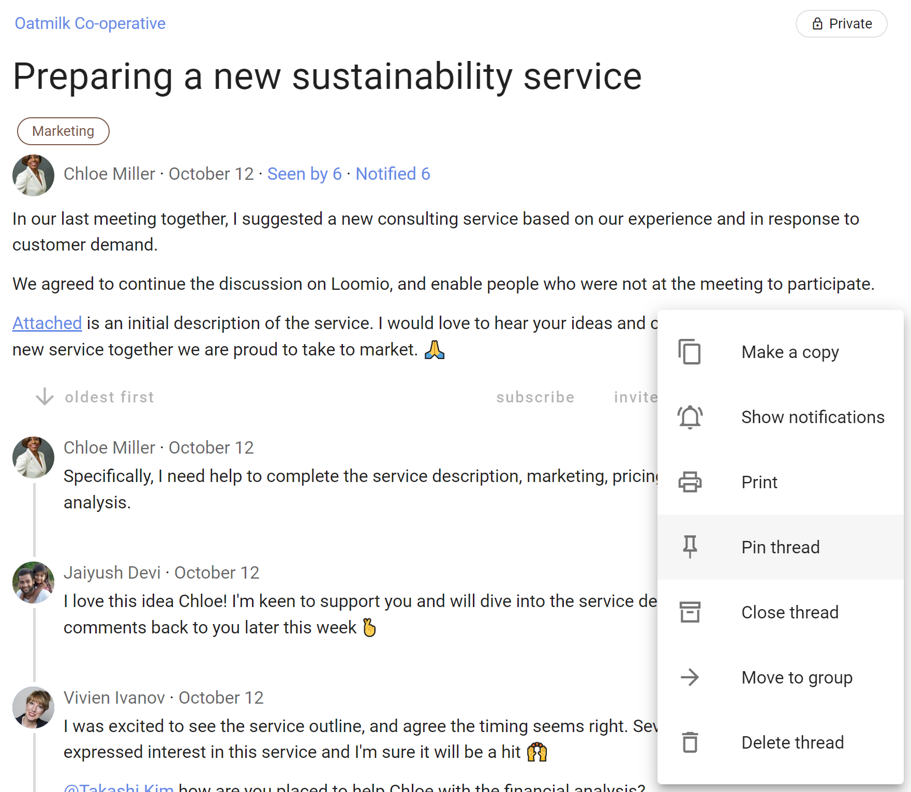

### Close discussion

To keep the list of discussions on your group page relevant, you can close discussions which people don't need to see.

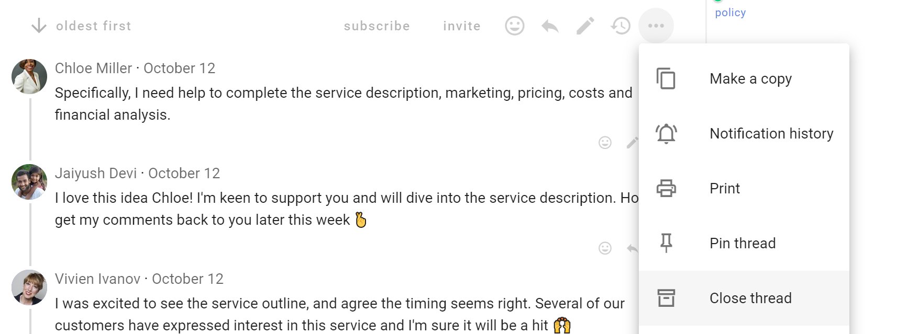

To view closed discussions, go to your group page. Click the drop-down menu just under the **Discussions** tab and change the discussion filter from **Open** to **Closed**.

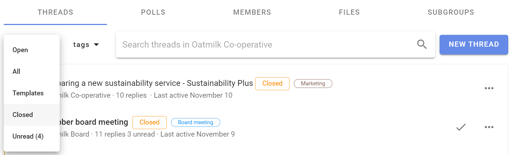

Closed discussions are marked with a **Closed** tag.

#### Re-open discussion

You can re-open a closed discussion from the [group page](https://help.loomio.com/en/user_manual/groups/thread_management/index.html#close-discussion) or from within the discussion.

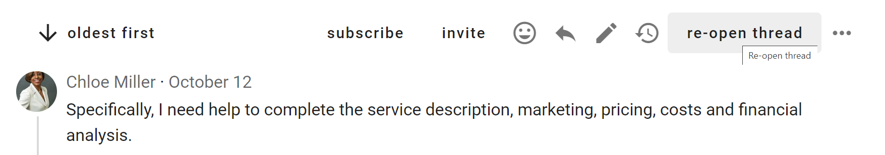

### Move to group

You can move a discussion to another group or subgroup.  The discussion will then be visible to any member of the destination group, and anyone who have been specifically invited to the discussion.

Select **Move to group** from the 3 dot menu to the right of the discussion.

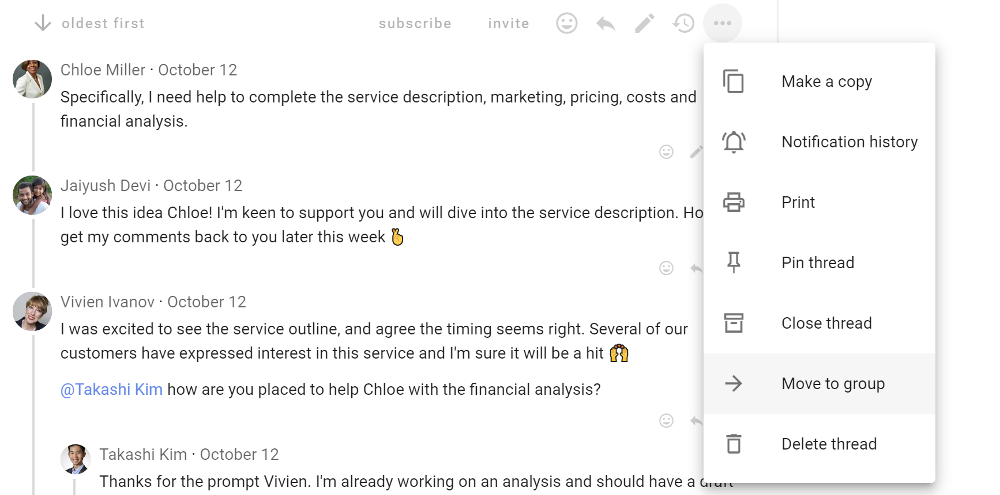

Select the destination group or subgroup.

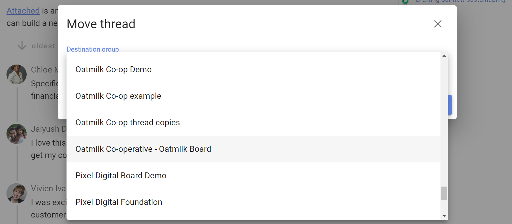

### Delete discussion

You can delete any discussion that you start.

Group admins you can delete any discussion in the group.

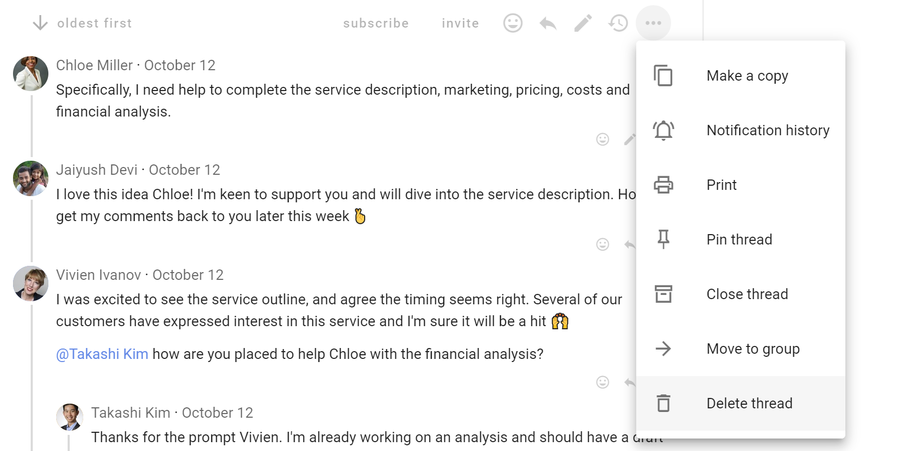

You will be asked to confirm you want to delete the discussion.  Delete discussion can not be undone.

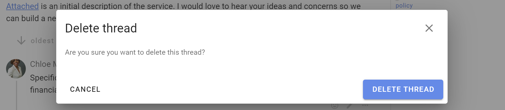

