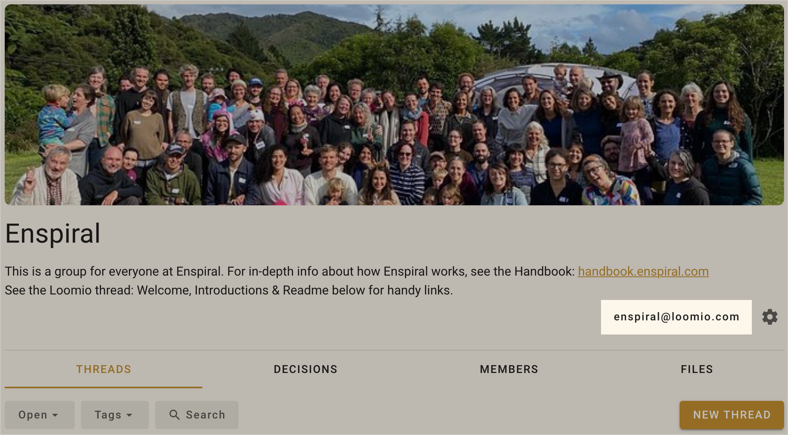
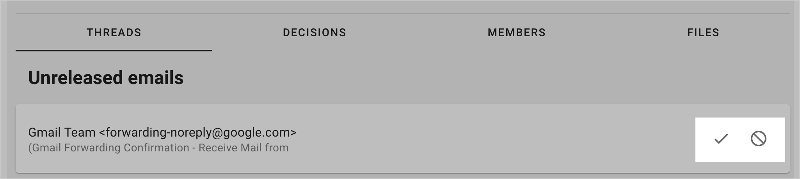

# Send an email to start a thread in your group

Your Loomio group has an email address! You can send or forward email to this address to start a thread in the group.

You can see your group's email address on the group page:

When you send an email to this address, a new thread will be started. The email subject becomes the thread title, the body of the email becomes the description, and any attached files will be attached to the thread.

The email "From" address is used to find the group member who will be the author of the thread.

## Preventing unauthorized emails

To ensure that this feature cannot be used by people who are not members of your group, Loomio will require that the "From" address of an incoming email matches the address of someone in the group.

If you use multiple email addresses, you can add an alias so Loomio knows about your other email addresses.

When the "from" address does not match a member of the group, you will receive a notification asking you to add an alias or reject all further emails from that address.

This means that the first time you send email from an unrecognised address, you will need to add an alias. After that, emails will be accepted immediately.

