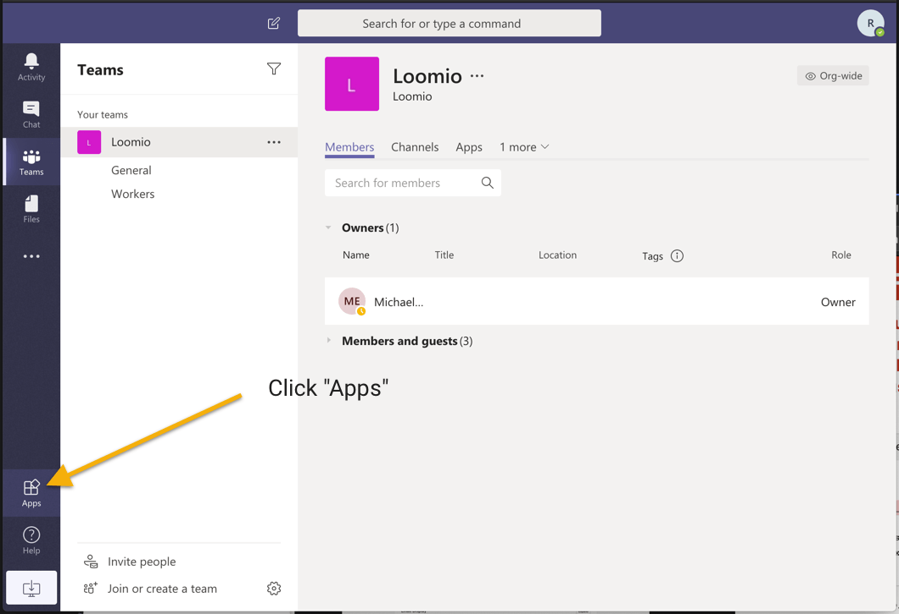
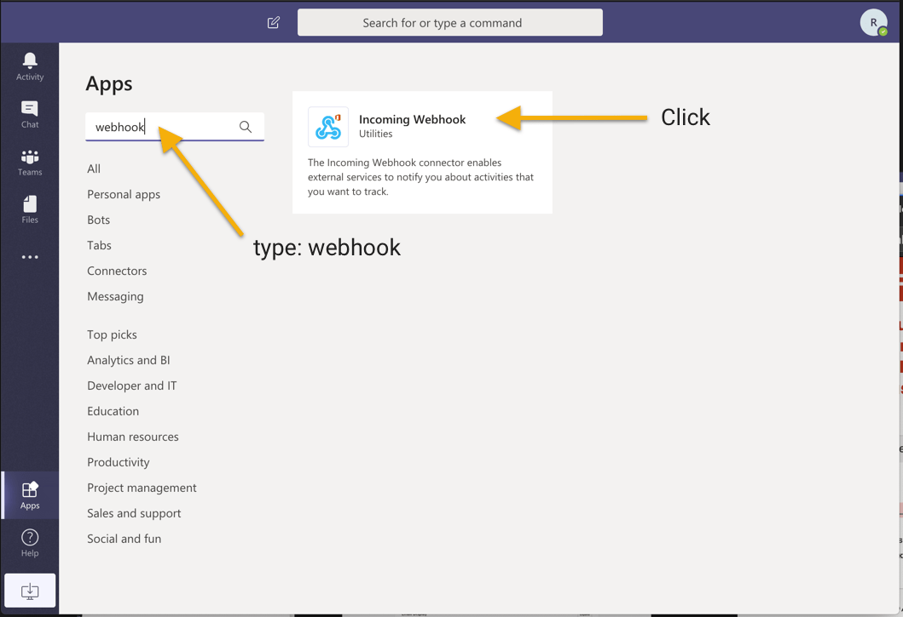
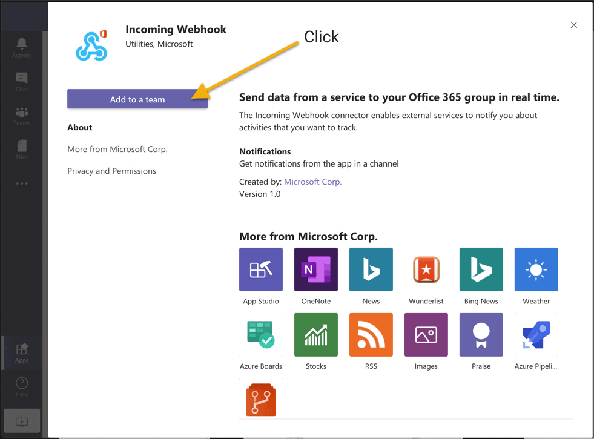
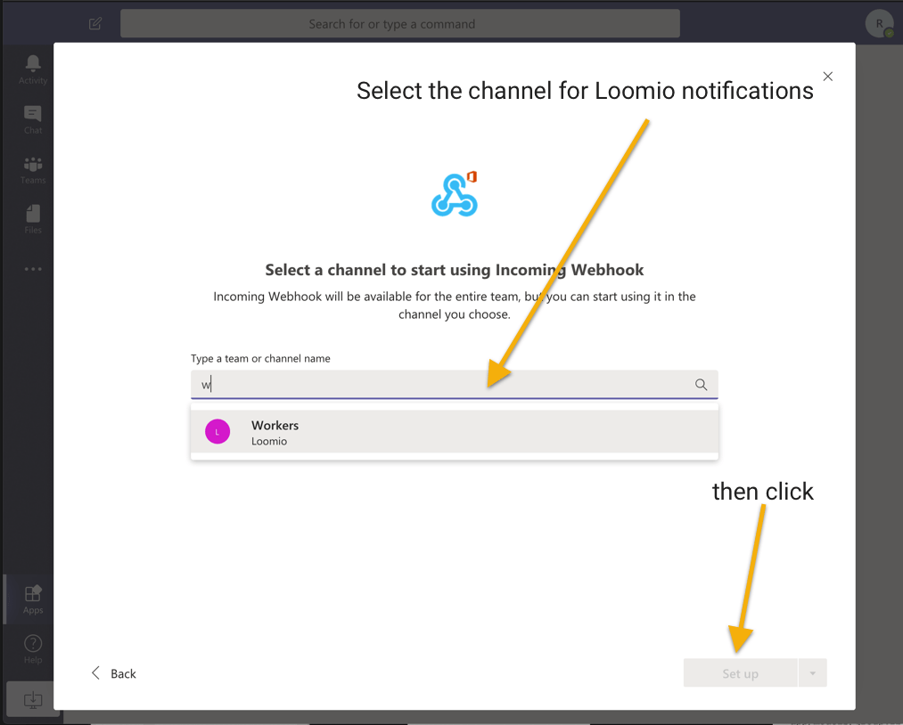
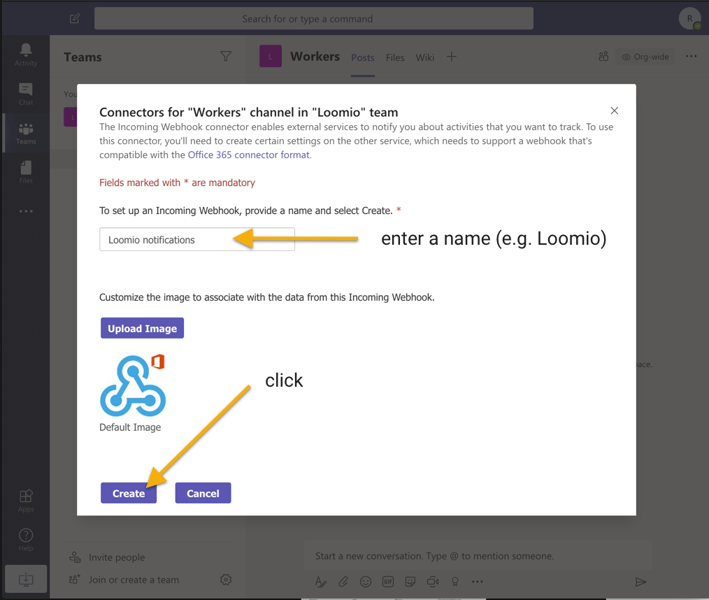
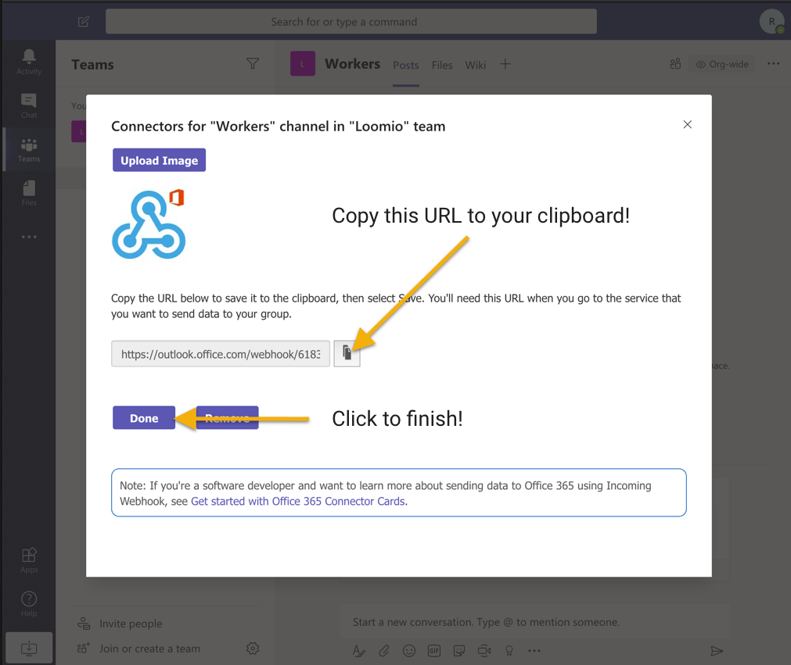

# Microsoft Teams integration
_Connect your Loomio group notifications to Microsoft Teams._

Loomio can send notifications into your Microsoft Teams when new discussions, proposals, comments, votes, and outcomes occur. 

---

Visit [https://teams.microsoft.com](https://teams.microsoft.com) then click Apps

Search for "webhook" in the search field, then click Incoming Webhook

Click "Add to a team"

Type and select the channel you want Loomio notifications to appear within.

Give it a name, such as "Loomio notifications", then click "Create"

Copy the URL it gives you, you'll paste it into Loomio in the last step.

_Loomio is not created by, affiliated with, or supported by Microsoft._

Now that you have a Webhook URL, continue setting up your chatbot over here:

[Adding a chatbot in Loomio](../chatbots/#how-to-setup-a-chatbot)
