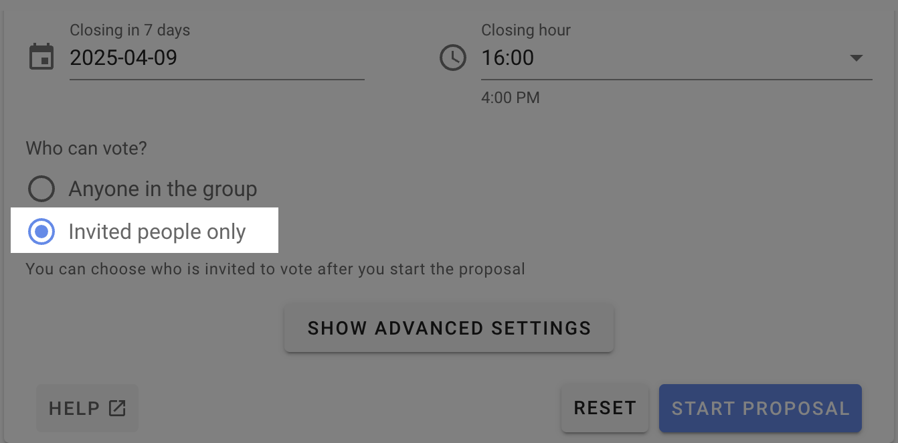
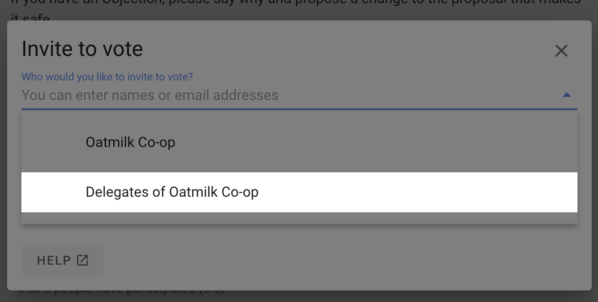
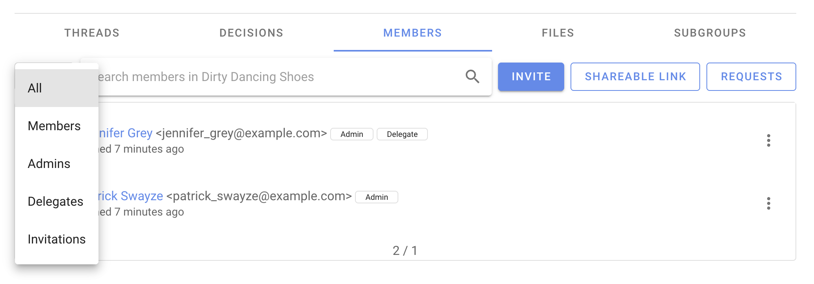

# Delegated voters

If some members of your group should have voting rights while others should not, you can use the "Make delegate" feature to identify those people with voting rights. There is a corresponding "Revoke delegate" action too.

To create a poll or proposal and only invite the delegates, use the "Invited people only" poll setting.

Then when inviting people to vote you will see the "Delegates of group-name" option.

You can see a list of who the delegates are from the members tab of your group page. Use the filter menu and select "Delegates".

