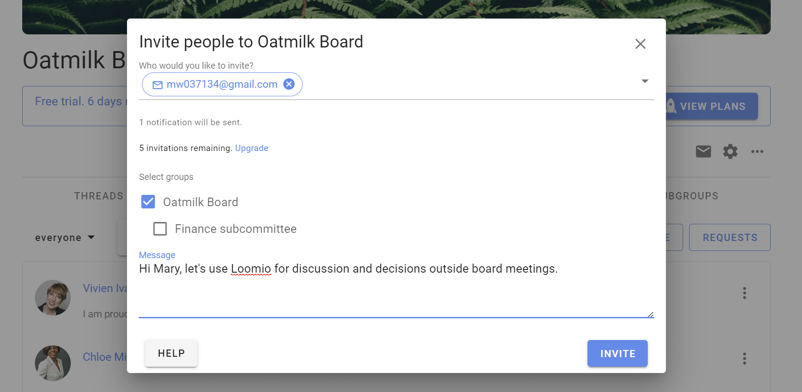
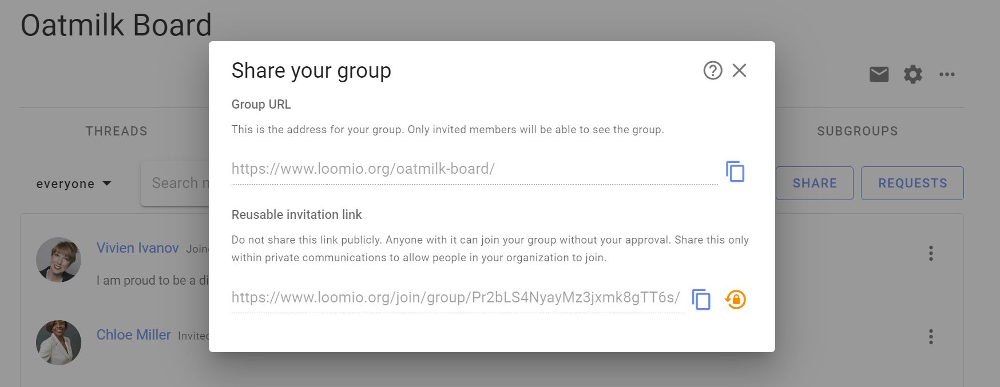
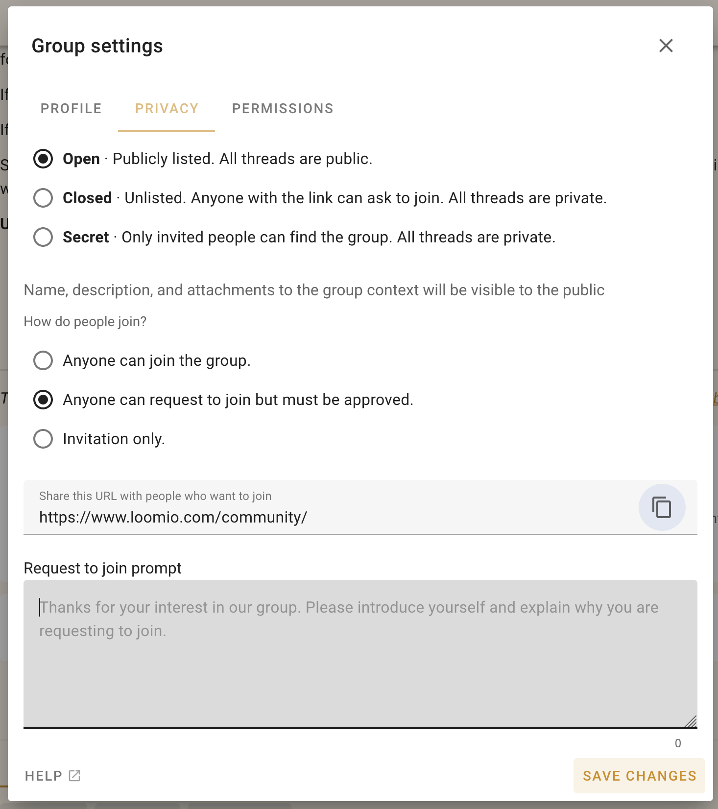
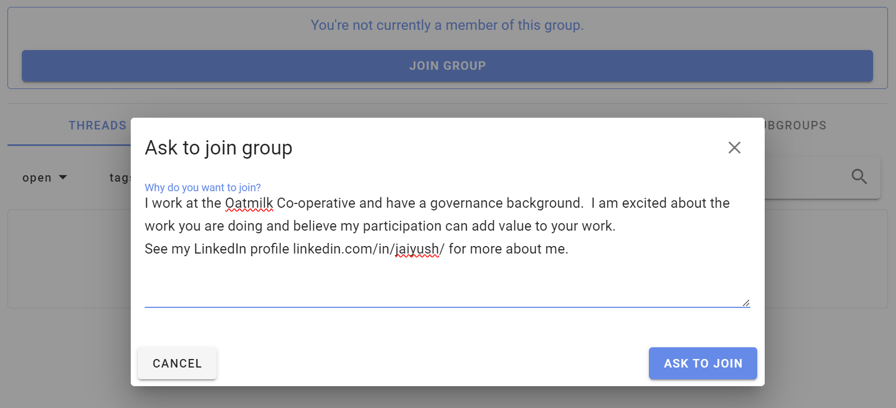
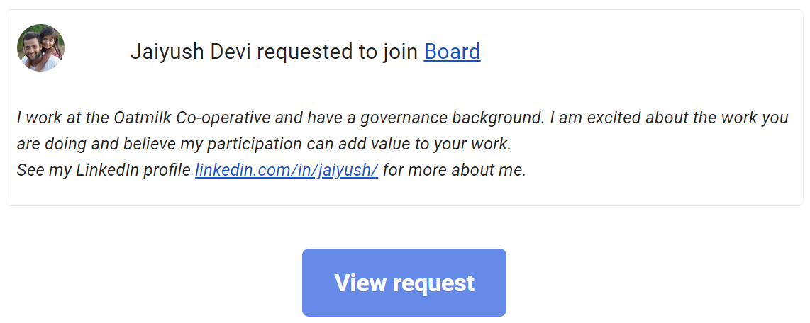
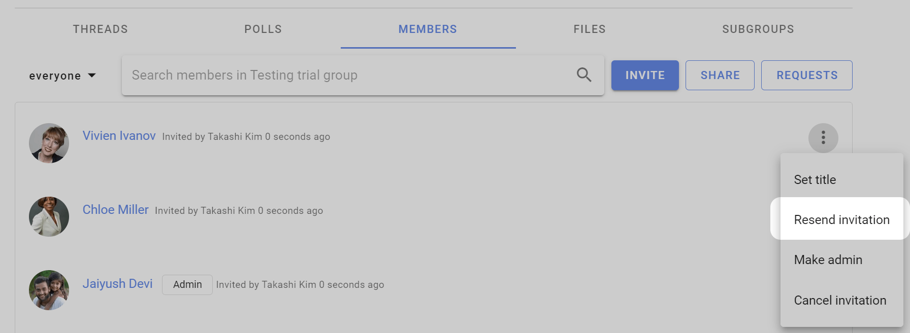
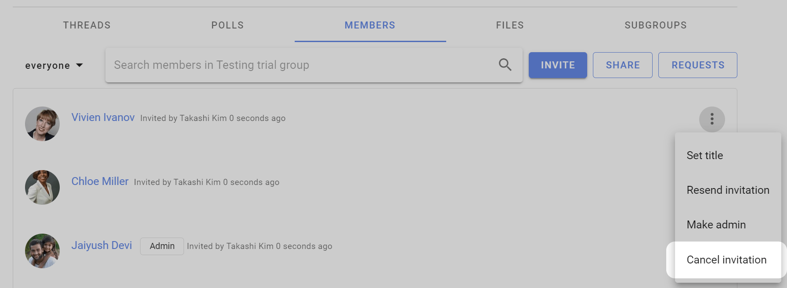

# Inviting people

*On this page*
- [Invite people](#invite-people)
- [Invite people via their email](#invite-people-via-their-email)
- [Share a link to your group](#share-a-link-to-your-group)
- [Managing invitations](#managing-invitations)

Inviting people to join your Loomio group is a critical step to success - however everyone is busy; many people are reluctant to try a new tool and can be slow to respond to your invitation.

Loomio includes tools to help you invite people; but you may also need to reach out to members by phone, text, chat or in a meeting, to tell them ***why*** you are using Loomio. If your group members resonate with this, it will encourage them to give it a go.

For example, your group might need:
- a safe space where members can find all the info they need and participate in their own time
- to stay in touch and respond to issues that come up between meetings
- to progress discussions and make decisions as needed
- to have better meetings and focus precious meeting time on issues that matter

If you're still having trouble with people not accepting your invitation:
- [Re-send your invitation](#re-send-invitations).
- Invite them to a particular thread or poll using their email address (so they can see that things are happening). Their email reply or vote will appear in Loomio.
- Record a short video of yourself on your phone, Zoom or Loom and send this with your invitation; so people can see that you're a real person, the importance of the work, your enthusiasm and passion, and to encourage them to join in :-)

## Invite people

Go to your group page and click the **Members** tab to access member management

You can **Invite** particular people to your group with their email address or **Share** a link to your group via email, newsletter, chat or from your website.

## Invite people via their email

Click **Invite** on the Member tab of your group page to send an email invitation with a _single-use_ link to a person's email address.  The recipient is invited to create a Loomio user account and join your group.

If the recipient already has a Loomio user account they can still accept the invitation to join your group with their existing account.

### Invite many at once

You can send invitations by email to up to 100 people at a time by entering (or copy/pasting) multiple email addresses into the "Who would you like to invite" box. Separate email addresses by comma or space.

- ***Tip**: Copy email addresses from a column in a Google or Excel spreadsheet, and paste into the invitation box.*

When you click **Invite** an email will be sent to each of the email addresses you supplied, containing a unique invitation link that can only be used once. This email will be sent in your current language.

### Invite people to Subgroups

Following the same process as above, you can invite people to a 'parent' group, and one or more subgroups simultaneously when you invite them with the **Invite people** button. Tick the boxes next to the subgroups you want them to immediately be a part of when they join the group.

## Share a link to your group

You can share a link to your group with the **Share** button. This is useful if you want to send a link via email, newsletter, chat or post on your website.

Two options are provided:

**Group URL** is the address for your group. Only invited members will be able to see the group. Useful to remind people that you have previously invited.

**Reusable invitation link** will allow anyone with the link to join your group without your approval.  Share this only within private communications to allow people in your organization to join.

Click on the "copy" icon to copy the link to your clipboard, then paste in your email, newsletter or chat channel.

If you want to stop people from joining via the link, click "Reset this link". The existing link will no longer work and a new link will be created.

### Allow people to "Ask to join group"

If your group's privacy is **Closed** then you can share your group URL ie: `https://www.loomio.com/group-name`. When people arrive at your group page, they will see the group title and description, and a button **Join group** where they can request membership.

Go to Group Settings (the cog icon on your group page) then Privacy.

People who **Ask to join group** are invited to write a short reason - *"Why do you want to join"*.  It may helpful if you ask people to state the organization they work for.

Group admins will receive an email, with a link to where you can approve or deny the request to join.

## Managing invitations

To manage invitations, open the filter/ drop down from the Members tab of your Group page and select **Invitations**; click on the three dot menu to the right of the member invitation.

You can also make people administrators or set their title (e.g. "IT Support") within the group before they accept their invitation.

### Re-send invitations

Follow up on people who don't make it into the group and give them a nudge. If someone has lost or forgotten about their invitation email, you can re-send it from the dropdown menu beside their name on the Members page.

Click on the three dots (**⋮**) next to the person you want to resend the invitation to, and then choose **Resend invitation**.

### Encourage people to participate

If people join but don't begin to participate right away, you might like to welcome them to the group with an @mention, for example:

> “Welcome to the group @Jane :) It's great to have you here! Would you saying a little bit about your work in this space?”

### Cancelling invitations
If you entered the wrong email address, or have changed your mind about inviting someone, you can cancel an invitation from the Members tab on your Group page. Select **Cancel Invitation** from the drop down menu to the right of the member invitation (**⋮**).

