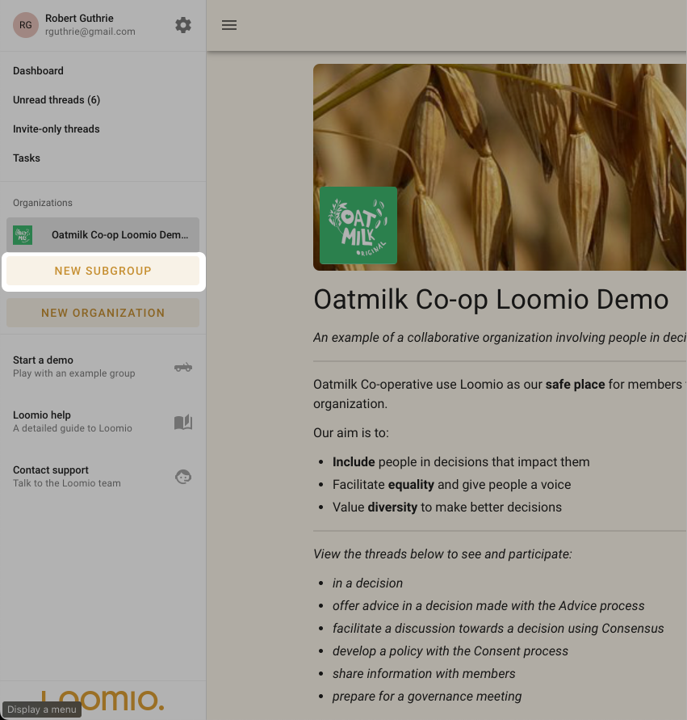
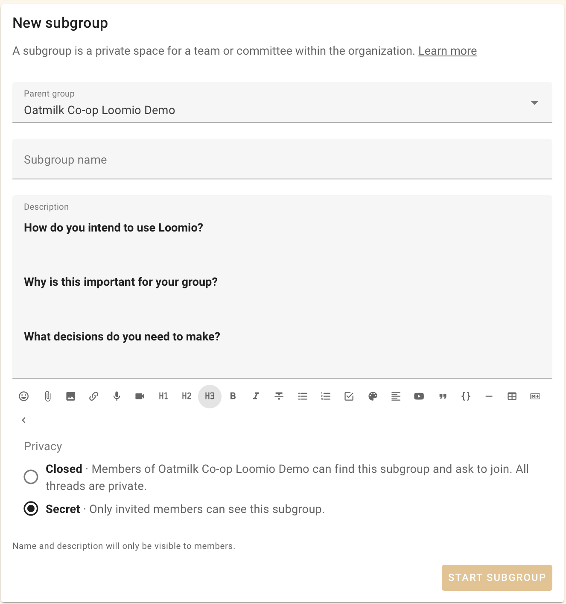
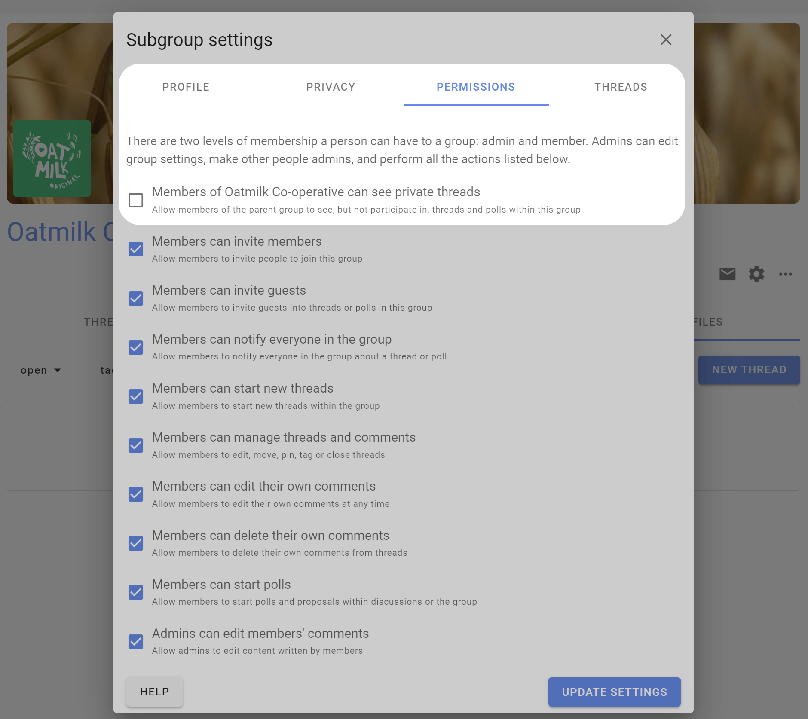
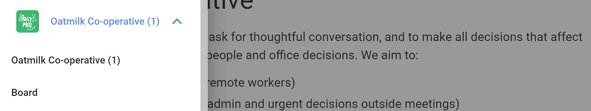
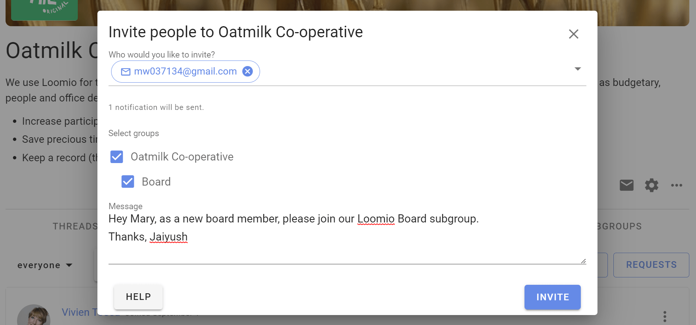
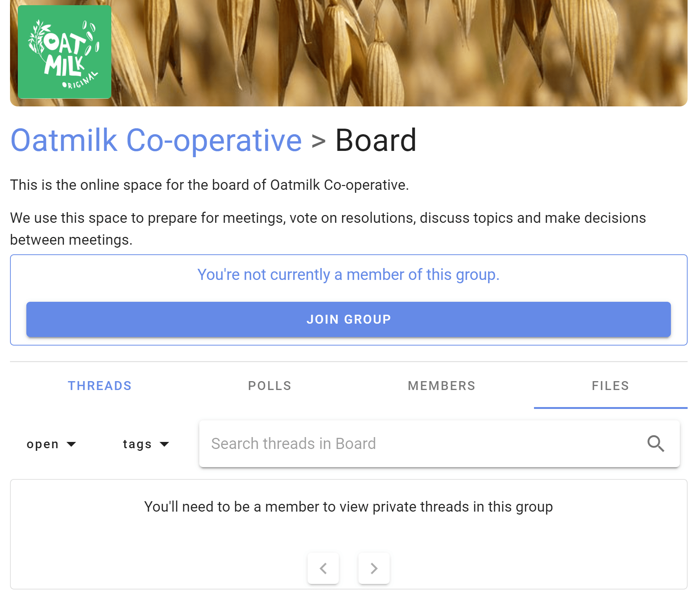
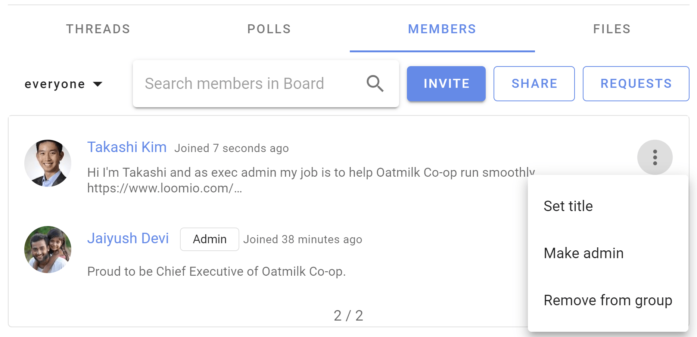

# Subgroups

*On this page*
- [Add a subgroup](#add-a-subgroup)
- [Subgroup settings](#subgroup-settings)
- [Find subgroups](#find-subgroups)
- [Invite to subgroup](#invite-to-subgroup)
- [Administer subgroup](#administer-subgroup)
- [Archive a subgroup](#archive-a-subgroup)
- [Delete a subgroup](#delete-a-subgroup)
- [Group page shows subgroup threads](#group-page-shows-subgroup-threads)

Subgroups help you organize your communications and members so that the right people are engaged in their work together.

For example, you can use subgroups for your organization's

- governance board
- working team or a project working group
- a topic (such as 'strategy' or 'learning')

Subgroups work just like groups do, but are located within your "parent" group. Most of the features and settings are the same as what you encounter in your parent group. This also means that someone can be a member of your subgroup, such as your board, but not of your parent group.

## Add a subgroup

To add a subgroup, visit your main group page, then click **New Subgroup** from the sidebar.

Click the **New subgroup** button, give it a name and select the privacy setting, then click **Start subgroup**.

The subgroup is created and you can start threads and invite people into the subgroup.

Add a [group description](https://help.loomio.com/en/user_manual/groups/settings/index.html#group-description) so people you invite to the subgroup understand its purpose.

Check subgroup settings such as privacy, permissions and change the cover image and logo to suit your subgroup.

When you are ready, [invite people](https://help.loomio.com/en/user_manual/groups/membership/index.html) people to the subgroup.

## Subgroup settings

### Privacy

The privacy settings for subgroups are similar to the parent group.

**Secret** subgroups are not visible to people not invited to the subgroup.

**Closed** subgroups are listed in the Subgroups tab of the parent group and user's sidebar menu. Members of the parent group can request to join the subgroup. Membership is approved by a subgroup admin.

Closed subgroups have an additional setting that allow members of its parent group to see private threads.

[Read about group privacy here](https://help.loomio.com/en/user_manual/groups/settings/index.html#privacy).

### Permissions

Subgroups operate independently of the main group. For example, if the subgroup privacy setting is set to **Secret**, then only invited members can find this subgroup, see who is in it, and see threads.

**Closed** subgroups have an additional setting that allow members of its parent group to see private threads, enabling the subgroup to be transparent to members of the parent group.

## Find subgroups

Open the sidebar menu, and click your group name to see it's subgroups.

## Invite to subgroup

Invite people to a subgroup as you invite them into a group. If they're already in your parent group you can just type their name. You can also quickly select everyone from the parent group.

### Simultaneously invite people to subgroups and parent group

If you use the **Invite people** button from your parent group's **Members** tab, you can invite people to multiple subgroups at the same time by ticking the boxes of those you would like them to join immediately.

## Administer subgroup

Subgroups can have their own admins, and admins of a subgroup may not be the same as the admins of the parent group.

However an admin of the 'parent' group can make themselves admin of any subgroup.  This helps administrators of the parent group to administer subgroups as necessary.

Go to the Subgroup tab, find the subgroup and click **Join group**.

Now a member of the subgroup, an admin of the parent group can make themselves an admin of the subgroup.

## Archive a subgroup

When your subgroup has served its purpose and you want to keep the subgroup for your records, a subgroup admin can archive it with the following:
- Rename the subgroup by appending the word Archive, e.g. **Archive - subgroup name**.
- Update the subgroup description to let everyone know the subgroup is now closed/archived.
- Remove members of the subgroup, leaving at least one person as admin.  (Only subgroup members can write new content.)

If you want the archived subgroup to be visible to members of the parent group;
- Change subgroup privacy to **Closed**
- In **Permissions** check the first box allowing members of the parent group to see the group.

## Delete a subgroup

Admins can delete a subgroup in the same way you delete group. When deleting a subgroup, be careful to not delete the 'parent' group.

Learn [how to delete groups](/en/user_manual/groups/deleting_archiving).
