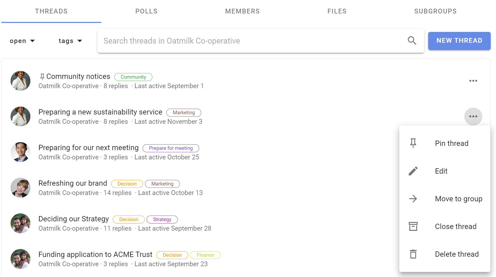
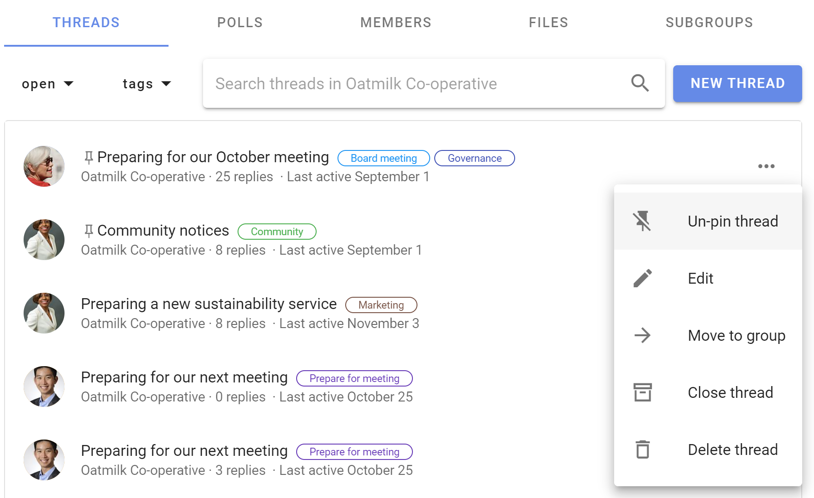
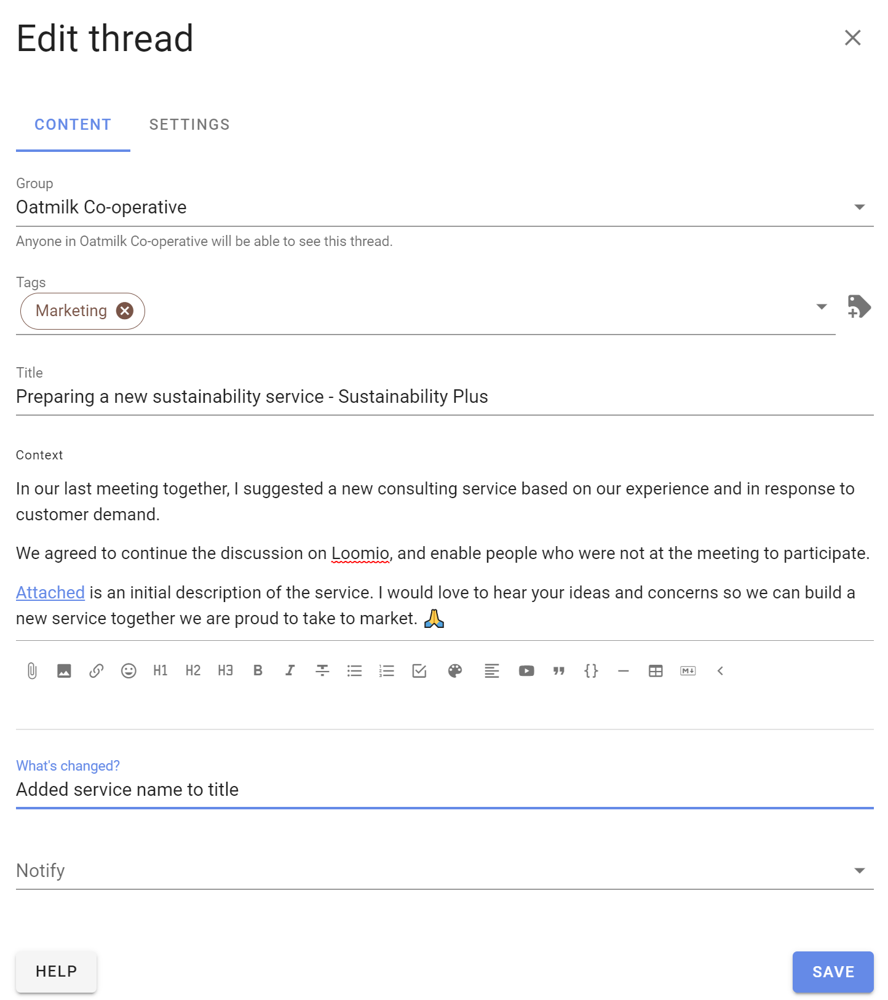
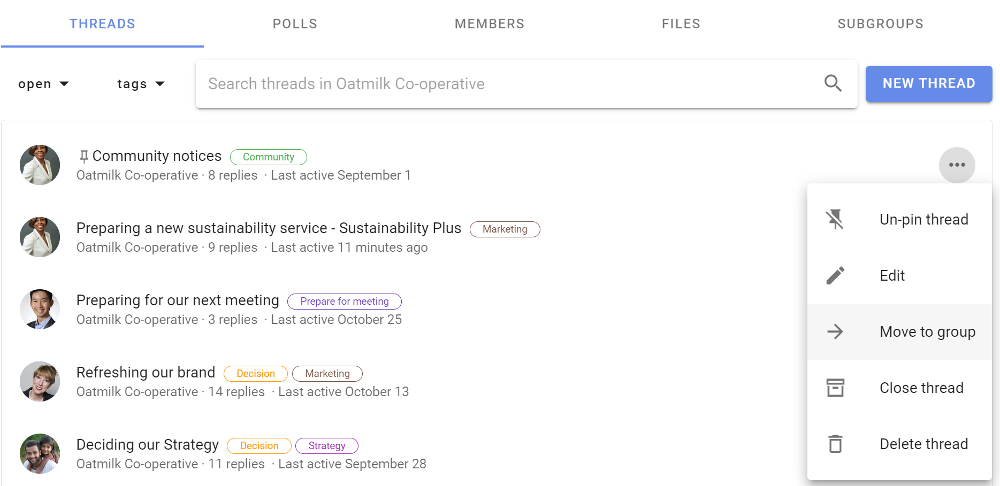
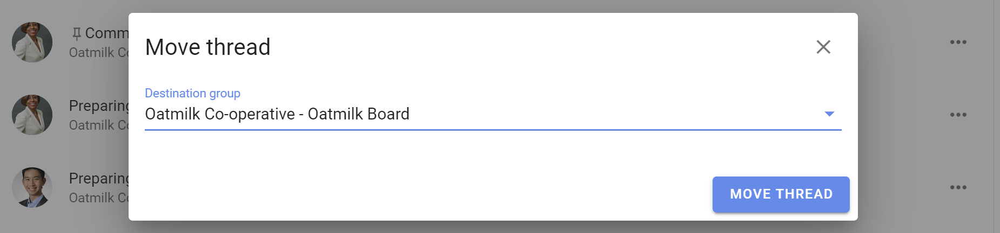
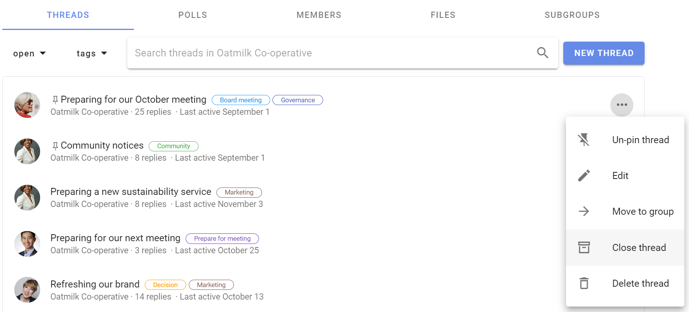
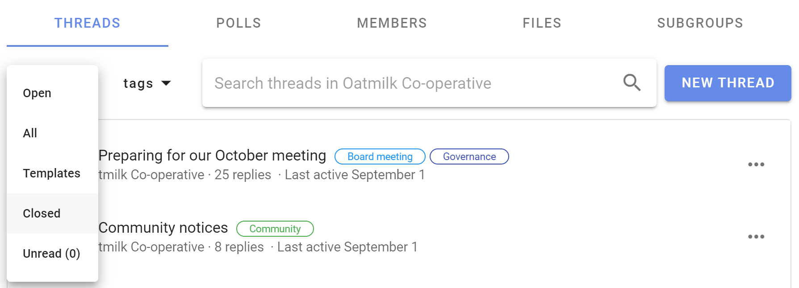
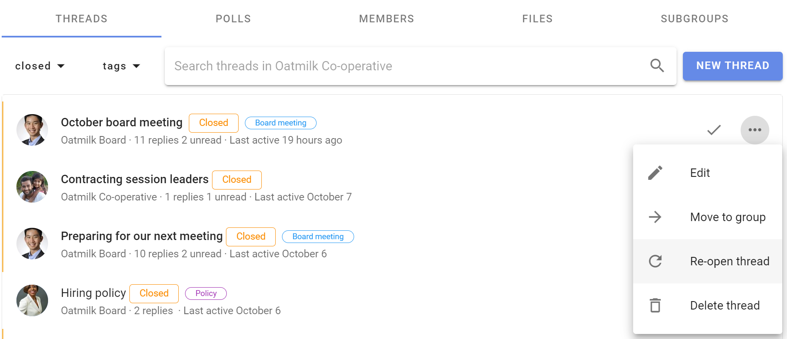
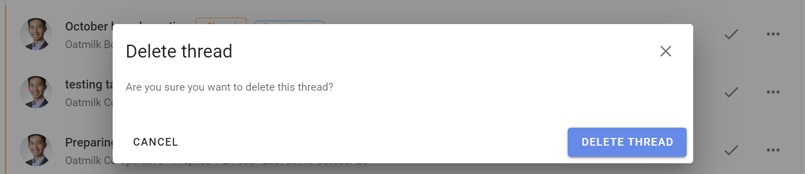

# Discussion management

As the number of discussions grows, you can help group members find the discussions they need.

On the group page **Discussions** tab there are several tools to help you display and administer discussions.

You can pin important discussions to the top of the discussion list, edit a discussion, move a discussion to another group, close old discussions and delete unwanted discussions.

Open the 3 dot (**...**) discussion management menu to the right of the discussion.

These tools are available for group admins.

If "Members can manage discussions and comments" is permitted in [Group Settings](https://help.loomio.com/en/user_manual/groups/settings/index.html#permissions), any member of the group can access discussion management tools.

If members are not permitted to manage discussions, they can only **Close** a discussion.

## Pin discussion

The discussion list is ordered by the most recent activity, so you will see current discussions at the top and older discussions lower down the list.

You can **Pin discussion** to the top of the list of discussions to make it easier to find.   Welcome discussions, news items and announcements are typical of pinned discussions.

Pinned discussions will appear above other discussions on the group page and are ordered by the most recently pinned item at the top. You can change position of the pinned discussion by pinning and unpinning discussions.

Use **Un-pin** to release a discussion so it is ordered by activity.

## Edit

**Edit discussion** opens the discussion edit panel, enabling you to edit any part of the discussion.

When a discussion has been edited, the **Show edits** icon appears on the discussion page. Click on this to see what changes have been made.

> Tip: Editing discussions from the group page is a quick way to add a Category tag.

## Move to group

You can move a discussion to another Loomio group or subgroup.

Select the destination group or subgroup, and click **Move discussion**.

> Tip: Start a draft discussion and move it to a group when you are ready to post.  Use a private subgroup of direct discussion to work on the draft discussion with one or two people.

## Close discussion

To keep the list of discussions on your group page relevant, you can close discussions that are no longer active.

Go to the Discussions tab on your group page, and open the 3 dot menu (**...**)

To view closed discussions, go to the group page and click on the drop-down menu just under the Discussions tab.

Change the discussion filter from default **Open** to **Closed**.   You can also use this filter to see **All** discussions, **Unread** discussions and **Templates**

Use **Re-open discussion** to restore it to the open discussion list.

## Delete discussion

Deleting a discussion removes it from your group.  You can not restore a deleted discussion.

If you are not sure if you will need to access the discussion again, use **Close discussion**.  Closed discussions can be re-opened.

When you select **Delete discussion** you will be asked to confirm before proceeding.

