# Orientation tour

If you are new to Loomio, let's take an orientation tour to help you quickly understand how to participate in discussions and decisions in your group.

_On this page_
- [How Loomio works](#how-loomio-works)
- [Group page](#group-page)
- [Side bar](#side-bar)
- [Notifications](#notifications)
- [Finding information quickly](#finding-information-quickly)
- [Discussions](#discussions)
- [Polls](#polls)

## How Loomio works

Loomio is designed to help your group come together, engage in discussions and use polls to make decisions.  It has a simple structure of three main elements: Group, Discussions, and Polls. 

### Group

A Loomio group is a safe place for your organization to meet, discuss and make decisions about work.

**Group home**

Your group home page is the first place you see when you arrive. It contains a title, an image to represent the group, and some text to introduce the group: its purpose, the work you will do, and any other information to help group members participate.

### Discussions

Discussions are where you share information, discuss, and make decisions.

Discussions are used for many purposes; to prepare for a meeting, discuss matters, share reports, ask questions, vote on proposals, approve actions, and so on. It's also where your group can develop a shared understanding of important issues.

Discussions keep everything about a topic in one place. Over time you'll create a useful archive of your organization's discussions and decisions.

### Polls

Loomio includes a wide range of poll tools to help you progress a discussion to an outcome. Each poll type has a slightly different purpose. The most common one is a proposal. 

A **proposal** is for converting a discussion into a clear, practical outcome. Someone suggests a course of action and invites everyone to respond. For example, you might ask members of your group to either:
- agree
- abstain or 
- disagree. 

Importantly, as well as selecting a response, everyone can give a reason why they have voted this way. You can all see where everyone else stands on the matter, and why. You can then, if you want, change your response. 

A proposal, and associated discussion, helps your group build shared understanding and creates its own record of how the decision came about.

### Putting it all together

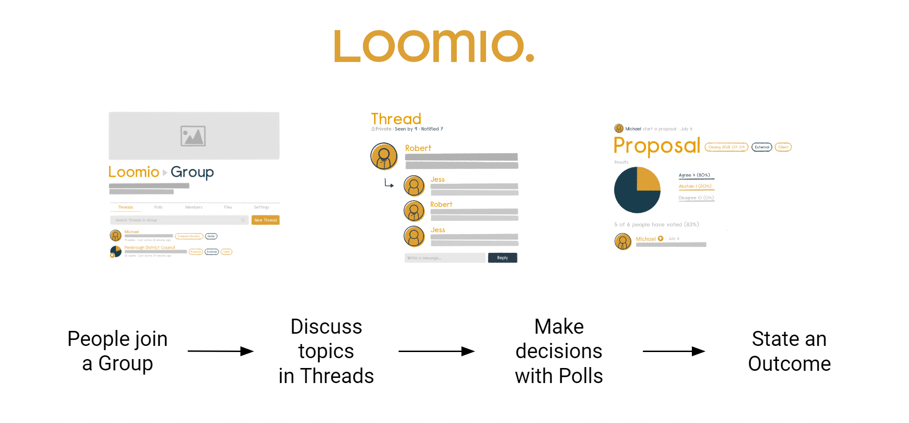

The best way to learn what to use when is to have a go. Use your own group or [start a free trial](https://www.loomio.com/try)

## Group page

Your group home page is the first place people see when they arrive. It contains a description of why the group exists, what you will use it for, and any other information that may help you participate.

Administrators can edit the description, add an image and logo that represents your organization, and set and change group privacy and member permissions.

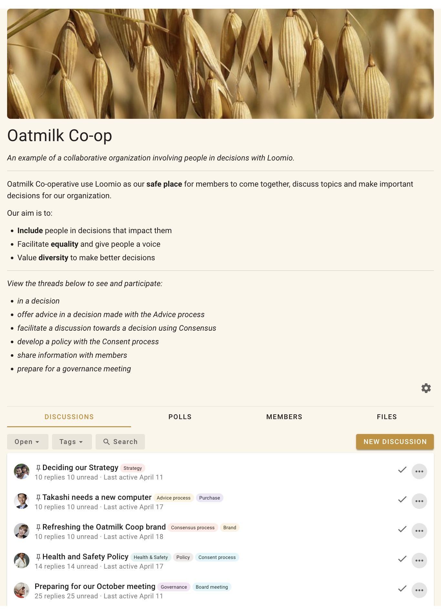

### Tabs

Under the group description you will see tabs. Clicking on each tab displays information about:

**Discussions** - A list of discussion threads showing the author, the thread title, category tags, and useful information about recent activity in the thread. 

**Polls** - A list of polls active in your group.

**Members** - a list of the people who are members of the group.

**Files** - Files and documents that have been attached to discussions in your group.

Below the tabs there is a search bar where you can type in any key word to find a particular discussion. To the left of the search bar are drop down menus where you can filter the discussions by open or closed status, or by tag.

## Side bar

The sidebar menu is accessible from the (☰) menu icon at screen top left, where you can see:

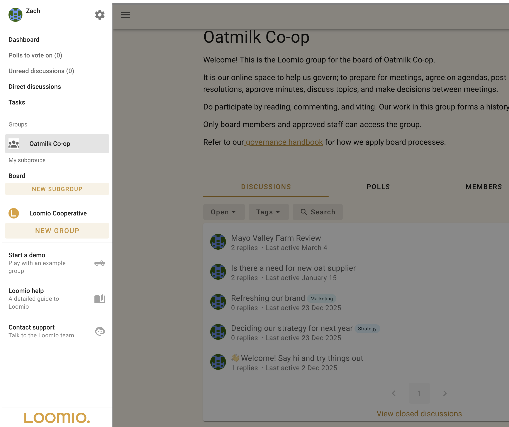

* **Dashboard** - Open polls and recently active threads.
* **Polls to Vote on** A list of  polls where you've been invited to cast a vote.
* **Unread discussions** - A list of discussions you have yet to read.
* **Direct Discussions** - Discussions between specific invited members. These are not visible to the rest of the group.
* **Tasks** - A list of tasks assigned to you, with due date.
* **Your Loomio groups** - Where you can easily find your Loomio groups and subgroups.
* **Demo group** - See and explore your private demo group at any time.
* **Help & guides** - A link to the Loomio User Manual.
* **Contact support** - [Contact us via web form](https://www.loomio.com/contact).

### User settings

Click your name in the top left to open your user settings, where you will see:

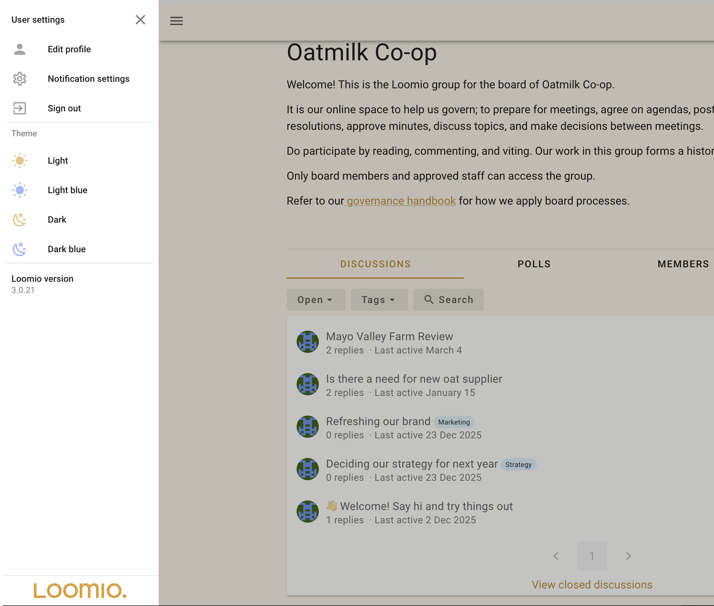

* **Edit profile** - Where you can edit your name or email address, upload a profile photo, add a bio, and add your location.
* **Notification settings** - Set what emails you want to receive from Loomio.
* **Theme** - Set your visual interface preference.
    
## Notifications

### In app notifications

The bell icon in the top-right is where notifications are accessed within Loomio.

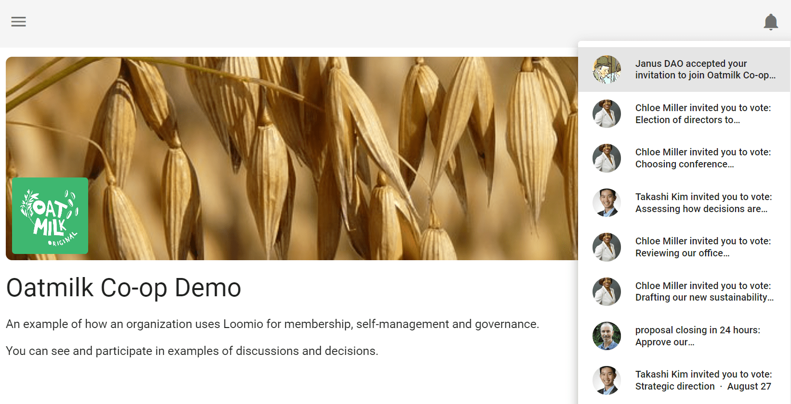

### Email notifications

Loomio sends emails to keep you updated on the activity in your groups. 

Emails Loomio may send you include:

* **Mention and Replies** - When someone @mentions you in a comment or replies to you, you will receive a notification email.
* **Subscribe on participation** - If selected, when you participate in a discussion you will receive emails for all further activity. This is off by default because in a busy group it can generate a lot of emails.
* **Catch-up summary email** - The 'Yesterday on Loomio' email includes activity from all your groups and threads that you have not read yet, and is a useful way to stay in touch with what's happening without having to visit Loomio every day.
* **Invitations to threads and polls** - You may receive an email when invited to a new discussion or poll.
* **Reminders and Outcomes** - If you have not voted in a poll, you may receive a reminder 24 hours before close. You may also receive an email stating the outcome of a poll.

These emails are to help you participate effectively with your group. The default settings are to help you stay up to date with activity on Loomio but should not overload your email inbox.

If you are receiving too many emails from Loomio, you can change the default email settings. Talk to your group administrator to get the balance right for you.

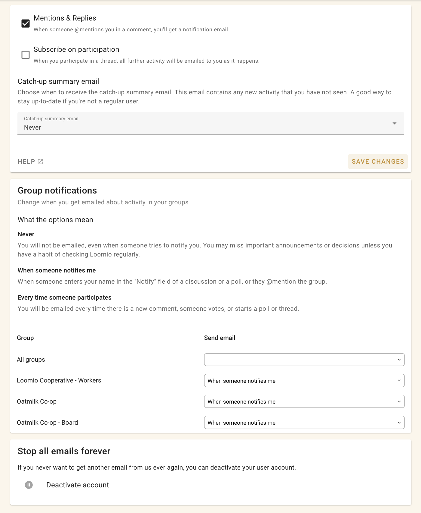

When you receive an email from Loomio, you can reply directly from your email inbox and your reply will be posted into the discussion thread. This works for everything except the Catch-up summary email.

## Finding information quickly

There are several tools included within Loomio to help you find the information you are looking for quickly.

### Search

You can use the Search bar at the top of almost every page to search for content relevant to that page.

For example, on the discussions tab, clicking 'search' then typing 'strategy' in the search bar brings up discussions with the word 'strategy'.

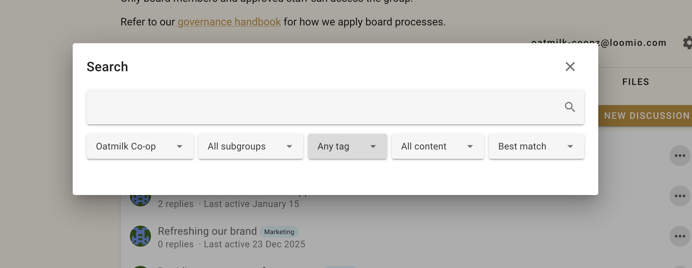

### Category Tags

Category Tags make it easy to find discussions of a certain type or topic. 

Tags can be applied when starting or editing a discussion or poll.

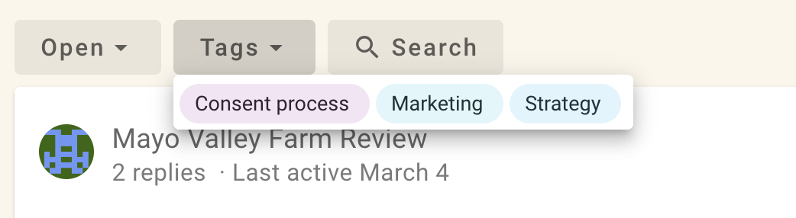

## Discussions

Under the **Discussions** tab on your group page, click on any of the discussions to open it in full.

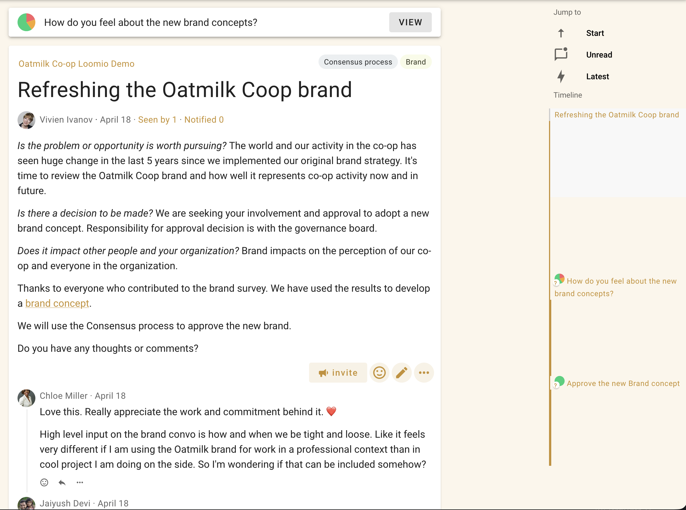

The title is prominent, and you can see the context and comments from other members. 

The discussion page includes everything you need to know about the discussion:
* the group name, and subgroup name, that the discussion belongs to
* category tags applied
* author and privacy level
* **Seen by** to see who has seen the discussion
* **Notified** to see who has been notified
* comments, replies, reactions and any polls
* timeline of key events in the discussions, such as polls

### Discussion context

The context is used to introduce the discussion topic. It will often include background information to help you participate in the discussion, such as attached files or links to online documents. The context always stays at the top of the discussion thread.

### Discussion activity

**Seen by** shows who has read the discussion, and when.

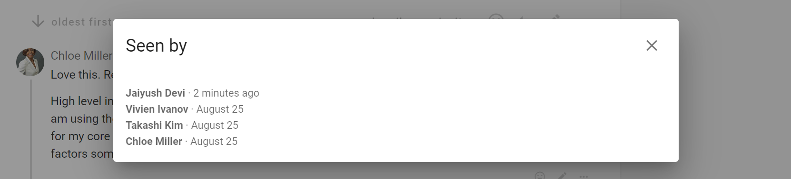

**Notified** shows who has been notified about the discussion, and if read or email opened.

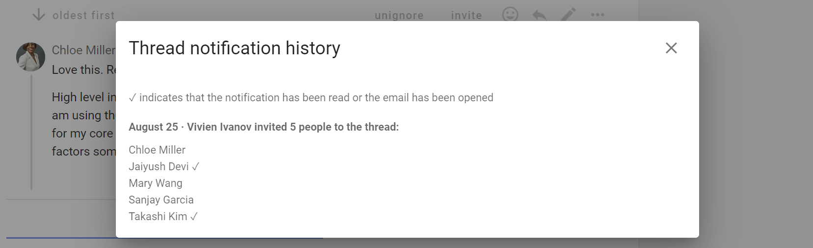

### Comments

As you scroll down the discussion page, you will see comments and replies from other group members.

### Timeline

The discussion timeline builds with key activity in the discussion.  Use it to quickly go to decisions or important comments pinned to the timeline.

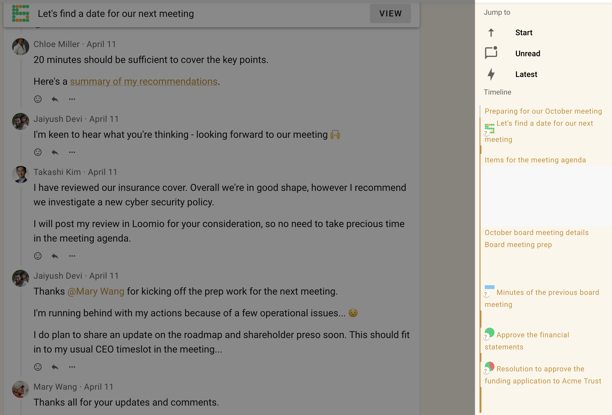

## Polls tab

From your group page, select the **Polls** tab to see your list of polls. Alongside the poll name, there is an active icon that changes as the poll progresses, and indicates your vote.

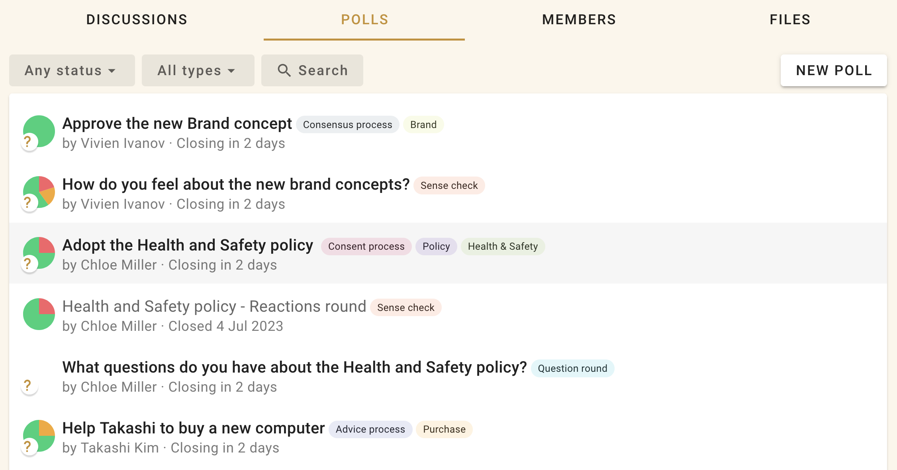
