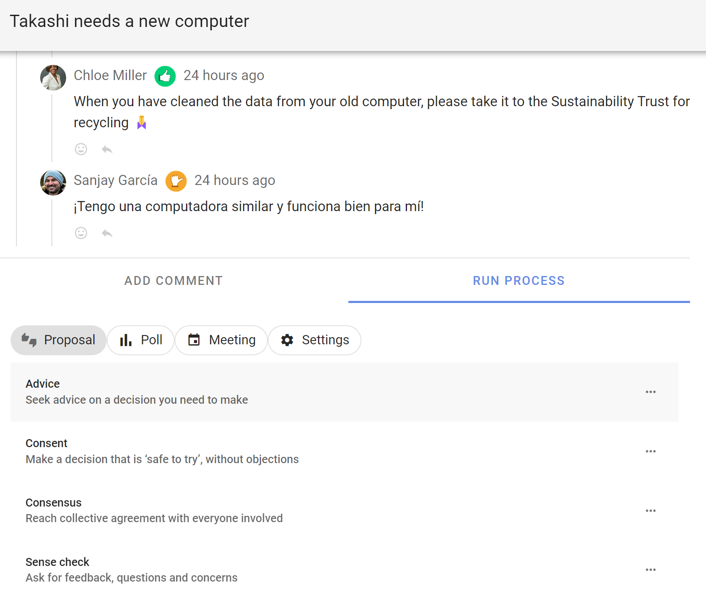
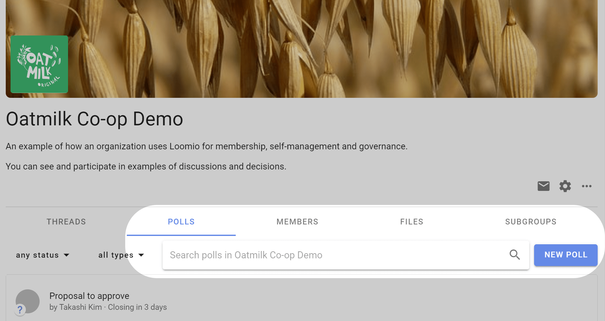

# Proposals and polls

Loomio proposals and polls help you involve people in decisions.  They are used to progress a discussion to an outcome.

- Involve the right people to make better decisions 
- Get engagement, test ideas, listen and sense, identify priorities, and clarify issues, even if the solution might not yet be apparent 
- Set a deadline, prompt people who haven’t participated, and state an outcome
- Apply decision making processes that work for your organization

## Run a proposal or poll

### Within a thread

You can start a proposal or poll within a thread to run a decision process or progress a discussion. 

Open the thread, scroll to the **Add Comment** bar and click on the **Run Process** tab, select a proposal or poll template.

### Standalone proposal or poll

You can also run a standalone proposal or poll from your group page, from the **Polls** tab on your group page. Click on **New Poll** and select your proposal or poll template.

## Templates

Loomio includes a series of predefined templates for common decision processes such as; Advice process, Consent process and Consensus. 

The proposal templates are the scaffolding to run a process. You can edit the templates to suit your particular needs, create new templates, or remove and rearrange templates to customize the experience for your organization.

A decision process is usually contained within a Loomio thread and may use one or more proposal templates as you progress towards an outcome. 

See our guides for [Advice process](https://help.loomio.com/en/guides/advice_process/index.html), [Consent process](https://help.loomio.com/en/guides/consent_process/index.html) and [Consensus process](https://help.loomio.com/en/guides/consensus_process/index.html) for help and examples of using proposal templates at key steps in each process.

## Proposal templates

**[Sense check](https://help.loomio.com/en/user_manual/polls/proposals/index.html#sense-check)** See if you're on the right track before committing to a decision.

**[Advice](https://help.loomio.com/en/user_manual/polls/proposals/index.html#advice-proposal)** Seek advice on a decision you need to make.

**[Consent](https://help.loomio.com/en/user_manual/polls/proposals/index.html#consent-proposal)** Proceed unless someone raises an objection.

**[Consensus](https://help.loomio.com/en/user_manual/polls/proposals/index.html#consensus-proposal)** Reach collective agreement with everyone involved.

## Poll templates

**[Choose](https://help.loomio.com/en/user_manual/polls/proposal_types/index.html#simple-poll)** Find the most popular option.

**[Score](https://help.loomio.com/en/user_manual/polls/proposal_types/index.html#score-poll)** Measure the level of support for each option.

**[Allocate](https://help.loomio.com/en/user_manual/polls/proposal_types/index.html#dot-vote)** Reveal priorities when there are trade-offs.

**[Rank](https://help.loomio.com/en/user_manual/polls/proposal_types/index.html#ranked-choice)** Find the group's order of preference.

**[Time poll](https://help.loomio.com/en/user_manual/polls/meeting_polls/index.html#time-poll)** Find when people are available.

## Settings

**[New poll template](https://help.loomio.com/en/user_manual/polls/poll_templates/index.html)** Create a new poll or proposal template with your own terminology and options.

### Hidden poll templates
Poll templates hidden from the poll menus to make it easier for people to find the poll template they need.  **Unhide** the template to make it available to your group.

**[Question round](https://help.loomio.com/en/user_manual/polls/proposals/index.html#question-round)** Invite clarifying questions to help people understand a proposal.

**[Gradients of agreement](https://help.loomio.com/en/user_manual/polls/proposals/index.html#gradients-of-agreement)** Express support for a proposal on an 8-point scale.

**[Proposal (classic)](https://help.loomio.com/en/user_manual/polls/proposals/index.html#proposal-classic)** Raise a proposal to make a decision.

## Poll structure

As you start using proposals and polls, you will notice the setup, running and closing follow a similar pattern:

**Set up proposal or poll:**
- Give it a title
- Assign a category tag
- Describe the poll question, and how you want people to vote
- Configure voting options
- Set a closing deadline 
- Invite people

In "Advanced settings" you can also set:
- Hide results, until vote is cast or poll closes
- Anonymous voting
- Vote reason to required, optional or disabled
- Reminder that poll is closing soon to nobody, author, undecided voters or all voters

**Running proposal or poll:**
- Participants vote and add a reason (optional) 
- Results are updated live
- Participants can change their vote if new info emerges
- A reminder is sent to people who haven’t voted 

**Proposal or poll closed:**
- The proposal or poll closes, and everyone can see the results
- The author sets an outcome, notifying everyone of what will happen next.
