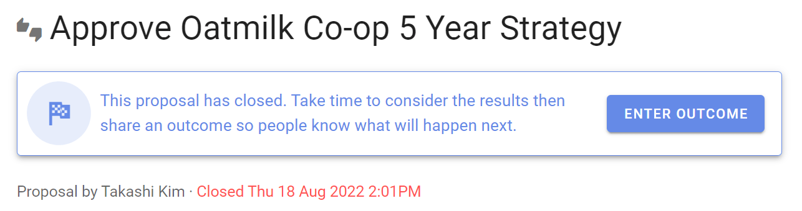
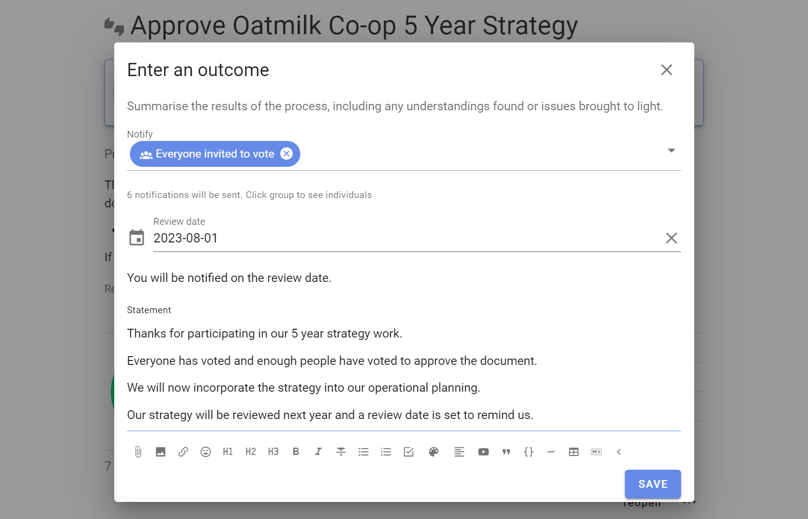
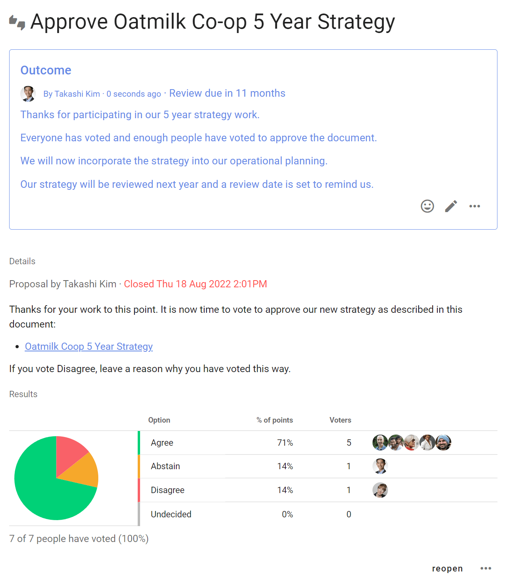

# Outcome

When your proposal or poll closes, you’ll be prompted to set an **outcome**.

State the results of the proposal or poll and say what will happen next.

The outcome statement is an important record of the poll or decision - a succinct statement for future reference.

## Outcome statements for common decision processes

| **Decision process** | **When the decision is made** | **Outcome** |
|---|---|---|
| Advice process | When advice has been received and taken into account. | State the decision made and thank people for their advice and feedback. |
| Consent process | When there are no remaining objections. | State that no valid objections remain and there is consent that the proposal is 'safe to try'.  |
| Consensus process | When most* people agree. | State proposal results and the decision made. |

**The majority or supermajority as governed by constitution or by prior agreement within your organization.*  

Whatever the results, there is always something to learn from the proposal and poll. 

If your proposal fails, consider what new understanding has been gained, and if this can be accommodated to reach a better decision.

The outcome statement is an opportunity to state the results and what has been learnt.  

You can notify people - they will receive an email from Loomio containing the poll results and your outcome statement.

You can also choose to set a **Review date** - a future date when you would like to review this poll or decision.  For example to review a strategy at the same time next year.

**Example outcome statements**

> _This proposal did not reach consensus because several people were concerned about budget impacts. George and Jimena will do some financial modelling and raise a new proposal next week._

or

> _I've taken on board everyone's input. As the project manager, this is my call to make and I've decided we are going to extend the timeline by 10 days._

