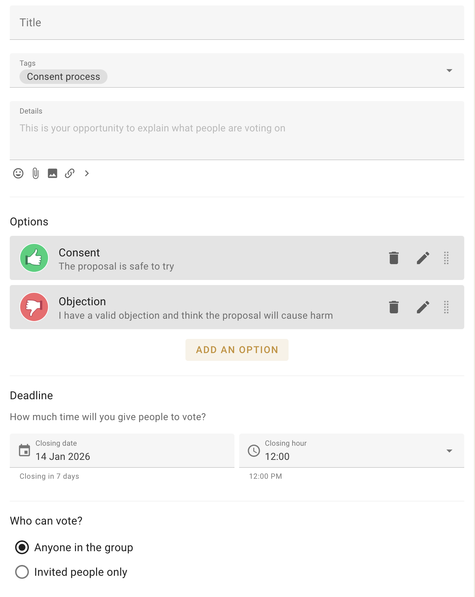
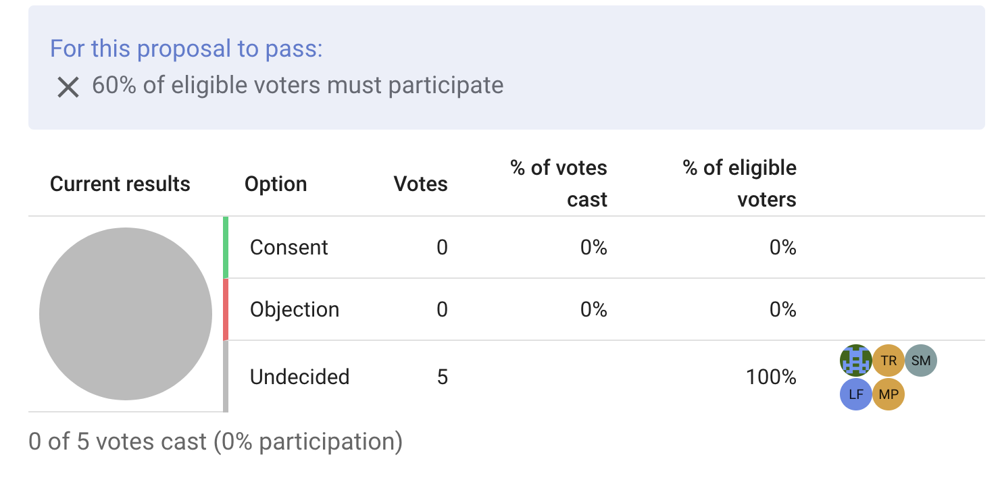
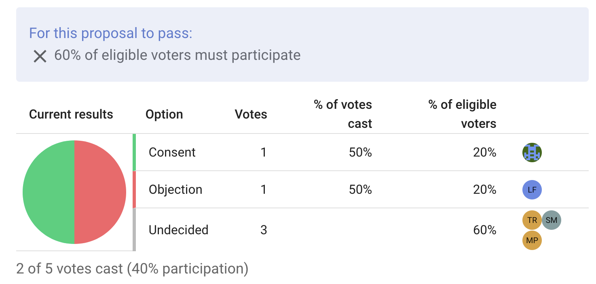
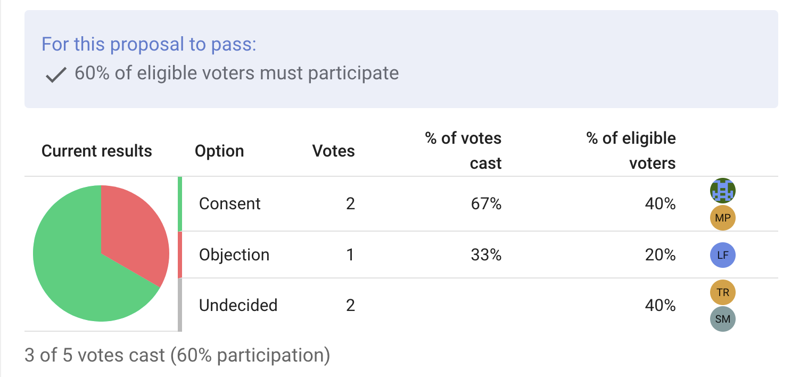

#  Quorum

When drafting a new decision, you have the option to set a quorum, or the minimum percentage of participants required for the decision to be valid.   This feature allows you to fine-tune Loomio's decision-making tools to your own governance process.

The quorum setting is found at the very bottom of a proposal's customisation screen.  You set the quorum as a percentage of the total eligible voters, or leave it blank if a quorum is not required.

You can also set a quorum percentage when making a proposal template, so that certain proposal types always require a quorum (see [Poll Templates](/user_manual/polls/poll_templates/index.html)).

## Example Scenario

The Oat Milk Co-op has an active discussion in Loomio about whether to switch oat suppliers. This discussion has gained momentum, and it is time to make a decision.

Zach, a member of the co-op board, clicks the 'Start a Vote' tab at the top of the discussion thread, and selects the "Consent" proposal template.  The window expands with all the options for this proposal, like title and description and who can cast a vote.  

Zach titles it "Should we switch suppliers?" and limits the vote to invited people only, i.e., just the board.

Oat Milk Co-ops's governance process states that significant decisions require a quorum of 60 percent of the board.  This feels like a significant decision, so Zach scrolls to the quorum section at the bottom of the proposal options, inputs "60" into the quorum field, and clicks "Start Proposal".  Finally, he sends invites to the board members when prompted.

With the proposal created, a pie chart now appears in the thread showing the vote distribution, with a banner above highlighting the quorum requirements. 

Boardmembers Zach and Liz cast their votes, consenting and objecting respectively.  The pie chart updates, but the banner still shows an X next to the quorum requirements as only 40 percent of the eligible voters have participated.

Boardmember Matt casts a consenting vote.  60 percent of the board have now participated. The banner above the pie chart now shows a check mark, indicating a quorum is present.  Zach may close the vote early, or wait for the rest of the co-op board to cast their votes.

