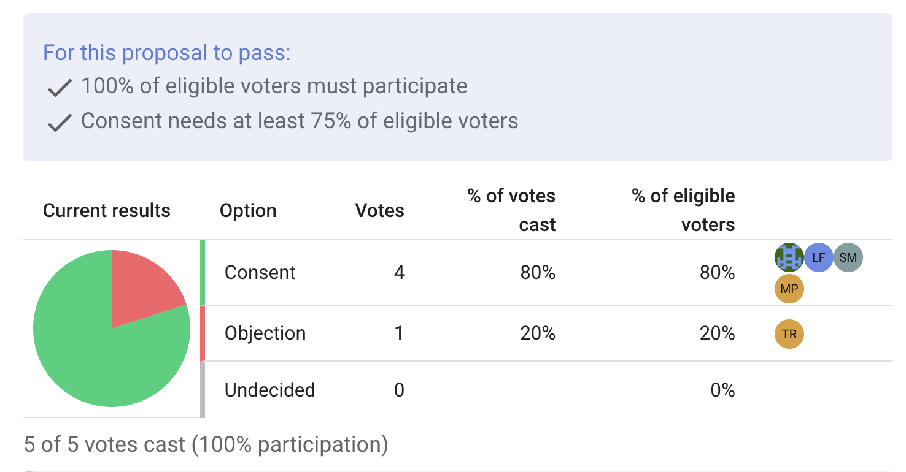

# Vote Share Requirements

When starting a vote, you may set a share requirement on any voting option. These are percentage based constraints a proposal must satisfy to pass.  For example, you may require that  a proposal must have 60 percent consenting votes, or a proposal fails if it receives more than 30 percent objecting votes.

The vote share requirements can be used in tandem with the [quorum feature](/user_manual/polls/quorum/) to finely customize Loomio's voting feature to match your own governance process.

Vote share requirements can be found by clicking the edit icon next to a voting option.

## Eligible vs. Cast Votes

When setting vote share requirements, you may base the percentage on either the **votes cast** or the **eligible voters**.

**Eligible voters**  refer to every person who is able to vote in the proposal.
**Votes cast** refer to the current votes, regardless of the overall turnout.

For example: let's say you begin a proposal whose voting is open to every member in your organization.   You set a vote share requirement that the proposal passes if it receives 75 percent consent from _eligible voters_.  This means the proposal could only pass if at least 75 percent of your entire organisation votes,  _and_ they cast consenting votes.

Alternatively, let's say you set the vote share requirement to 60 percent of _votes cast_.  Then, the proposal may pass once 60 percent of the votes are consenting, regardless of how many people in your organisation voted.  It may be that a tiny fraction of your organisation participated, but the majority of that fraction voted yes.

Setting the vote share requirements alongside a quorum requirement is useful for critical decisions in which you want to protect against low voter turnout.

## Different types of vote share requirements

A proposal can have multiple voting options and each of them can have a vote share requirement, enabling highly specific voting processes.  For example:

- You may require a strong majority, and  set a requirement that *consenting votes must be 75 percent of the eligible voters**.
- You may want enthusiastic participation, so set a quorum of 60 percent of your organization and a vote share requirement that _abstaining votes are no more than 30 percent of the cast votes_.
- To enforce the power of a block, you may require that _blocking votes must be no more than 0 percent of the cast votes_.

These requirements can also be set while making a [proposal template](/user_manual/polls/poll_templates/), so that Loomio's proposals always follow your organisation's governance requirements.

## Detailed example 

The Oat Milk Co-op are looking for a new supplier, with Mayo Valley Farms their strongest candidate.  The co-op decides it is time to vote on whether they should switch to this farm.

Matt starts a new proposal, titled "We should switch to Mayo Valley Farms" and limits the vote to board members.

This is a critical decision, and their governance handbook states that critical decisions require at least 75 percent consent from the board.

To facilitate this requirement, Matt sets the voting options to "Consent" and "Objection", then clicks the edit option next to "Consent".

In the edit screen, he checks the vote share requirement box, and fills it out to state "For the proposal to pass, this option must receive at least 75% of eligible voters".

He saves the proposal and sends an invite to the five member board.  Then, he casts an approving vote.

Liz votes next, and votes in consent.  The proposal results update with the voting breakdown, showing 100 percent of the current votes in consent.  An 'X' remains next to the vote share requirement and quorum requirements, as the current votes represent only 40 percent of the eligible voters, and so the requirements are still not met.

Tom votes in objection,  then the remaining members of the board vote in consent. 

The results update with the curent breakdown.  Check marks appear next to the vote share and quorum requirements, as 100 percent of the board has voted and 80 percent of them voted in consent.

The proposal can now close, in favour of switching to Mayo Valley Farms.

