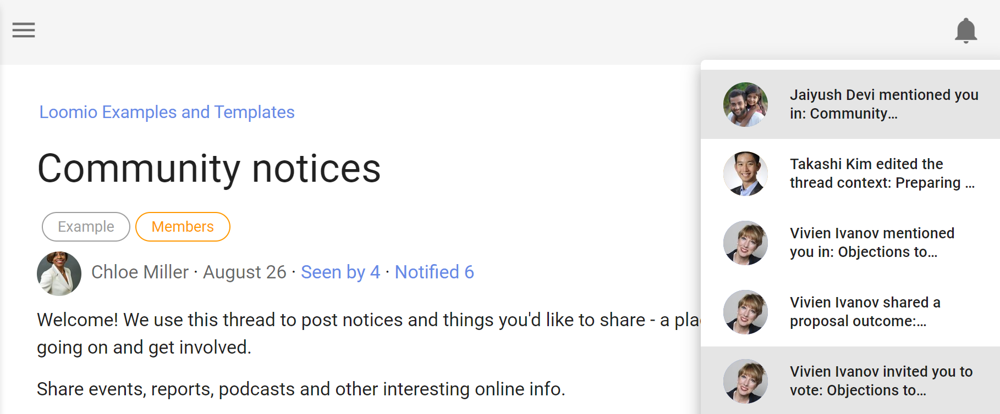
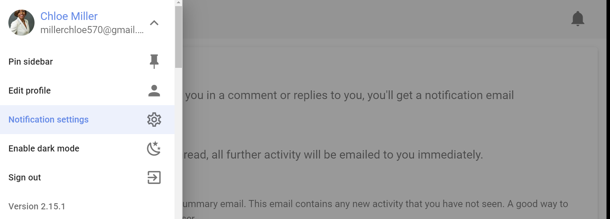
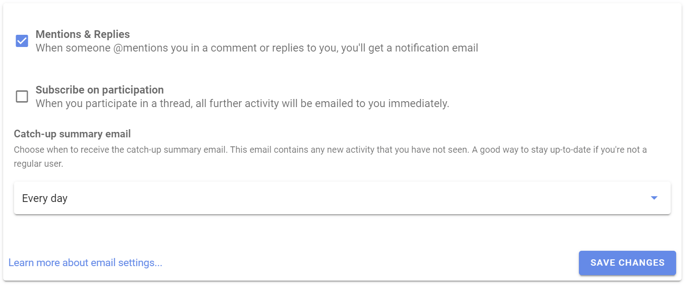
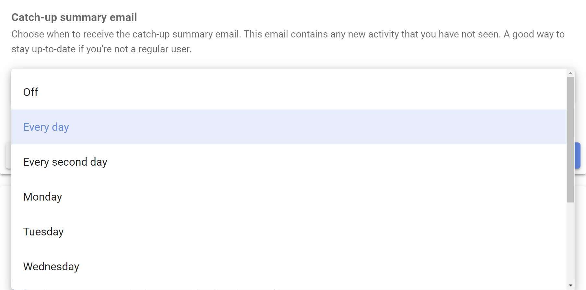
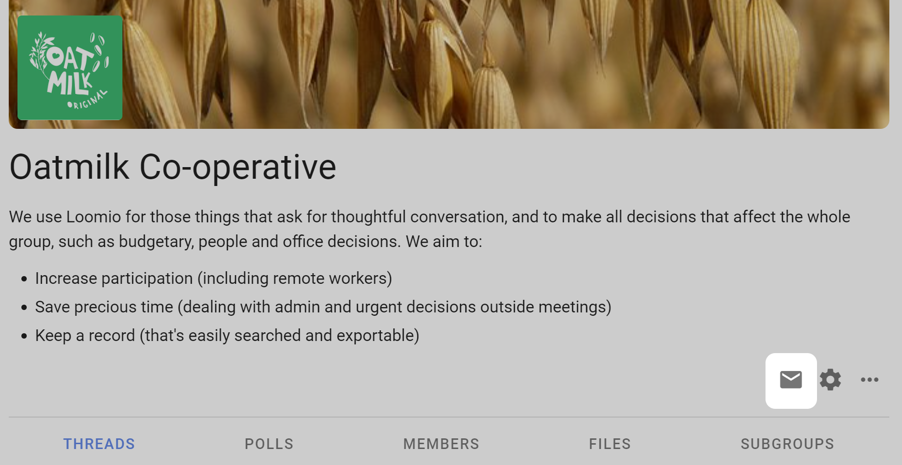
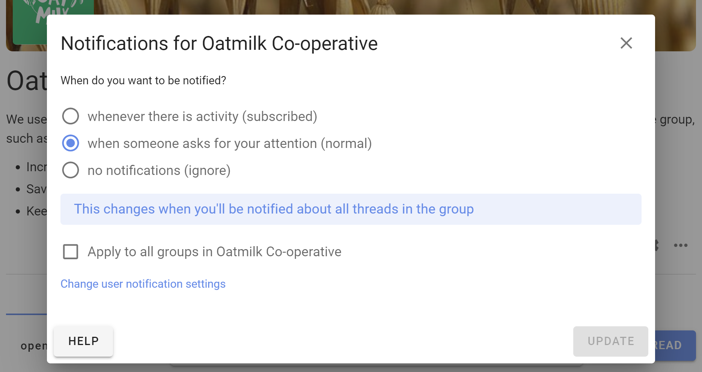
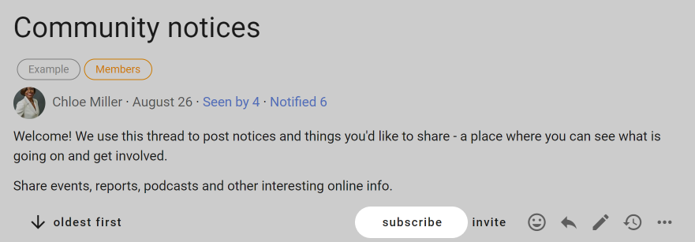
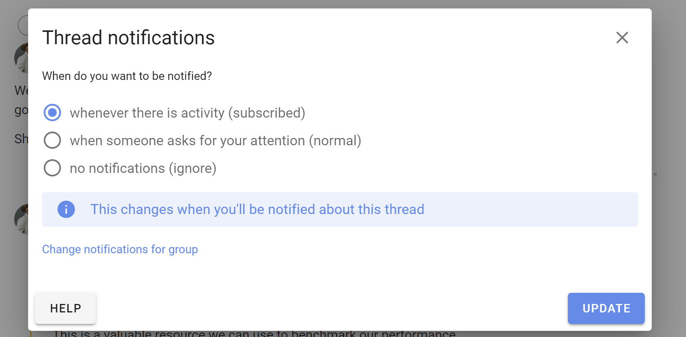
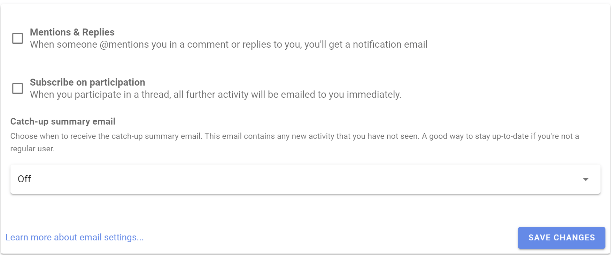
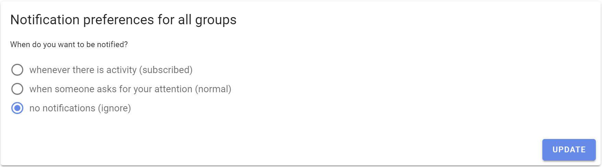

# Notifications

The notifications you receive from Loomio help you stay in touch with activity in your Loomio groups, be alerted to new discussions, polls, outcomes and when someone wants to get your attention.

The default notification settings are intended to alert you to important activity in your group without overwhelming your email in-box.  

The default settings work for most people.  Change notification settings to suit the way you work. 

_On this page_

- [Notifications in Loomio](#notifications-in-loomio)
- [Email notifications](#email-notifications)
- [User email settings](#user-email-settings)
- [Group email settings](#group-email-settings)
- [Discussion email settings](#discussion-email-settings)
- [Turn off all notifications](#turn-off-all-notifications)

## Overview video

<iframe width="100%" height="380px" src="https://www.youtube-nocookie.com/embed/0Mb2_D74ktM?start=2?rel=0" frameborder="0" allowfullscreen></iframe>

## Notifications in Loomio

When you are notified, Loomio will send a notification within the app and, by default, to your email.

The bell icon in the top-right is where notifications are accessed within the app; a number will display the number of notifications you have yet to read.

## Email notifications

Loomio sends emails to keep you updated on the activity in your groups. The default settings assume that you don't have a habit of using Loomio regularly so are designed to ensure you can stay up to date by checking your emails.

Emails we send out include:

- A daily summary called **Yesterday on Loomio**. This includes activity from all your groups and discussions, but only content which you have not read yet.

- **Mention** and **Reply** notifications. If someone replies to a comment you wrote, or they write a comment and mention you in it, you'll get an email with what they wrote.

- Invitations to discussions and notification of polls or proposals. If someone wants to notify the group about a new decision or discussion, they can select everyone or just some people in the group to notify. Also be aware of **poll closing soon** and **outcome** notifications.

- Discussion updates. If **subscribe on participation** is checked, then after you comment or vote within a discussion, you'll be emailed any further activity.

For any discussion-specific email (that's most except the Yesterday on Loomio email) you can reply directly from your email and your replies will be posted into the Loomio discussion.

## User email settings

### Notification settings

To see and change notification settings, go to **Notification settings** under your user profile on the sidebar menu.

If the sidebar is closed, click on the menu icon (**☰**) to open it.

There are three settings that apply to every group you belong to.

### Mentions & Replies

Enabling this setting means when someone wants to get your attention, they can @mention your name in a comment, which will notify you. We recommend you leave this setting on, so you'll get an email when this happens. The default setting is 'on'.

### Subscribe on participation

Enabling this setting means when you participate in a thread, all further activity will be emailed to you immediately.  If it is an active thread, you may receive many emails. The default setting is off.

### Catch-up summary email

Enabling this setting means you will get an email with any activity that you missed the day, or week, before. This provides an easy routine for staying up to date with Loomio activity.  You can choose:

- 'Off' to not receive this email.
- 'Every day' to receive the email daily.
- 'Every second day' to receive the email every second day.
- 'Monday', 'Tuesday'...'Sunday' to receive the email once a week on a particular day.

## Group email settings

You can configure what notification emails you get for each group you belong to.

Notification settings for each specific group are found in your Loomio group. To find them

- Click on your group page
- Click on the letter envelope icon to open, **Notifications for [group name]**

**When do you want to be notified?**

1. **whenever there is activity** (subscribed)

 - If you want the experience of a traditional email mailing list, where you are emailed everything as it happens. You will be emailed whenever there is activity (comments, votes, new threads, proposals, and proposal outcomes) in this group.

2. **when someone asks for your attention** (normal)

 - When someone invites you to vote or participate in a thread you'll get an email. In these cases someone in your group is choosing to notify you. This is the default setting.

3. **no notifications** (ignore)

 - You won't get notification emails about this group. You will need to sign in to Loomio regularly or read your catch-up summary email to stay updated.

You can apply a particular setting to all of your groups by checking **Apply to all groups**.

## Thread email settings

To change the email notification settings for an individual thread, click on **(subscribe)**.

To receive notifications for all activity about this thread, change the setting to **whenever there is activity (subscribed)**.

To receive notifications when someone asks for your attention, select **when someone asks for your attention (normal)**.  This is the default setting.

To turn off notifications for this thread, select **no notifications (ignore)**.  You will not receive email notifications about this thread, so to stay informed you will need to keep any eye on the bell icon at top right of the app, read the Catch-up summary email or sign in to Loomio regularly.

Note the settings changes in Thread notifications are only for the particular thread you have open.  Click **Change notifications for group** to change the default settings for all threads.

## Turn off all notifications

To turn off all email notifications go to [Notification settings](https://www.loomio.com/email_preferences/). First, untick all the boxes and **Save changes**. Lastly, choose **no notifications** and then **Update**.

