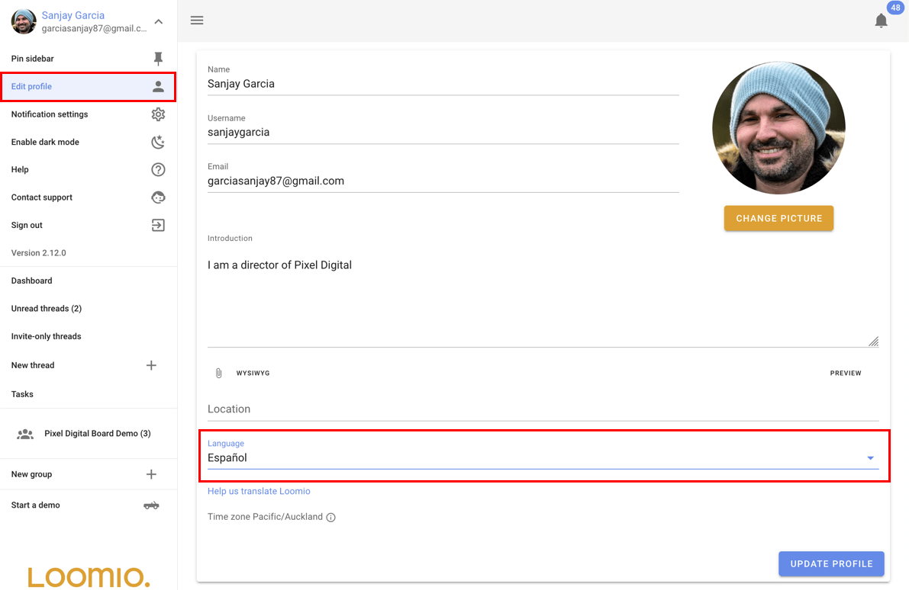
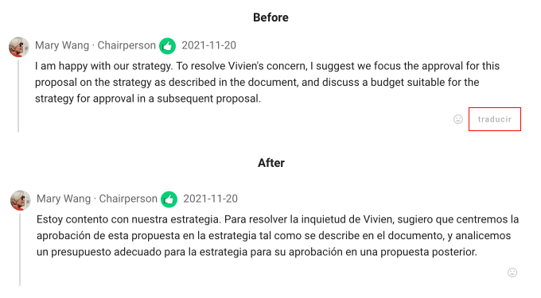

# Languages and Translation

Loomio supports mutliple languages with these two features:

1. Application translation - Change the language of the user interface, IE: the buttons and application text.
2. Content translation - Translate comments, discussions and proposals into your preferred language.

## Application translation

Loomio will automatically detect what your preferred language is when you visit the app with your browser. 
If you want to change the preferred language, you can do so from the "Edit profile" page.

## Content translation
When someone in your group writes their message in a language that is different to your preferred language, a "translate" button will appear below the message. You can click this button to automatically translate the message into your preferred language.

Translation of the user content is provided by Google Translate, and done automatically when requested by users.
