# Comments

Comments are the main way people participate in a discussion. They are visible to anyone who has permission to see the thread.

## Reading comments

When you open a discussion, Loomio takes you to activity that is new to you.

Unread comments have a blue **new** label beside their posting time.

## Writing a comment

Write a comment to contribute to the discussion. Other people can reply, react, or post their own comments.

Select **Post Comment** to publish it. Your comment will be visible to anyone who has permission to see the discussion.

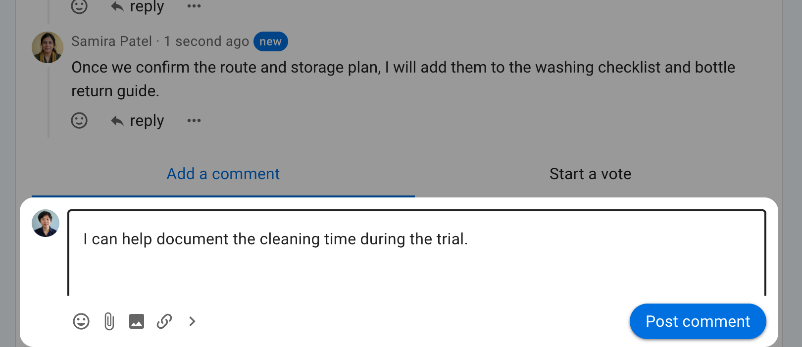

The tools described in [Formatting](/en/user_manual/discussions/formatting/) are available when writing comments.

## Mentioning people

Type **@**, start typing a person's name, then select them from the list. A mention notifies that person immediately and is a useful way to ask for their attention or response.

To notify everyone in the group, type **@**, start typing the group name, then select it from the list.

Mentioning someone does not give them access to the thread. Use **Invite people** in the thread sidebar if they are not already a thread member.

## Replying to a comment

Select **Reply** below a comment to respond to it. The reply is prefilled with an @mention of the comment author, which notifies them when you post it. Remove the mention if you do not want to notify them.

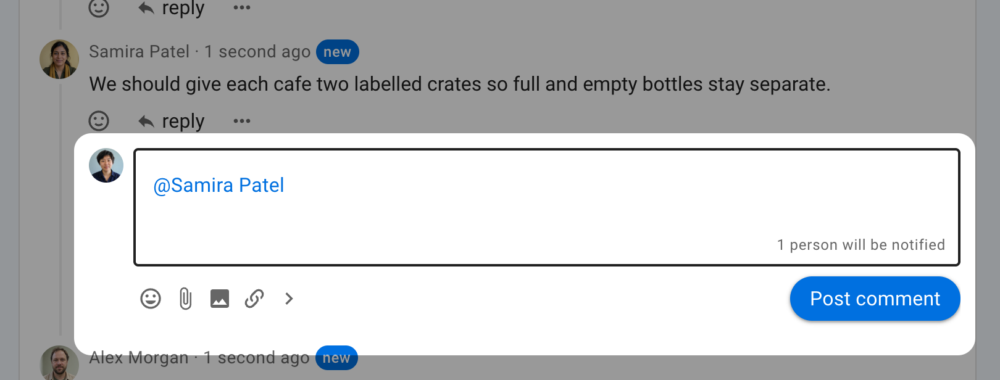

You can also reply to your own comment to nest a response beneath it.

If a Loomio email says you can reply by email, your emailed reply will appear in the thread.

## Reactions

Use the smiley button to respond with an emoji. Reactions notify the comment author within Loomio but do not send an email.

## Translating comments

If the author uses a language other than yours, a **Translate** action appears below the comment.

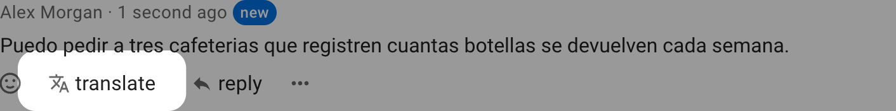

Select **Translate comment** to see the comment in your language.

## Comment actions

Common actions appear directly below a comment. Additional actions are available from the three-dot menu (**⋯**).

### Add a comment to Jump to

Use **Pin to timeline** to add a comment to the thread's **Jump to** list.

You can edit the label shown in **Jump to**. Unpin and then pin the comment again to change the link text.

>[!Tip]
>Highlight the words you want to use as the link text before selecting **Pin to timeline**.

Select **Unpin** to remove the item from **Jump to**.

### Edit a comment and view changes

Select **Edit** below one of your comments to change it. Group admins can also edit member comments when the relevant group permission is enabled.

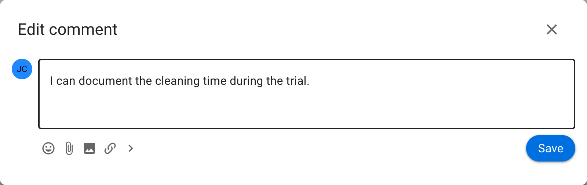

An **Edited** action appears below an edited comment.

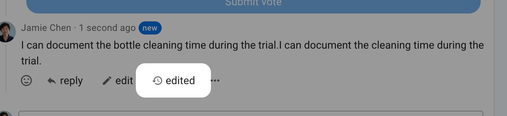

Select **Edited** to see what changed. Red highlighting shows removed text and green highlighting shows added text. Loomio records who made each edit and when it was made.

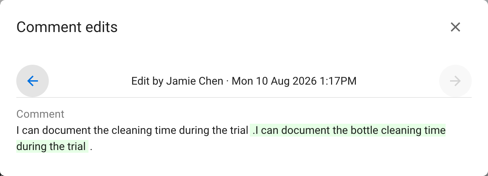

You can edit a comment when:

- you wrote it and the group allows members to edit their comments
- you are a group admin and [Admins can edit members' comments](/en/user_manual/groups/settings/#permissions) is enabled

### Copy a comment link

Select **Copy link** to copy the comment's unique URL. You can paste the link elsewhere to refer directly to that comment.

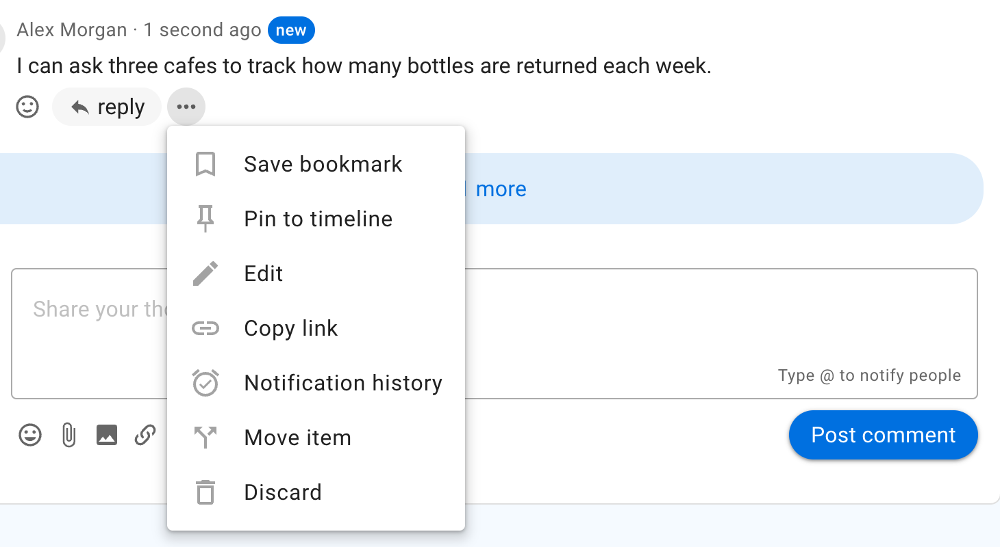

### View notification history

Open the three-dot menu (**⋯**) beside a comment and select **Notification history**.

The notification history shows who was notified about the comment, when the notification was sent, and whether it has been read when that information is available.

### Discard, restore, or delete a comment

Discarding a comment removes it from the thread but retains it in a trash bin. You can discard your own comments with **Discard** in the three-dot menu. Group admins can also discard comments.

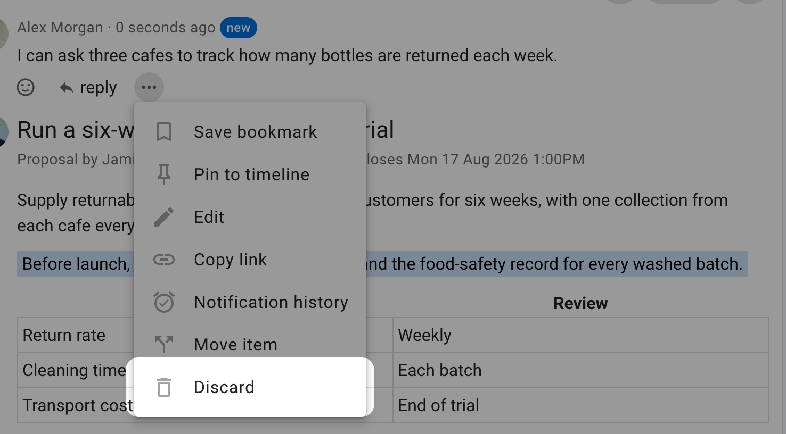

**Restore a comment**

The location of a discarded comment is labelled **Item removed**. Open its three-dot menu and select **Restore**.

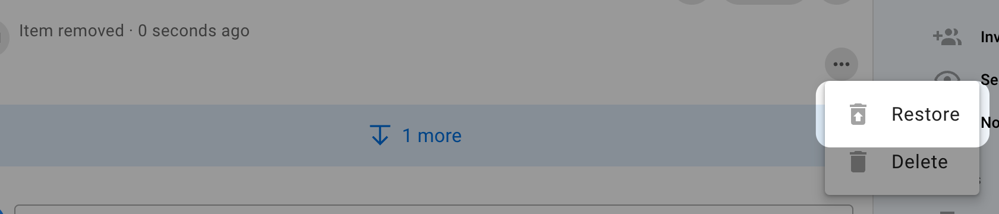

**Delete a comment**

Deleting a comment removes it permanently. It cannot be restored.

If **Members can delete their own comments** is enabled in [Group settings](/en/user_manual/groups/settings/#permissions), members can permanently delete their own discarded comments. Group admins can delete any comment.

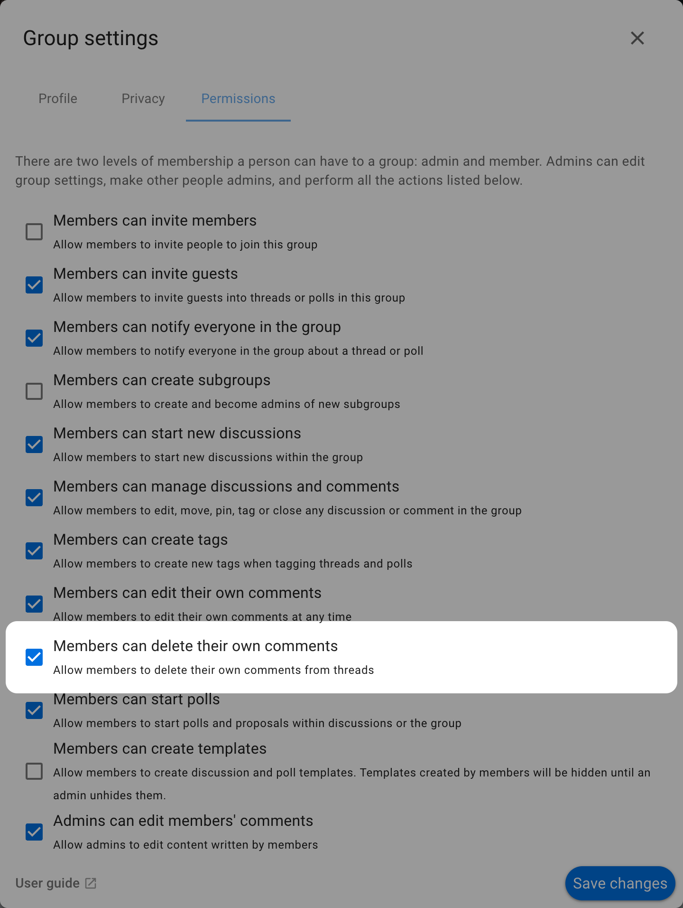

Open the three-dot menu on an **Item removed** entry and select **Delete**.

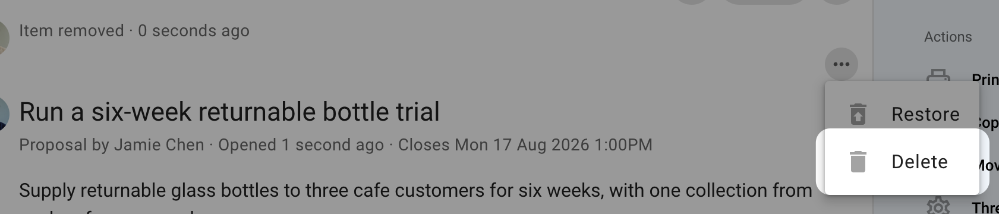

A confirmation message explains that the comment will be permanently deleted.

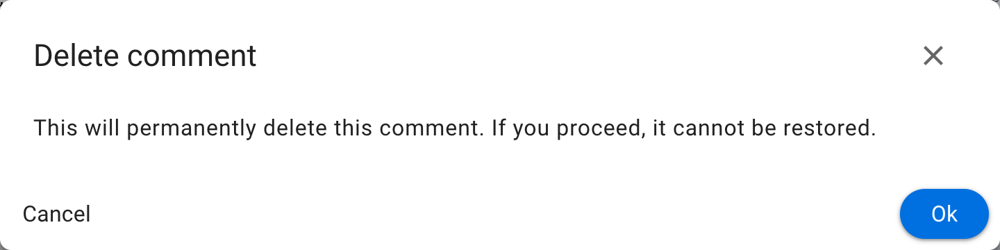
