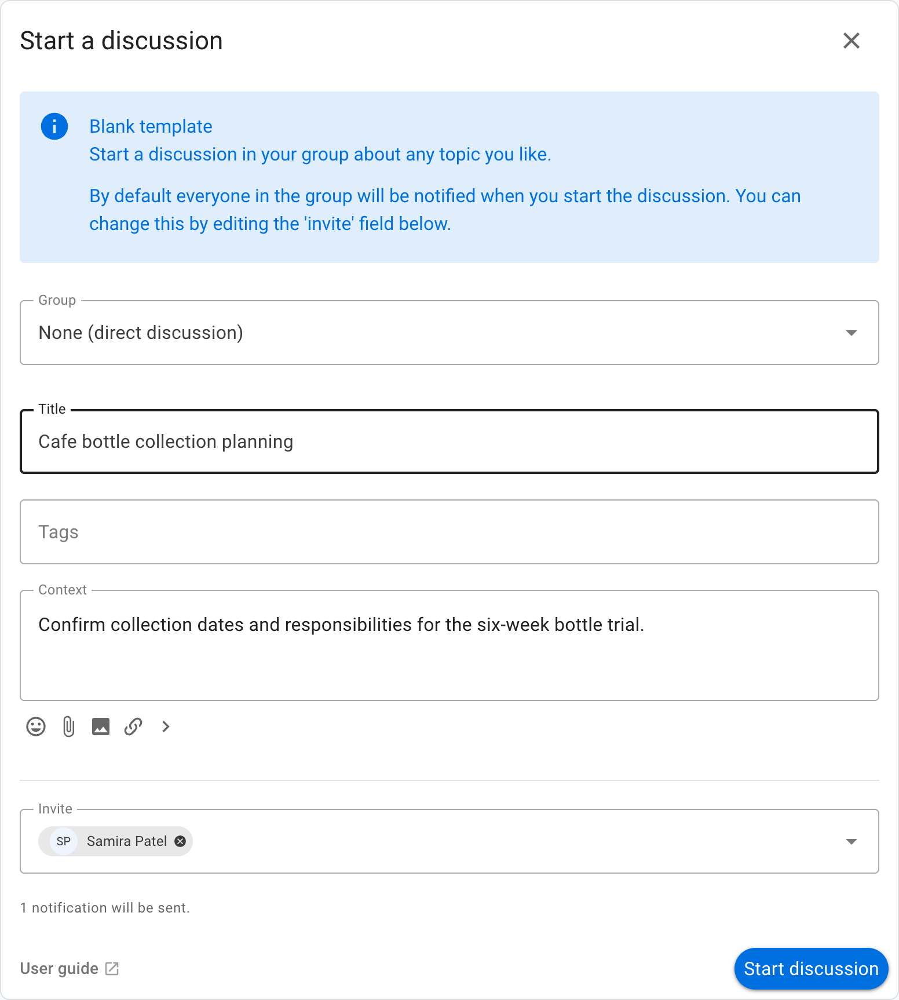
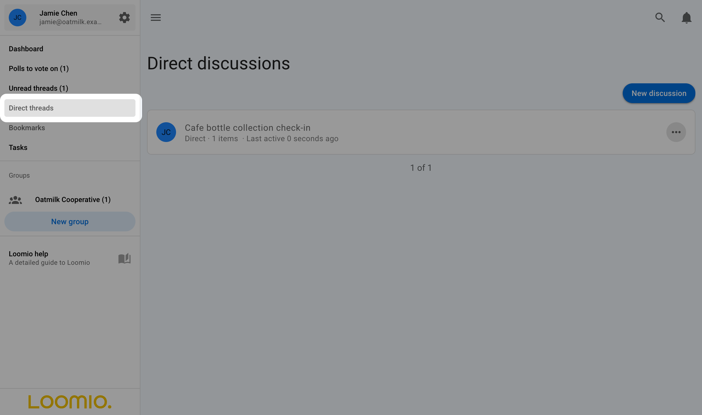

# Direct discussions

A direct discussion is a private discussion for a specific set of people.

A direct discussion does not belong to a group. Invited people do not need to be a member of your Loomio group.

You control who can see and participate by adding people or email addresses to the **Invite** field.

Direct discussions support the same comments, polls and other tools as group discussions. They can be useful when creating a subgroup is unnecessary.

Select **Direct threads** in the sidebar to see your direct discussions. Select **New discussion** on that page to start another one.

## Contacting someone via a direct discussion
A direct discussion can be used to contact one or more people privately without creating a subgroup.
