# Thread management

As the number of threads grows, you can help group members find the threads they need. A thread may contain a discussion, a poll, or both.

On the group page **Discussions** tab there are several tools to help you display and manage threads.

You can pin important threads to the top of the list, select tags, edit a discussion, move a thread to another group, move items between threads, lock old threads and delete unwanted threads.

Open the three-dot menu (**⋯**) to the right of a thread in the group discussion list.

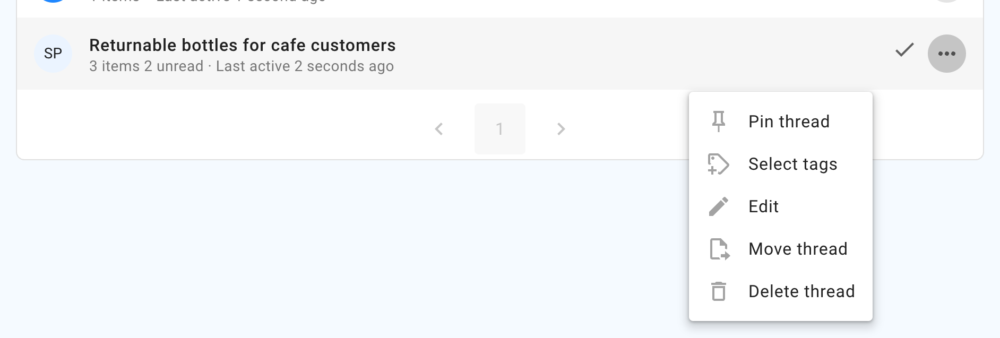

These tools are available for group admins.

If **Members can manage discussions and comments** is enabled in [Group settings](/en/user_manual/groups/settings/#permissions), members can edit, move, pin, tag or close discussions and comments in the group.

## Pin a thread

The thread list is ordered by the most recent activity, so you will see current threads at the top and older threads lower down the list.

You can pin a thread to the top of the list to make it easier to find. Welcome discussions, news items and announcements are typical of pinned threads.

Pinned threads appear above other threads on the group page and are ordered by the most recently pinned item at the top. You can change the position of a pinned thread by unpinning it and pinning it again.

Use **Unpin thread** to return it to the activity-based order.

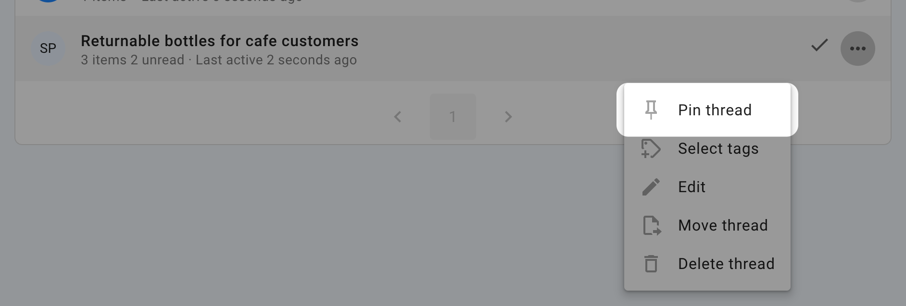

## Edit a thread

**Edit** opens the discussion form, where you can update the title, context and notification message.

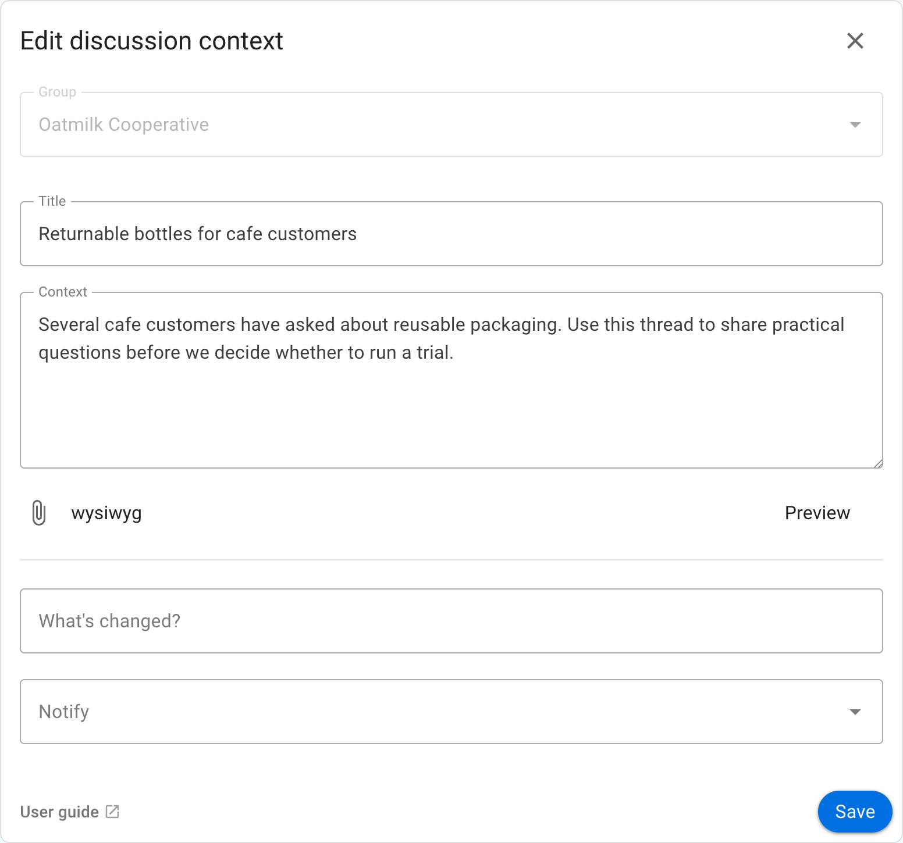

When a discussion has been edited, an **Edited** action appears on the discussion context. Select it to see what changed.

>[!Tip]
>Editing a discussion from the group page is a quick way to update its category tags.

## Move a thread to another group

You can move a thread to another Loomio group or subgroup.

The thread will be visible to members of the destination group and to anyone specifically invited to the thread.

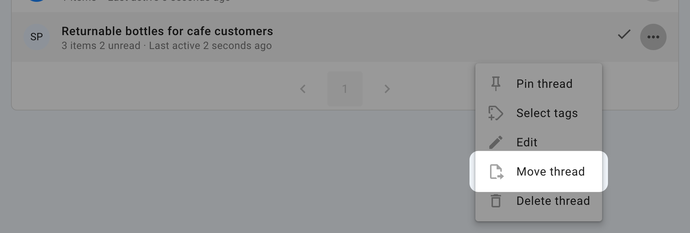

Select the destination group, subgroup or **Direct thread**, then click **Move thread**.

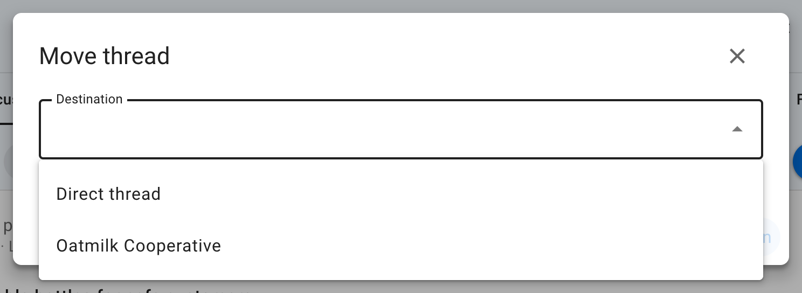

>[!Tip]
>Start a draft thread and move it to a group when you are ready to post. Use a private subgroup or direct discussion to work on a draft with one or two people.

## Move items between threads

Use **Move item** to move items from one thread to another. You can use this to combine two discussions into one thread; there is no separate **Merge discussions** command.

In the source discussion, open the three-dot menu (**⋯**) on a comment and select **Move item**.

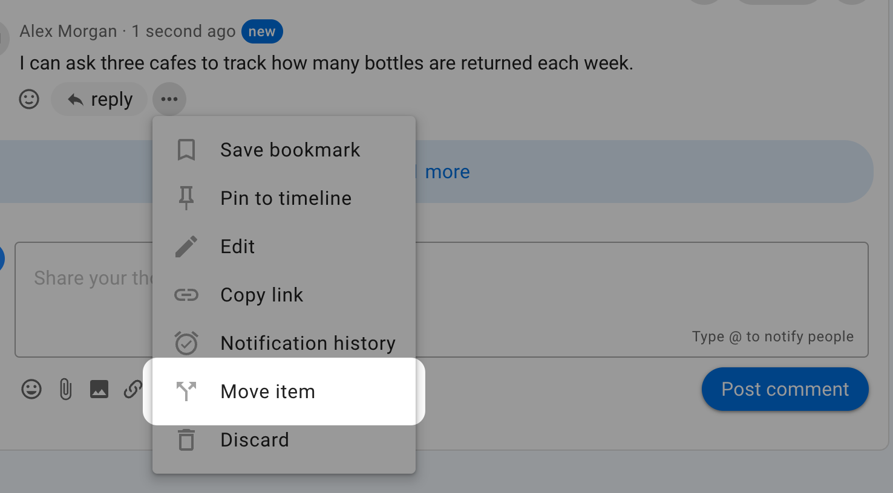

Select the items you want to move.

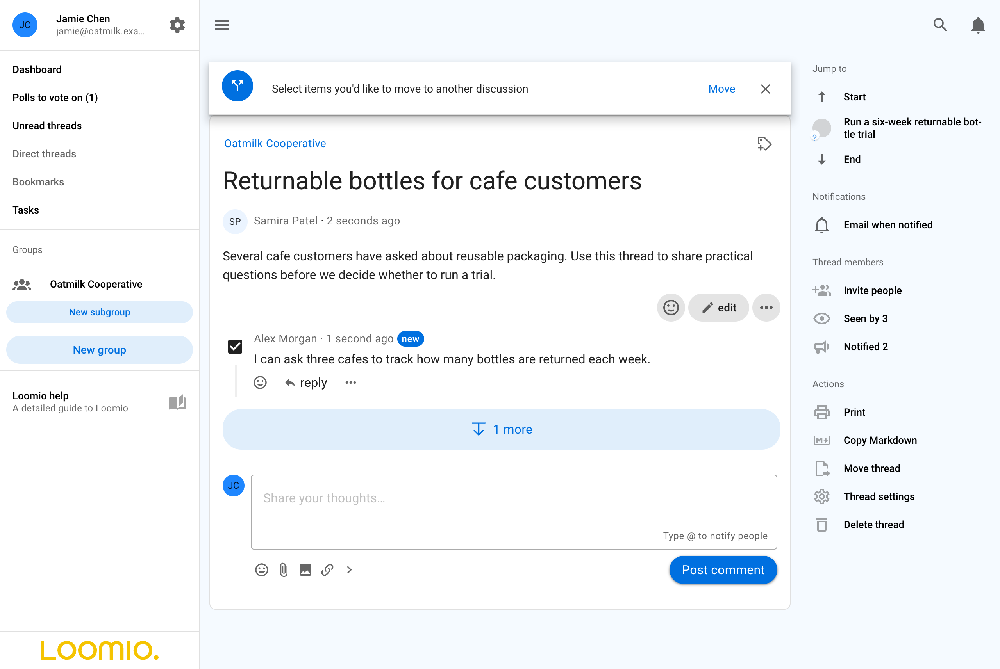

Select any additional items with the checkboxes, then click **Move** in the banner at the top of the discussion.

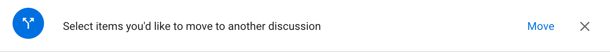

Choose the group or subgroup, then search for the existing discussion you want to move the items into.

You can also use this process to move comments onto a new topic. Instead of selecting an existing discussion, start a new discussion and add its title and context.

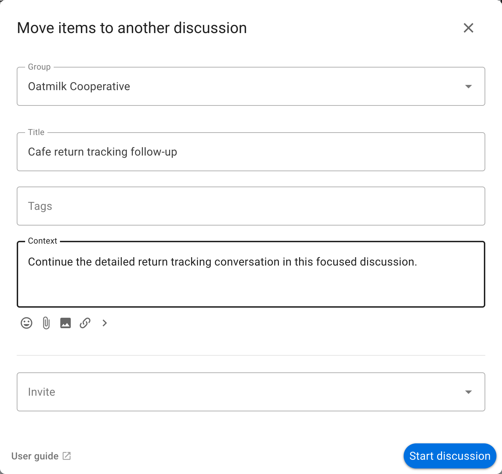

The items are moved from the original thread into the selected or newly created thread.

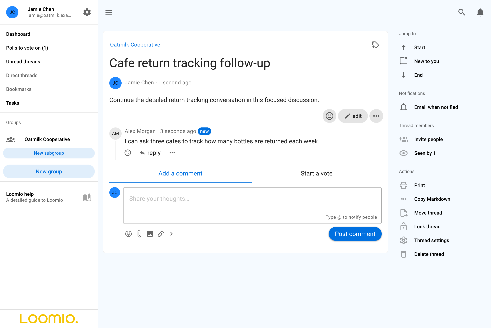

After moving the items, lock the original thread if it is no longer needed. You can delete it instead if you are certain you will not need it again.

## Copy a thread as Markdown

Thread members can copy a complete thread as structured Markdown. You can use
the copied text with an AI assistant or paste it into a document or another
tool that supports Markdown.

Open the thread and select **Copy Markdown** under **Actions** in the right
sidebar.

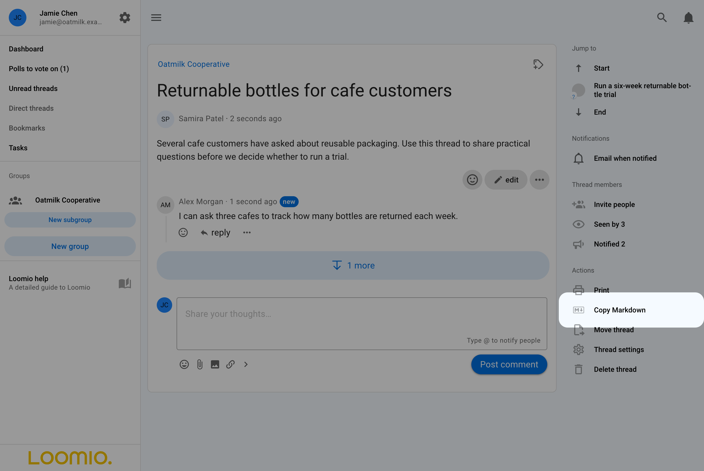

Select **Copy thread** to copy the Markdown to your clipboard.

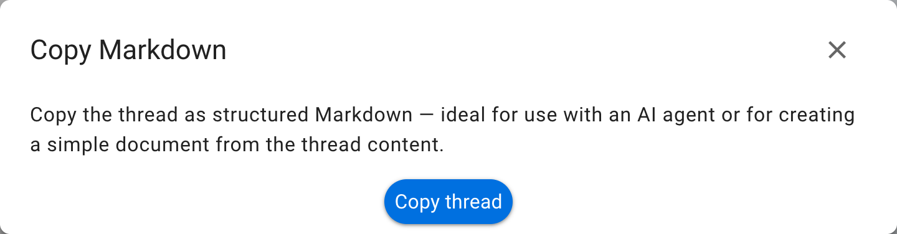

The copied document includes the discussion context, timestamps, replies,
polls, visible results, vote reasons, and outcomes. Loomio applies the same
visibility rules as the thread: results and vote reasons you cannot see are
not included, and voters are not identified in anonymous polls.

## Lock a thread

Lock a thread to prevent people from commenting or making further changes. Locked threads are removed from the list of open threads.

You can only lock a thread after its active polls have closed.

Open the discussion and select **Lock thread** under **Actions** in the right sidebar.

To view locked threads, go to the group page and click the drop-down menu under the Discussions tab.

Change the discussion filter from **Open** to **Locked**.

Open a locked discussion and select **Unlock thread** under **Actions** to allow comments and changes again and restore it to the open discussion list.

Locked threads are marked with a **Locked** tag.

## Delete a thread

Deleting a thread removes it from your group. You cannot restore a deleted thread.

If you are not sure whether you will need to access the thread again, lock it instead. Locked threads can be unlocked.

When you select **Delete thread** you will be asked to confirm before proceeding.

