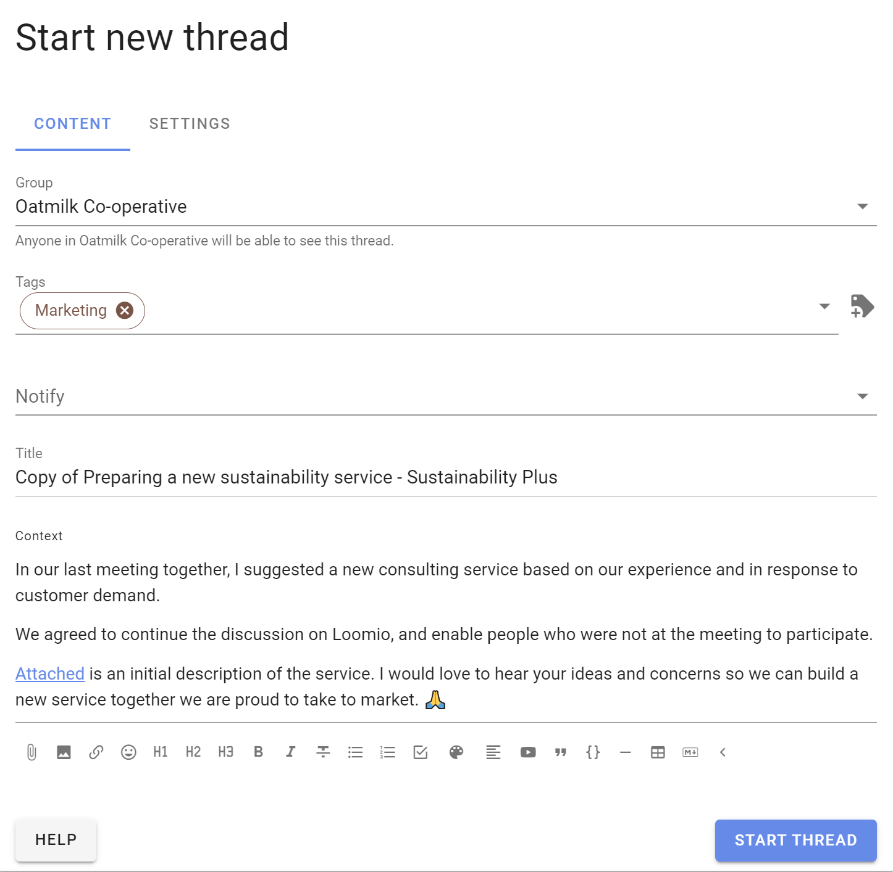

# Thread management

As the number of threads grows, you can help group members find the threads they need. A thread may contain a discussion, a poll, or both.

On the group page **Discussions** tab there are several tools to help you display and manage threads.

You can pin important threads to the top of the list, edit a thread, move a thread to another group, move items between threads, copy discussions, close old threads and delete unwanted threads.

Open the 3 dot (**...**) thread management menu to the right of the thread.

These tools are available for group admins.

If "Members can manage discussions and comments" is permitted in [Group Settings](https://help.loomio.com/en/user_manual/groups/settings/index.html#permissions), any member of the group can access thread management tools.

If members are not permitted to manage discussions, they can only **Close** a thread.

## Pin a thread

The thread list is ordered by the most recent activity, so you will see current threads at the top and older threads lower down the list.

You can pin a thread to the top of the list to make it easier to find. Welcome discussions, news items and announcements are typical of pinned threads.

Pinned threads appear above other threads on the group page and are ordered by the most recently pinned item at the top. You can change the position of a pinned thread by unpinning it and pinning it again.

Use **Un-pin** to release a thread so it is ordered by activity.

## Edit a thread

**Edit thread** opens the edit panel, enabling you to change the thread.

When a discussion has been edited, the **Show edits** icon appears on the thread page. Click on this to see what changes have been made.

>[!Tip]
>Editing discussions from the group page is a quick way to add a Category tag.

## Make a copy

Create a copy of a discussion when you want to start a new discussion based on an existing one. The copy includes the title (prefixed with "Copy of"), discussion context, tags and formatting.

Open the 3 dot (**⋯**) menu under the discussion context and select **Make a copy**.

Edit the title and context for the new discussion.

>[!Note]
>**Make a copy** does not copy comments or polls from the source discussion. Loomio remembers the poll types used in the source discussion and shows them at the top of the poll type list in the new discussion.

## Move a thread to another group

You can move a thread to another Loomio group or subgroup.

The thread will be visible to members of the destination group and to anyone specifically invited to the thread.

Select the destination group or subgroup, and click **Move thread**.

>[!Tip]
>Start a draft thread and move it to a group when you are ready to post. Use a private subgroup or direct discussion to work on a draft with one or two people.

## Move items between threads

Use **Move item** to move items from one thread to another. You can use this to combine two discussions into one thread; there is no separate **Merge discussions** command.

In the thread you want to move items from, open the 3 dot menu (**...**) on an item and select **Move item**.

Select the items you want to move.

Click **Move** in the banner at the top of the discussion.

Choose the group or subgroup, then select the existing thread you want to move the items into.

You can also use this process to move comments onto a new topic. Instead of selecting an existing discussion, start a new discussion and add its title and context.

The items are moved from the original thread into the selected or newly created thread.

After moving the items, lock the original thread if it is no longer needed. You can delete it instead if you are certain you will not need it again.

## Lock a thread

Lock a thread to prevent people from commenting or making further changes. Locked threads are removed from the list of open threads.

You can only lock a thread after any proposals in the thread have closed.

Open the 3 dot menu (**...**) for the thread and select **Lock thread**.

To view locked threads, go to the group page and click the drop-down menu under the Discussions tab.

Change the discussion filter from **Open** to **Locked**.

Use **Unlock thread** to allow comments and changes again and restore the thread to the open thread list.

Locked threads are marked with a **Locked** tag.

## Delete a thread

Deleting a thread removes it from your group. You cannot restore a deleted thread.

If you are not sure whether you will need to access the thread again, lock it instead. Locked threads can be unlocked.

When you select **Delete thread** you will be asked to confirm before proceeding.

