# Formatting

When starting or editing a discussion or poll, or writing a comment, you will see a formatting bar below the text field. Select the arrow at the end of the bar to show or hide the full set of tools.

Hover the mouse or cursor over each item for the name of each tool.

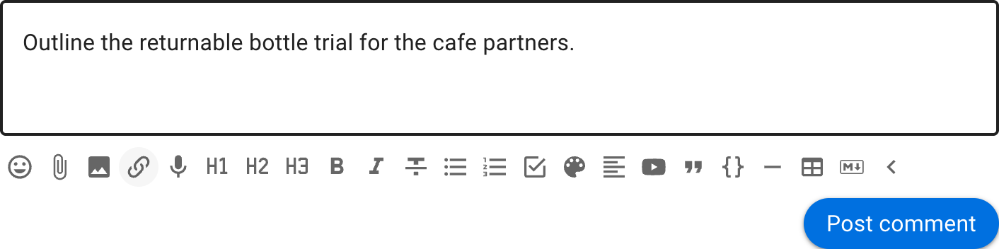

Use formatting to add structure and emphasis so information is easier to scan.

## Attach file

Use the paper clip icon, just below the text form, to add file attachments from your computer.

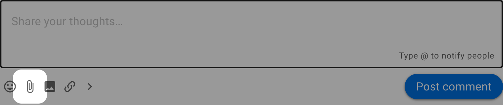

### Remove attachments

While editing the context, click the **X** to the right of the file name to remove it.

## Insert image

Use this tool to insert and display an image.

Select an image file from your computer. The image is inserted into the editor after it uploads.

The image is displayed within the published discussion, poll or comment.

>[!Tip]
>You can also copy/paste an image directly into Loomio.

## Insert link

You can add a link to any shareable document or page on the internet.  

To add a link:

1. Select the text you want to link to - say the name of a document.
2. Click the link icon.
3. Paste the address into the **Insert link** field and select **Apply**.

For a document hosted elsewhere, check its sharing permissions so discussion participants can open it.

A preview of the doc will appear under the text space. You can remove this if you want.

Now, anyone with access to your Loomio discussion and permission to view the doc can open and read it.

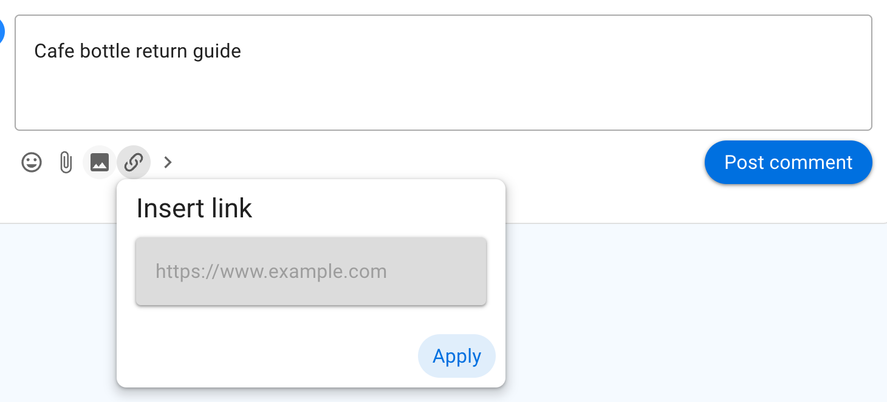

## Insert Emoji

Select the smiley button and choose an emoji from the picker.

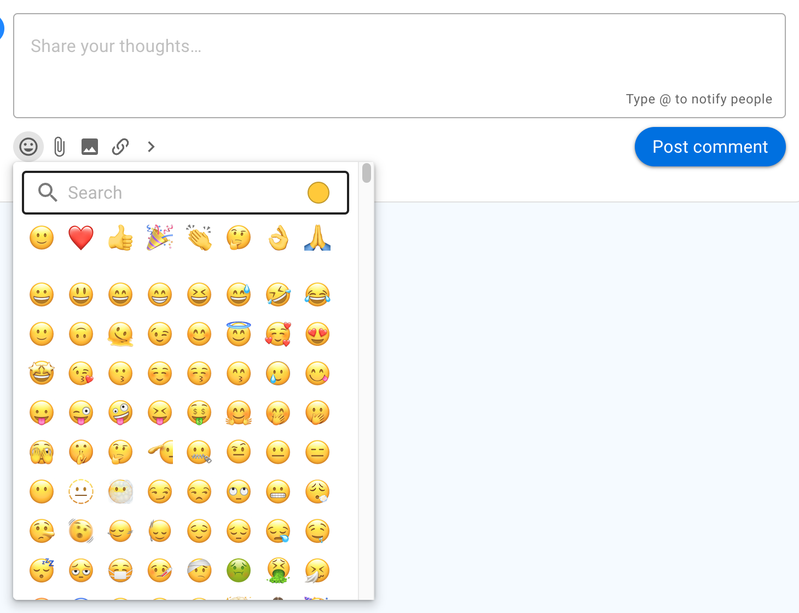

## Headings

Heading 1, Heading 2 and Heading 3 can help structure a discussion or comment.

Select the text to mark as a heading and click on the heading format tool.

If a heading is used in a comment, the comment will automatically be pinned to the discussion timeline.

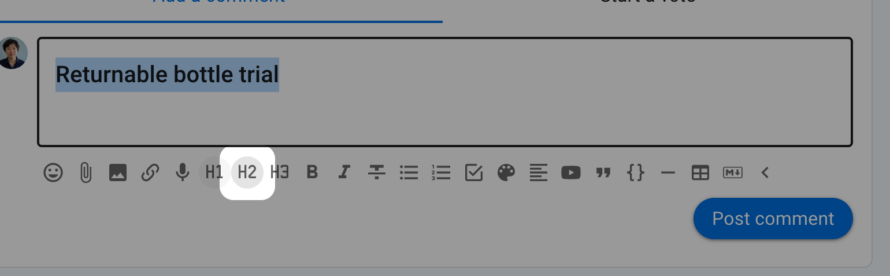

## Bold, Italicize, Strikethrough

Select the text to format and click on the required format tool.

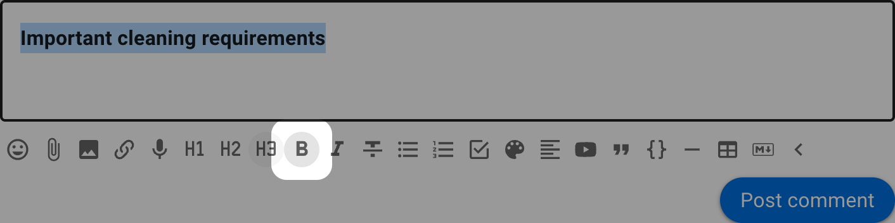

## List

Use **List** to format items as bullet points.

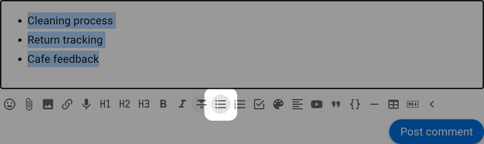

## Numbered list

Use **Numbered list** when the order of items matters.

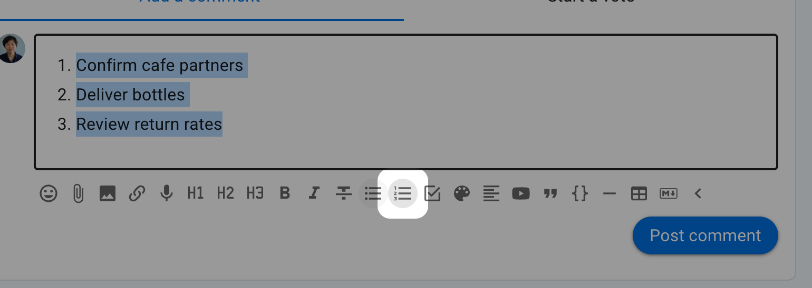

## Task list

Use **Task list** to add checkboxes. After posting the list, tasks can be assigned to someone and given a due date.

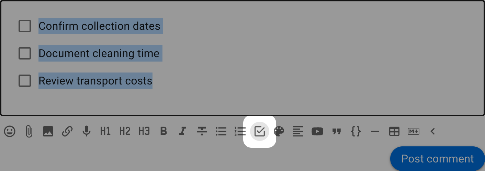

See the page on [Tasks](/en/user_manual/discussions/tasks/) for more information.

## Colors

Use **Colors** to add a highlight colour to selected text.

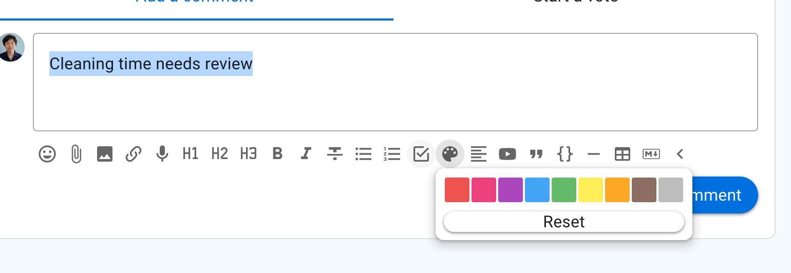

## Align

Select to align text to left, center or right.

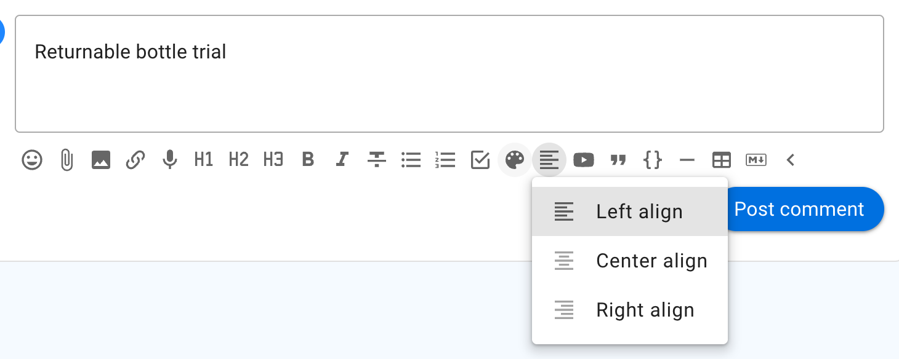

## Embed videos and webpages

You can embed supported videos and webpages anywhere there is a formatting toolbar.

To use the embed video feature: 
1. Copy the address of the video or webpage.
2. Select **Embed video**, paste the address and select **Apply**.

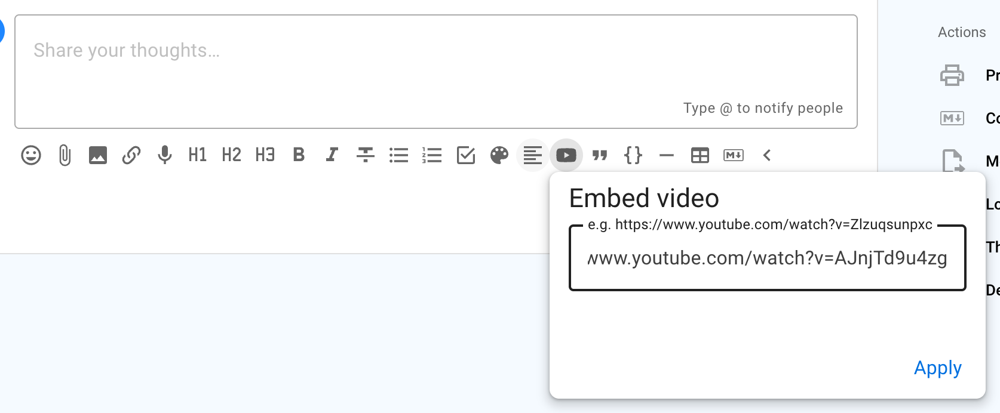

<iframe width="100%" height="380px" src="https://www.youtube-nocookie.com/embed/AJnjTd9u4zg" frameborder="0" allowfullscreen></iframe>

>[!Tip]
>Make sure the video can be accessed by everyone who can participate in the discussion. For example, an unlisted video may be suitable when it should not appear in public search results.

## Quote

Quote adds emphasis to your text, and can be useful to draw attention to an instruction.

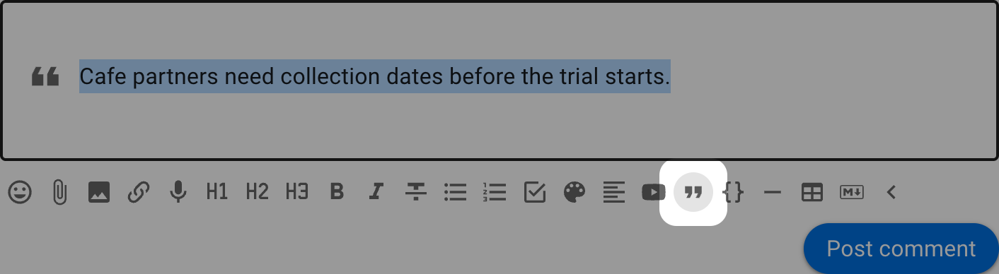

## Code block

Typically used to show code in text, code block formatting is also available to help you distinguish text in your discussion.

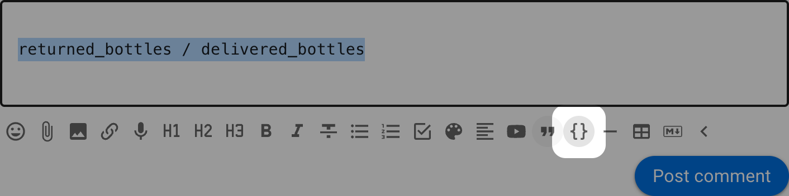

## Divider

Use the divider to draw a horizontal line to separate sections.

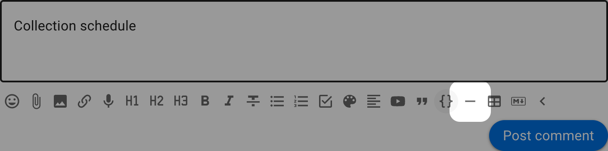

## Add table

Add a table to your discussion. 

Additional tools are available to add/remove columns and rows.

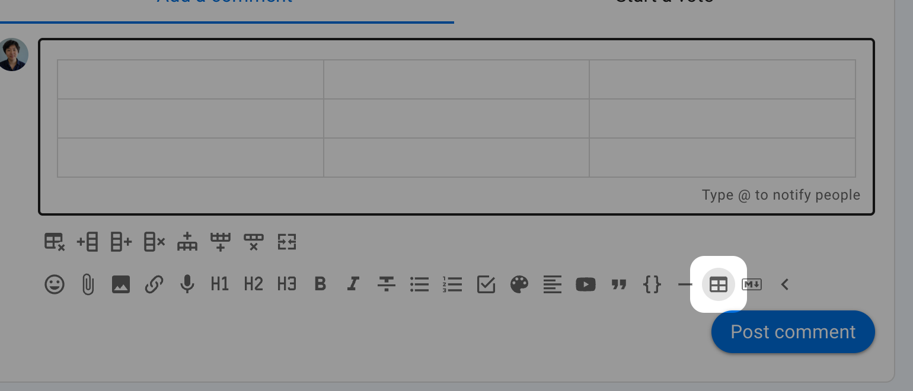

## Markdown

To switch to Markdown editing, select **Edit Markdown**.

If you click this while there is text in the form, some formatting may be lost upon conversion.

### Rich text

Select **Edit rich text** to return to the formatting tools. This converts supported Markdown into its displayed form.

**Preview** shows how Markdown will appear when posted without converting it.
