# Notifying people

Loomio includes tools to help you notify people about activity within Loomio. For example; when you start a new discussion, require a response, invite people to take an action or just want to make sure people are alerted to new information.

A notification in Loomio sends an email to the people you notify.  Notifications also appear under the bell icon at the top right of Loomio.

Notification needs vary from group to group, and often vary over time as people become more familiar with Loomio as part of their daily work.  Consider how people in your group want to be notified, and try to strike a balance of letting people know about new activity in Loomio without overwhelming their inbox.

## Notify about a new discussion

When you start a discussion, you can choose to notify all members of a group, or just some of them. Notify sends the discussion to specific people via email.

You can also invite guests to the thread.  Guests can see and participate in the thread, but cannot see other threads in your group that they have not been invited to.

Use the drop down menu to select a group of people, and click on the group to see individual people.  You can remove people from the notification list by clicking the x beside their name.

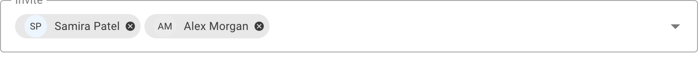

You can type in the first few letters of the name of a member of your group, and their name in Loomio will appear. Click on this to add to the 'Notify' panel.

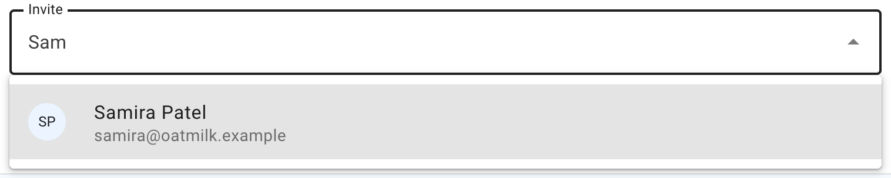

You can type or paste in a person's email address.  This is useful to invite a 'guest' to the discussion.  Guests can see the discussion and all comments and polls within the discussion, however they cannot see any other discussions of your group.  You can remove a guest from a discussion.

If the person is a member of your Loomio group they will receive the notification as usual.

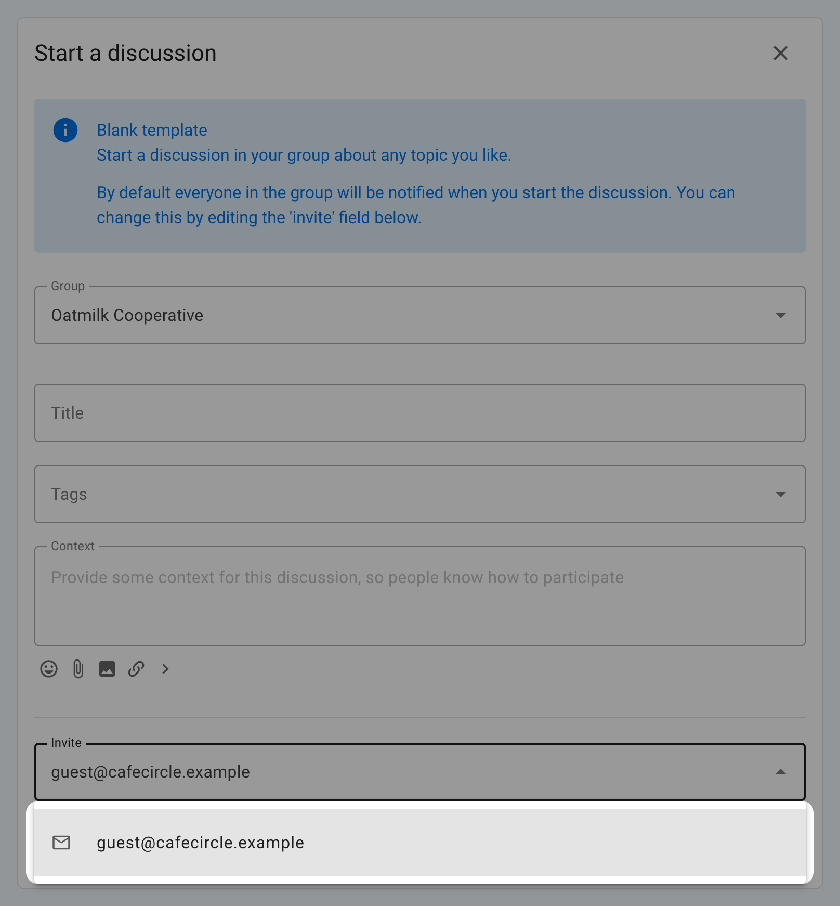

**Do not notify anyone**

You can also choose not to notify anyone about your discussion.  If the discussion is started in a Loomio group, then all members of the group will be able to see and participate in the discussion.  Members will be alerted that the discussion has started through the daily **Catch up summary email** if enabled.

A Loomio discussion offers a way for you to share information and work transparently - to "work out loud".

By not notifying people you are saving a few emails from their in-box, and members of your group can stay informed of progress of the discussion through the 'Catch up summary email' or by signing into Loomio.

## Mentioning

### Mentioning people

If you want to get the attention of a specific person, type **\@**, start typing their name, and then select the user name of the person you want to **mention**. The mentioned people will be notified immediately.

You can mention people in comments, threads and polls.

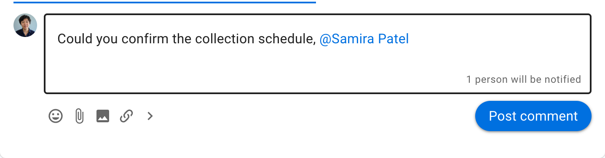

### Mentioning the group

You can also notify everyone in the group at once, by typing **\@** then typing the group name.

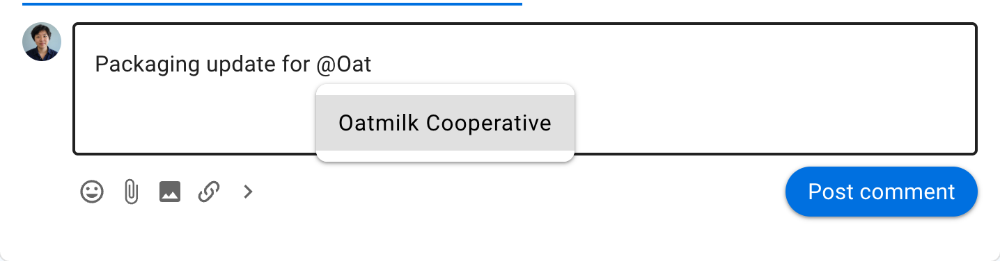
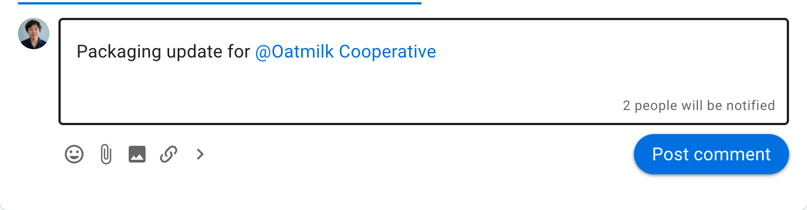

### Replies

When you click **reply** on a comment, your reply will be prefilled with an @mention to the person you are replying to. In this way, a reply will notify the person you're replying to. If you remove the @mention, they will not be notified.

### Reactions

Reacting to a comment is a great way to encourage and acknowledge a comment by letting the comment author know how you feel.  It is a quick and light-weight way to participate that does not require any text, nor send an email.

On any comment or thread's context you can **react** and choose an emoji.

Reactions send a notification within Loomio, but do not send an email.

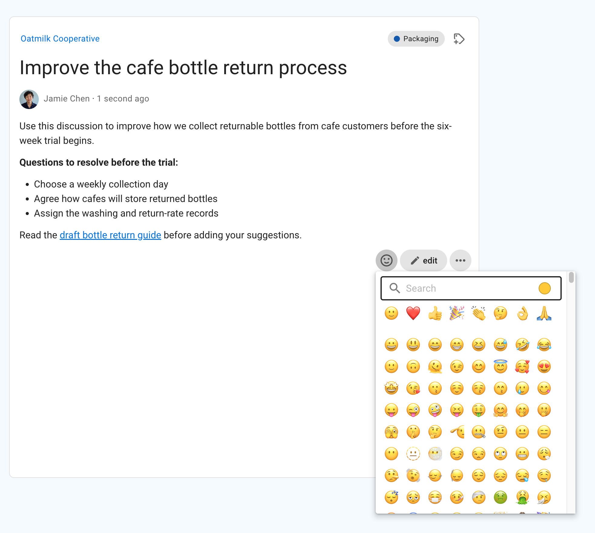

## Invite to discussion

You can invite people to the discussion at any time after the discussion has started.

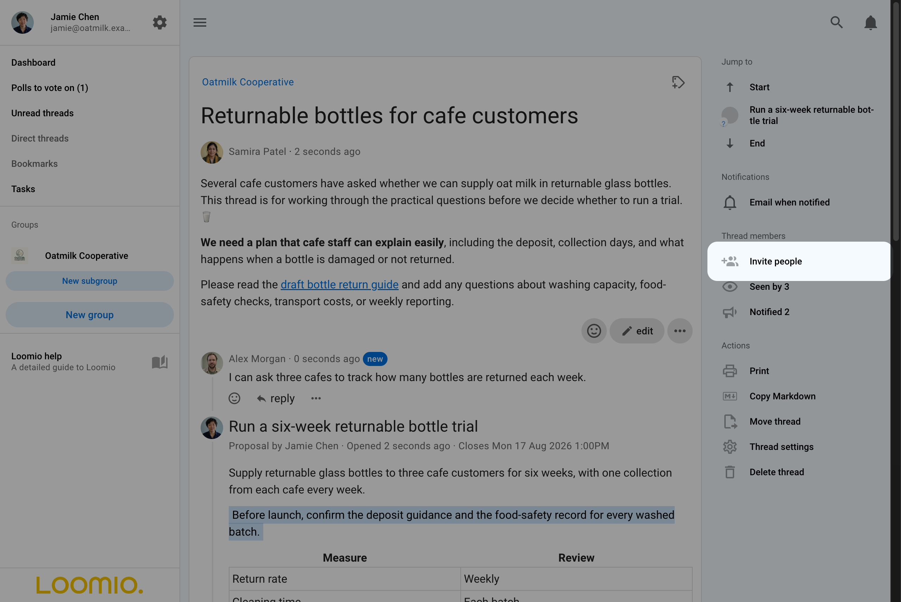

Select the people you want to invite by group, subgroup or individually.

To add people individually:
- Group members - type the first letters of their user name or type/paste their email address.
- Guests - type/paste their email address.

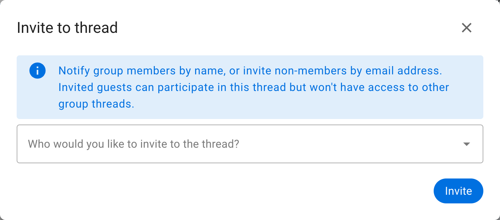

You can remove a person from the discussion by clicking the 3 dots menu to the right of their name and selecting **Remove from discussion**.

### Invite a guest
You can invite any person outside your group to see and participate in a discussion.

Guests can not see any other discussions in your group - only the discussion they have been specifically invited to.

Invite a guest with their email address.

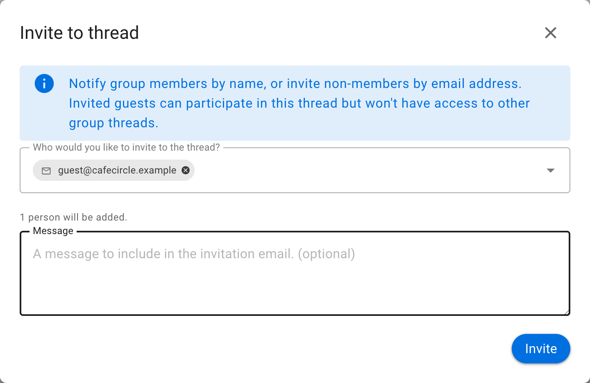

## Notify about discussion changes

Notify people to let them know when a discussion has been updated.

The discussion can be updated at any time by adding/removing text in the discussion context.

When updated, you can write a comment in **What's changed?** describing the change.

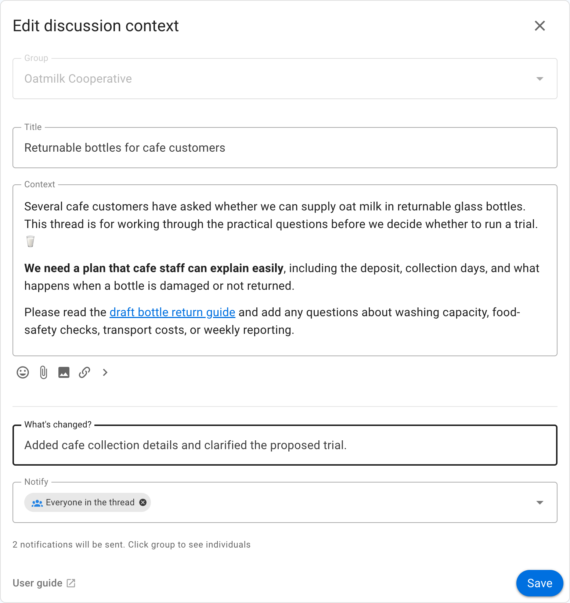

The thread edit comment will appear in the thread.

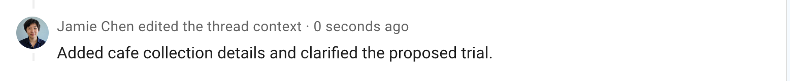

## Who has seen or been notified about the discussion?

The **Thread members** section of the discussion sidebar shows **Seen by** and **Notified**.

These features help you track engagement in a discussion or poll.  Although someone may not yet have commented in the discussion, you can check to see if they have seen the discussion, who has been notified, and if the notification has been read or the email has been opened.

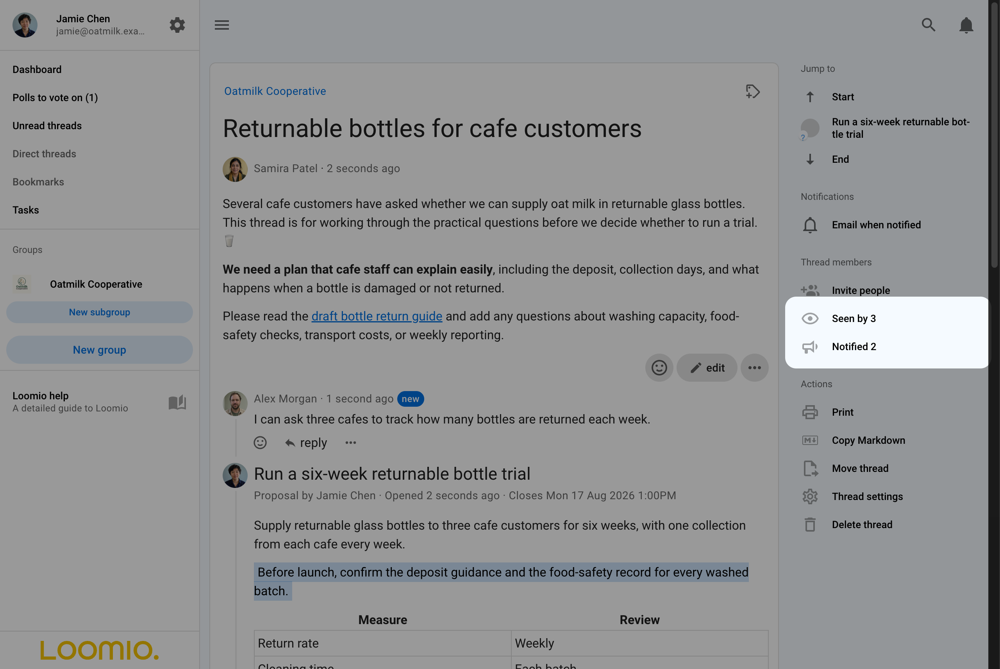

### Seen by

Click on **Seen by** to see who has seen the discussion and when.

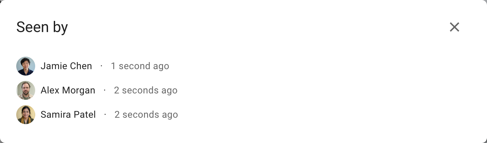

### Notified (Discussion notification history)

Click on **Notified** to see who has been notified about the discussion

Each recipient is marked **Read** or **Unread** when that information is available.

In **Discussion notification history** you can see all notifications for that discussion, including the discussion invitation, and mentions and replies within comments.

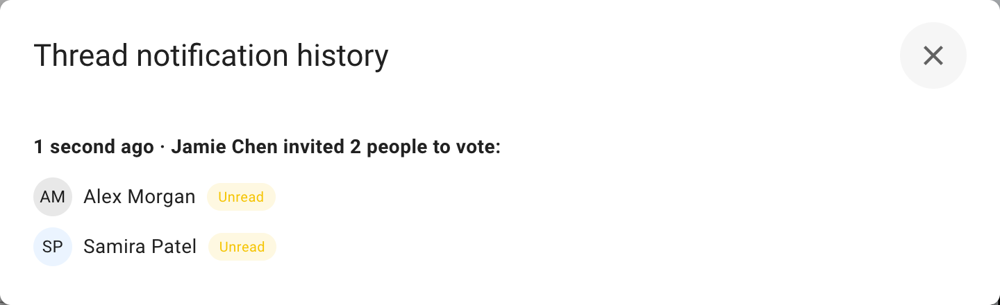

Open discussion notification history at any time by clicking **Notified** in the **Thread members** section.

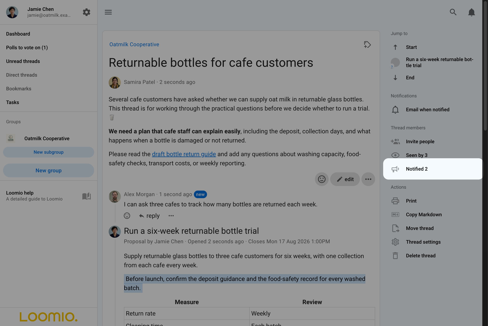

### Comment notification history
Alongside the comment, click on the 3 dots drop-down menu (**⋯**) to find **Notification history**.

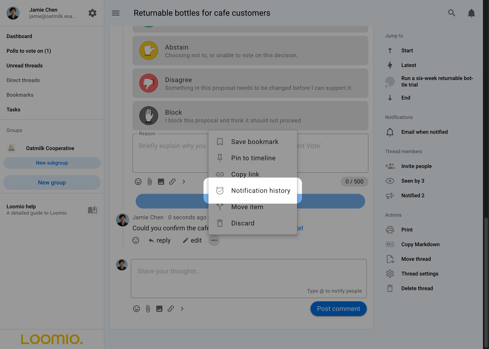

Opening the **Notification history** will show if any notifications for the comment have been sent, and when.

Each recipient is marked **Read** or **Unread** when that information is available.

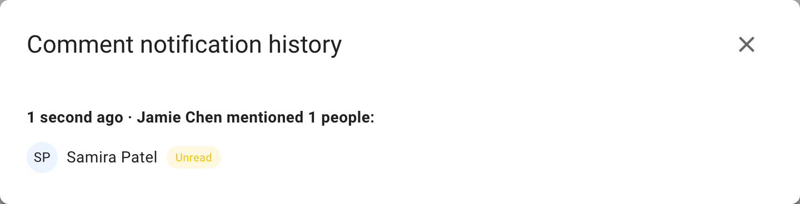

### Poll notification history
At the bottom of the poll, click on the 3 dots drop-down menu (**⋯**) to find **Notification history**.

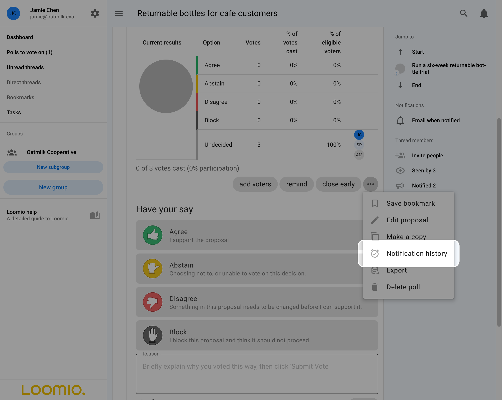

The poll notification history shows who has been invited to the poll and the date invited.

Each recipient is marked **Read** or **Unread** when that information is available.

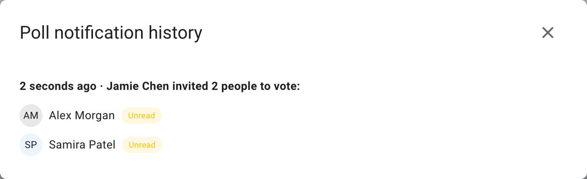

## Discussion email notifications

Click the current notification setting in the discussion sidebar to choose whether Loomio emails you for all activity, only when you are notified, or not at all. Choosing all activity can produce many emails in an active discussion.

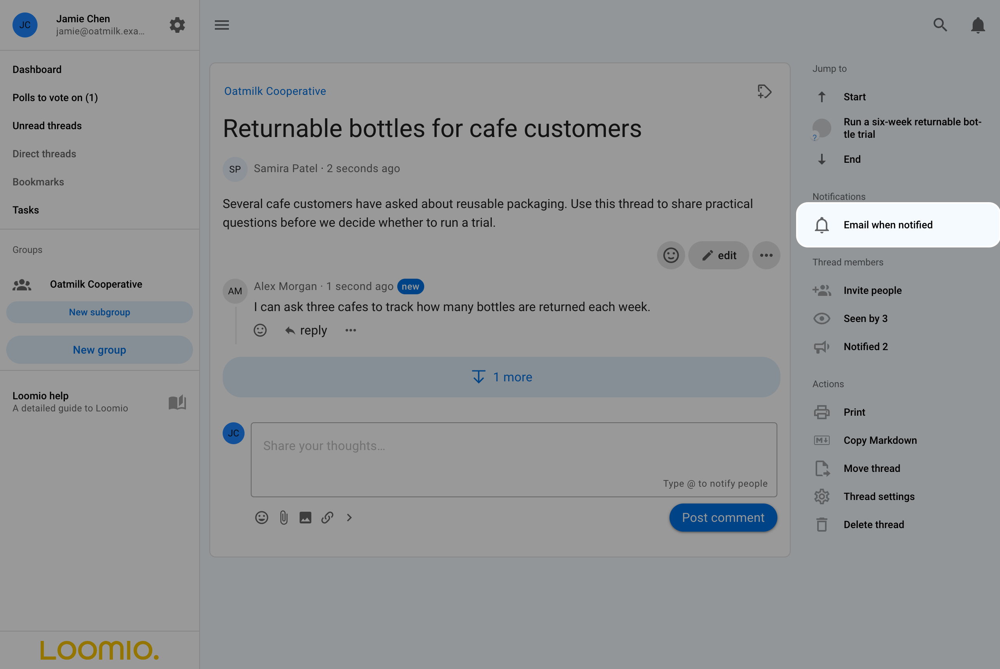
