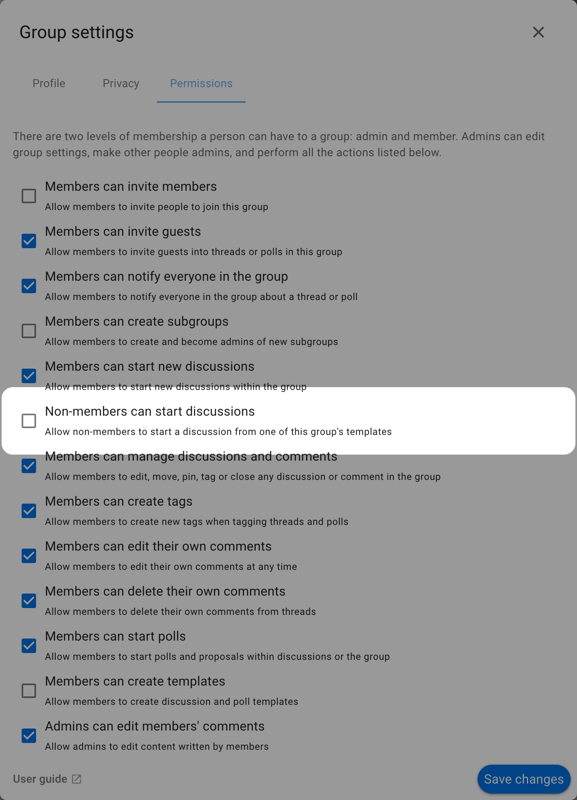

# Collect private submissions

Use a Closed group to collect private submissions from people who are not members of the group. Each submission becomes a separate discussion that the submitter and the group's review team can use to exchange information, ask questions, and record a decision. Submitters cannot see other private discussions or submissions in the group.

Nominations are a clear use case when candidate details or the list of nominees must remain private during selection. A person can nominate themselves or someone else for an election, appointment, committee, board, or representative role, while a selection panel reviews each nomination in its own discussion.

Other suitable purposes where submissions should not be public include:

- Complaints, safeguarding reports, safety concerns, and incident reports
- Appeals and requests to reconsider a decision about an individual case
- Requests for mediation, conflict resolution, or personal support
- Applications containing personal, financial, or eligibility information, such as hardship grants or scholarships
- Sealed bids or tender responses that must remain private during assessment

This workflow is private between submitters, but it is not anonymous. Submitters need a user account, and every member of the Closed group can see the submissions. Consider who belongs to the review group before using it for sensitive information.

## Enable private submissions

You must be an admin of the group or subgroup where you want to collect submissions.

1. Open the group.
2. Select **Settings** (or **More** and then **Edit group settings**).
3. Open **Permissions**.
4. Enable **Non-members can start discussions**.
5. Save the group settings.

This option is available only for **Open** and **Closed** groups. It is hidden for **Secret** groups. If you cannot see it, open **Privacy** in the group settings and change **Group privacy** to **Closed** (recommended for private submissions) or **Open**, then return to **Permissions**.

Enabling this permission does not make the group's discussions public. A non-member can start a new discussion and access that discussion as a guest, but cannot see the group's other private discussions.

## Set up a private submission process

1. Create a dedicated subgroup for the submission process and set its privacy to **Closed**. A subgroup keeps the submissions separate from the parent group's other work.
2. Add the selection panel or other people responsible for reviewing submissions as members of the subgroup. Every subgroup member can see every submission, so add only people who should have that access.
3. Create a [discussion template](/en/user_manual/discussions/templates) in the subgroup. Include the questions and information submitters should provide. You can create different discussion templates for different kinds of submissions.
4. If submitters should not request subgroup membership, set membership to **Invitation only**.
5. [Enable private submissions](#enable-private-submissions) in the subgroup's permissions.
6. Test the process with an account that is not a member of the subgroup.
7. Share the subgroup page with prospective submitters. They must sign in to their user account before making a submission.

## Make a submission

The submitter opens the subgroup and selects **Start discussion**. Loomio shows the subgroup's available discussion templates. The submitter selects the relevant discussion template, completes its questions, and starts the discussion.

The discussion belongs to the subgroup, but the submitter does not become a subgroup member. Loomio adds them as a guest of their discussion thread, enabling them to see and participate in the discussion with the panel or review team. They cannot see other private discussions or submissions in the subgroup.

## Review submissions

Subgroup members can see every submission discussion in the subgroup. They can ask follow-up questions and use comments, polls, or other discussion tools to complete their review.

If another person needs to provide information, a subgroup member with permission can invite them to the submission discussion. For example, when a nominator submits a nomination, the subgroup can invite the nominee to the thread if their participation is required. The invited person joins as a guest without gaining access to the subgroup's other private discussions.

Each submitter can see their own submission but cannot see the subgroup's other private discussions or submissions. Disable **Non-members can start discussions** when submissions close. Existing discussions and guest access are unchanged.
