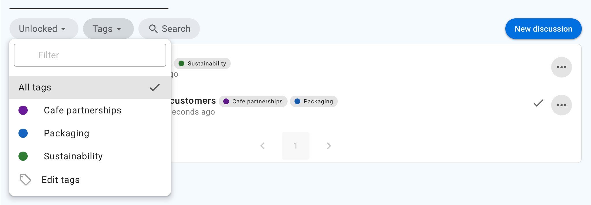
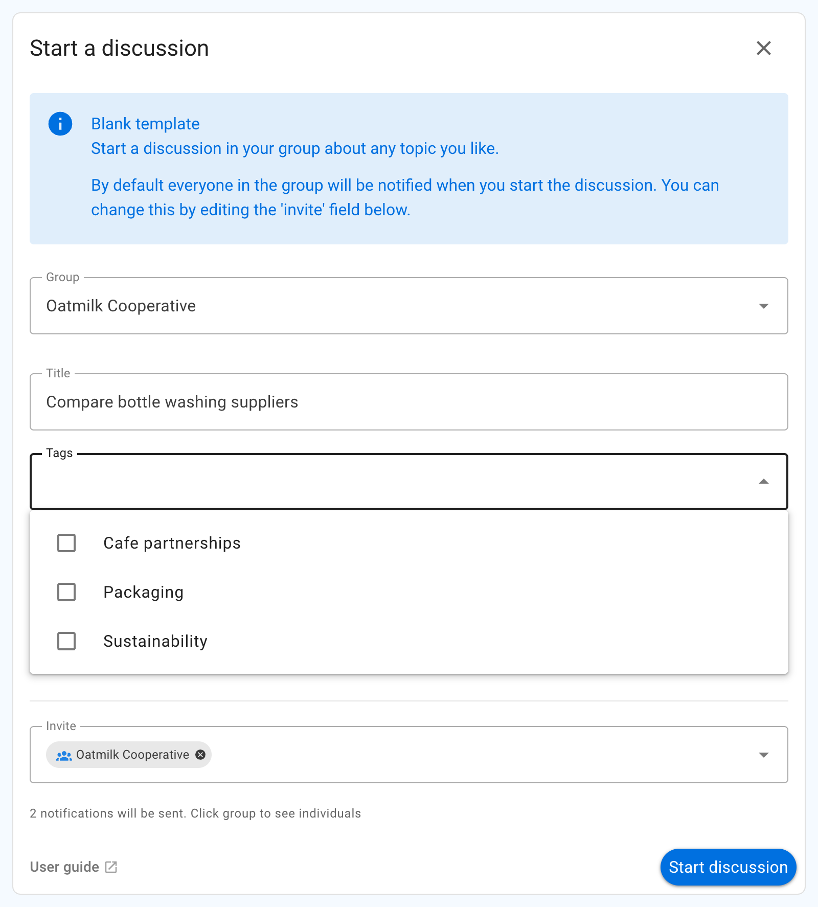
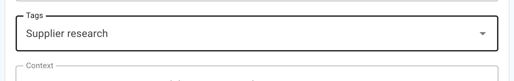
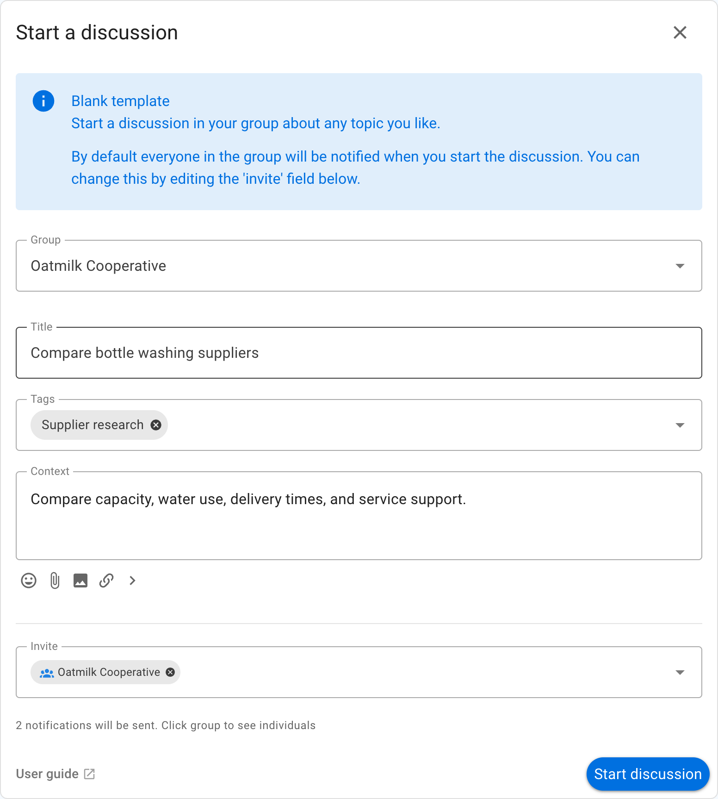
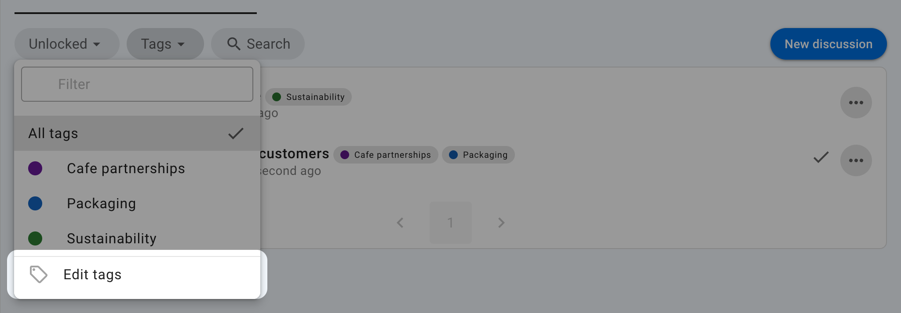
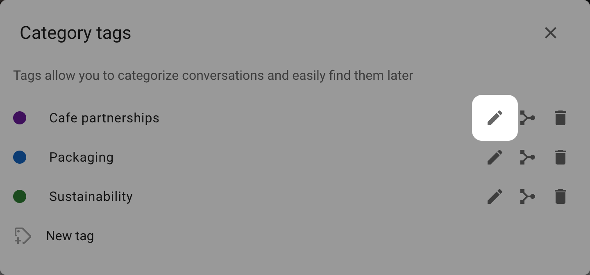
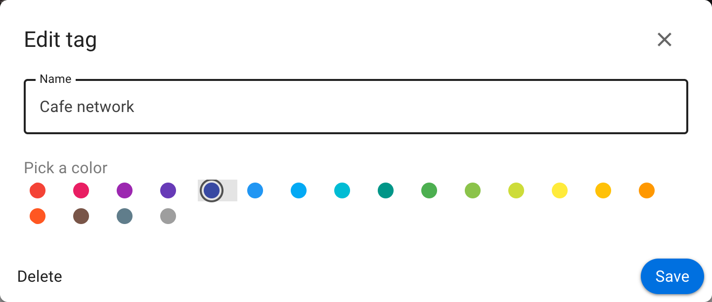
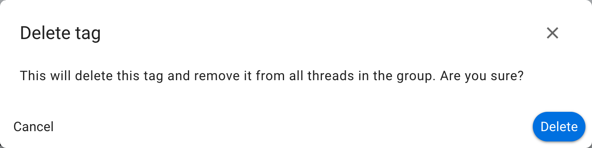
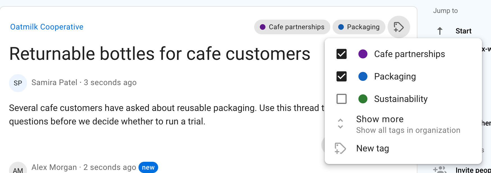

# Category tags

Category tags make it easy to find threads and polls about a particular type of work or topic.

Tags belong to the whole organization. A tag used in a parent group is the
same tag in its subgroups, making it possible to organize related work across
the organization. Loomio displays tag names alphabetically and shows their
colors as dots beside the names.

On your group page, click **Tags** above the thread list to see the tags used in
the current group. Select a tag to show only threads with that tag. Use the
filter textbox to search a long list, or select **Show more** to include all
tags in the organization. Select **Show fewer** to return to the current
group's tags.

## Apply tags

Members who can edit a thread or poll can apply tags to it.

When you start a thread or poll, click the **Tags** field and select one or more tags.

Start typing to filter the list. Select a tag again, or click the × on its chip, to remove it.

## Create tags

Parent-group admins can always create tags for the parent group and its
subgroups. Subgroup admins can create tags while tagging content in their
subgroup. The **Members can create tags** group permission, enabled by default,
allows other members who can tag a thread or poll to create new tag names. If
the permission is disabled, members can still apply existing tags.

To create a tag while starting a thread or poll, type its name in the **Tags** field and press Enter.

Use short, familiar names that group members will recognize, such as Finance, Governance, Packaging, or Cafe partnerships.

## Edit tags

Only parent-group admins can rename, recolor, merge, or delete tags. These
changes apply throughout the organization, including its subgroups.

On the group page, open **Tags** and select **Edit tags**.

Select the pencil icon beside a tag.

Edit the tag name or choose a color, then click **Save**.

Click **Delete** to remove the tag from all threads and polls in the organization.

### Edit tag in thread or poll

To change the tags on an existing thread or poll, open it and click the tag button beside its current tags near the title.

Select tags to add or remove them. Changes are saved immediately.

