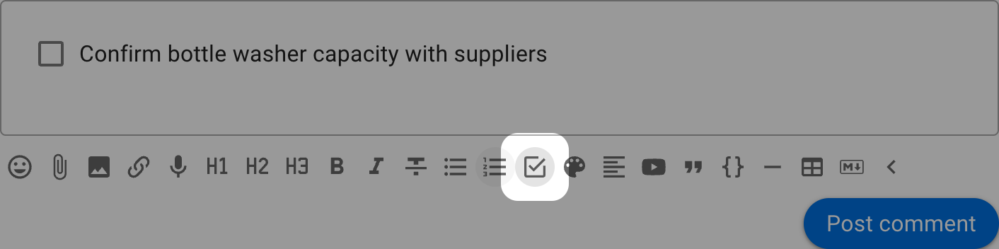
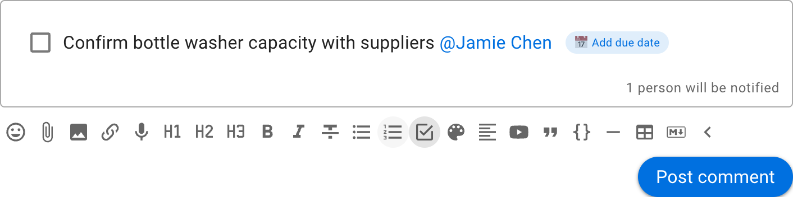
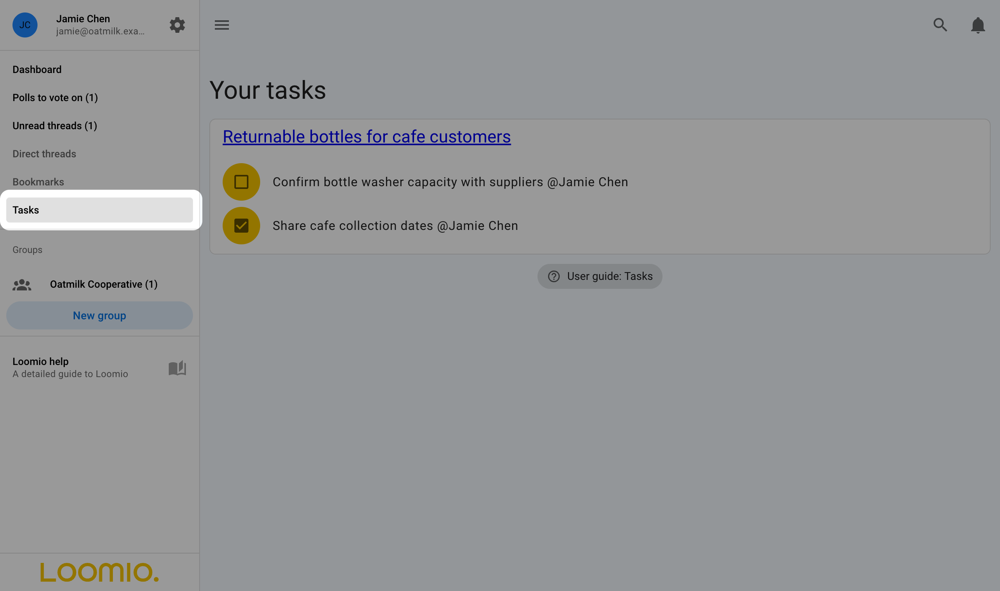
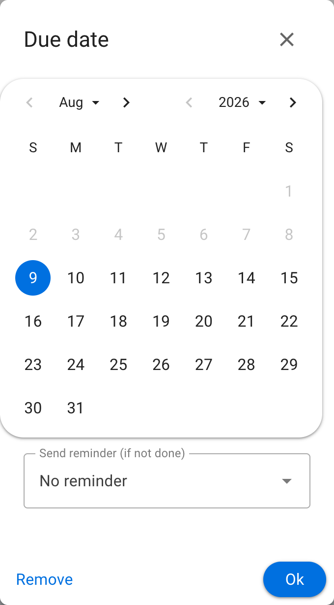
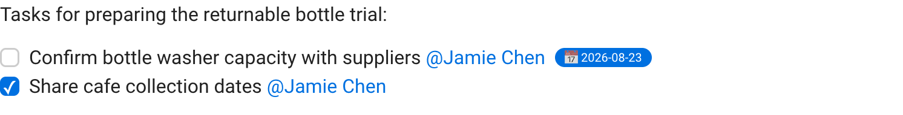

# Tasks

Use tasks in threads and comments to name an action, assign it to someone, set a due date, and track whether it is complete.

## Add a task

While writing a thread or comment, expand the formatting toolbar and click **Task list**. Type the action beside the checkbox.

## Name and assign the task to a person

Use an @mention in the task to assign it to a group member. An **Add due date** button appears once the task has an assignee.

Tasks assigned to you appear on your **Tasks** page. Open **Tasks** from the sidebar to see them grouped by thread or poll.

## Set a reminder

Click **Add due date** to choose a due date and when Loomio should email the assignee a reminder. You can also remove an existing due date from this dialog.

## Mark it as done

Click the checkbox beside a task to mark it as done. You can do this while editing the text, while reading it if you are the assignee, or from the **Tasks** page. Click it again to reopen the task.
