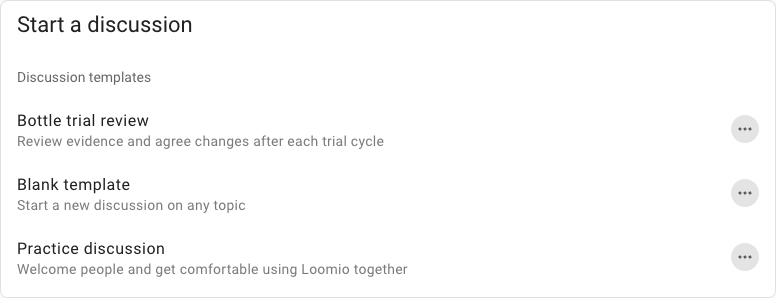
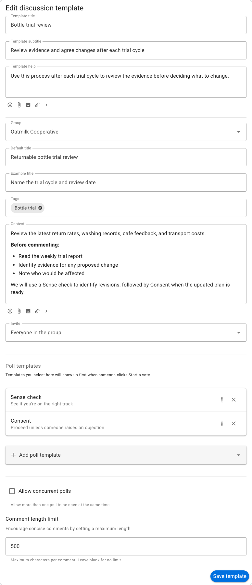
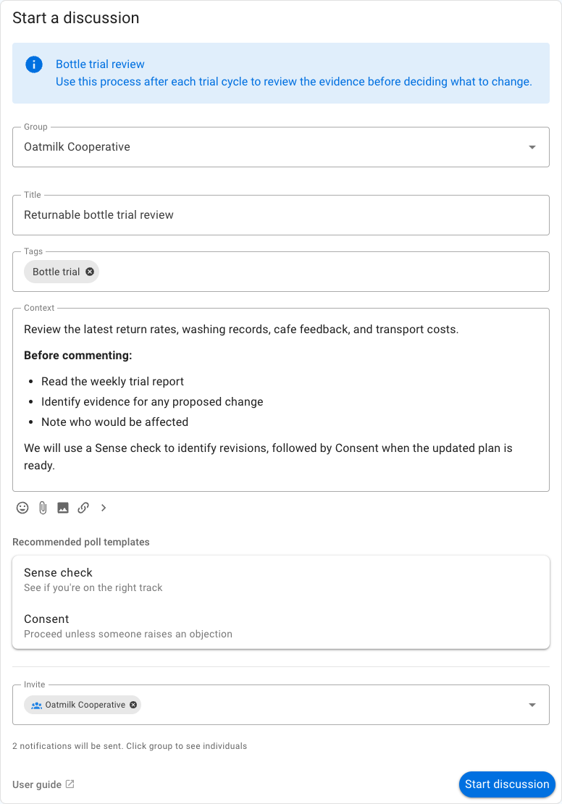

# Discussion templates

Discussion templates provide a reusable starting point for discussions your group runs regularly. A template can supply instructions, a title, context, tags, invite settings, and recommended poll templates.

Use a template when a discussion follows a repeatable process, such as a project review, advice process, meeting preparation, funding decision, or document approval. Members can still edit the supplied content before starting each discussion.

## Choose a template

Select **Start a new discussion** from the group page to see the group's available templates. Each item has a process name and subtitle explaining its purpose.

Select a template to open a pre-filled discussion form, or select **New template** to browse examples and create one. Starting a blank discussion is also a template choice.

## Example: bottle trial review

Oatmilk Cooperative reviews its returnable-bottle trial after each cycle. Its template reminds members to read the weekly report and consider return rates, washing records, cafe feedback, and transport costs. It also recommends a Sense check followed by Consent.

This is a useful template because the purpose and evidence remain consistent while the observations and decisions change each cycle.

## Create or edit a template

Group administrators can select **New template** from the template list, choose an example or blank template, and then adapt it. Use the action menu beside an existing template to edit it.

The form includes:

- **Process name**: the short name shown in the template list;
- **Process subtitle**: a one-line explanation of when to use it;
- **Process introduction**: instructions shown above the new discussion form;
- **Group**: whether the template starts a group or direct discussion;
- **Default title**: a title supplied to each new discussion;
- **Example title**: placeholder guidance when there is no default title;
- **Tags**: tags automatically applied to the discussion;
- **Context**: headings, questions, links, or other editable starting content;
- **Invite**: whether to invite everyone in the group by default;
- **Poll templates**: polls or proposals recommended for this process;
- **Concurrent polls**: whether more than one poll may be open at a time; and
- **Comment length**: an optional limit for replies.

Use a default title only when it will remain accurate. Otherwise, provide an example title that prompts the author to name the particular review, period, document, or decision.

## Start a discussion from a template

Select the template, review the process instructions, and edit the supplied title and context for this instance. Check the invite list before selecting **Start discussion**.

Recommended poll templates appear in the form as a guide to the process. They do not start automatically. Once the discussion is open, start the recommended poll when the group reaches the appropriate stage.

## Manage the template list

Group administrators can use the action menu beside a template to:

- edit its content and settings;
- hide it from the main template list;
- unhide it from **Hidden templates**;
- rearrange the order of visible templates; or
- delete a template the group no longer needs.

Hiding a template preserves it for later use. Deleting it removes the template but does not delete discussions previously created from it.

## Let members create templates

By default, group administrators manage templates. An administrator can enable **Members can create templates** under **Group settings** → **Permissions**.

When enabled, members can create discussion and poll templates and manage templates they authored. Group administrators can manage every template in the group. A member-created template is available in the group's template list after it is saved, so agree on naming and review practices before enabling this permission.

## Browse example templates

Select **New template** to browse Loomio's example processes. Search or filter the gallery, choose an example, and edit the copy for your group. The example is not added to the group until you save it.
