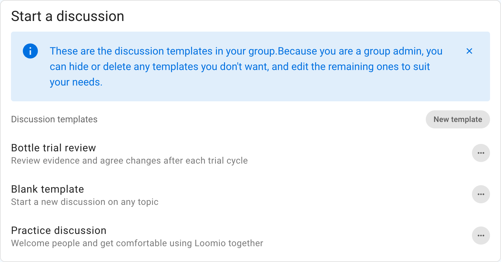
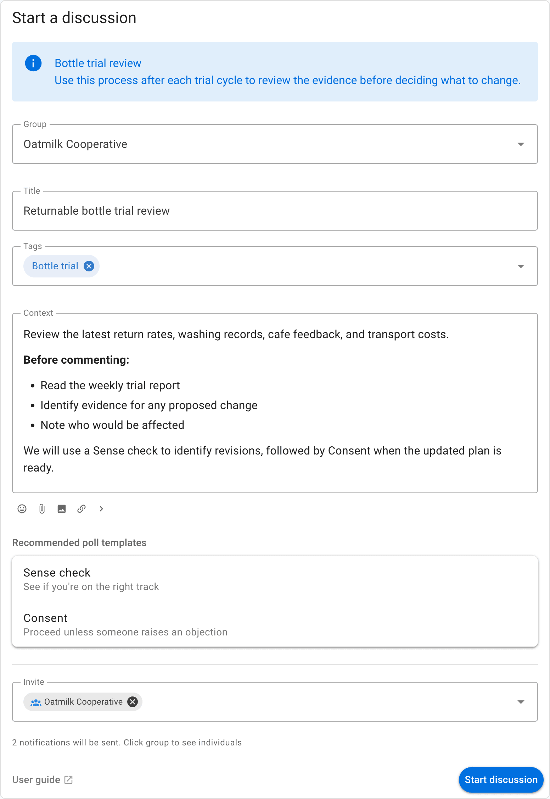
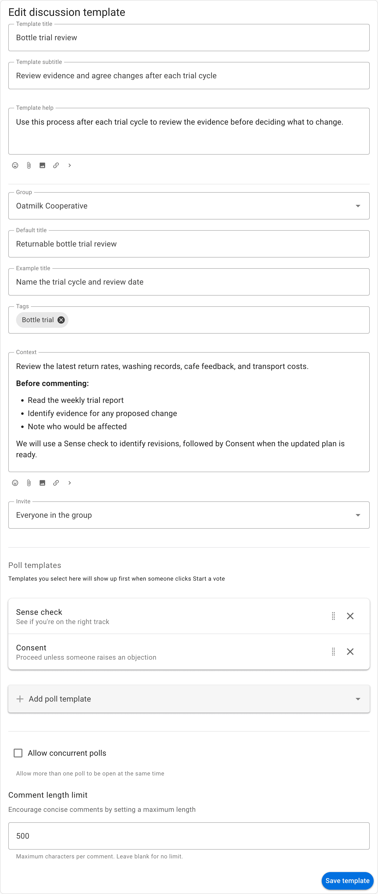

# Discussion templates

Discussion templates help your group start discussions the same way each time. A template can supply a title, context, tags, and instructions for the person starting the discussion. It also sets defaults, such as whether to notify the whole group and which polls to suggest.

Every new discussion in a group starts from a template. When someone selects **Start discussion**, Loomio shows the group's templates. Even **Blank template** is a template, so your group can change its defaults too.

Templates work well for processes your group repeats, such as project reviews, advice processes, meeting preparation, funding decisions, or document approvals. The person starting the discussion can still edit everything before they start it.

## How templates are used

1. A member selects **Start discussion** on the group page.
2. Loomio lists the group's visible templates. Each one shows its process name and subtitle.
3. The member selects a template. Loomio opens the new discussion form, filled in from the template.
4. The template's process introduction appears at the top of the form as guidance.
5. The member edits the title, context, tags, and invite list, then selects **Start discussion**.

Changing a template affects only discussions started after the change. Discussions already started from it keep their content and settings.

## Choose who is notified by default

The **Invite** setting controls who the new discussion form invites by default. It has two options:

- **Everyone in the group**: the group appears in the discussion form's **Invite** field, and every member is notified when the discussion starts.
- **None**: the **Invite** field starts empty. Nobody is notified unless the author adds people.

Loomio's built-in templates, including **Blank template**, use **Everyone in the group**. If your group does not want every new discussion to notify all members, edit the templates your group uses and set **Invite** to **None**.

The author can always change the invite list before starting the discussion. They can remove the group to notify nobody, or add specific people instead. This setting only affects notifications. Group members can still find and read the discussion in the group, whichever option you choose.

The group is added to the invite list only when the author is allowed to notify the whole group. Admins can always do this. Members can do it when **Members can notify everyone in the group** is enabled in the group's permissions.

## Template settings

Group admins can edit a template from the action menu beside it in the template list. The form has these settings:

- **Process name**: the short name shown in the template list.
- **Process subtitle**: one line explaining when to use the template.
- **Process introduction**: instructions shown at the top of the new discussion form. Use it to explain the process and link to resources. It is not part of the discussion.
- **Group**: whether the template starts a discussion in the group or a direct discussion. A direct discussion is visible only to the people invited to it.
- **Default title**: a title filled in for each new discussion. The author can edit it.
- **Example title**: an example shown in an empty title field. Use it when a default title would not fit every discussion.
- **Tags**: tags applied to each new discussion. The author can remove them.
- **Context**: the starting text of the discussion. Use headings, questions, or links to guide what people write.
- **Invite**: whether to invite everyone in the group by default. See [Choose who is notified by default](#choose-who-is-notified-by-default).
- **Poll templates**: polls suggested for this process. They are listed on the new discussion form. They also appear first when someone starts a poll in the discussion. They do not start automatically.
- **Allow concurrent polls**: whether more than one poll can be open in the discussion at the same time.
- **Comment length limit**: an optional maximum length for comments.

Use a default title only when it will stay accurate. Otherwise, write an example title that prompts the author to name the specific review, period, document, or decision.

## Example: bottle trial review

Oatmilk Cooperative reviews its returnable-bottle trial after each cycle. Its template has the process name "Bottle trial review" and a default title. It adds the "Bottle trial" tag. Its context asks members to read the weekly report and consider return rates, washing records, cafe feedback, and transport costs. It recommends a Sense check followed by Consent.

This works as a template because the purpose and evidence stay the same each cycle. Only the observations and decisions change.

## Create a template

Group admins can select **New template** from the template list. Choose an example from Loomio's gallery or start with a blank template, then adapt it and save it.

You can search or filter the gallery. An example is not added to your group until you save it.

## Manage the template list

When a group is created, Loomio adds a set of templates suited to the kind of group. Only **Blank template** and **Practice discussion** are visible at first. The others are hidden, and admins can unhide them.

Group admins can use the action menu beside a template to:

- edit its content and settings;
- hide it from the template list;
- unhide it from **Hidden templates**;
- rearrange the order of visible templates;
- export it as a JSON file; or
- delete it.

Hiding a template keeps it for later use. Deleting a template does not delete discussions started from it.

## Share templates between groups

Select **Export json** in a template's action menu to download it as a file. To use it in another group, select **New template**, then **Import json**. The form opens with the imported content so you can review it before saving.

Links to custom poll templates are not included in the file. Export and import those poll templates separately.

## Let members create templates

By default, only group admins can create and edit templates. An admin can enable **Members can create templates** under **Group settings** → **Permissions**.

When this is enabled, members can create discussion and poll templates and edit the templates they created. Admins can edit every template in the group. A member's template appears in the group's template list once it is saved, so agree on naming and review practices before enabling this permission.

## Templates for non-members

If **Non-members can start discussions** is enabled, people outside the group choose from the same template list. Their discussion form never invites the group by default. See [Collect private submissions](/en/user_manual/discussions/private_submissions).

## Related

- [Poll templates](/en/user_manual/polls/poll_templates)
