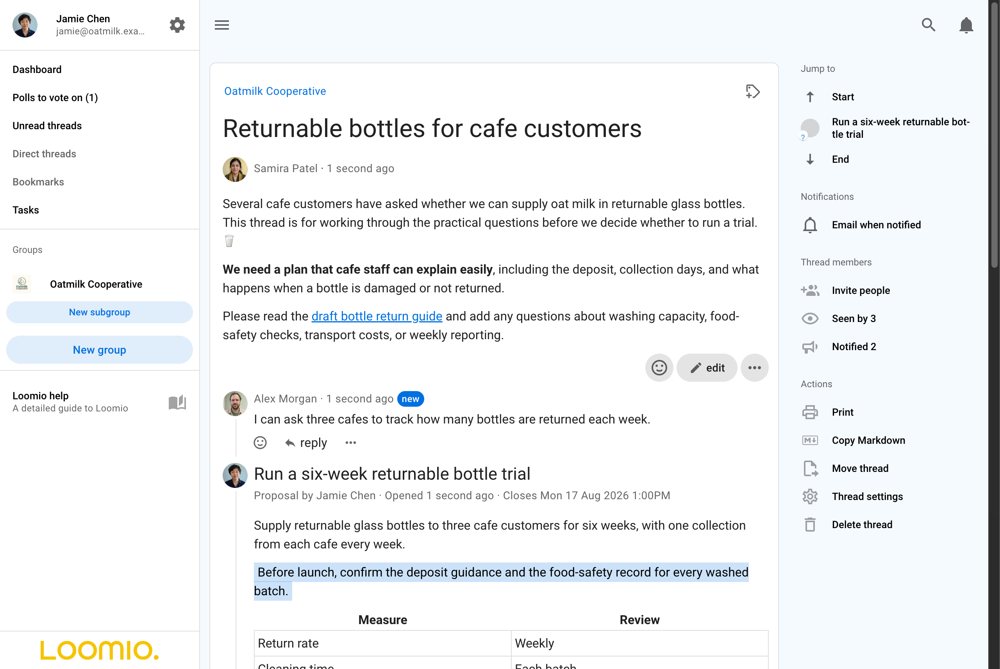
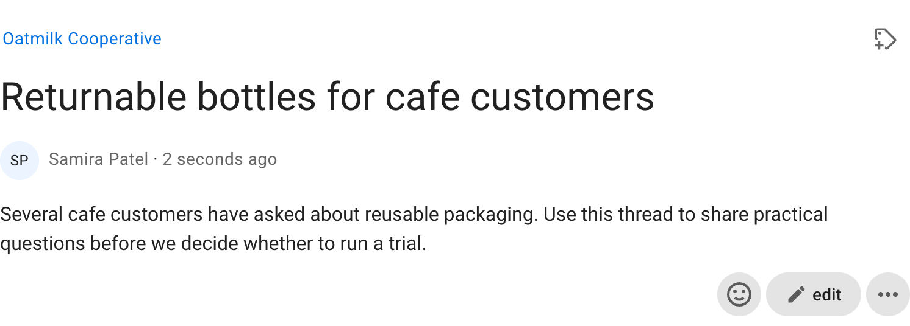
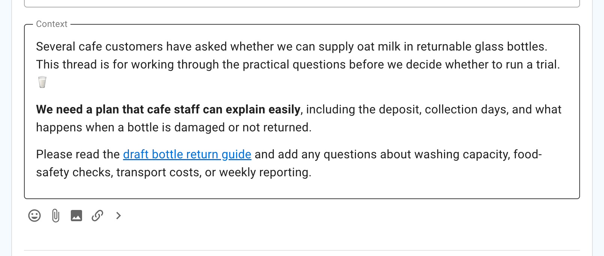
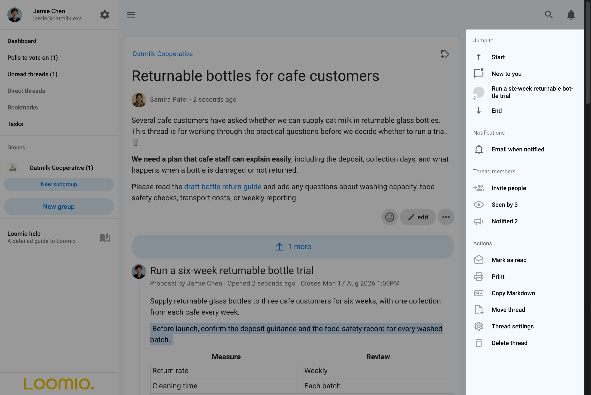
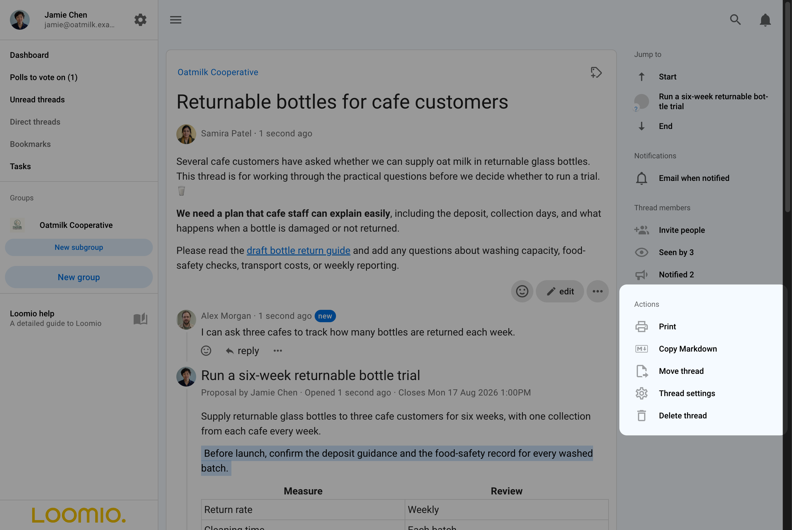
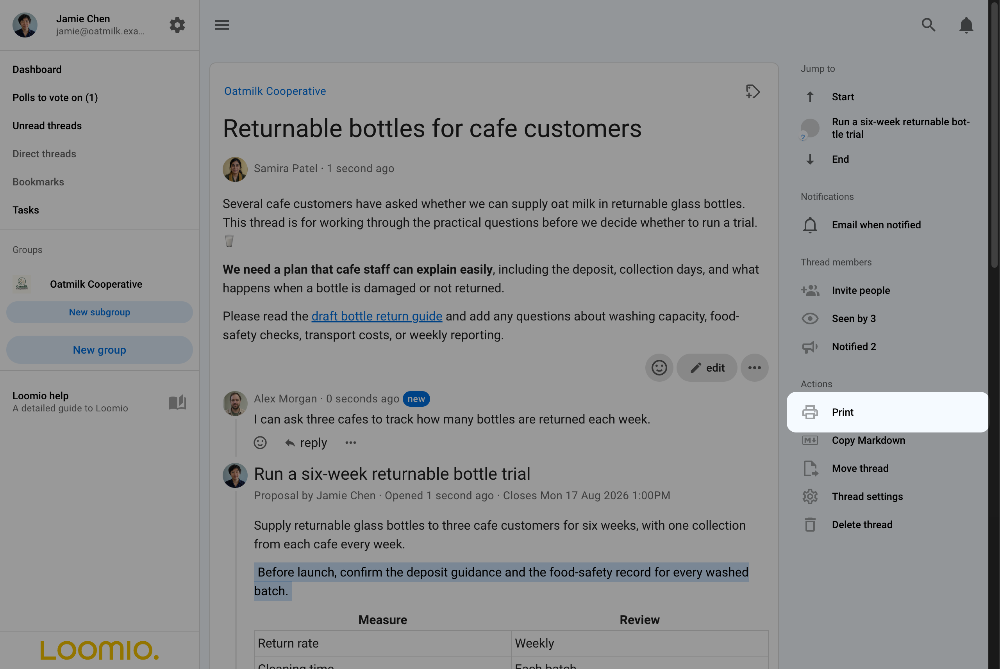
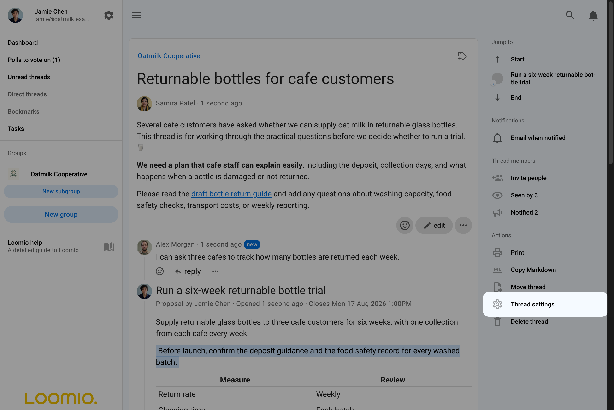
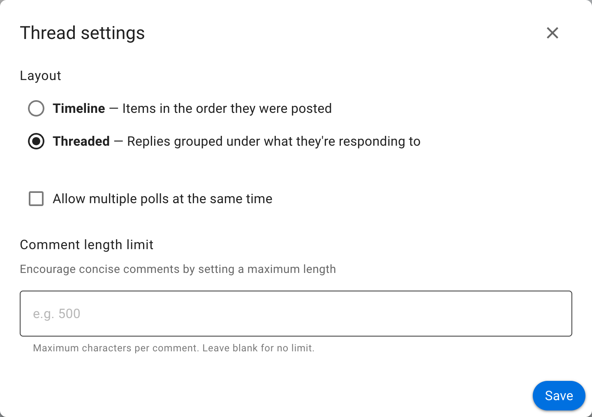

# Using threads

A discussion keeps its context, comments, decisions, and outcomes together in one thread. This page explains how to participate in a thread and use its navigation and actions.

## Thread anatomy

A typical thread looks like this:

From the top of the page, a thread contains:

**Group name** - At the top left of the discussion page is the name of the group or subgroup that the discussion belongs to.  Click on this name to go back to the group page.

**Discussion access** - The access icon at the top right opens the discussion's access settings. A group discussion is available to group members and anyone specifically invited to it, subject to the group's privacy settings.

**Discussion title** - The name of the discussion.

**Category tags** - The discussion may have one or more category tags. Using simple tags helps people more easily find discussions of a similar type.

**Discussion author** - The name and avatar of the person who started the discussion, shown beneath the title.

**Date** - Hover over the date to see the full date and time of discussion start.

**Seen by** - In the right sidebar, shows who has read the discussion and when.

**Notified** - In the right sidebar, shows who has been notified about the discussion and whether each notification has been read or its email opened.

**Discussion context** - Content to frame the discussion.

**Discussion interaction and administration tools** - The discussion context has controls to react to and edit it. The right sidebar contains notification, membership and administration actions.

**Comments** - Comments are displayed under the discussion context. The author's name, avatar and posting time show who wrote each comment and when. Interaction and administration tools are available on each comment.

**Navigation, notifications and actions** - The right sidebar contains
shortcuts to activity and milestones, notification and membership information,
and the thread actions available to you.

## Discussion context

The discussion **context** is always found at the top of the discussion. Use the context to frame the discussion or decision.

Think of your group as you write content in the discussion context.  Your aim is to get a discussion going, so consider how you can motivate people to participate.  In general, keep the discussion context simple and clear.

Write the discussion context when starting or editing a discussion. **Edit** a discussion with the pencil icon.

As the discussion progresses, update discussion context.  Think of the context like a whiteboard in your meeting room, where you can write the agenda, the outcomes intended and how you plan to get there.

At the bottom of the context panel is a formatting bar, where you can format text, attach files, images and embed a video.

### Notify people about context changes

When you edit the discussion context, use **What's changed?** to summarize the update and choose who should be notified.

The summary appears as an item in the thread so participants can see what changed.

## Navigation

The **Jump to** section of the right sidebar helps you move through a thread:

- **Start** goes to the discussion context
- **New to you** appears when the thread contains activity you have not read
- **Latest** appears when newer activity is available beyond the items currently loaded
- milestone links go directly to important comments, polls, and outcomes
- **End** goes to the latest item in the thread

Comments that include an H2 or H3 heading, polls, and proposals are automatically included as milestone links. Select any milestone to go directly to it.

When you add a comment, poll, vote, or outcome, Loomio marks your own new item as read. It will not appear as something new for you to review.

## Notifications and members

The right sidebar controls your email notifications and shows who has been invited, who has seen the thread, and who has been notified.

### Email notifications for this thread

Select the current notification setting to choose whether Loomio emails you about all activity, only activity that specifically notifies you, or no activity. Receiving email for all activity can produce many messages in an active thread.

### Invite people

Select **Invite people** to add people after the thread has started.

Select a group or subgroup, enter the names of individual members, or enter an email address to invite a guest.

A guest can see and participate in this thread but cannot see other discussions in the group unless separately invited.

To remove someone, open the three-dot menu (**⋯**) beside their name and select **Remove from discussion**.

### Seen by

**Seen by** shows who has opened the thread and when. It can help you identify people who may not have seen important information yet.

### Notified

**Notified** opens the discussion notification history. It includes invitations, mentions, and replies, showing who was notified and whether each notification has been read when that information is available.

## Actions

The right sidebar contains actions for the whole thread. Some actions are also available from the three-dot menu (**⋯**) beside a thread on the group page.

The actions shown depend on your permissions. Group admins can manage threads, and group settings may allow members to perform some management actions. See [Group permissions](/en/user_manual/groups/settings/#permissions).

### Print

Select **Print** to generate a page suitable for printing. Use your browser's print dialog to save it as a PDF.

### Copy Markdown

Select **Copy Markdown**, then **Copy thread**, to copy the complete thread as structured Markdown. You can paste it into a document, an AI assistant, or another tool that supports Markdown.

The copied document includes the discussion context, timestamps, replies, polls, visible results, vote reasons, and outcomes. Loomio applies the same visibility rules as the thread: results and vote reasons you cannot see are not included, and voters are not identified in anonymous polls.

### Thread settings and display

Group admins can select **Thread settings** to change how replies are arranged and configure other discussion options.

Choose **Timeline** to list items in the order they were posted, or **Threaded** to group replies beneath the item they respond to. Thread settings also control whether multiple polls may run at once and can set a maximum comment length. These settings apply to everyone in the discussion.

### Pin or unpin a thread

Pinned threads appear above other threads on the group page. Welcome discussions, news items, and announcements are typical uses for pinned threads.

Open the three-dot menu (**⋯**) beside the thread on the group page and select **Pin thread**. Pinned threads are ordered by the time they were pinned. To change their order, unpin and pin them again.

Select **Unpin thread** to return a thread to the activity-based order.

### Move a thread

Select **Move thread** to move a thread to another group, subgroup, or to a direct thread. It will be visible to members of the destination group and anyone specifically invited to it.

>[!Tip]
>Start a draft as a direct discussion or in a private subgroup, then move it to the group when it is ready.

To move selected activity rather than the whole thread, see [Moving items between threads](/en/user_manual/discussions/moving_items/).

### Lock or unlock a thread

Lock a thread to prevent comments or further changes. A thread can only be locked after its active polls have closed.

Select **Lock thread** under **Actions**. Locked threads are removed from the list of open discussions and marked with a **Locked** tag.

To find a locked thread, open the discussion filter on the group page and select **Locked**. Open the thread and select **Unlock thread** to allow comments and changes again.

### Delete a thread

Deleting a thread removes it permanently and cannot be undone. Lock the thread instead if you may need it again.

Select **Delete thread** and confirm the deletion.

