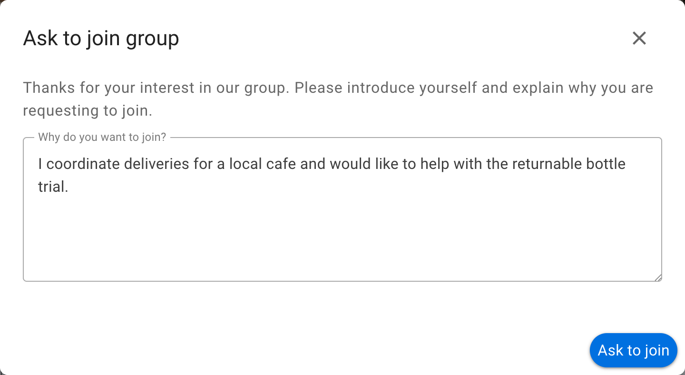
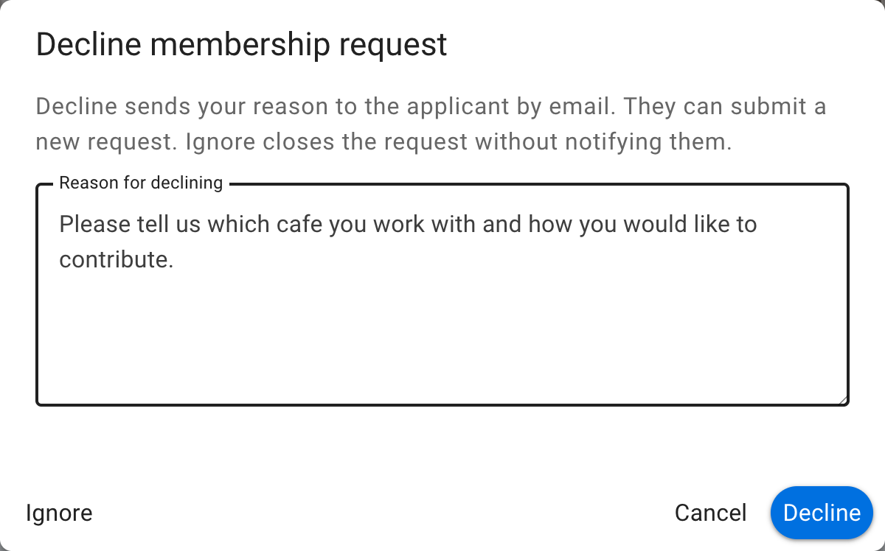

# Inviting people

Go to your group page and click the **Members** tab to access member management.

You can **Invite** particular people to your group with their email address or **Share** a link to your group via email, newsletter, chat or from your website.

## Send invitations via email

Click **Invite** on the **Members** tab to send an email containing a single-use invitation link. The recipient can create a Loomio user account and join your group.

If the recipient already has a Loomio user account they can still accept the invitation to join your group with their existing account.

### Invite many at once

You can send invitations by email to up to 100 people at a time by entering (or copy/pasting) multiple email addresses into the "Who would you like to invite" box. Separate email addresses by comma or space.

When inviting people to a group within an organization, the parent group and related subgroups you belong to appear as audience suggestions. Select a group, then select its chip to expand the audience into individual people. You can remove anyone you do not want to invite before sending the invitations. People who already belong to the destination group are excluded.

>[!Tip]
>Copy email addresses from a column in a Google or Excel spreadsheet, and paste into the invitation box.

When you click **Invite** an email will be sent to each of the email addresses you supplied, containing a unique invitation link that can only be used once. This email will be sent in your current language.

### Invite people to Subgroups

Following the same process as above, you can invite people to a 'parent' group, and one or more subgroups simultaneously when you invite them with the **Invite people** button. Tick the boxes next to the subgroups you want them to immediately be a part of when they join the group.

## Share a link to your group

You can share a link to your group with the **Share** button. This is useful if you want to send a link via email, newsletter, chat or post on your website.

Click on the "copy" icon to copy the link to your clipboard, then paste in your email, newsletter or chat channel.

If you want to stop people from joining via this link, click "Reset this link". The existing link will no longer work and a new link will be created.

## Request to join group

People can request to join an Open or Closed group. Share the group URL, such as `https://www.loomio.com/group-name`. When people arrive at the group page, they can see the public group information and select **Join group** to answer the joining prompt and send their request.

The joining prompt gives people a chance to introduce themselves and explain why they want to join.

Under [Group privacy](/en/user_manual/groups/settings/privacy#how-people-join), choose **Request approval** to require requests to be reviewed. You can also customize the joining prompt in the group settings.

### Review membership requests

Group administrators and members with permission to add members review requests from the **Membership requests** section of the **Members** tab. A reviewer can:

- **Approve** the request to add the applicant as a member and notify them.
- **Ignore** the request to close it without notifying the applicant or allowing another request.
- **Decline** the request with a message explaining the decision. Loomio sends the message to the applicant by email and notification, and they can submit a new request.

Select the decline button to write a message or ignore the request.

## Managing invitations

To manage invitations, open the filter/ drop down from the Members tab of your Group page and select **Invitations**. You can manage individual invitations by clicking the three dot menu (**⋮**) to the right of the member.

You can also make people administrators or set their title (e.g. "IT Support") within the group before they accept their invitation.

### Re-send invitations

Follow up on people who don't make it into the group and give them a nudge. If someone has lost or forgotten about their invitation email, you can re-send it from the dropdown menu beside their name on the Members page.

Click on the three dots (**⋮**) next to the person you want to resend the invitation to, and then choose **Resend invitation**.

### Cancelling invitations
If you entered the wrong email address, or have changed your mind about inviting someone, you can cancel an invitation from the Members tab on your Group page. Select **Cancel Invitation** from the drop down menu to the right of the member invitation (**⋮**).

