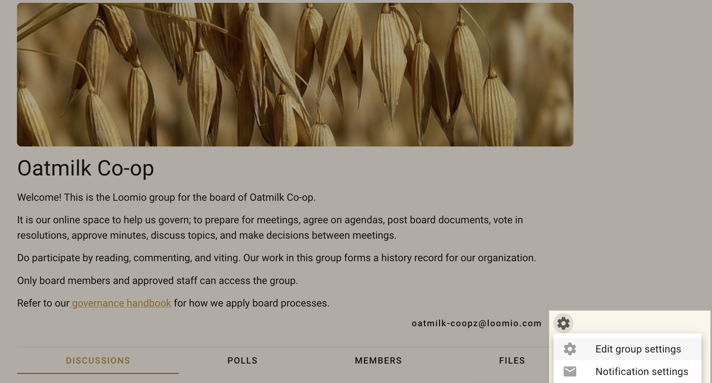
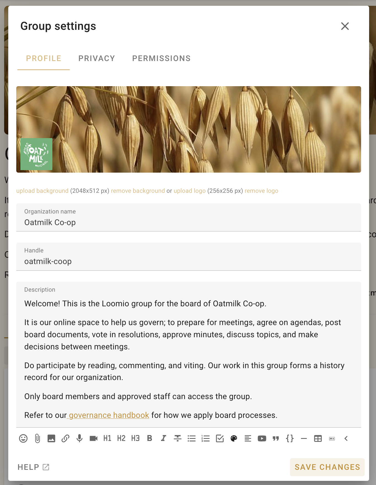
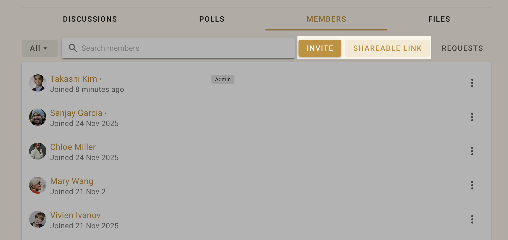
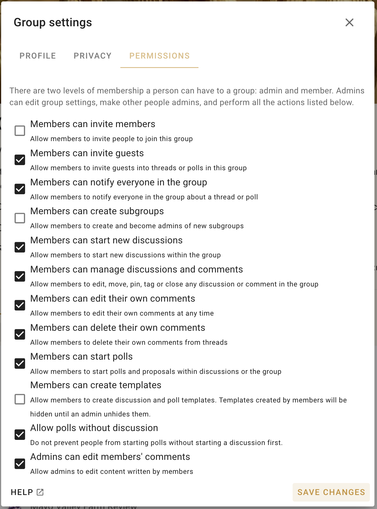

# Group Settings

In group settings you can change the group profile, the groups visibility and methods of joining, and what members are able to do within Loomio. Only people who are 'admin' can see and edit group settings.

On your group page, click the **Edit group settings** cogwheel icon to open the settings form. 

## Group Profile
The profile tab determines the name, description, and appearance of your group on Loomio.

### Upload a group photo
You can upload a group photo and logo by clicking either of their images in the settings form.  The logo will appear alongside your group name in the sidebar menu.

The ideal pixel resolution for the group image is 2048 x 512. But any image with aspect ratio of 4:1 will fit. 

### Change group name
You can edit the name for your organization or group. We recommend short names, particularly if you plan to use subgroups.

###  Change Handle
When you start a group, a handle is automatically created. The handle provides a simplified url for your group, structured as **loomio.com/your-group-handle**, for easy sharing.  Your handle can be edited in these settings.

### Add group description
The group description will show on the main dashboard. It is a good place to write an invitation and context for the group, .e.g., what you will use loomio for, why the work is important, who is invited into this work, and how to participate.

You can richly format the text as well as attach documents, hyperlinks, and videos.

## Privacy

The privacy tab lets you determine who can find your group, who can see the discussions in your group, and how people join.

The recommended privacy setting for new groups is **Secret**. This means everything is private to those invited members of the group. No one will know about this group (or subgroup) unless you invite them.

If you want the content of your discussions and decisions to be public and accessible by anyone on the internet, change your group privacy to **Open**. The members list will only be visible to other members.

Many groups use **Closed** to allow people to find the group and request to join. The **Name** and **Group description** are publicly accessible in Closed groups, but all threads are private.

Open groups may contain secret and closed subgroups.

A member of an open group can see that a closed subgroup exists, but not secret subgroups.

If you set your group privacy to **Open** or **Closed**,  additional settings appear to determine how people can find and join the group.

### Finding the group

You can choose to list your group in Loomio's global directory, viewable at [loomio.com/explore](https://loomio.com/explore).  Anyone visiting this page can search for and discover your group.

### Joining the group

You can choose to either let anyone join (pending approval)  or have membership be invite only. 

If membership is open to anyone, then a 'join group' button will show on your group page for new visitors. Clicking this will send a membership request to the group admins for approval. 

If membership is invite only, then new members are added through the 'Members' tab on the dashboard by users with appropriate permissions. New members can be invited either by their email address or by sending them an invite link.

## Permissions

There are two levels of membership a person can have to a group: admin and member. 

Admins can edit group settings, make other people admins, and perform all the actions listed in the permissions tab of your group settings.

Consider carefully each of these permissions and how they apply to your group.  In general groups with trusted members experienced with Loomio will have most settings ticked. However for most new groups, communities and larger networks, where people are less familiar with Loomio, you may want to restrict permissions to keep everyone safe.  You can always open permissions as confidence and experience of the group increases.  

Contact us if you have questions about the best permission settings for your group.

