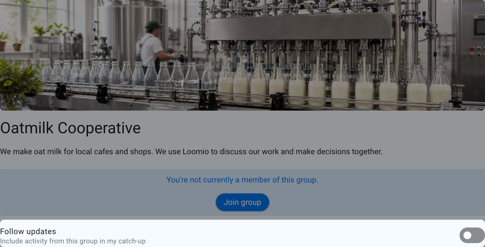

# Group privacy

Privacy controls who can find a group and who can read its content. Open **Edit group settings** from the group page, then select **Privacy**.

Changing privacy can expose or hide existing group content, not only content created afterward. Choose the most restrictive setting that still supports the group's purpose.

## Open

Open groups are public spaces. Anyone can find the group and read its discussions, polls, and files. The member list remains visible only to members.

Open groups can allow people to join immediately, require approval, or remain invitation only.

### Follow an Open group

People can stay up to date with an Open group without joining. Following adds unread group activity to their catch-up email so they can review it in their own time. Followers do not become members, receive member voting rights, or receive immediate notifications just because they follow the group.

Turn on **Follow updates** on the group page to include its unread discussions, comments, polls, and other thread activity in your catch-up. Turn the setting off to stop including the group.

## Closed

Anyone can find a Closed group and read its name and description. Discussions, polls, files, and the member list are private to members and invited guests.

Closed groups can let people request membership or remain invitation only. They cannot let people join immediately without approval.

A Closed subgroup of a parent group can optionally allow members of the parent group to read its discussions without joining the subgroup.

## Secret

Secret groups and their content are visible only to people who have been invited or added. Membership is invitation only. Secret groups do not appear in the public group directory.

## How people join

Privacy determines which joining options are available:

| Group privacy | Available joining options |
| --- | --- |
| **Open** | Anyone can join, request approval, or invitation only |
| **Closed** | Request approval or invitation only |
| **Secret** | Invitation only |

When approval is required, people select **Join group**, answer the group's joining prompt, and send a request to join. See [Inviting people](/en/user_manual/groups/inviting_people#request-to-join-group) for instructions on configuring the prompt, reviewing requests, and inviting people directly.

## Group directory

Open and Closed parent groups can be listed in the public group directory so people can discover them. Directory listing does not change who can read group content or become a member. Subgroups and Secret groups cannot be listed.
