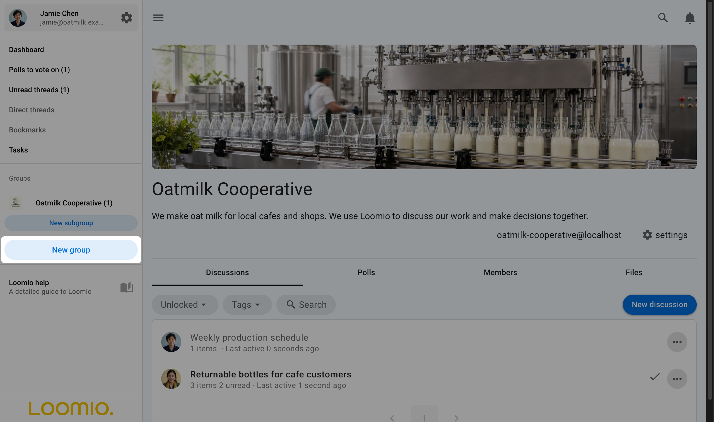

# Starting a new group

If you are new to Loomio, you can start a group on a free trial at any time from the [Loomio website](https://www.loomio.com/). If you already use Loomio and would like to start a new group for another organization or purpose, you can do this from the sidebar menu - click on **New group**.

For many organizations, a single Loomio group is sufficient. You can start as many subgroups as you need within the group. See [Subgroups](/en/user_manual/groups/subgroups/) for more info.

## Group details

### Group name

Type your group name. It's best to keep your group name short and concise.

### Group handle

Your group is automatically assigned a handle. The handle is used in the group's URL and email address, such as **loomio.com/your-group-handle** and **your-group-handle@loomio.com**.

You can edit the handle when you create the group and change it later in group settings. When you change it, links and email addresses that use the old handle continue to work. Loomio keeps up to three old handles; after that, the oldest handle expires.

### Group description

This short description will show at the top of the dashboard, to offer any necessary context for new members.

**When you click 'Start Group' your new group is automatically created!**

---
