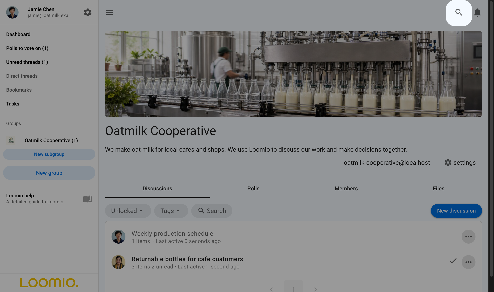
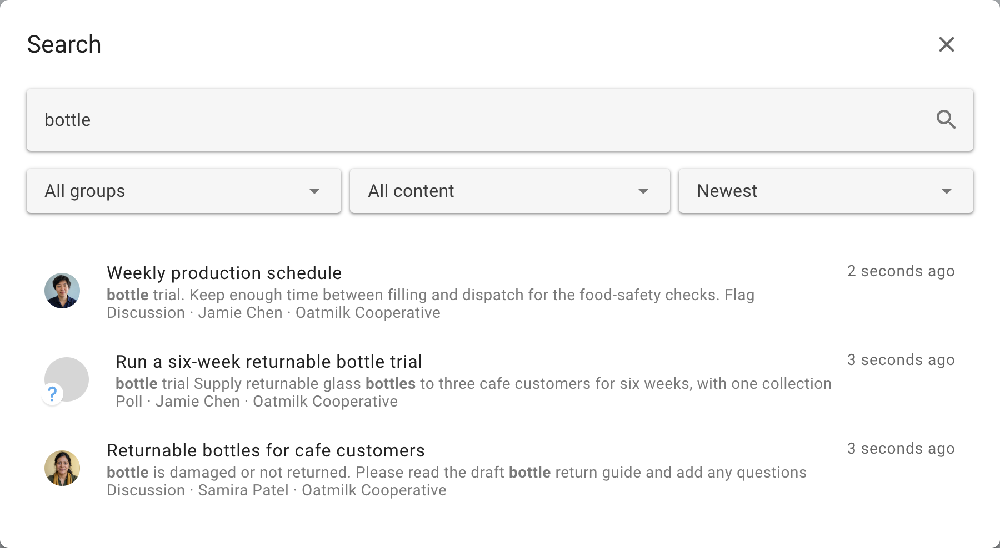
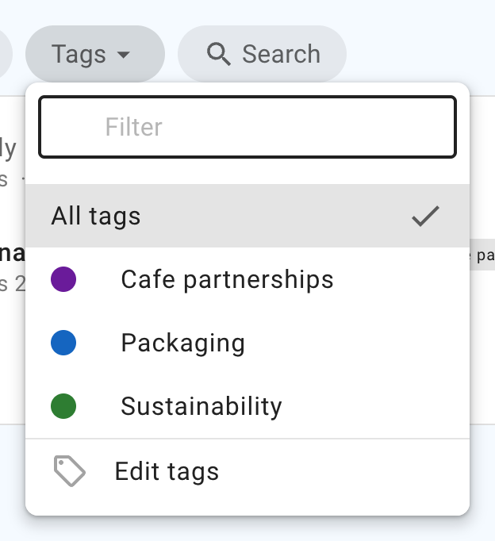

# Finding content

Loomio provides several ways to find discussions and decisions across your groups.

## Search

The Search button in the top navigation bar opens global search from any page in Loomio.

Search includes content you can access across all your groups and direct discussions. It can find discussion titles and context, comments, polls, votes, and outcomes.

Enter a word or phrase, then press Enter or select the search icon. For example, searching for **bottle** finds Oatmilk Cooperative content containing that word.

### Search tips

- Start with one or two distinctive words from the title or content you remember.
- Search matches the beginning of a word, so a partial word such as **bott** can match **bottle**. It does not match misspellings or similar-sounding words.
- Use the filters to limit results to an organization, subgroup, tag, or content type such as comments or polls.
- Sort by **Best match** when relevance matters, or by newest or oldest when you know roughly when the content was posted.

## Filter discussions

Use the controls beside Search to filter discussions by open or closed status or by category tag. Combining a search term with a filter can narrow a long discussion list quickly.

## Category tags

Tags group related discussions and polls under names chosen by your group, such as a project, team, or area of work.

Select a tag on the **Discussions** tab to show matching discussions. People with permission to start or edit discussions can apply tags. See [Category tags](/en/user_manual/discussions/tags) for setup and permission details.

## Unread discussions

Select **Unread discussions** in the sidebar to see discussions with activity you have not read. Within a discussion, the timeline helps you move to unread items and important events.

## Polls awaiting your vote

Select **Polls to vote on** in the sidebar to see active polls where you have been invited but have not yet voted. You can also open a group's **Polls** tab to see its active and closed polls.

## Bookmarks

Bookmark a discussion, comment, poll, vote, or outcome when you want to return to it. Open **Bookmarks** from your user menu to see everything you have saved. See [Bookmarks](/en/user_manual/users/bookmarks) for details.
