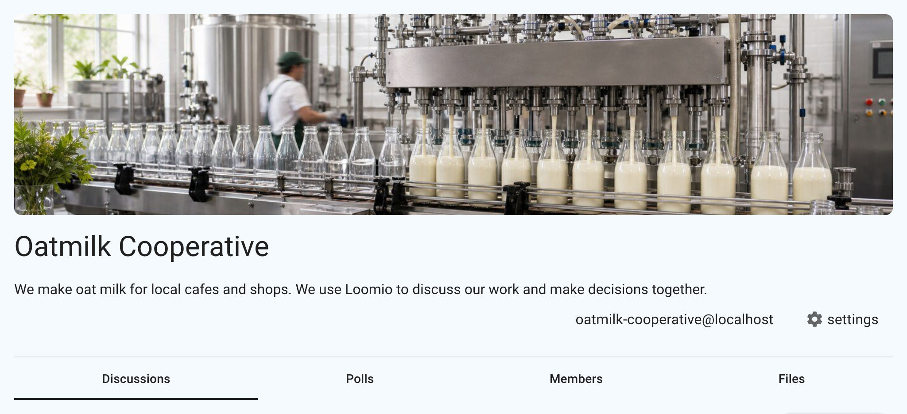
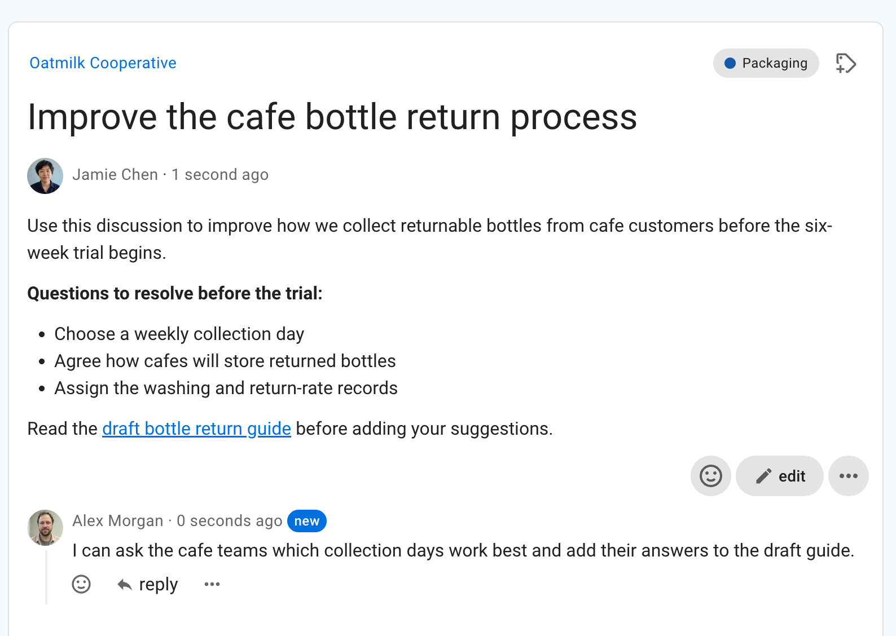
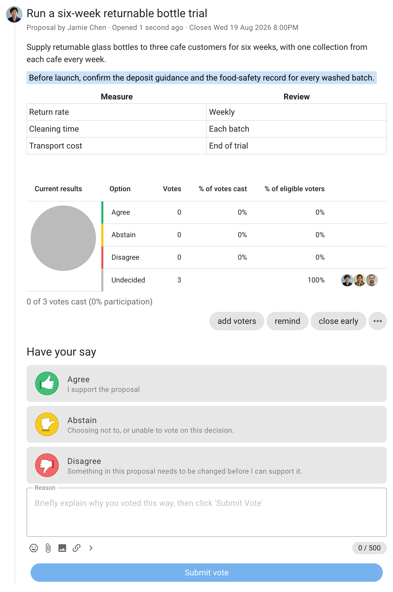

# Getting started

Loomio is a discussion and decision making tool for collaborative organizations.

It enables you to bring people together to discuss topics, explore proposals and make decisions.

<iframe width="660" height="415" src="https://www.youtube-nocookie.com/embed/K8ZRNtlRvAI" title="Loomio in 2 minutes" frameborder="0" allow="accelerometer; autoplay; clipboard-write; encrypted-media; gyroscope; picture-in-picture" allowfullscreen></iframe>

## How Loomio works

Loomio has three main parts: groups, discussions, and polls.

### Groups

A group is a place for an organization, team, or community to work together. Its home page explains the group's purpose and provides access to its discussions, polls, members, and files.

### Discussions

Discussions keep the information and conversation about a topic together. People can share context, comment, reply, react, and use polls to move the discussion towards an outcome.

Over time, discussions create a searchable record of the information considered and the decisions made by your group.

### Polls and proposals

Polls help a group understand preferences, gather advice, and make decisions. Different poll templates support different processes. A proposal asks people to respond to a suggested course of action and explain the reason for their response.

Polls can be part of a discussion or run independently from the **Polls** tab on a group page.

To learn where these parts appear in the interface, see the [Quick tour](/en/user_manual/overview/orientation). To start contributing, see [How to participate](/en/user_manual/overview/how-to-participate).

## Try it out

The best way to learn about Loomio is to [start a free trial](/try)

## How people use Loomio

**Member organizations** to involve members in decisions at scale. Political parties, consumer and worker co-operatives, and membership associations use Loomio to facilitate a safe, inclusive space for members to share information and raise topics, participate in important decisions and vote in General Assembly. Streamline decision processes, improve transparency and accountability, document discussions and record decisions, and include members' voices to organize for action.

**Self-managing organizations** to involve staff in decisions. Self-managing teams, worker co-operatives, and sociocratic organisations use Loomio to run consent, consensus, and advice-based decision processes across distributed teams and time zones. Tap into collective intelligence, distribute decision making, build governance and policy together, and document decisions and discussion.

**Boards, councils, and distributed networks** to involve stakeholders in decisions. Create a safe space for discussion, keep track of communications, and coordinate across geographies and time zones. Structure decision making processes, improve agility and response times, and preserve organizational memory.

**Residential communities and co-ops** to make decisions together as neighbours. Cohousing communities, ecovillages, coliving cooperatives, housing co-ops, and land trusts use Loomio to replace or augment traditional strata and property management with democratic governance. Residents shape decisions about shared land, common spaces, and community agreements, and asynchronous discussion means members can fully participate whether they're on-site or away travelling, keeping a clear record of how the community has chosen to live together.

Loomio builds a living record of your organization; the decisions made, who was involved and the discussion leading up to the decision.
