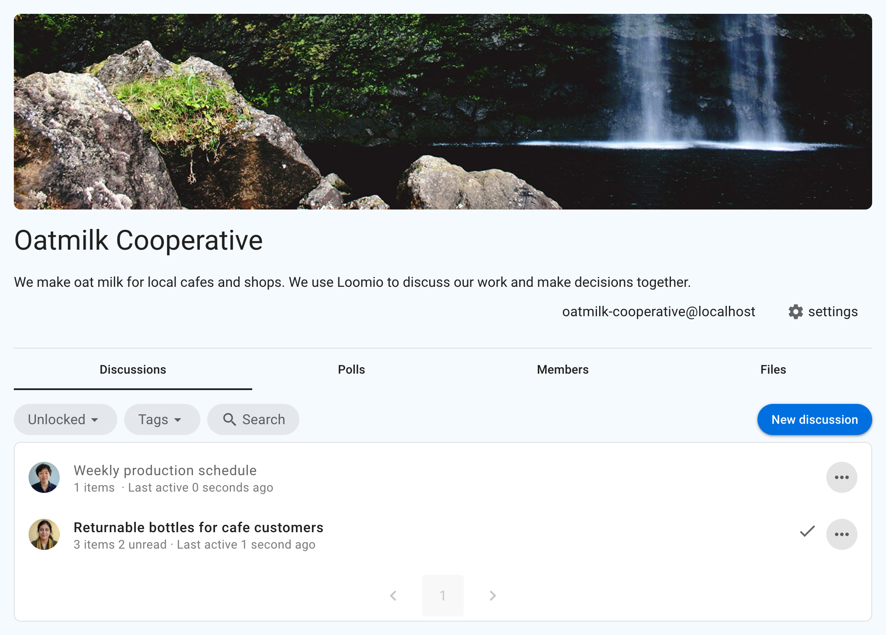
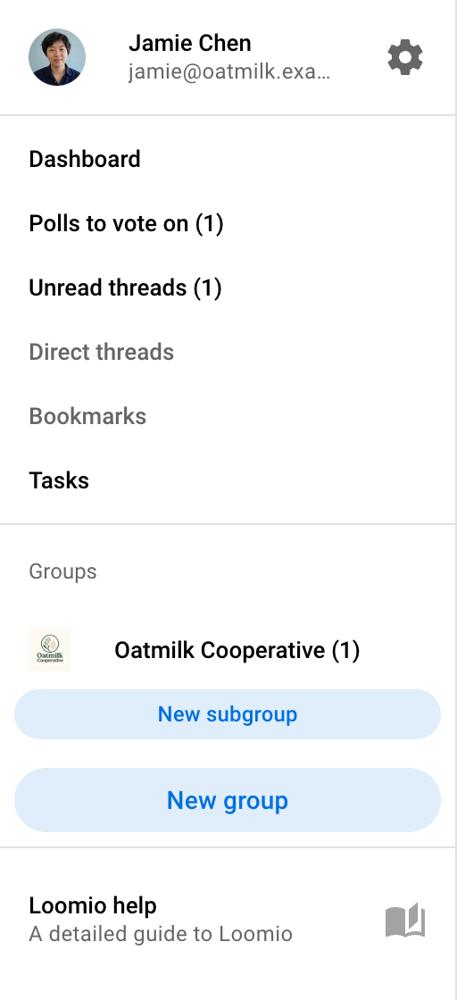
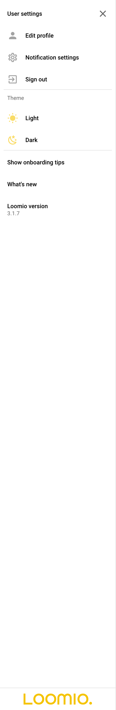
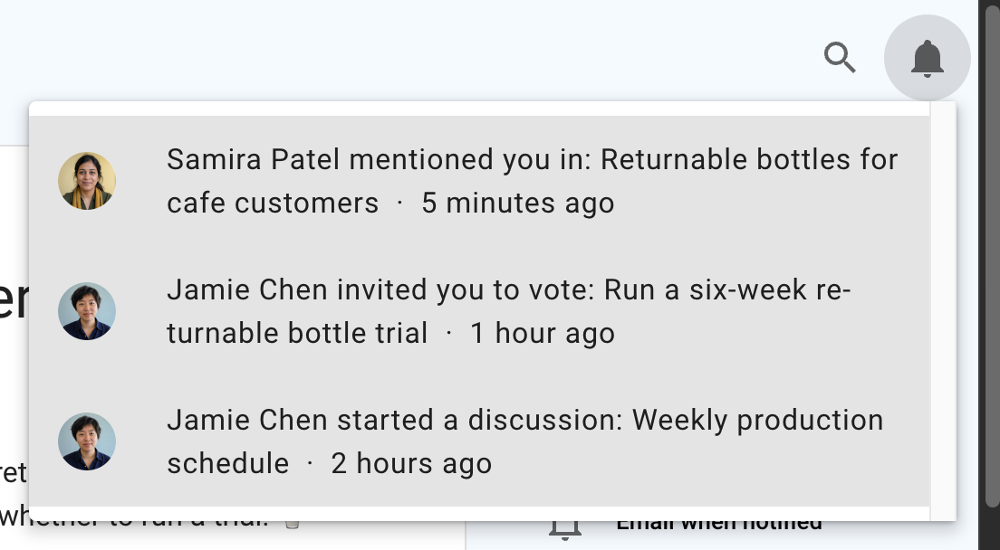

# Getting around Loomio

This page introduces the main parts of the Loomio interface and where to find the work that involves you.

## Group page

Your group home page introduces the group and provides access to its work.

### Tabs

The tabs under the group description provide access to:

**Discussions** - The group's discussion threads and recent activity.

**Polls** - A list of polls active in your group.

**Members** - The people who belong to the group.

**Files** - Documents and other files attached throughout the group. The tab collects files from discussion contexts, comments, proposals, and polls, so you can find a document without remembering where it was attached.

See [Finding content](/en/user_manual/overview/finding-content) for help with search, filters, tags, bookmarks, and unread discussions.

## Sidebar

Open the sidebar with the menu button (**☰**) at the top left.

Use the sidebar to open your dashboard, polls awaiting your vote, unread and direct discussions, tasks, and groups. It also links to the user manual and support.

### User settings

Select your name in the sidebar to open your user menu.

Use this menu to edit your profile, change notification settings, choose a theme, manage account settings, and sign out.

## Notifications

The bell button at the top right opens your in-app notifications. A badge appears when you have notifications you have not viewed.

See [Notifications](/en/user_manual/users/email_settings) to learn about in-app notifications, email preferences, and notification settings for groups and discussions.

## What to do next

- Read [How to participate](/en/user_manual/overview/how-to-participate) to learn how to comment, reply, react, and vote.
- Read [Finding content](/en/user_manual/overview/finding-content) to learn how to locate discussions and decisions.
- Visit [Discussions](/en/user_manual/discussions) or [Proposals and polls](/en/user_manual/polls/intro_to_decisions) for detailed guidance.
