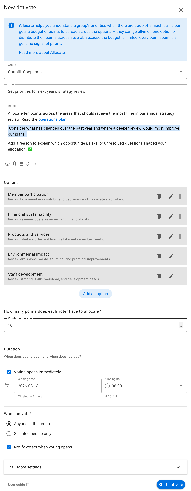
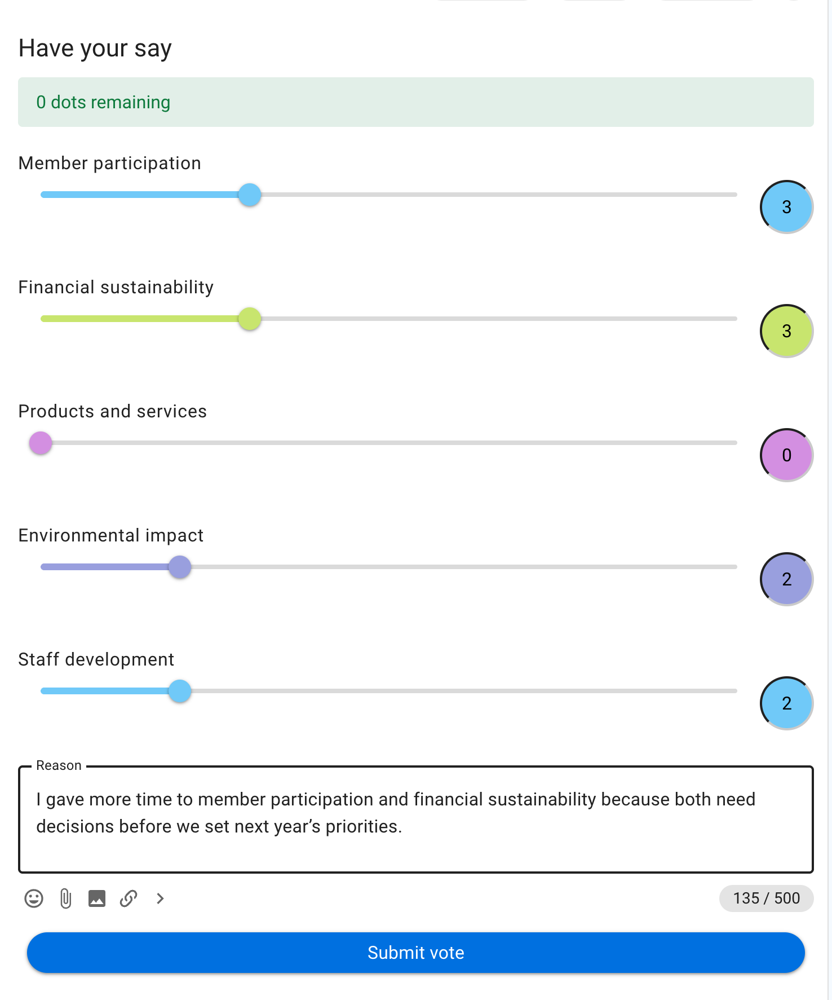
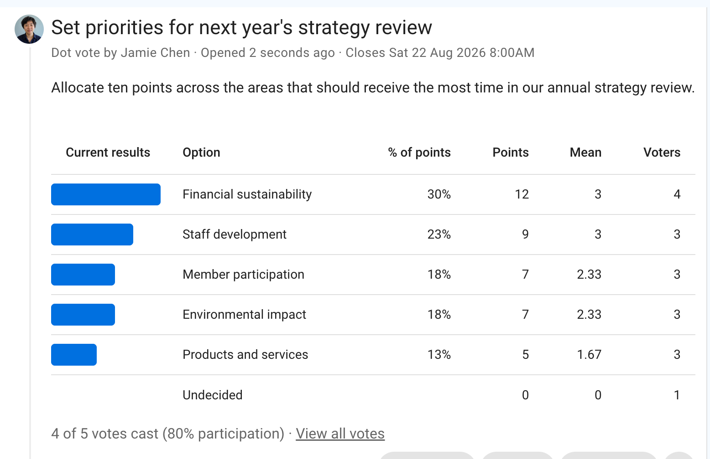

# Allocate

Allocate, sometimes known as a dot vote, reveals priorities when there are trade-offs. Each participant receives a fixed budget of points and distributes it across the options. Giving more to one option leaves fewer points for the others.

## When to use Allocate

Use Allocate when time, money, attention, or another resource is limited. It works well for:

- prioritizing work for the next planning period;
- dividing a participatory budget between projects;
- choosing how much agenda time to give several topics;
- distributing a fixed number of volunteer hours; or
- identifying which improvements matter most to members.

The points express relative priority, not an amount that Loomio will automatically assign. Use [Score](/en/user_manual/polls/score/) when every option can receive a high rating without reducing support for another.

## Example: set priorities for an annual strategy review

Oatmilk Cooperative is planning its annual strategy review. It asks members which areas should receive the most time and attention during the review. Each member receives ten points to allocate across five areas. This shows the group's relative priorities while requiring participants to make trade-offs.

## Set up the poll

Describe the decision and what the points represent. Add options at a similar level of scope, then set **Points per person**. In this example, each voter receives ten points to indicate how much review time each strategic area should receive.

A very large budget can create false precision. A useful budget is usually large enough to show differences but small enough to require choices. Make clear whether concentrating all points on one option is acceptable.

## Vote

Participants move the sliders to distribute their budget. Loomio shows how many points remain and prevents submission until the allocation is valid.

In this example, the voter assigns three points each to **Member participation** and **Financial sustainability**, two each to **Environmental impact** and **Staff development**, and none to **Products and services**. A zero does not necessarily mean an area has no value; it means the voter used their limited points elsewhere.

## Read the results

The results order options by the total points received. They also show:

- **% of points**: the option's share of all allocated points;
- **Points**: the total points allocated;
- **Mean**: the average among voters who gave the option points; and
- **Voters**: how many people gave the option at least one point.

In this example, **Financial sustainability** receives the most points, followed by **Staff development**. Financial sustainability receives points from every voter, suggesting broad agreement that it needs substantial review time. Read the totals alongside the number of voters to distinguish broad priorities from areas strongly supported by fewer people.

Read the totals together with the number of voters and their reasons. Publish an outcome explaining how the strategy review will be structured; the poll does not assign time automatically.
