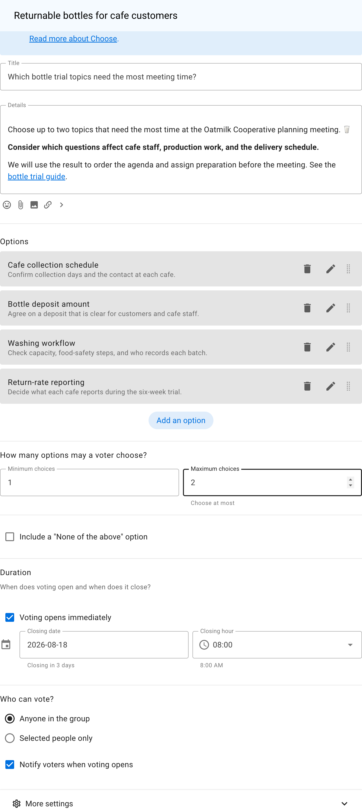
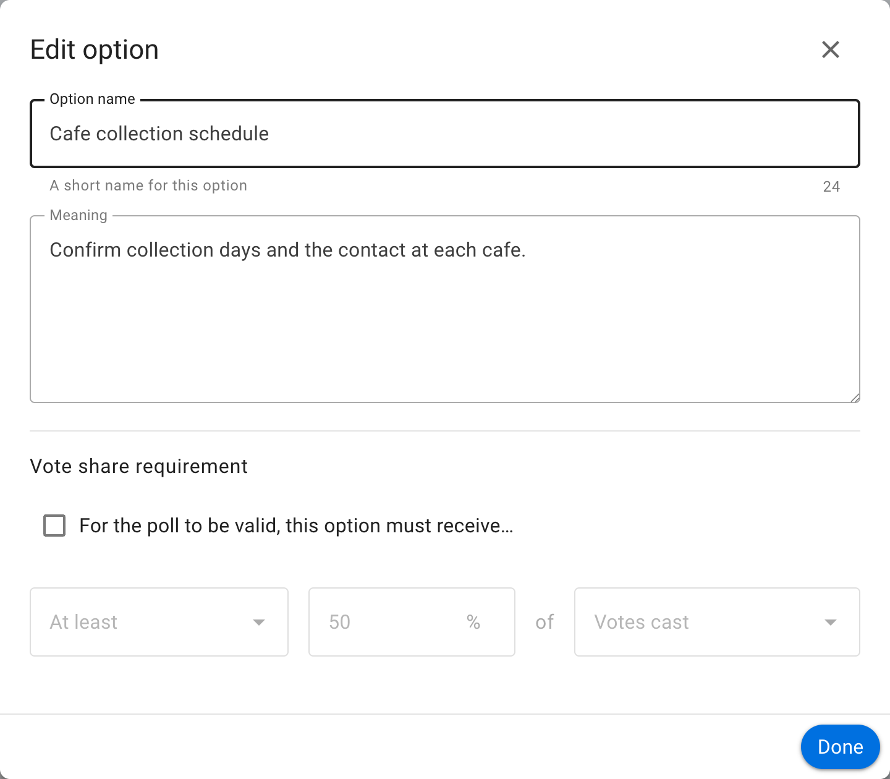
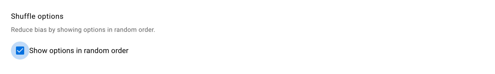
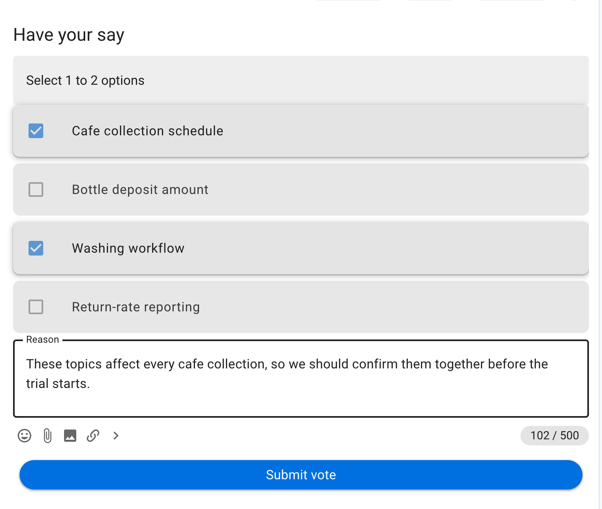
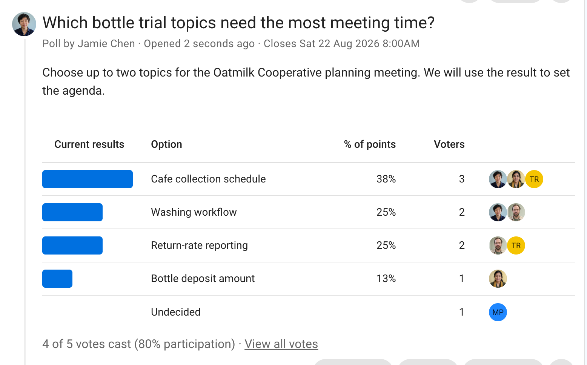
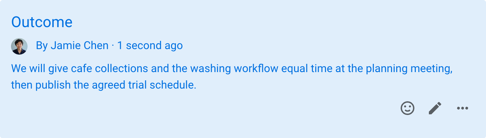

# Choose

Choose is a simple poll for finding the most popular option or making a shortlist. Participants select one or more options, depending on the limits you set. This voting method is commonly known as multiple choice.

## When to use Choose

Use Choose when the options are distinct and you need to count how many people select each one. It works well for:

- choosing one venue from a shortlist;
- selecting up to three topics for an agenda;
- deciding which design should proceed to the next round; or
- checking which services members intend to use.

Choose records selections, not the strength or order of a person's preferences. Use [Score](/en/user_manual/polls/score/) to measure how strongly people support every option, [Allocate](/en/user_manual/polls/allocate/) when there is a limited budget, or [Rank](/en/user_manual/polls/rank/) when preference order matters.

## Example: set a planning-meeting agenda

Oatmilk Cooperative needs to decide which parts of a returnable-bottle trial need the most time at its next planning meeting. The poll asks each person to choose up to two topics. Its details explain how the result will be used, and each option includes enough information to distinguish it from the others.

## Set up the poll

Give the poll a specific question as its title. In **Details**, explain what participants should consider and what will happen with the result. Add each available option, then set the **Minimum choices** and **Maximum choices**.

Set both limits to 1 when participants must choose exactly one option. Set a higher maximum when you want a shortlist. Avoid allowing so many choices that participants can select nearly every option, because that makes the result less useful.

Use the pencil icon beside an option to add a meaning or further explanation. This is useful when a short option name could be interpreted in different ways.

Under **More settings**, **Show options in random order** can reduce the effect of always presenting one option first.

## Vote

The vote form tells participants how many options they may select. In this example, the voter selects **Cafe collection schedule** and **Washing workflow**, then gives a reason connecting those choices to the trial.

A reason can reveal why an option matters and what work participants expect it to cover. If reasons are important to the decision, configure the vote-reason setting before starting the poll.

## Read the results

The results show the share of all selections received by each option, the number of voters who selected it, and who has not voted. Because each person could choose two options, the percentages describe selections rather than a percentage of people.

In this example, **Cafe collection schedule** has three selections. **Washing workflow** and **Return-rate reporting** each have two. The result supports giving cafe collections the most agenda time, but the tied topics still require the organizer to decide how the remaining time is divided.

When the poll closes, publish an **Outcome** explaining what the group will do with the result.

