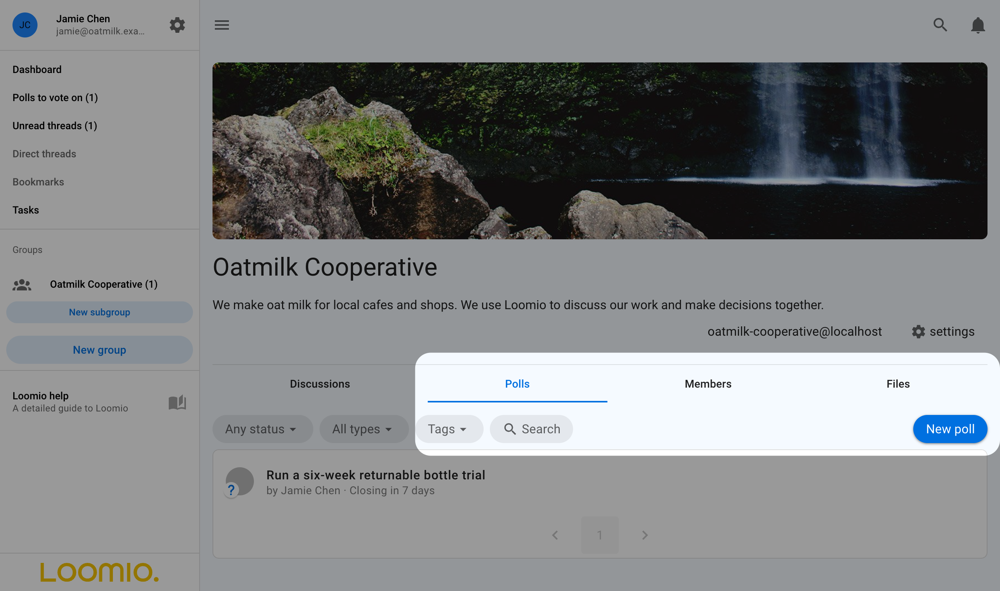

# Proposals and polls

Proposals and polls collect structured responses from a group. They can help test an idea, make a decision, identify priorities, schedule a meeting, or elect representatives.

## Find the right help

These parts of the manual answer different questions:

| If you want to… | Read… |
|---|---|
| Choose what participants should express | [Proposals](../proposals/) or [Polls](../proposal_types/) |
| Run a specific proposal template | [Sense check](../proposals/sense_check/), [Advice](../proposals/advice/), [Consent](../proposals/consent/), or [Consensus](../proposals/consensus/) |
| Configure the templates available to a group | [Poll templates](../poll_templates/) |
| Facilitate a decision from discussion to outcome | [Making decisions](/en/guides/making_decisions/) |

A **voting method** defines how people respond and how results are calculated. A **poll template** is a reusable configuration built on a voting method, with preset instructions, options, and settings. A **decision process** may use a discussion and several templates before the group reaches an outcome.

## Proposals

A proposal asks people to respond to a statement or course of action. Loomio includes templates for common purposes:

- [Sense check](../proposals/sense_check/) gathers early reactions;
- [Advice](../proposals/advice/) gathers input for a decision maker;
- [Consent](../proposals/consent/) tests for meaningful objections; and
- [Consensus](../proposals/consensus/) seeks collective agreement.

See [Proposals](../proposals/) to compare them.

## Polls

Use a poll when participants need to select, score, allocate, rank, state their availability, or cast an election ballot:

- [Choose](../choose/) finds popular options;
- [Score](../score/) evaluates every option on a scale;
- [Allocate](../allocate/) distributes a limited budget of points;
- [Rank](../rank/) finds an overall order of preference;
- [Time poll](../meeting_polls/) finds when people are available; and
- [STV Election](../stv/) elects multiple winners proportionally.

See [Polls](../proposal_types/) to compare them.

## Start a proposal or poll

### Choose whether to use a discussion

Start the proposal or poll inside a discussion when people need context, questions, or conversation before responding. A discussion can contain several proposals over time, keeping amendments and the eventual outcome together as one record of the topic.

Run a standalone poll when the discussion has already happened elsewhere, such as at a meeting, or when the question is simple and you only need to collect responses. Include enough detail or a link to the relevant record so voters understand what they are responding to.

### In a discussion

Open the discussion, scroll to the reply area, select **Start a vote**, and choose a template.

### Without a discussion

Open the **Polls** tab on the group page, select **New poll**, and choose a template.

If you create a discussion and poll at the same time only to run a vote, avoid notifying people twice. Start the discussion without notifying them and use the poll invitation, or run the poll without a discussion.

## What happens next

When starting a proposal or poll, you provide a title and details, review its response options and settings, set a closing time, and invite participants. While it is open, participants can vote, explain their response, and change their vote. Results update as votes are submitted, subject to the poll's result-visibility setting.

When it closes, publish an [outcome](../outcomes/) that records what the result means and what will happen next.
