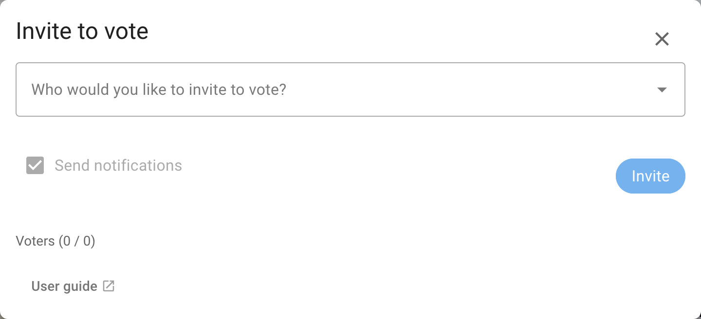
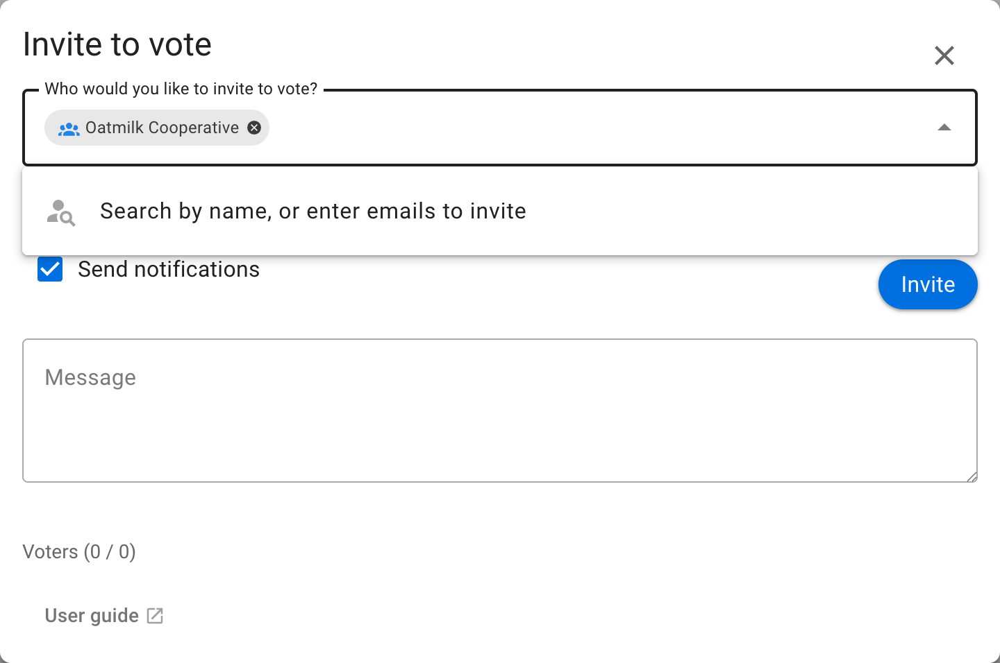
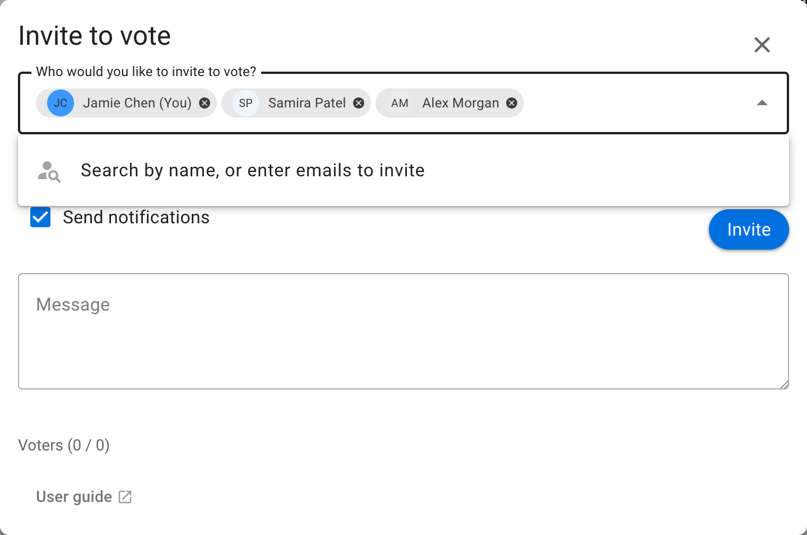
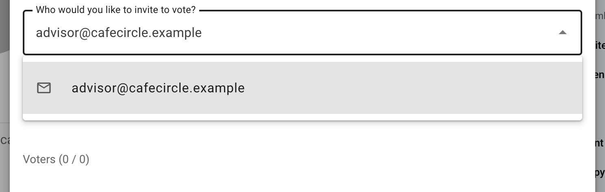
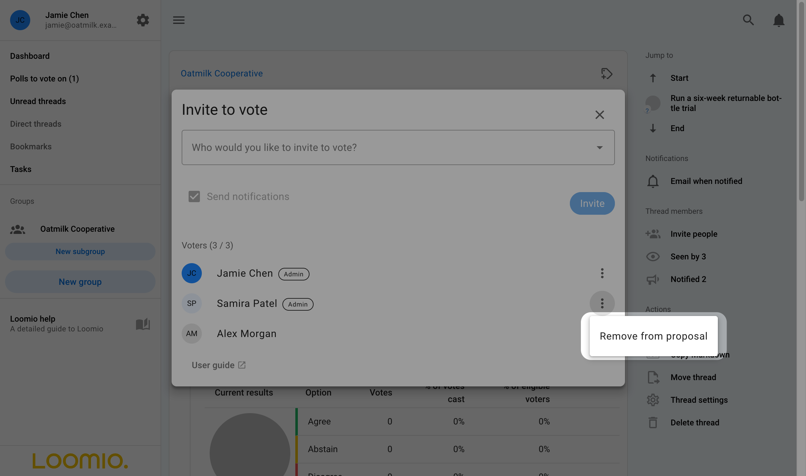
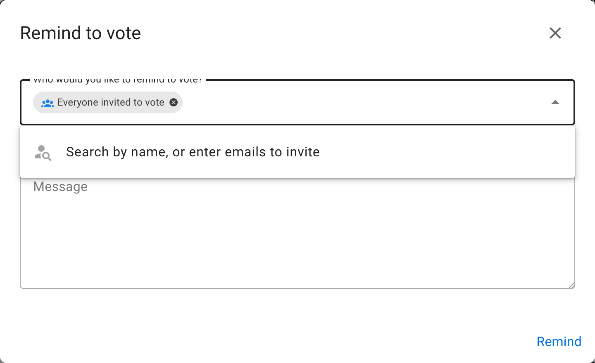
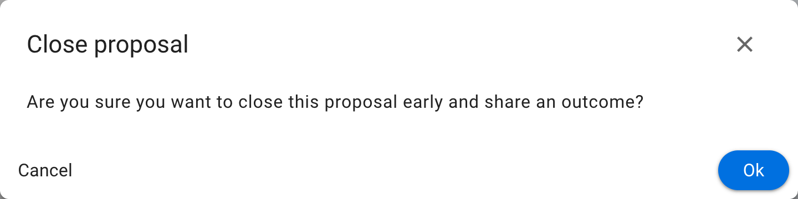
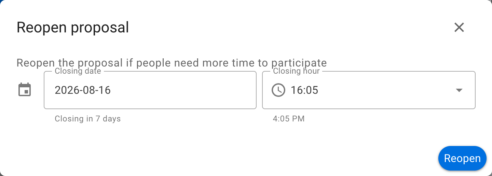

# Invite to vote

## Invite people to vote in a poll

Invite people to your poll by sending them a notification.

After you start a poll, the **Invite to vote** box appears. Select an audience such as **Everyone in the thread** or your group, or enter individual names and email addresses.

You can include an optional message with the invitation.

Select a group chip to expand it into the people you are inviting. Select the x beside a name to remove that person from the invitation.

### Invite guests or experts

You can also invite a guest to the poll by entering their email address. They will be given permission to participate in only this poll.

If the poll is within a thread, they will also be able to see that thread and its comments. They will not be able to comment, participate in other polls in the thread, or see other threads in the group.

### Invite a subgroup to vote

To limit voting to invited people, select **Selected people only** when you create the poll. You can then invite a subgroup from the parent group. See also [Delegated voters](/en/user_manual/groups/delegated_voters/).

## Engage people while a poll is running

At the bottom of the poll are several features to help you engage with people once the poll is running.

### Add voters to the poll

You can add new people to the poll at any time, including before voting opens on a scheduled poll.

Select **Add voters**, then enter the names or email addresses of the people you want to add.

If the poll has a scheduled opening time and voting has not yet opened, voters will not receive an immediate notification. Instead, they will be notified when voting opens.

### Remove people from the poll

Select **Add voters**, find the person's name, open the three-dot menu beside it, and select **Remove from proposal**.

For example, an administrator who creates a poll on behalf of board members can remove themself if they are not authorised to vote.

### Remind people to vote

Select **Remind** to send a notification to people who have not voted. **Everyone invited to vote** is selected by default. Select the chip to see or change the recipients.

### Close early

Select **Close early** to close a poll before its scheduled closing time.

You might do this when everyone has voted or the poll no longer needs to remain open.

### Reopen

Select **Reopen** on a closed poll, then set a new closing date and time.

