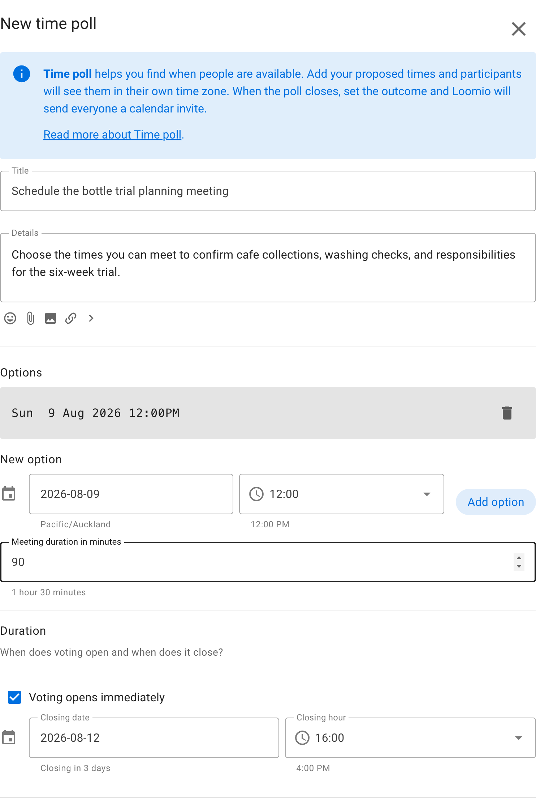
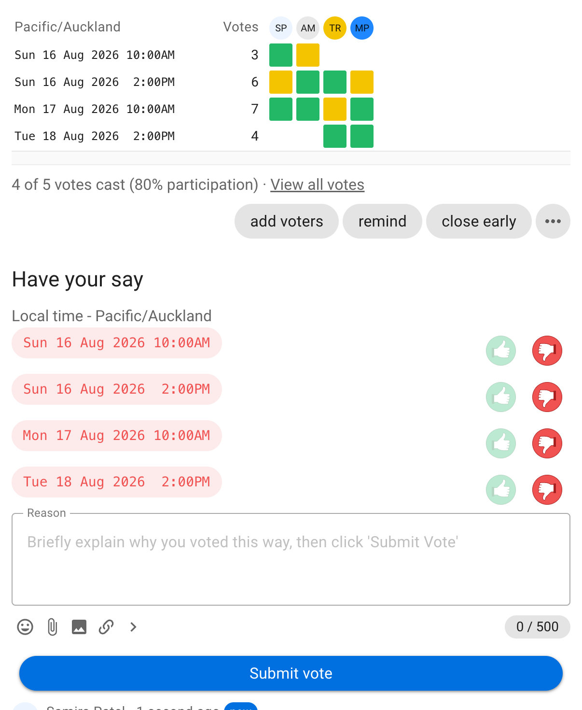
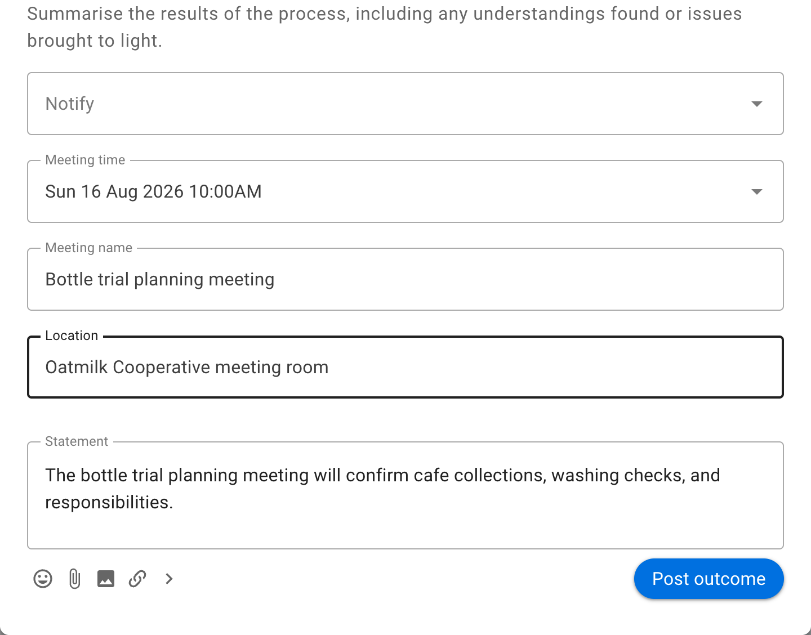
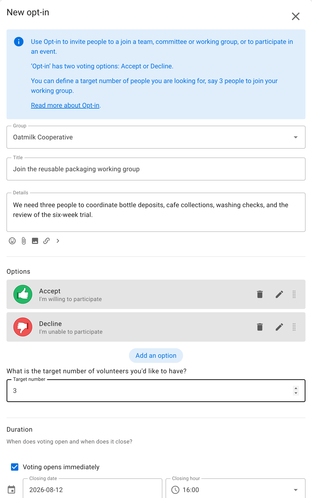
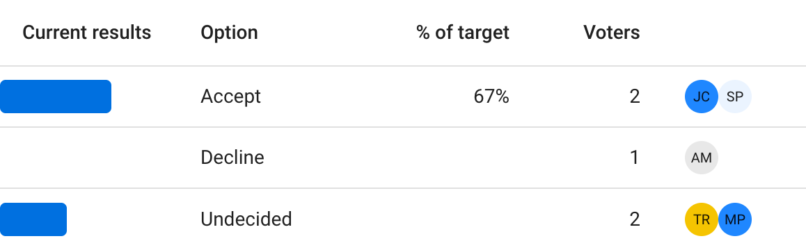

# Meeting polls

Use a **Time poll** to find a time for a meeting or event. Participants see the options in their own time zone.

## Time poll

_Find when people are available to meet_

Save time arranging a date for your meeting or event.

Time poll makes it easy to see everyone's availability and find the best time.

Give your Time poll a title and details. Enter a list of date and time options in your time zone.

When setting timeslots, consider people in different time zones. Participants will see times localized in their time zone.

Set a meeting duration.

### Voting

People mark each time with the green thumbs-up icon when they are available, the yellow sideways thumb when they can attend if needed, or the red thumbs-down icon when they are unavailable.

Participants can leave a reason comment to help the organizer find a suitable time.

If the times don't work, participants can suggest alternatives using the message field. You can then update the poll with new times.

The results update as voting proceeds in a table showing who is available when, so everyone can see which timeslots are popular.

### Outcome

When the Time poll closes, pick the best time and post an outcome.

**Notify**: Add the people you are inviting to the meeting or event

**Meeting time**: Select the time that works best

**Meeting name**: Give your meeting a name. The Time poll title is used by default

**Location**: Add a physical location or a meeting link

**Statement**: Summarize the result and add any instructions for the meeting

Loomio includes the selected time, meeting name, duration, location, and statement in the outcome notification and calendar invitation.

## Opt-in

_Find volunteers or participants_

Use **Opt-in** to invite people to join a team, committee, working group, or event. Open the Opt-in template to start the form.

Opt-in has two voting options: **Accept** and **Decline**.

Set a target for how many people you need. In this example, Oatmilk Cooperative needs three people for its reusable packaging working group.

The results show progress towards the target, who accepted or declined, and who has not voted.

Like other Loomio polls, Opt-in has a closing time and can notify undecided voters before it closes.
