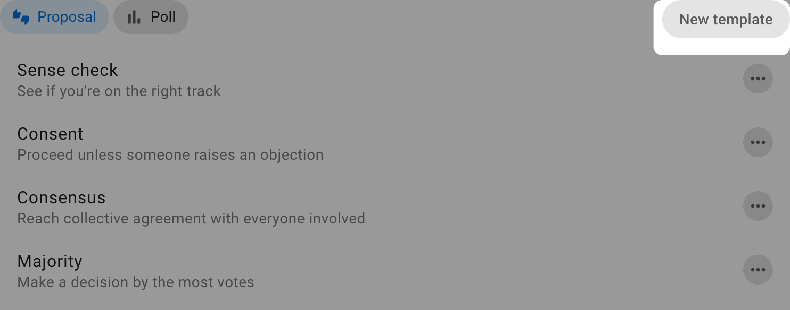
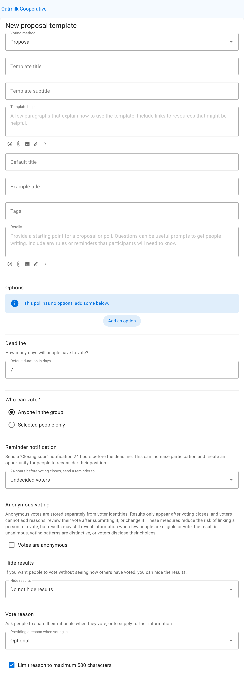
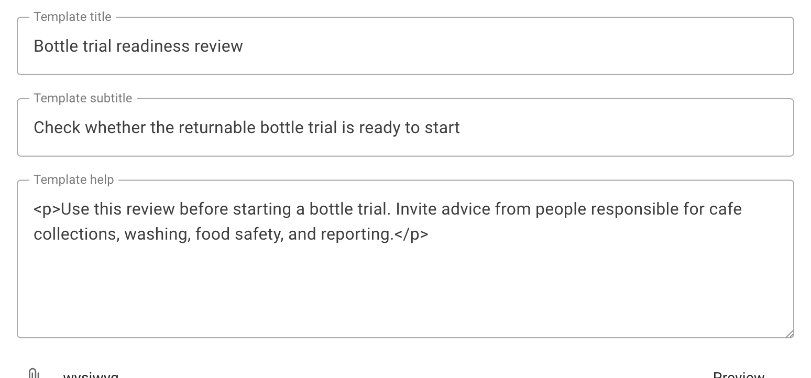
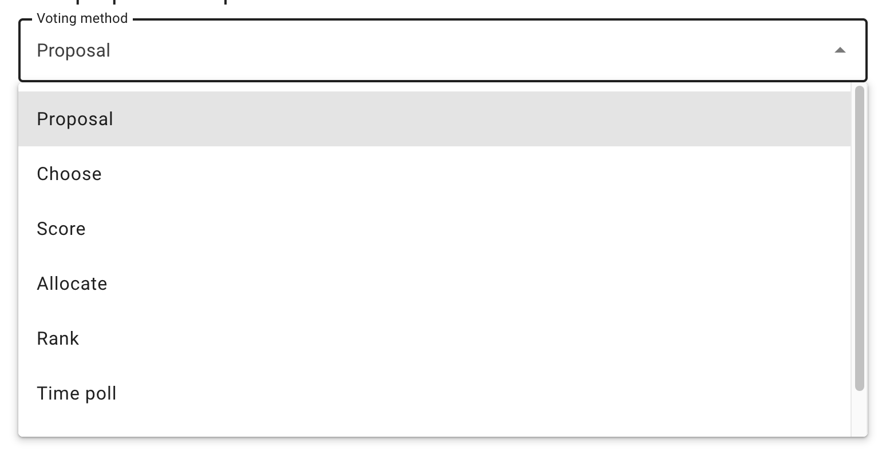
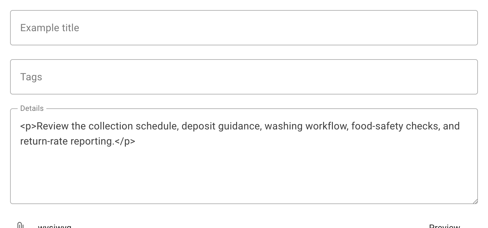
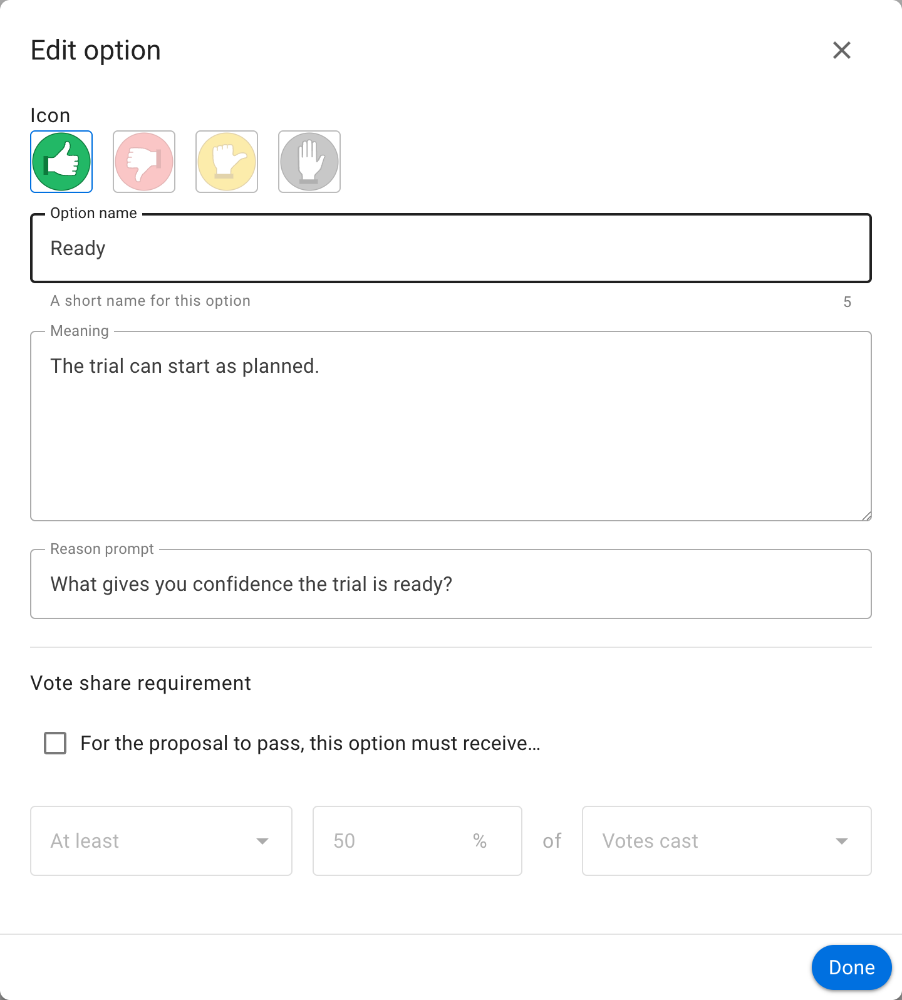
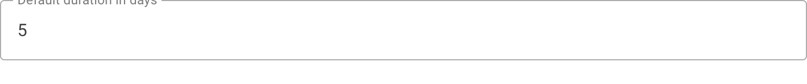
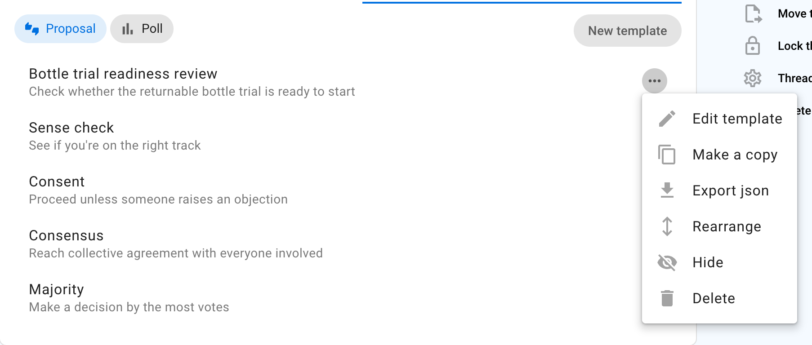
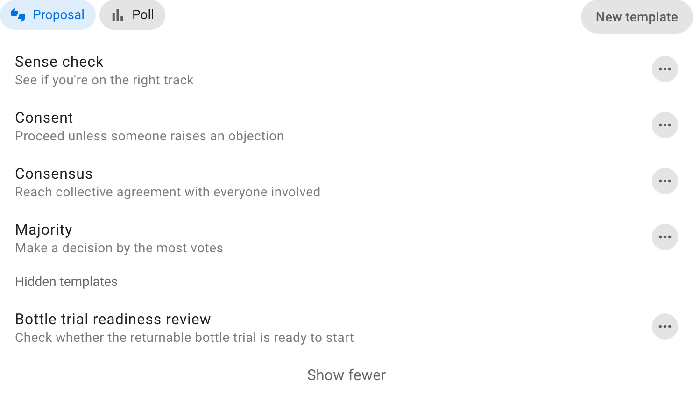

# Poll templates

Poll templates are reusable starting points shown when someone selects **Start a vote** or **New poll**. A template combines a voting method with preset guidance, response options, and settings.

Use this page to configure which templates are available to a group or to create one for your own process. To choose a template for a particular vote, see [Proposals](../proposals/) or [Polls](../proposal_types/). To facilitate a complete decision process, see [Making decisions](/en/guides/making_decisions/).

## Voting methods and templates

A voting method controls how participants respond and how Loomio calculates the result. Examples include Proposal, Choose, Score, Allocate, Rank, Time poll, and STV.

A poll template uses one of those methods and adds reusable defaults. For example, Sense check, Advice, Consent, and Consensus are different templates built on the Proposal voting method. Their instructions and response options differ even though Loomio handles their ballots in the same way.

## Use a template

When starting a vote, select the **Proposal** or **Poll** tab and choose one of the templates available to the group.

The template supplies an introduction, example content, options, and settings. Review and edit these for the particular decision before starting the vote. Editing the new vote does not change the reusable template.

## Who can manage templates

Group administrators can create and manage every poll template in their group. They can enable **Members can create templates** under **Group settings** → **Permissions**. When enabled, members can create templates and manage templates they authored.

## Create a poll template

Open the template list and select **New template**. Start with an example or a blank template, then choose the group that will use it.

The template form defines the guidance and defaults people receive when they start a vote.

### Template title, subtitle, and help

- **Template title** is the short name shown in the template list.
- **Template subtitle** explains when to use it in one sentence.
- **Template help** appears in the information panel when someone uses the template. Explain its purpose, any rules participants should know, and links to relevant policies or guides.

Use plain, specific names that distinguish the template from others in the group.

### Voting method

Choose what participants need to express and how the result should be calculated.

- **Proposal**: respond to a statement using defined positions;
- **Choose**: select one or more options;
- **Score**: evaluate every option on a scale;
- **Allocate**: distribute a limited budget of points;
- **Rank**: arrange options in preference order;
- **Time poll**: indicate availability; and
- **STV**: rank candidates in a proportional, multi-winner election.

Changing the voting method changes the fields and result calculation available to the template.

### Example title, details, and tags

Provide example content that helps an author frame the vote. These values are copied into a new proposal or poll and can be edited before it starts.

Use prompts rather than fixed content when each use needs a different title or details. Add default category tags only when they apply every time the template is used.

### Response options

Methods such as Proposal and Choose let you configure response options. Select the pencil icon beside an option to edit:

- **Option name**: the short response label;
- **Icon**: its visual marker;
- **Meaning**: what selecting the option communicates; and
- **Reason prompt**: the question shown when someone explains their response.

Define options so participants can tell the difference between them without guessing. The meanings should match the decision rules your group actually uses.

### Duration and settings

Set a default duration that is suitable for most uses of the template. The author can change the closing time for an individual vote.

Other defaults can control result visibility, anonymous voting, vote-reason requirements, reminders, quorum, and method-specific behaviour. See [Proposal and poll settings](../starting_proposals/) for their effects.

### Save and test the template

After saving, start a draft vote from the template. Check that its introduction, prompts, options, and defaults make sense to someone who did not create it. Starting a draft is also a useful way to confirm that the chosen voting method produces the result the group expects.

## Manage the template list

Use the action menu beside a template to:

- **Edit** its reusable content and defaults;
- **Move** it to a different position in the list;
- **Hide** it from people starting votes; or
- **Delete** a custom template that is no longer needed.

Select **Show hidden templates** to review or restore hidden templates. Default templates can be hidden or adapted for the group, but cannot be deleted.

Changing a template does not alter proposals or polls that have already been started from it.
