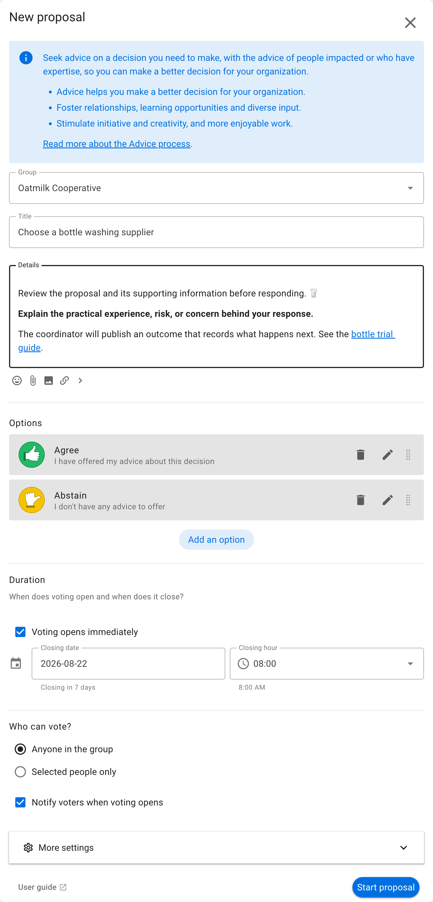
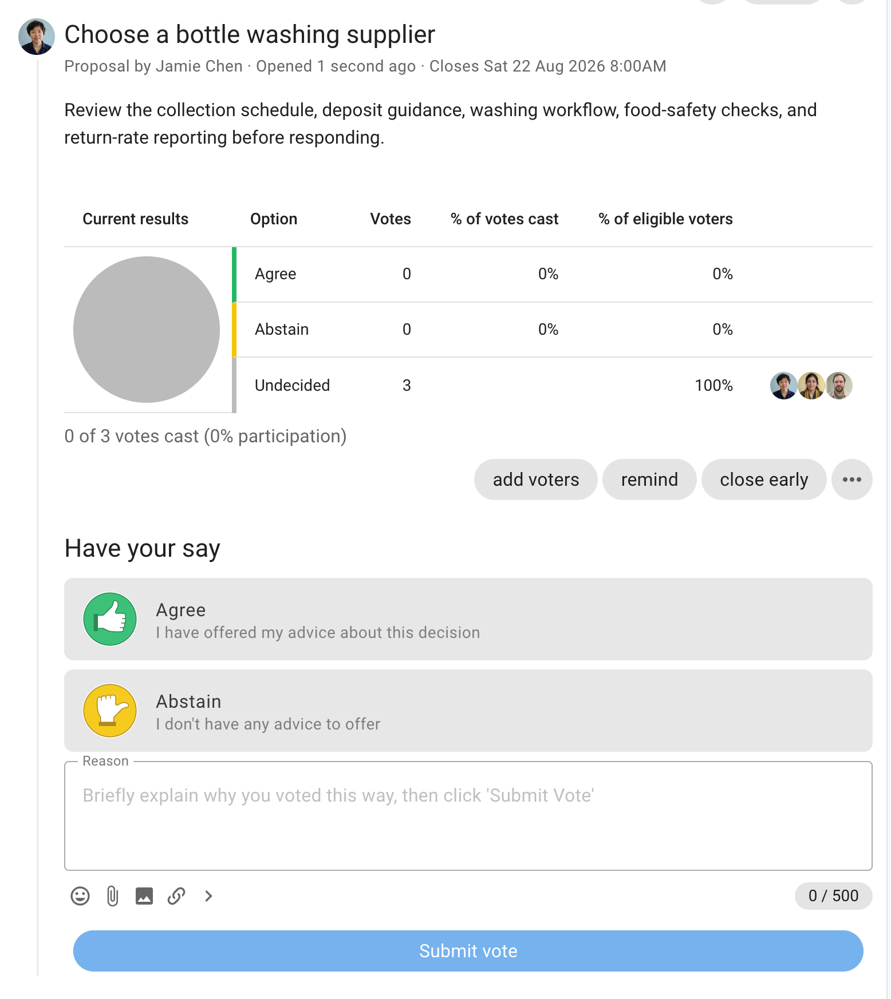
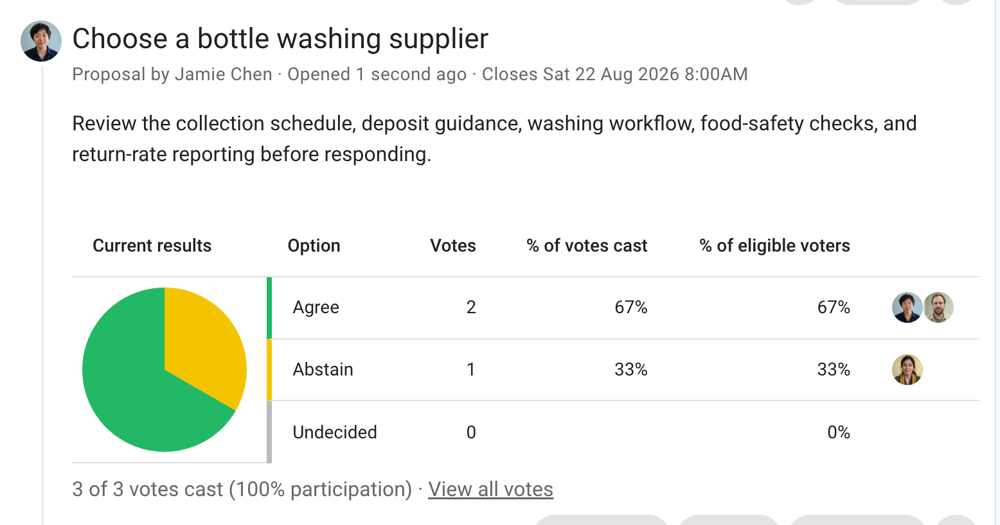

# Advice

An Advice proposal gathers input for a decision that a person or team is responsible for making. Participants can offer advice or indicate that they have no advice to add.

This page explains the Advice proposal form, voting, and results. See the [Advice process](/en/guides/making_decisions/advice_process) for the complete workflow from framing the decision to publishing an outcome.

## When to use Advice

Use Advice when the decision maker wants input from people with relevant expertise or people affected by the decision. It works well for supplier choices, operational decisions, policy drafts, and decisions within a delegated role.

Advice is not an approval vote. Say who will make the decision, what constraints apply, and how they will consider the responses.

## Example: choose a washing supplier

Oatmilk Cooperative's operations coordinator must select a washing supplier. They invite advice about capacity, food-safety records, water use, service response times, and support.

## Set up the proposal

Describe the decision, name the decision maker, and include the information participants need. Invite people who are affected or have relevant knowledge. The default options let someone offer advice or abstain.

## Vote

Participants select **Advice** and give a concrete recommendation, risk, question, or relevant experience. They can abstain when they have no useful input.

## Read the results

The chart confirms who has responded, but the reasons contain the substance of an Advice proposal. Look for constraints, agreements, and conflicting recommendations rather than treating the most common response as the decision.

The decision maker publishes an outcome explaining what they decided and how the advice informed it.
