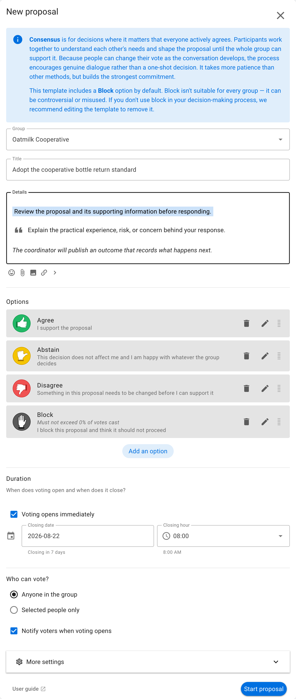
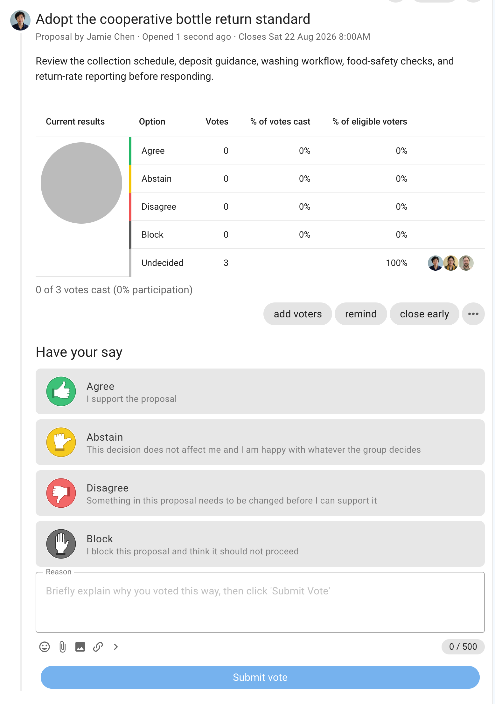
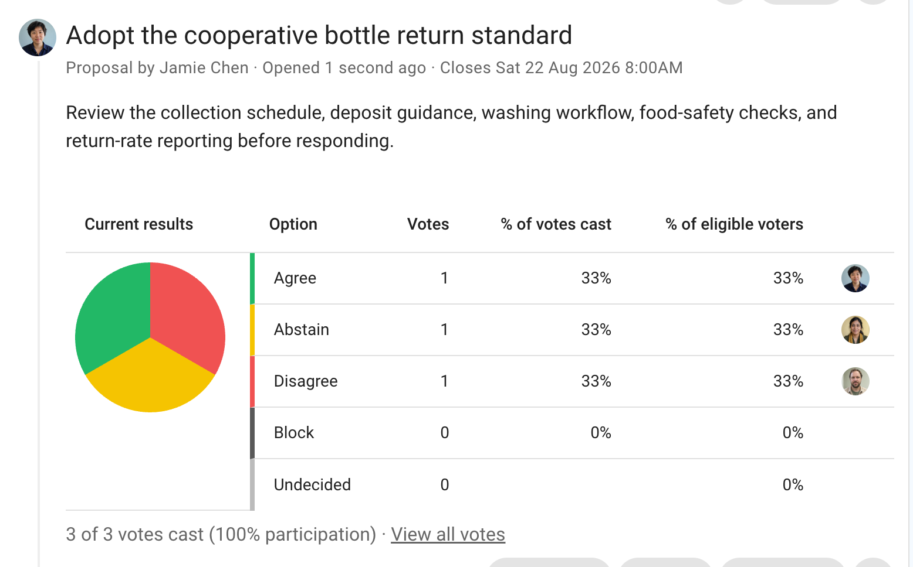

# Consensus

A Consensus proposal seeks collective agreement from everyone involved. The default responses let participants agree, abstain, disagree, or block.

This page explains how to run one Consensus proposal. See the [Consensus process](/en/guides/making_decisions/consensus_process) for the complete workflow from discussion and Sense check through amendment and outcome.

## When to use Consensus

Use Consensus for decisions where broad ownership matters and the group is prepared to work through concerns together. It suits shared standards, governance agreements, strategic commitments, and decisions that affect the whole group.

Consensus usually requires discussion and proposal development before voting. Define the meaning and consequences of **Block** for your group. If your process does not use blocks, edit the template to remove that option.

## Example: adopt a bottle return standard

Oatmilk Cooperative has developed a standard covering deposits, collection, washing, food-safety records, and reporting. Because every team will use it, the cooperative seeks consensus before adopting it.

## Set up the proposal

State the complete agreement being considered and link to supporting information. Explain each response, particularly the distinction between disagreeing and blocking. Allow enough time for questions and amendments.

## Vote

Participants choose the response that matches their position and explain the interests or concerns behind it. A block reason should identify why adopting the proposal would violate a fundamental need or agreed principle.

## Read the results

The chart shows the balance of responses. Review every disagreement and block reason; consensus is a process of resolving concerns, not only counting agreement votes.

If the group reaches agreement, publish an outcome recording the final standard and responsibilities. Otherwise, record what will be revised and when the group will return to the proposal.
