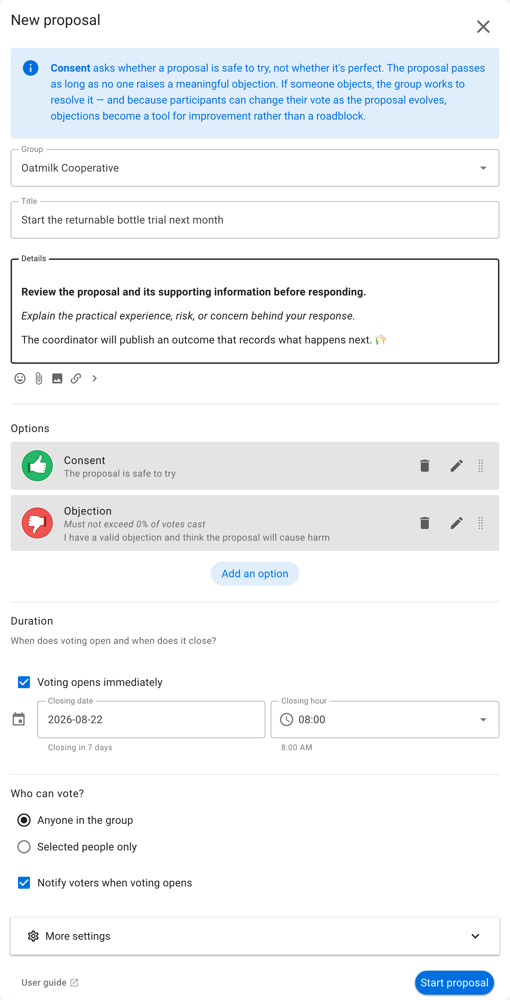
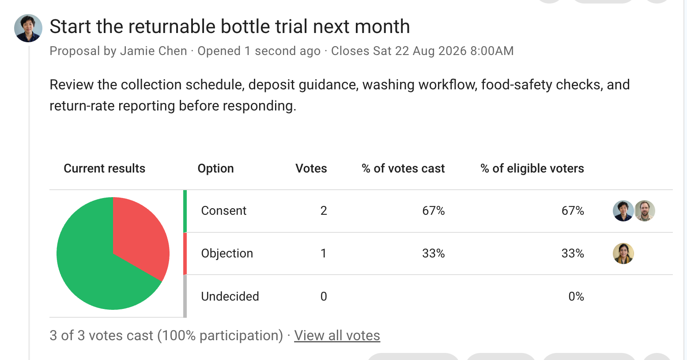

# Consent

A Consent proposal asks whether a course of action is safe to try. Participants either consent or raise an objection. An objection identifies a concrete risk or harm that the proposal should address.

This page explains how to run one Consent proposal. See the [Consent process](/en/guides/making_decisions/consent_process) for the complete workflow, including questions, Sense check, amendments, objections, and outcome.

## When to use Consent

Use Consent when the group needs a workable decision that can proceed unless there is a valid objection. It suits experiments, operational policies, role agreements, and other decisions the group can review after gaining experience.

Consent does not require everyone to prefer the proposal. Define what counts as an objection before voting, and explain how objections will be tested and resolved.

## Example: start a bottle trial

Oatmilk Cooperative proposes starting a six-week returnable-bottle trial next month. The trial is limited in scope and includes a review, so the group asks whether it is safe to try.

## Set up the proposal

Describe the proposed action, its limits, safeguards, and review point. Keep **Consent** and **Objection** meanings precise, and require a reason for objections so the concern can be understood and addressed.

## Vote

Participants select **Consent** when the proposal is safe enough to try, even if it is not their preferred plan. They select **Objection** when they can describe a material risk or harm.

## Read the results

The chart makes objections visible, but the group must examine the reasons. Resolve a valid objection by amending the proposal, adding a safeguard, changing its scope, or deciding not to proceed.

Publish an outcome that records the agreed action, any safeguards, who is responsible, and when the group will review it.
